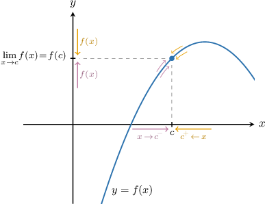
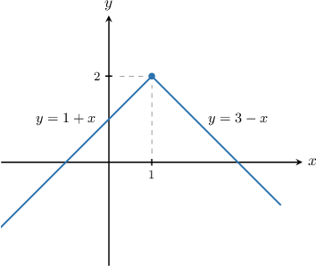
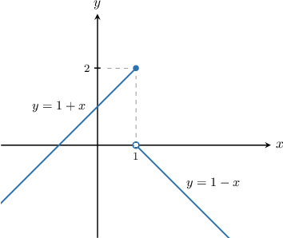

# Defining Continuity at a Point

Source: https://www.mathacademy.com/topics/314?courseId=105
Topic ID: 314

## Prerequisites

- [Determining Continuity from Graphs](./462-determining-continuity-from-graphs.md)
- [Limits of Piecewise Functions](./1262-limits-of-piecewise-functions.md)

## Lesson

### Introduction

Intuitively, a function $f(x)$ is **continuous** if we can draw $y=f(x)$ without taking our pen off the paper.

We can give a precise mathematical definition of continuity using limits:

*A function $f(x)$ is **** $\boldsymbol{x=c}$ if*

$$

\lim_{x\to c}f(x) = f(c).

$$

In other words, a function is continuous at a point if the limit at the point is equal to the function value at the point.

To test for continuity of $f(x)$ at a point $x=c$, we need to check three conditions:

1. Does $f(c)$ exist? In other words, we must check that $f(x)$ is defined at $x=c.$

2. Does $\displaystyle \lim_{x\to c}f(x)$ exist? In other words, we have to check that $\displaystyle \lim_{x \to c^{-}}f(x) = \lim_{x \to c^{+}}f(x).$

3. Does $\displaystyle \lim_{x\to c}f(x) = f(c)?$

If the answer to all three questions is yes, then the function is continuous at $x=c.$ If the function is not continuous at $x=c,$ we say that it has a **discontinuity** at $x=c.$

The diagram below shows a function that's continuous at $x=c.$

Notice that:

- $f(c)$ exists$\quad{\color{green}{\checkmark}}$

- $\lim\limits_{x\to c}f(x)$ exists $\quad{\color{green}{\checkmark}}$

- $\lim\limits_{x\to c}f(x) = f(c)$ $\quad{\color{green}{\checkmark}}$

Let's now see how to use these continuity conditions to check for continuity in a piecewise function.

### A Worked Example

Remember that to test for continuity of $f(x)$ at a point $x=c$, we need to check three conditions:

1. Does $f(c)$ exist?

2. Does $\displaystyle \lim_{x\to c}f(x)$ exist?

3. Does $\displaystyle \lim_{x\to c}f(x) = f(c)?$

Let's use these three conditions to show that the following function is continuous at $x=1.$

$$

\begin{aligned}1+𝑥, & 𝑥≤1 \\ 3−𝑥 & 𝑥>1\end{aligned}

$$

We check all three conditions in turn.

1. Using the expression for the first branch of the function, we obtain that So, $f(x)$ is defined at $x=1.$ $\:\:{\color{green}\checkmark}$

2. By calculating the one-sided limits, we get the following: As a result: Therefore, the limit of $f(x)$ at $x=1$ exists:

3. We have that $\lim\limits_{x \to 1} f(x) = 2 = f(1).$ $\:\: {\color{green}\checkmark}$

Therefore, the function $f(x)$ is continuous at $x=1.$ The graph of $y=f(x)$ is shown below.

### Example: Verifying Continuity at a Point Using the Definition

#### Question

Consider the following function:

$$

\begin{aligned}1+𝑥, & 𝑥≤1 \\ 1−𝑥 & 𝑥>1\end{aligned}

$$

Which of the following statements are true regarding $f(x)?$

1. $f(x)$ is defined at $x=1$

2. $\lim\limits_{x\to 1^-} f(x) = \lim\limits_{x \to 1^+} f(x)$

3. $\lim\limits_{x\to 1} f(x)= f(1)$

4. $f(x)$ is continuous at $x=1$

#### Explanation

To test for continuity of $f(x)$ at a point $x=c$, we need to check three conditions:

1. Does $f(c)$ exist?

2. Does $\displaystyle \lim_{x\to c}f(x)$ exist?

3. Does $\displaystyle \lim_{x\to c}f(x) = f(c)?$

With that in mind, let's examine our statements in turn.

- Statement I is true. Using the expression for the first branch of the function, we obtain that So, $f(x)$ is defined at $x=1.$ $\:\:{\color{green}\checkmark}$

- Statement II is false. By calculating the one-sided limits, we get the following: As a result: Therefore, the limit of $f(x)$ at $x=1$ does not exist. $\:\:{\color{red}\times}$

- Statement III is false since the limit of $f(x)$ at $x=1$ does not exist. $\:\:{\color{red}\times}$

- Statement IV is false. Since not all statements I-III are true, the function $f(x)$ has a discontinuity at $x=1,$ as shown below.

Therefore, the correct answer is "I only."

### Example: Identifying the Reason for a Discontinuity

#### Question

For what reason does the function $f(x)$ below have a discontinuity at $x=2?$

$$

\begin{aligned}3𝑥+2, & 𝑥<2 \\ 6, & 𝑥=2 \\ 𝑥^{3}, & 𝑥>2\end{aligned}

$$

#### Explanation

Let's check the conditions necessary for $f(x)$ to be continuous at $x=2.$

- $f(2) = 6,$ so $f(2)$ exists. ${\color{green}\checkmark}$

- We calculate the one-sided limits and find that they coincide: Therefore, the overall limit exists and $\lim_\limits{x\to 2} f(x)=8.\, \, {\color{green}\checkmark}$ $\ \[1ex]$

- The limit of the function is not equal to the function value: $\lim_\limits{x\to 2} f(x)= 8,$ while $f(2) = 6.$ ${\color{red}\times}$

Therefore, the function $f(x)$ has a discontinuity at $x=2$ because $\lim_\limits{x\to 2} f(x) \neq f(2).$

### Example: Applying the Definition of Continuity to Evaluate a Limit

#### Question

If $f(x)$ is continuous at $x=2$ and $f(2)=2,$ then what is the value of

$$

\displaystyle{\lim_{x\to 2} \sqrt{x^2-2f(x)}}\,?

$$

#### Explanation

We're told that $f(x)$ is continuous at $x=2.$ According to the definition of continuity, this means that $\lim\limits_{x\to 2} f(x)$ exists and

$$

\lim_{x\to 2} f(x)=f(2)=2.

$$

Therefore,

$$

\displaystyle{\lim_{x\to 2} \sqrt{x^2-2f(x)}}=\sqrt{2^2-2\cdot 2} = 0.

$$
