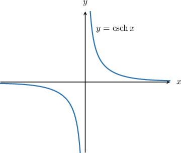
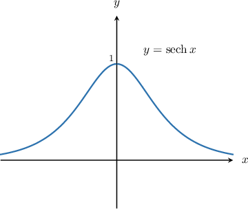
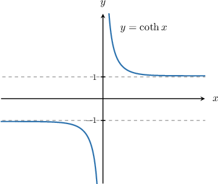

# The Reciprocal Hyperbolic Functions

Source: https://www.mathacademy.com/topics/3265?courseId=105
Topic ID: 3265

## Prerequisites

- [The Hyperbolic Functions](./967-the-hyperbolic-functions.md)

## Lesson

### Introduction

We can define the **reciprocal hyperbolic functions** similarly to how we define reciprocal trigonometric functions.

The **hyperbolic cosecant function** (pronounced "cosetch") is defined as The graph of is shown below.

Note the following properties of

- Its domain is

- Its range is

- It has a vertical asymptote

- It has a horizontal asymptote

- It is an odd function.

### Example: Evaluating Hyperbolic Cosecant

#### Question

$\newcommand{\arsinh}{\mathop{\rm arsinh}\nolimits} \newcommand{\arcosh}{\mathop{\rm arcosh}\nolimits} \newcommand{\artanh}{\mathop{\rm artanh}\nolimits} \newcommand{\sech}{\mathop{\rm sech}\nolimits} \newcommand{\csch}{\mathop{\rm csch}\nolimits} \newcommand{\coth}{\mathop{\rm coth}\nolimits} \newcommand{\arsech}{\mathop{\rm arsech}\nolimits} \newcommand{\arcsch}{\mathop{\rm arcsch}\nolimits} \newcommand{\arcoth}{\mathop{\rm arcoth}\nolimits}$

Evaluate $\csch (-9).$

#### Explanation

$\newcommand{\arsinh}{\mathop{\rm arsinh}\nolimits} \newcommand{\arcosh}{\mathop{\rm arcosh}\nolimits} \newcommand{\artanh}{\mathop{\rm artanh}\nolimits} \newcommand{\sech}{\mathop{\rm sech}\nolimits} \newcommand{\csch}{\mathop{\rm csch}\nolimits} \newcommand{\coth}{\mathop{\rm coth}\nolimits} \newcommand{\arsech}{\mathop{\rm arsech}\nolimits} \newcommand{\arcsch}{\mathop{\rm arcsch}\nolimits} \newcommand{\arcoth}{\mathop{\rm arcoth}\nolimits}$

The definition of $\csch x$ is

$$

\csch x = \dfrac{1}{\sinh x} = \dfrac {2}{e^{x} - e^{-x}}.

$$

Therefore,

$$

\csch (-9) =\dfrac{2}{e^{-9}-e^{-(-9)}}=\dfrac{2}{e^{-9}-e^{9}}.

$$

### Hyperbolic Secant

The **hyperbolic secant function** (pronounced "sesh") is defined as The graph of is shown below.

Note the following properties of

- Its domain is

- Its range is

- It has a horizontal asymptote

- It is an even function.

### Example: Evaluating Hyperbolic Secant

#### Question

$\newcommand{\arsinh}{\mathop{\rm arsinh}\nolimits} \newcommand{\arcosh}{\mathop{\rm arcosh}\nolimits} \newcommand{\artanh}{\mathop{\rm artanh}\nolimits} \newcommand{\sech}{\mathop{\rm sech}\nolimits} \newcommand{\csch}{\mathop{\rm csch}\nolimits} \newcommand{\coth}{\mathop{\rm coth}\nolimits} \newcommand{\arsech}{\mathop{\rm arsech}\nolimits} \newcommand{\arcsch}{\mathop{\rm arcsch}\nolimits} \newcommand{\arcoth}{\mathop{\rm arcoth}\nolimits}$

Evaluate $\sech \left(-t \right).$

#### Explanation

$\newcommand{\arsinh}{\mathop{\rm arsinh}\nolimits} \newcommand{\arcosh}{\mathop{\rm arcosh}\nolimits} \newcommand{\artanh}{\mathop{\rm artanh}\nolimits} \newcommand{\sech}{\mathop{\rm sech}\nolimits} \newcommand{\csch}{\mathop{\rm csch}\nolimits} \newcommand{\coth}{\mathop{\rm coth}\nolimits} \newcommand{\arsech}{\mathop{\rm arsech}\nolimits} \newcommand{\arcsch}{\mathop{\rm arcsch}\nolimits} \newcommand{\arcoth}{\mathop{\rm arcoth}\nolimits}$

The definition of $\sech{x}$ is

$$

\sech{x} = \dfrac{1}{\cosh x} = \dfrac{2}{e^{x}+e^{-x}}.

$$

Therefore,

$$

\begin{aligned}sech⁡(−𝑡) & =\frac{2}{𝑒^{−𝑡}+𝑒^{−(−𝑡)}} \\ & =\frac{2}{𝑒^{−𝑡}+𝑒^{𝑡}}.\end{aligned}

$$

### Hyperbolic Cotangent

The **hyperbolic cotangent function** (pronounced "coth") is defined as The graph of is shown below.

Note the following properties of

- Its domain is

- Its range is

- It has a vertical asymptote

- It has horizontal asymptotes

- It is an odd function.

Using the alternative definitions of we can write down two more definitions for

### Example: Evaluating Hyperbolic Cotangent

#### Question

$\newcommand{\arsinh}{\mathop{\rm arsinh}\nolimits} \newcommand{\arcosh}{\mathop{\rm arcosh}\nolimits} \newcommand{\artanh}{\mathop{\rm artanh}\nolimits} \newcommand{\sech}{\mathop{\rm sech}\nolimits} \newcommand{\csch}{\mathop{\rm csch}\nolimits} \newcommand{\coth}{\mathop{\rm coth}\nolimits} \newcommand{\arsech}{\mathop{\rm arsech}\nolimits} \newcommand{\arcsch}{\mathop{\rm arcsch}\nolimits} \newcommand{\arcoth}{\mathop{\rm arcoth}\nolimits}$

Evaluate $\coth (-\ln 3).$

#### Explanation

$\newcommand{\arsinh}{\mathop{\rm arsinh}\nolimits} \newcommand{\arcosh}{\mathop{\rm arcosh}\nolimits} \newcommand{\artanh}{\mathop{\rm artanh}\nolimits} \newcommand{\sech}{\mathop{\rm sech}\nolimits} \newcommand{\csch}{\mathop{\rm csch}\nolimits} \newcommand{\coth}{\mathop{\rm coth}\nolimits} \newcommand{\arsech}{\mathop{\rm arsech}\nolimits} \newcommand{\arcsch}{\mathop{\rm arcsch}\nolimits} \newcommand{\arcoth}{\mathop{\rm arcoth}\nolimits}$

The definition of $\coth x$ is

$$

\begin{aligned}coth⁡𝑥 & =\frac{1}{tanh⁡𝑥} \\ & =\frac{𝑒^{𝑥}+𝑒^{−𝑥}}{𝑒^{𝑥}−𝑒^{−𝑥}} \\ & =\frac{𝑒^{2𝑥}+1}{𝑒^{2𝑥}−1} \\ & =\frac{1+𝑒^{−2𝑥}}{1−𝑒^{−2𝑥}}.\end{aligned}

$$

Using the fourth definition, we get

$$

\begin{aligned}coth⁡(−ln⁡3) & =\frac{1+𝑒^{−2(−ln⁡3)}}{1−𝑒^{−2(−ln⁡3)}} \\ & =\frac{1+𝑒^{2ln⁡3}}{1−𝑒^{2ln⁡3}} \\ & =\frac{1+𝑒^{ln⁡3^{2}}}{1−𝑒^{ln⁡3^{2}}} \\ & =\frac{1+3^{2}}{1−3^{2}} \\ & =\frac{1+9}{1−9} \\ & =\frac{10}{(−8)} \\ & =−\frac{5}{4}.\end{aligned}

$$
