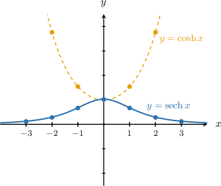
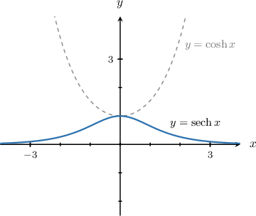
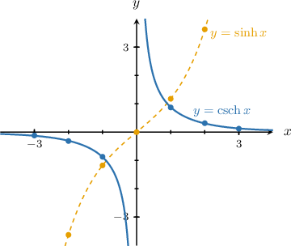
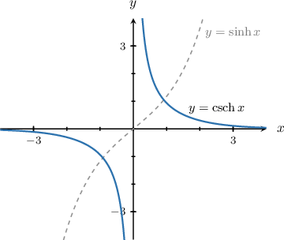
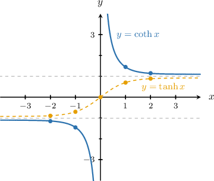
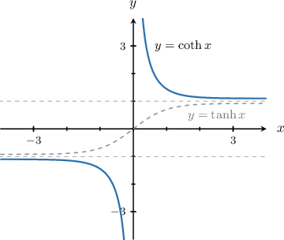

# Graphs of the Reciprocal Hyperbolic Functions

Source: https://www.mathacademy.com/topics/3267?courseId=105
Topic ID: 3267

## Prerequisites

- [Graphs of the Hyperbolic Functions](./1831-graphs-of-the-hyperbolic-functions.md)
- [Unbounded Behavior of Functions Near a Point](../../../high-school/traditional/lessons/algebra-ii/2046-unbounded-behavior-of-functions-near-a-point.md)

## Lesson

### Introduction

The **hyperbolic secant** is the reciprocal of the hyperbolic cosine: $$

$$

y = \operatorname{sech}{x} = \dfrac{1}{\cosh{x}} = \dfrac{2}{e^x+e^{-x}}

$$

To plot the graph of $y=\operatorname{sech} x,$ we create a table with some values, rounded to the nearest hundredth.

Plotting these points, we get the following curves:

We can summarize some of the basic properties of hyperbolic secant from its graph.

- The domain is $(-\infty,\infty)$ and the range is $(0,1].$

- It's an even function (the graph is symmetric about the $y$-axis).

- It has no zeros.

- Its maximum value occurs at $x=0.$

- Its graph is increasing over $(-\infty,0)$ and is decreasing over $(0,\infty).$ Moreover, $\qquad$ $\operatorname{sech}{x} \to 0$ as $x \to \pm\infty.$

### Example: Identifying the Graph and Properties of the Hyperbolic Secant

#### Question

Which of the following statements are true regarding the function $y=\operatorname{sech}{x}?$

1. The function is increasing over $(0, \infty).$

2. The function has a vertical asymptote.

3. The domain of the function is $(-\infty, 0) \cup (0, \infty).$

#### Explanation

Let's recall the graph of $y=\operatorname{sech}{x}.$

Let's now examine our statements in turn.

- Statement I is false. The function $y=\operatorname{sech} x$ is decreasing over $(0, \infty).$

- Statement II is false. The function has no vertical asymptotes.

- Statement III is false. The domain of the function is $(-\infty, \infty).$

Therefore, none of the statements are true.

### The Hyperbolic Cosecant Function

The **hyperbolic cosecant** is the reciprocal of the hyperbolic sine: $$

$$

y = \operatorname{csch}{x} = \dfrac{1}{\sinh{x}} = \dfrac{2}{e^x-e^{-x}}

$$

To plot the graph of $y=\operatorname{csch} x,$ we create a table with some values, rounded to the nearest hundredth.

Plotting these points, we get the following curves:

We can summarize some of the basic properties of hyperbolic cosecant from its graph.

- The domain and range are $(-\infty,0) \cup (0,\infty).$

- It's an odd function (the graph has rotational symmetry of order $2$ about the origin).

- It has no zeros.

- Its graph is decreasing over the entire domain. Moreover: $\qquad$ $\operatorname{csch}{x} \to 0$ as $x \to \pm\infty$ $\qquad$ $\operatorname{csch}{x} \to -\infty$ as $x \to 0^-$ $\qquad$ $\operatorname{csch}{x} \to \infty$ as $x \to 0^+$

### Example: Identifying the Graph and Properties of the Hyperbolic Cosecant

#### Question

Which of the following statements are true regarding the function $y=\operatorname{csch}{x}?$

1. The function has no zeros.

2. $\operatorname{csch}{x} \to -\infty$ as $x \to 0^-.$

3. The function is even.

#### Explanation

Let's recall the graph of $y=\operatorname{csch}{x}.$

Let's now examine our statements in turn.

- Statement I is true. The function $y=\operatorname{csch}{x}$ has no zeros.

- Statement II is true. Indeed, we have that $\operatorname{csch}{x} \to -\infty$ as $x \to 0^-.$

- Statement III is false. The function is odd (the graph has rotational symmetry of order $2$ about the origin).

Therefore, only I and II are true.

### The Hyperbolic Cotangent Function

The **hyperbolic cotangent** is the reciprocal of the hyperbolic tangent:

$$

y = \coth{x} = \dfrac{\cosh{x}}{\sinh{x}} = \dfrac{e^x+e^{-x}}{e^x-e^{-x}}

$$

Creating a table of values and plotting the points in the usual way, we get the following curves:

We can summarize some of the basic properties of hyperbolic cotangent from its graph.

- The domain is $(-\infty,0) \cup (0,\infty)$ and the range is $(-\infty,-1) \cup (1,\infty).$

- It's an odd function (the graph has rotational symmetry of order $2$ about the origin).

- It has no zeros.

- Its graph is decreasing over the entire domain. Moreover: $\qquad$ $\coth{x} \to -1$ as $x \to -\infty$ $\qquad$ $\coth{x} \to 1$ as $x \to \infty$ $\qquad$ $\coth{x} \to -\infty$ as $x \to 0^-$ $\qquad$ $\coth{x} \to \infty$ as $x \to 0^+$

### Example: Identifying the Graph and Properties of the Hyperbolic Cotangent

#### Question

Which of the following statements are true regarding the function $y=\coth{x}?$

1. The function has a zero at $x=0.$

2. $\coth{x} \to 1$ as $x \to \infty.$

3. The range of the function is $(0, \infty).$

#### Explanation

Let's recall the graph of $y=\coth{x}.$

Let's now examine our statements in turn.

- Statement I is false. The function does not have zeros in its domain.

- Statement II is true. Indeed, we have that $\coth{x} \to 1$ as $x \to \infty.$

- Statement III is false. The range of the function is $(-\infty, -1) \cup (1, \infty).$

Therefore, the correct answer is "II only."
