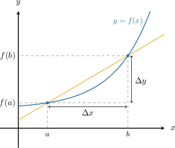

# The Average Rate of Change of a Function

Source: https://www.mathacademy.com/topics/336?courseId=105
Topic ID: 336

## Prerequisites

- [Calculating Slopes of Straight Lines](../../../middle-school/lessons/grade-8/396-calculating-slopes-of-straight-lines.md)
- [Introduction to Functions](../../../high-school/traditional/lessons/algebra-i/470-introduction-to-functions.md)

## Lesson

### Introduction

Consider a curve between two points and The **average rate of change** of on the interval is computed as follows:

Geometrically, the average rate of change represents the slope of the **secant line** which passes through and

**Note:** In general, a secant is a line that intersects a curve at two or more distinct points.

### Example: Calculating the Average Rate of Change of a Function

#### Question

A curve is defined as $y = 2x^2.$ Find the average rate of change of $y$ over the interval $[0,5].$

#### Explanation

Let $f(x)=2x^2.$ Applying the formula for the average rate of change, we get

$$

\begin{aligned}\frac{Δ𝑦}{Δ𝑥} & =\frac{𝑓(𝑏)−𝑓(𝑎)}{𝑏−𝑎} \\ & =\frac{𝑓(5)−𝑓(0)}{5−(0)} \\ & =\frac{(2(5)^{2})−(2(0)^{2})}{5} \\ & =\frac{50}{5} \\ & =10.\end{aligned}

$$

### Example: Calculating the Average Rate of Change Given a Table

#### Question

Find the average rate of change of the function $f(x)$ on the interval $[-1,2]$ given the following table of values for $f(x)\mathbin{:}$

#### Explanation

Using the formula for the average rate of change, we get

$$

\begin{aligned}\frac{Δ𝑓}{Δ𝑥} & =\frac{𝑓(𝑏)−𝑓(𝑎)}{𝑏−𝑎} \\ & =\frac{𝑓(2)−𝑓(−1)}{2−(−1)} \\ & =\frac{6−(−3)}{2−(−1)} \\ & =3.\end{aligned}

$$

### Example: Calculating the Average Rate of Change: Word Problem

#### Question

Dave plants a tree in his garden. After $x$ months the tree is $2\sqrt x + 1$ feet high. What is the average rate of growth of the tree over the first six months?

#### Explanation

Let $f(x)=2\sqrt{x}+1$ be the height of the tree after $x$ months. The average rate of growth of the tree over the first six months is the average value of $f(x)$ on the interval $[0,6].$

Applying the formula, we get

$$

\begin{aligned}\frac{Δ𝑓}{Δ𝑥} & =\frac{𝑓(𝑏)−𝑓(𝑎)}{𝑏−𝑎} \\ & =\frac{𝑓(6)−𝑓(0)}{6} \\ & =\frac{2\sqrt{6}+1−(2\sqrt{0}+1)}{6} \\ & =\frac{2\sqrt{6}}{6} \\ & =\frac{\sqrt{6}}{3}.\end{aligned}

$$

Therefore, the average rate of growth is $\dfrac {\sqrt 6} 3 \approx 0.82$ feet per month.

### Example: Determining the Interval Over Which the Average Rate of Change is Zero

#### Question

Find the interval where the average rate of change of $f(x)$ equals $0$ given the following table of values for $f(x)\mathbin{:}$

#### Explanation

We have $\dfrac{\Delta f}{\Delta x}=0$ if and only if $\Delta f = 0.$ So

$$

\begin{aligned} & Δ𝑓=0 \\ & 𝑓(𝑏)−𝑓(𝑎)=0 \\ & 𝑓(𝑏)=𝑓(𝑎).\end{aligned}

$$

This means we have to find an interval $[a,b]$ such that $f(a)=f(b).$

Since $f(-2)=f(5)=2,$ we conclude that $\dfrac{\Delta f}{\Delta x}=0$ on the interval $[-2,5].$
