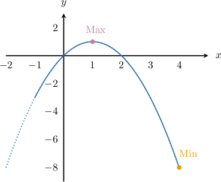
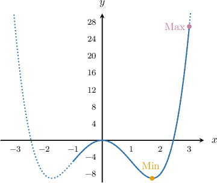

# The Candidates Test

Source: https://www.mathacademy.com/topics/364?courseId=105
Topic ID: 364

## Prerequisites

- [Using the First Derivative Test to Classify Local Extrema](./1360-using-the-first-derivative-test-to-classify-local-extrema.md)

## Lesson

### Introduction

We know how to use the first derivative test to find the local extrema of a continuous function. But how do we find the global extrema of a continuous function on a closed interval $[a,b]?$

We apply the **candidates test**, which consists of the following three steps.

**Step 1**: Find all of the critical points. The critical points are our "candidates."

- If the function is defined on a closed interval $[a,b],$ then we must remember to include the endpoints as well.

- If the function is defined on an open interval $(a,b),$ then we do not include the endpoints.

**Step 2**: Determine the value of the function at each of the critical points.

**Step 3**: Compare all the values of $f$ found in step $2.$ The greatest of these values is the global maximum value, and the least is the global minimum value.

### Example: Finding the Global Extrema of a Function on a Given Interval

#### Question

Find the global extrema of $f(x) = 2x - x^2$ on the interval $[-1,4].$

#### Explanation

Let's apply the candidates test step by step.

****: We find the critical points. Taking the derivative of $f(x)=2x-x^2,$ we get

$$

f'(x) = 2-2x,

$$

and solving $f'(x)=0,$ we get

$$

2-2x = 0 \quad \Longrightarrow \quad x=1.

$$

The critical points are $x=1$ and the endpoints $x=-1,4$ (since the derivative is not defined at the endpoints).

****: We evaluate $f(x)$ at the critical points.

$$

\begin{aligned}𝑓(−1) & =2(−1)−(−1)^{2}=−3 \\ 𝑓(1) & =2(1)−(1)^{2}=1 \\ 𝑓(4) & =2(4)−(4)^{2}=−8.\end{aligned}

$$

****: We compare all of the values found in step $2.$

- The greatest value is $f(1)=1,$ so the global maximum value is $1.$

- The least value is $f(4)=-8,$ so the global minimum value is $-8.$

### Example: Discarding Stationary Points of a Function on a Given Interval

#### Question

Find the global maximum and minimum values for the function $f(x) = x^4 - 6 x^2$ on the closed interval $[-1, 3].$

#### Explanation

First, we find the critical points. Taking the derivative of $f(x)=x^4 - 6x^2,$ we get

$$

f'(x) = 4x^3 - 12x,

$$

and solving $f'(x)=0,$ we get

$$

\begin{aligned}4𝑥^{3}−12𝑥 & =0 \\ 4𝑥(𝑥^{2}−3) & =0 \\ 4𝑥(𝑥+\sqrt{3})(𝑥−\sqrt{3}) & =0 \\ 𝑥 & =0,±\sqrt{3}.\end{aligned}

$$

Since $x = -\sqrt 3 \approx -1.73$ does not belong to the interval $[-1,3]$, we ignore this point.

So, the critical points are $x=0,\sqrt{3}$ and the endpoints $x=-1,3$ (since the derivative is not defined at the endpoints).

Finally, we evaluate $f$ at the critical points:

$$

\begin{aligned} f(-1) & = (-1)^4 - 6(-1)^2 = -5\\[5pt] f(0) & = (0)^4 - 6(0)^2 = 0\\[5pt] f(\sqrt 3) & = (\sqrt 3)^4 - 6(\sqrt 3)^2 = -9\\[5pt] f(3) & = (3)^4 - 6(3)^2 = 27 \\\end{aligned}

$$

We conclude that the global maximum is $27$ and the global minimum is $-9.$

