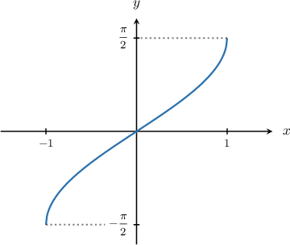
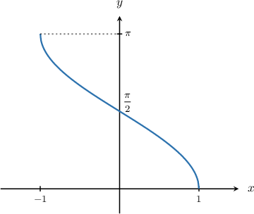
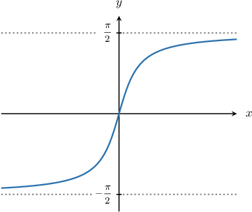
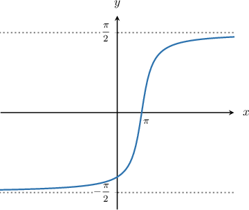
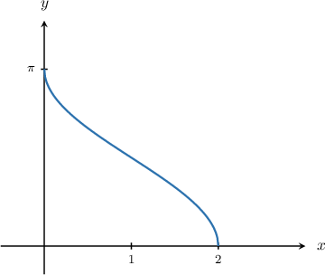
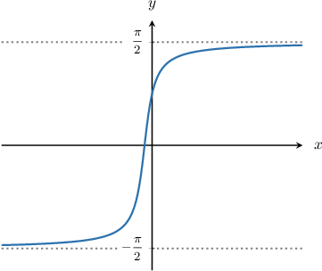

# Limits of Inverse Trigonometric Functions

Source: https://www.mathacademy.com/topics/3811?courseId=105
Topic ID: 3811

## Prerequisites

- [The Power and Root Rules for Limits](./37-the-power-and-root-rules-for-limits.md)
- [Evaluating Expressions Containing Inverse Trigonometric Functions](../../../high-school/integrated-math-honors/lessons/integrated-math-iii-honors/209-evaluating-expressions-containing-inverse-trigonometric-functions.md)
- [Combining Graph Transformations: Two Operations](../../../high-school/traditional/lessons/algebra-ii/1254-combining-graph-transformations-two-operations.md)
- [Limits at Infinity from Graphs](./1873-limits-at-infinity-from-graphs.md)

## Lesson

### Introduction

In this lesson, we will learn how to deal with limits involving inverse trigonometric functions.

Let's begin by recalling the graph of $y=\arcsin(x).$

Using the graph, we note the following:

- The domain of $\arcsin(x)$ is $x \in [-1,1].$

- For every value $a \in (-1,1),$ we have In other words, we can evaluate the limit using direct substitution. For example,

- For any value $a$ that does *not* lie in the domain of $\arcsin(x),$ the limit does *not* exist.

- At the point $x=-1,$ the limit does *not* exist because the left-sided limit does not exist. However, the right-sided limit *does* exist and is given by

- Similarly, at the point $x=1,$ the limit does *not* exist because the right-sided limit does not exist. However, the left-sided limit *does* exist and is given by

The limit properties of $y=\arccos(x)$ are similar. Let's discuss them briefly.

### Limits of Inverse Cosine

Let's recall the graph of $y=\arccos(x).$

From the graph, we note the following:

- The domain is $x \in [-1,1].$

- For every value $a \in (-1,1),$ we have

- For any value $a$ that does *not* lie in the domain of $\arccos(x),$ the limit does *not* exist.

- The right-sided limit at $x=-1$ is given by

- Similarly, the left-sided limit at $x=1$ is given by

Finally, let's deduce the limit properties of $y = \arctan x.$

### Limits of Inverse Tangent

The graph of $y=\arctan x$ is shown below.

From the graph, we note the following:

- The domain is $x \in (-\infty, \infty).$

- For every value $a,$ we have

- The limit as $x\to-\infty$ is given by

- The limit as $x\to\infty$ is given by

We can use the algebra of limits to evaluate expressions involving inverse trigonometric functions. Let's see some examples.

### Example: Finding the Limit of an Inverse Trigonometric Function at a Point

#### Question

Evaluate $\lim\limits_{x \to 0} \dfrac{\arccos(x) -\pi}{x-\pi}.$

#### Explanation

Let's sketch the graph of $y=\arccos(x){:}$

The domain of $\arccos(x)$ is $x \in [-1,1].$

Now, substituting $x=0$ directly into the limit, we have

$$

\begin{aligned}\underset{𝑥→0}{lim}(\frac{arccos⁡(𝑥)−𝜋}{𝑥−𝜋}) & =\frac{arccos⁡(0)−𝜋}{0−𝜋} \\ & =\frac{(\frac{𝜋}{2}−𝜋)}{2} \\ & =\frac{(−\frac{𝜋}{2})}{2} \\ & =\frac{1}{2}.\end{aligned}

$$

### Limits of Inverse Trigonometric Function at Infinity

We can deduce limits at infinity of transformed inverse trigonometric functions by sketching their graphs.

For example, let's consider the following limit:

$$

\lim\limits_{x \to \, \infty} \dfrac{2}{\pi}\arctan \left(x-\pi\right)

$$

To evaluate this limit, we first sketch the graph of $y =\arctan \left(x-\pi\right){:}$

The domain of $\arctan \left(x-\pi\right)$ is $(-\infty,\infty).$ Moreover, from the graph, we see that

$$

\lim\limits_{x\to \infty} \arctan \left(x-\pi\right)=\color{blue}{\dfrac{\pi}{2} } .

$$

Therefore, by the algebra of limits, we have

$$

\begin{aligned}\underset{𝑥→\,∞}{lim}\frac{2}{𝜋}arctan⁡(𝑥−𝜋) & =\frac{2}{𝜋}⋅\underset{𝑥→\,∞}{lim}arctan⁡(𝑥−𝜋) \\ & =\frac{2}{𝜋}⋅(\frac{𝜋}{2}) \\ & =1.\end{aligned}

$$

Limits at infinity involving the inverse sine and cosine functions usually do not exist. Let's see an example.

### Example: Finding Limits at Infinity

#### Question

What is the value of $\lim\limits_{x \to \, \infty} \arccos(x-1)?$

#### Explanation

First, let's sketch the graph of $y = \arccos(x-1){:}$

The domain of $\arccos(x-1)$ is $x \in [0,2].$ This means that $\arccos(x-1)$ is undefined outside this interval.

Therefore, $\lim\limits_{x \to \, \infty} \arccos(x-1)$ is undefined.

### Example: Finding a Limit Involving Trigonometric Functions and Their Inverses

#### Question

Compute the value of $\lim\limits_{x \to \, \infty}\cos\left(\dfrac{2}{3}\arctan \left(2x+1\right)\right).$

#### Explanation

First, let's sketch the graph of $y =\arctan \left(2x+1\right){:}$

The domain of $\arctan \left(2x+1 \right)$ is $(-\infty,\infty).$

As $x$ increases to $\infty,$ the graph tends to $y={\color{blue}\dfrac{\pi}{2}}.$ Therefore,

$$

\begin{aligned}\underset{𝑥→\,∞}{lim}cos⁡(\frac{2}{3}arctan⁡(2𝑥+1)) & =cos⁡(\frac{2}{3}⋅(\frac{𝜋}{2})) \\ & =cos⁡(\frac{𝜋}{3}) \\ & =\frac{1}{2}.\end{aligned}

$$
