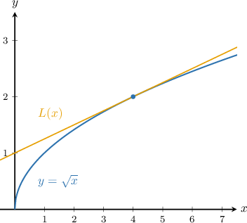
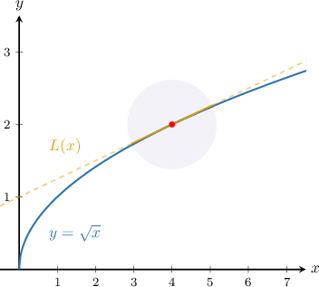
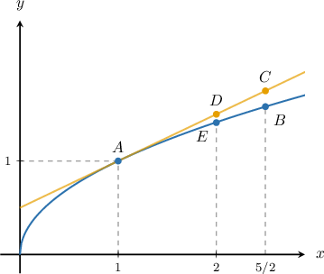

# Approximating the Roots of a Number Using Local Linearity

Source: https://www.mathacademy.com/topics/622?courseId=105
Topic ID: 622

## Prerequisites

- [Approximating Functions Using Local Linearity and Linearization](./621-approximating-functions-using-local-linearity-and-linearization.md)

## Lesson

### Introduction

Let's take a look at the following graph of the function $f(x)=\sqrt{x}$ and its tangent line $\color{orange} L$ at $x=4.$

From this graph, we can see that near $x=4,$ the tangent line and the function are very close to each other. So, the line $L(x)$ is a good approximation of the function for points close to $x=4.$

Here, the tangent line approximation of the function $f(x)=\sqrt{x}$ at the point $a=4$ is defined by

$$

\begin{aligned}𝐿(𝑥)=𝑓(4)+𝑓^{′}(4)(𝑥−4).\end{aligned}

$$

Let's calculate $f(4)$ and $f'(4)$ in the expression above. Evaluating the function at $a=4,$ we get

$$

f(4) = \sqrt{4} = 2,

$$

and computing the derivative, we get

$$

\begin{aligned}𝑓^{′}(𝑥) & =\frac{d}{d𝑥}(\sqrt{√𝑥}) \\ & =\frac{d}{d𝑥}(𝑥^{1/2}) \\ & =\frac{1}{2\sqrt{√𝑥}},\end{aligned}

$$

which in turn gives

$$

f'(4) = \dfrac{1}{2\sqrt{4}} = \dfrac{1}{4}.

$$

Finally, we obtain

$$

\begin{aligned}𝐿(𝑥) & =𝑓(4)+𝑓^{′}(4)(𝑥−4) \\ & =2+\frac{1}{4}(𝑥−4) \\ & =2+\frac{1}{4}𝑥−1 \\ & =\frac{1}{4}𝑥+1.\end{aligned}

$$

### Example: Identifying a Correct Tangent Line Approximation From a Graph

#### Question

The plot below shows the graph of $y=\sqrt{x}$ and its tangent line at $x=1.$ What value gives the tangent line approximation of $\sqrt{2.5}?$

#### Explanation

We are interested in the point that has the $x$-coordinate equal to $2.5$ and that lies on the tangent line to $y=\sqrt{x}$ at $x=1.$ This is the point $C.$

Therefore, the value that gives the tangent line approximation of $\sqrt{2.5}$ is the $y$-coordinate of $C.$

### Example: Estimating the Square Root of a Number Using a Tangent Line Approximation

#### Question

Approximate the value of $\sqrt{49.1}$ using the tangent line approximation of $f(x)=\sqrt{x}$ at $x=49.$

#### Explanation

The tangent line approximation of $f(x)$ at the point $x = a$ is

$$

L(x) = f(a) + f'(a)(x-a)

$$

In our case, we have $a=49,$ which gives

$$

\begin{aligned}𝐿(𝑥)=𝑓(49)+𝑓^{′}(49)(𝑥−49).\end{aligned}

$$

Let's compute $f(49)$ and $f'(49)$ in the expression above. Evaluating the function, we get

$$

f\left( 49\right) = \sqrt{49}= 7,

$$

and computing the derivative, we get

$$

\begin{aligned}𝑓^{′}(𝑥) & =\frac{d}{d𝑥}(\sqrt{√𝑥})=\frac{1}{2\sqrt{√𝑥}},\end{aligned}

$$

which in turn gives

$$

f'\left( 49\right) = \dfrac{1}{2\sqrt{49}} = \dfrac{1}{2\cdot 7} = \dfrac{1}{14}.

$$

So, the tangent line approximation is

$$

\begin{aligned}𝐿(𝑥)=7+\frac{1}{14}(𝑥−49).\end{aligned}

$$

We can approximate $\sqrt{49.1}$ by evaluating the tangent line approximation at $x=49.1.$ We get

$$

\begin{aligned}\sqrt{√49.1} & ≈𝐿(49.1) \\ & =7+\frac{1}{14}(49.1−49) \\ & =7+\frac{1}{14}(0.1) \\ & =7+\frac{1}{14}(\frac{1}{10}) \\ & =7+\frac{1}{140} \\ & =\frac{981}{140} \\ & ≈7.007\,143.\end{aligned}

$$

Note that the exact answer, rounded to six decimal places, is $\sqrt{49.1} = 7.007\,139.$ Our approximation is very close!

### Example: Estimating the Cube Root of a Number Using a Tangent Line Approximation

#### Question

Using the tangent line approximation of $f(x)=\sqrt[3]{x}$ at $x=8$, approximate the value of $\sqrt [3]{9}.$

#### Explanation

The tangent line approximation of $f(x)$ at the point $x = a$ is

$$

L(x) = f(a) + f'(a)(x-a)

$$

In our case, we have $a=8,$ which gives

$$

\begin{aligned}𝐿(𝑥)=𝑓(8)+𝑓^{′}(8)(𝑥−8).\end{aligned}

$$

Let's compute $f(8)$ and $f'(8)$ in the expression above. Evaluating the function at $a=8,$ we get

$$

f(8) = \sqrt[3]{8} = 2,

$$

and computing the derivative, we get

$$

\begin{aligned}𝑓^{′}(𝑥) & =\frac{d}{d𝑥}(\sqrt[√𝑥]{3}) \\ & =\frac{d}{d𝑥}(𝑥^{1/3}) \\ & =\frac{1}{3\sqrt[√𝑥^{2}]{3}},\end{aligned}

$$

which in turn,gives

$$

f'(8) = \dfrac{1}{3\left(\sqrt[3]{8}\right)^2} = \dfrac{1}{12}.

$$

So the tangent line approximation is

$$

L(x) = 2 + \dfrac{1}{12}(x-8).

$$

We can approximate $\sqrt[3]{9}$ by evaluating the tangent line approximation at $x=9.$ We get

$$

\begin{aligned}\sqrt[√9]{3} & ≈𝐿(9) \\ & =2+\frac{1}{12}(9−8) \\ & =2+\frac{1}{12}(1) \\ & =\frac{25}{12}.\end{aligned}

$$
