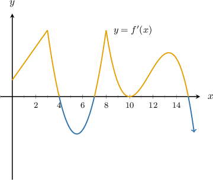
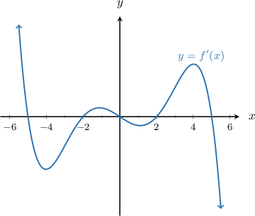
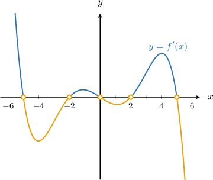
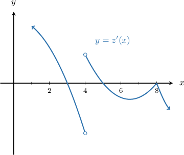
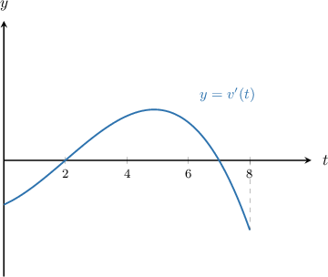
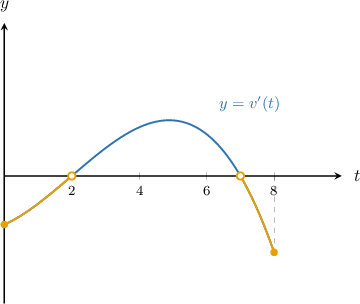

# Interpreting the Graph of a Function's Derivative

Source: https://www.mathacademy.com/topics/624?courseId=105
Topic ID: 624

## Prerequisites

- [Sketching the Derivative of a Function From the Function's Graph](./1204-sketching-the-derivative-of-a-function-from-the-function-s-graph.md)
- [Using the First Derivative Test to Classify Local Extrema](./1360-using-the-first-derivative-test-to-classify-local-extrema.md)

## Lesson

### Introduction

Suppose that $f(x)$ is a differentiable function. The graph of the derivative $y=f'(x)$ is given below. Can we determine the intervals on which $f(x)$ is increasing or decreasing?

To solve this problem, we use the following theorem:

*A differentiable function $f(x)$ is increasing on the interval $(a,b)$ if the derivative $f'(x)$ is positive for every value in $(a,b).$*

We also have the following related theorem:

*A differentiable function $f(x)$ is decreasing on the interval $(a,b)$ if the derivative $f'(x)$ is negative for every value in $(a,b).$*

From the graph, we see that $f'(x) > 0$ on the intervals

$$

(0,4), \quad (7,10), \quad (10,15).

$$

Also from the graph, we see that $f'(x) < 0$ on the intervals

$$

(4,7), \quad (15, \infty).

$$

Therefore, $f(x)$ is increasing for $x \in (0,4) \cup (7,10) \cup (10,15)$ and decreasing for $x \in (4,7) \cup (15, \infty).$

### Example: Determining Increasing and Decreasing Intervals Given the Graph of a Derivative

#### Question

The graph of $y=f'(x),$ the derivative of $f(x),$ is given below. Find all the values of $x$ where the function $y=f(x)$ is decreasing.

#### Explanation

First, we recall the following:

- If $f'(x) = 0$ for all $x \in (a,b),$ then the slope of $f(x)$ is equal to zero on $(a,b).$

- If $f'(x) > 0$ for all $x \in (a,b),$ then the slope of $f(x)$ is positive on $(a,b).$

- If $f'(x) < 0$ for all $x \in (a,b),$ then the slope of $f(x)$ is negative on $(a,b).$

From the above graph, we can see that $f'(x)$ is negative on the intervals $(-5,-2),$ $(0,2)$ and $(5,\infty)\mathbin{:}$

Therefore, $f(x)$ is decreasing when $x\in (-5,-2) \cup (0,2) \cup (5,\infty).$

### Relative Extrema

Recall that we can use the first derivative test to identify the relative extrema of a continuous function $f(x)\mathbin{:}$

- $f(x)$ has a relative maximum at $x=a$ if $f'(x)$ changes its sign from *positive* to *negative* around $x=a.$

- $f(x)$ has a relative minimum at $x=a$ if $f'(x)$ changes its sign from *negative* to *positive* around $x=a.$

So, to determine the relative extrema of a function $f(x)$ by looking at a graph of $f'(x),$ we need to pay attention to the locations where $f'(x)$ changes sign.

### Example: Determining Relative Extrema Given the Graph of a Derivative

#### Question

The graph of $y=z'(x),$ the derivative of $z(x),$ is given below. Find all the values of $x$ where the function $z(x)$ has a relative extremum. You may assume that all of the $x$-intercepts of $y=z'(x)$ are shown in the picture.

#### Explanation

First, we recall the following:

- If $z'(x)=0$ or $z'(x)$ is undefined, then we have a critical point.

- If $z'(x)>0,$ then $z(x)$ is increasing.

- If $z'(x)< 0,$ then $z(x)$ is decreasing.

The function $z(x)$ has a relative extremum at $x=a$, if the following two conditions are satisfied:

- $z'(x)=0$ or it's undefined, and

- $z'(x)$ changes its sign (going from left to right) at that point.

We summarize the information from the graph in the table below:

In our case, we obtain relative extrema at $x=3,$ $x=4,$ and $x=5.$

Notice that $x=8$ is ** a relative extremum because the sign of $z'(x)$ does not change either side of this critical point.

### Example: Interpreting the Graph of a Function's Derivative: Word Problem

#### Question

Let $v(t)$ denote the speed (in $\text{km/h}$) of a hurricane at time $t$ (in hours) since the hurricane originated in the Atlantic Ocean. The graph of $y=v'(t),$ the derivative of $v(t),$ is given below. Find all the values of $t$ where the speed of the hurricane is decreasing.

#### Explanation

First, we recall the following:

- If $v'(t) = 0$ for all $t \in (a,b),$ then $v(t)$ is constant on $(a,b).$

- When $v'(t) > 0$ for all $t \in (a,b),$ then $v(t)$ is increasing on $(a,b).$

- When $v'(t) < 0$ for all $t \in (a,b),$ then $v(t)$ is decreasing on $(a,b).$

From the above graph, we can see that $v'(t)$ is negative on the intervals $[0,2)$ and $(7,8]\mathbin{:}$

Therefore, the speed of the hurricane is decreasing when $t \in [0,2) \cup (7,8].$
