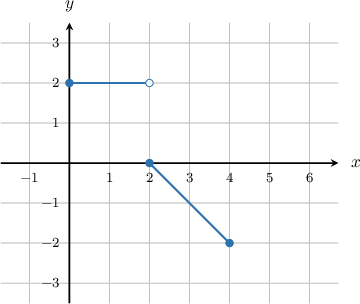
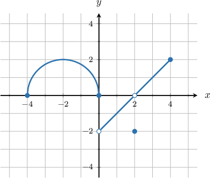

# Definite Integrals of Piecewise Functions

Source: https://www.mathacademy.com/topics/626?courseId=105
Topic ID: 626

## Prerequisites

- [Calculating the Definite Integral of a Function Given Its Graph](./1200-calculating-the-definite-integral-of-a-function-given-its-graph.md)

## Lesson

### Introduction

The additive properties of integrals are beneficial when we have to integrate a piecewise function, such as

$$

\begin{aligned}𝑥, & 𝑥<0 \\ 5, & 𝑥≥0.\end{aligned}

$$

For example, let's calculate the integral

$$

\displaystyle \int_{-5}^4 f(x) \,\text{d}x.

$$

We can split the integral into two integrals using the additive property, one integral for each "piece" of the piecewise function.

- The first integral will be over the integral $[-5,0],$ and

- the second integral will be over the integral $[0,4].$

Doing this, we get the following:

$$

\begin{aligned}∫_{4−5}𝑓(𝑥)\,d𝑥 & =∫_{0−5}𝑓(𝑥)\,d𝑥+∫_{40}𝑓(𝑥)\,d𝑥 \\ & =∫_{0−5}𝑥\,d𝑥+∫_{40}5\,d𝑥 \\ & =\frac{1}{2}𝑥^{2}_{0−5}+5𝑥_{40} \\ & =\frac{1}{2}[0^{2}−(−5)^{2}]+5[4−0] \\ & =−\frac{25}{2}+20 \\ & =\frac{15}{2}\end{aligned}

$$

### Example: Calculating the Definite Integral of a Piecewise Continuous Function Given the Function Expression

#### Question

The function $f(x)$ is defined below. What is the value of $\displaystyle \int_{-2}^5 f(x) \,\text{d}x\,?$

$$

\begin{aligned}3, & 𝑥<0 \\ 2𝑥+3, & 𝑥≥0\end{aligned}

$$

#### Explanation

By the additive property of the definite integral, we have

$$

\begin{aligned}∫_{5−2}𝑓(𝑥)\,d𝑥 & =∫_{0−2}3\,d𝑥+∫_{50}(2𝑥+3)\,d𝑥 \\ & =3𝑥_{0−2}+(𝑥^{2}+3𝑥)_{50} \\ & =[3(0)−3(−2)]+[(5^{2}+3(5))−(0^{2}+3(0))] \\ & =6+25+15 \\ & =46.\end{aligned}

$$

### Example: Calculating the Definite Integral of a Piecewise Linear Function Given Its Graph

#### Question

The graph of $y=f(x),$ shown above, consists of two line segments. Find the value of $\displaystyle \int_{0}^{4} f(x)\: \text{d}x.$

#### Explanation

The graph consists of two parts: the line segment for $x \in [0,2)$ and the line segment for $x \in [2,4].$ Therefore, we can write the required integral as follows:

$$

\int_{0}^{4} f(x)\: \text{d}x = \underbrace{\int_{0}^{2} f(x)\: \text{d}x}_{A_1} + \underbrace{\int_{2}^{4} f(x)\: \text{d}x}_{-A_2}.

$$

- The $1$st integral represents the signed area between the curve and the $x$-axis, where $x \in [0,2).$ The corresponding region is a rectangle, so we find the area using the formula

- The $2$nd integral represents the signed area between the curve and the $x$-axis, where $x \in [2,4].$ The corresponding region is a right triangle, so we find the area using the formula Since the region lies below the $x$-axis, we have

Finally, we obtain

$$

\begin{aligned}∫_{40}𝑓(𝑥)\,d𝑥 & =𝐴_{1}−𝐴_{2} \\ & =4−2 \\ & =2.\end{aligned}

$$

### Example: Calculating the Definite Integral of a Piecewise Curved Function Given Its Graph

#### Question

Given the graph of $y=f(x)$ above, find the value of $\displaystyle \int_{-4}^4 f(x) \,\text{d}x.$

#### Explanation

The graph consists of four parts: the arc of a semi-circle for $x\in [-4,0],$ a line segment for $x\in (0,2),$ a line segment for $x\in (2,4],$ and the point at $x=2.$ So, we can use the additive property of integrals to get

$$

\begin{aligned}∫_{4−4}𝑓(𝑥)\,d𝑥 & =∫_{0−4}𝑓(𝑥)\,d𝑥+∫_{20}𝑓(𝑥)\,d𝑥+∫_{22}𝑓(𝑥)\,d𝑥+∫_{42}𝑓(𝑥)\,d𝑥 \\ & =\underset{𝐴_{1}}{\underset{}{∫_{0−4}𝑓(𝑥)\,d𝑥}}+\underset{−𝐴_{2}}{\underset{}{∫_{20}𝑓(𝑥)\,d𝑥}}+0+\underset{𝐴_{3}}{\underset{}{∫_{42}𝑓(𝑥)\,d𝑥}}.\end{aligned}

$$

- The $1$st integral represents the signed area between the curve and the $x$-axis, where $x \in [-4,0].$ The corresponding region is a semi-circle with a radius of $2,$ so we find the area using the formula

- The $2$nd integral represents the signed area between the curve and the $x$-axis, where $x \in (0,2).$ The corresponding region is a right triangle, so we find the area using the formula Since the region lies below the $x$-axis, we have

- The $3$rd integral represents the signed area between the curve and the $x$-axis, where $x \in (2,4].$ The corresponding region is a right triangle, so we find the area using the formula

Finally,

$$

\begin{aligned}∫_{4−4}𝑓(𝑥)\,d𝑥 & =𝐴_{1}−𝐴_{2}+𝐴_{3} \\ & =2𝜋−2+2 \\ & =2𝜋.\end{aligned}

$$
