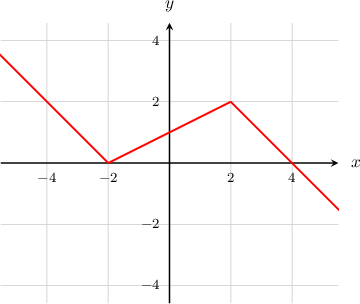

# Recognizing Derivatives in Limits

Source: https://www.mathacademy.com/topics/637?courseId=105
Topic ID: 637

## Prerequisites

- [Calculating Derivatives From Graphs](./1117-calculating-derivatives-from-graphs.md)
- [Differentiating Reciprocal Trigonometric Functions](./1686-differentiating-reciprocal-trigonometric-functions.md)

## Lesson

### Introduction

Suppose that we wish to calculate the limit

$$

L=\lim\limits_{h\to 0} \dfrac{\ln(2+h) -\ln(2)}{h}.

$$

The key here is to notice that the limit looks very similar to the instantaneous rate of change formula,

$$

f'(a) = \lim\limits_{h\to 0} \dfrac{f(a+h)-f(a)}{h},

$$

for the function $f(x) = \ln x$ at $a=2.$

Let's substitute $f(x) = \ln x$ and $a=2$ into the above, just to be sure:

$$

\begin{aligned}𝑓^{′}(2) & =\underset{ℎ→0}{lim}\frac{𝑓(2+ℎ)−𝑓(2)}{ℎ} \\ & =\underset{ℎ→0}{lim}\frac{ln⁡(2+ℎ)−ln⁡(2)}{ℎ} \\ & =𝐿.\end{aligned}

$$

This confirms that $L = f'(2).$ So instead of working out that difficult limit, we only need to work out $f'(2).$

Computing the derivative, we have

$$

f'(x) = \frac{1}{x}, \qquad f'(2) = \dfrac{1}{2},

$$

and therefore we conclude that $L=\dfrac{1}{2}.$

### Example: Recognizing Derivatives in Limits Similar to the Instantaneous Rate of Change Formula

#### Question

Calculate $\displaystyle\lim_{h\to 0}\dfrac{e^{3+h} - e^3}{h}.$

#### Explanation

First, we let

$$

L = \lim_{h\to 0}\dfrac{e^{3+h} - e^3}{h}.

$$

Comparing this with the formula for the instantaneous rate of change

$$

f'(a) = \lim_{h\to 0}\dfrac{f(a+h) - f(a)}{h},

$$

we see that if we let $f(x)=e^x$ and $a=3$, we get

$$

f'(3) = \lim_{h\to 0}\dfrac{f(3+h) - f(3)}{h} = \lim_{h\to 0}\dfrac{e^{3+h} - e^3}{h} =L.

$$

This confirms that $L=f'(3).$

Computing the derivative, we have

$$

f'(x) = e^x, \qquad f'(3) = e^3,

$$

and therefore we conclude that $L=e^3.$

### Recognizing the Equivalent Definition of the Derivative in Limits

We can apply the same method for calculating limits that are similar to the equivalent definition of the derivative,

$$

f'(a) = \lim\limits_{x\to a} \dfrac{f(x)-f(a)}{x-a}.

$$

It is important to choose the correct form for each limit. If the numerator of the limit looks like $f(a+h) -f(a)$ for some $a$ and the denominator looks like $h,$ then use the form

$$

\lim\limits_{h\to 0} \dfrac{f(x+h)-f(x)}{h}.

$$

But if the numerator looks like $f(x)-f(a)$ and the denominator looks like $x-a$ for some $a,$ then use the form

$$

\lim\limits_{x\to a} \dfrac{f(x)-f(a)}{x-a}.

$$

### Example: Recognizing Derivatives in Limits Similar to the Equivalent Definition of the Derivative

#### Question

Calculate $\displaystyle \lim_{x\to\pi/3}\dfrac{\left(\sin(x) - \dfrac{\sqrt 3}{2}\right)}{\left(x-\dfrac{\pi}{3}\right)}.$

#### Explanation

First, we let

$$

L = \lim_{x\to\pi/3}\dfrac{\left(\sin(x) - \dfrac{\sqrt 3}{2}\right)}{\left(x-\dfrac{\pi}{3}\right)}.

$$

Comparing this with the formula for the instantaneous rate of change,

$$

f'(a) = \dfrac{f(x) - f(a)}{x-a},

$$

we see that if we let $f(x) = \sin(x)$ and $a=\dfrac{\pi}{3},$ we get

$$

f'\left(\dfrac{\pi}{3}\right) = \lim_{x\to a}\dfrac{\sin(x) - \sin\left(\dfrac{\pi}{3}\right)}{\left(x-\dfrac{\pi}{3}\right)} =\lim_{x\to\pi/3}\dfrac{\left(\sin(x) - \dfrac{\sqrt 3}{2}\right)}{\left(x-\dfrac{\pi}{3}\right)}= L

$$

This confirms that $L = f'\left(\dfrac{\pi}{3}\right).$

Computing the derivative, we have

$$

f'(x) = \cos(x), \qquad f'\left(\dfrac{\pi}{3}\right) = \cos{\left(\dfrac{\pi}{3}\right)} = \dfrac{1}{2},

$$

and therefore we conclude that $L=\dfrac 1 2.$

### Example: Computing Limits Equivalent to a Derivative Using a Graph

#### Question

Which of the following statements is true regarding the graph of the function $y=f(x)$ shown below?

1. ${\displaystyle \lim_{h \to 0} \dfrac{f(-4+h) -f(-4)}{h}=2}$

2. ${\displaystyle \lim_{h \to 0} \dfrac{f(2+h) -f(2)}{h} =\dfrac{1}{2}}$

3. ${\displaystyle \lim_{h \to 0} \dfrac{f(4+h) -f(4)}{h} =-1}$

#### Explanation

Comparing these limits with the formula for the instantaneous rate of change

$$

f'(a) = \lim_{h\to 0}\dfrac{f(a+h) - f(a)}{h},

$$

we see that

$$

\begin{aligned}\underset{ℎ→0}{lim}\frac{𝑓(−4+ℎ)−𝑓(−4)}{ℎ} & =𝑓^{′}(−4), \\ \underset{ℎ→0}{lim}\frac{𝑓(2+ℎ)−𝑓(2)}{ℎ} & =𝑓^{′}(2), \\ \underset{ℎ→0}{lim}\frac{𝑓(4+ℎ)−𝑓(4)}{ℎ} & =𝑓^{′}(4).\end{aligned}

$$

The function consists of $3$ line segments. Inspecting the graph, we see that

- for $x < -2,$ we have $f'(x)=-1,$

- for $-2 < x < 2,$ we have $f'(x)=\dfrac{1}{2},$

- for $x > 2,$ we have $f'(x)=-1.$

The derivative does not exist at $x=-2$ nor $x=2.$ So, we have

$$

\begin{aligned}\underset{ℎ→0}{lim}\frac{𝑓(−4+ℎ)−𝑓(−4)}{ℎ} & =−1, \\ \underset{ℎ→0}{lim}\frac{𝑓(2+ℎ)−𝑓(2)}{ℎ} & =DNE, \\ \underset{ℎ→0}{lim}\frac{𝑓(4+ℎ)−𝑓(4)}{ℎ} & =−1.\end{aligned}

$$

Therefore, only statement III is true.
