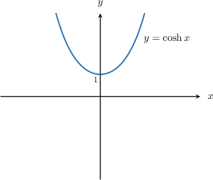
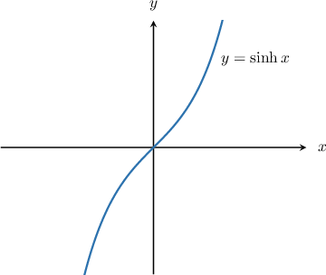
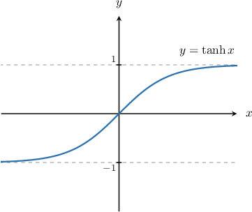

# The Hyperbolic Functions

Source: https://www.mathacademy.com/topics/967?courseId=105
Topic ID: 967

## Prerequisites

- [Simplifying Expressions Using Basic Trigonometric Identities](../../../high-school/integrated-math-honors/lessons/integrated-math-iii-honors/203-simplifying-expressions-using-basic-trigonometric-identities.md)
- [Euler's Formula](../../../high-school/integrated-math-honors/lessons/integrated-math-iii-honors/898-euler-s-formula.md)
- [The Power Rule for Logarithms](../../../high-school/traditional/lessons/algebra-ii/1475-the-power-rule-for-logarithms.md)

## Lesson

### Introduction

The **hyperbolic functions** are functions defined using the exponential functions $e^x$ and $e^{-x}.$ As we will see at the end of the lesson, hyperbolic functions are closely related to trigonometric functions.

The **hyperbolic cosine** (abbreviated and pronounced "cosh") is defined as

$$

\cosh x= \dfrac12\left(e^x+e^{-x}\right).

$$

The graph of $y=\cosh x$ is shown below.

The function $y=\cosh x$ is not a parabola, although it may look like one.

Note the following properties of $y=\cosh x\mathbin{:}$

- Its domain is $x\in (-\infty, \infty).$

- Its range is $y \geq 1.$

- It is an even function.

To evaluate $\cosh x$ at some value, say $x=2,$ we simply substitute our value into the definition:

$$

\begin{aligned}cosh⁡2=\frac{1}{2}(𝑒^{2}+𝑒^{−2})≈3.7622\end{aligned}

$$

### Example: Evaluating Hyperbolic Cosine

#### Question

Evaluate $\cosh (\ln 2).$

#### Explanation

The definition of $\cosh{x}$ is

$$

\cosh{x} = \dfrac{1}{2}(e^{x} + e^{-x}).

$$

Therefore,

$$

\begin{aligned}cosh⁡(ln⁡2) & =\frac{1}{2}(𝑒^{ln⁡2}+𝑒^{−ln⁡2}) \\ & =\frac{1}{2}(𝑒^{ln⁡2}+𝑒^{ln⁡2^{−1}}) \\ & =\frac{1}{2}(2+2^{−1}) \\ & =\frac{1}{2}(2+\frac{1}{2}) \\ & =\frac{1}{2}(\frac{4+1}{2}) \\ & =\frac{5}{4}.\end{aligned}

$$

### Hyperbolic Sine

The **hyperbolic sine** (pronounced "shine") is defined as

$$

\sinh x= \dfrac12\left(e^x-e^{-x}\right).

$$

The graph of $y=\sinh x$ is shown below.

Note the following properties of $y=\sinh x\mathbin{:}$

- Its domain is $x\in (-\infty, \infty).$

- Its range is $y \in (-\infty, \infty).$

- It is an odd function.

### Example: Evaluating Hyperbolic Sine

#### Question

Evaluate $\sinh 1.$

#### Explanation

The definition of $\sinh x$ is

$$

\sinh{x} = \dfrac{1}{2}(e^{x} - e^{-x}).

$$

Therefore,

$$

\begin{aligned}sinh⁡1 & =\frac{1}{2}(𝑒^{1}−𝑒^{−1}) \\ & =\frac{1}{2}(𝑒−\frac{1}{𝑒}) \\ & =\frac{1}{2}(\frac{𝑒^{2}−1}{𝑒}) \\ & =\frac{𝑒^{2}−1}{2𝑒}.\end{aligned}

$$

### Hyperbolic Tangent

Just as we do with trigonometric functions, we can use the basic hyperbolic functions $\sinh x$ and $\cosh x$ to create more hyperbolic functions.

The **hyperbolic tangent** (pronounced "tanch") is defined as

$$

\begin{aligned}tanh⁡𝑥=\frac{sinh⁡𝑥}{cosh⁡𝑥} & =\frac{𝑒^{𝑥}−𝑒^{−𝑥}}{𝑒^{𝑥}+𝑒^{−𝑥}}\,\,\,\,.\end{aligned}

$$

The graph of $y=\tanh x$ is shown below.

Note the following properties of $y=\tanh x\mathbin{:}$

- Its domain is $x\in (-\infty, \infty).$

- Its range is $y \in (-1,1).$

- It has horizontal asymptotes $y=\pm 1.$

- It is an odd function.

We can write down an equivalent definition of $\tanh{x}$ by multiplying the numerator and denominator by $e^x\mathbin{:}$

$$

\begin{aligned}tanh⁡𝑥 & =\frac{𝑒^{𝑥}−𝑒^{−𝑥}}{𝑒^{𝑥}+𝑒^{−𝑥}} \\ & =\frac{𝑒^{𝑥}−𝑒^{−𝑥}}{𝑒^{𝑥}+𝑒^{−𝑥}}\,⋅\,\frac{𝑒^{𝑥}}{𝑒^{𝑥}} \\ & =\frac{𝑒^{2𝑥}−1}{𝑒^{2𝑥}+1}\end{aligned}

$$

The third definition of $\tanh{x}$ can be found by multiplying the numerator and denominator of our original definition by $e^{-x}\mathbin{:}$

$$

\begin{aligned}tanh⁡𝑥 & =\frac{𝑒^{𝑥}−𝑒^{−𝑥}}{𝑒^{𝑥}+𝑒^{−𝑥}} \\ & =\frac{𝑒^{𝑥}−𝑒^{−𝑥}}{𝑒^{𝑥}+𝑒^{−𝑥}}\,⋅\,\frac{𝑒^{−𝑥}}{𝑒^{−𝑥}} \\ & =\frac{1−𝑒^{−2𝑥}}{1+𝑒^{−2𝑥}}\end{aligned}

$$

We can use any definition of $\tanh x$ that we like for a given situation. However, it's often convenient to use the second or third definition when evaluating a function containing $\tanh{x},$ because they include fewer exponential terms than the first definition.

### Example: Evaluating Hyperbolic Tangent

#### Question

Evaluate $\tanh{4}.$

#### Explanation

The definition of $\tanh x$ is

$$

\begin{aligned}tanh⁡𝑥 & =\frac{𝑒^{𝑥}−𝑒^{−𝑥}}{𝑒^{𝑥}+𝑒^{−𝑥}} \\ & =\frac{𝑒^{2𝑥}−1}{𝑒^{2𝑥}+1} \\ & =\frac{1−𝑒^{−2𝑥}}{1+𝑒^{−2𝑥}}.\end{aligned}

$$

Using the second definition, we get

$$

\begin{aligned}tanh⁡4 & =\frac{𝑒^{2(4)}−1}{𝑒^{2(4)}+1} \\ & =\frac{𝑒^{8}−1}{𝑒^{8}+1}.\end{aligned}

$$

### The Relationship Between Trigonometric and Hyperbolic Cosine

There is a deep connection between trigonometric and hyperbolic functions. This means that we can use a lot of our knowledge of trigonometry to solve problems containing hyperbolic functions.

To see how they are connected, we need to go back to Euler's formula:

$$

e^{\textrm i\theta} = \cos\theta + \textrm i\sin\theta

$$

By replacing $\theta$ with $-\theta,$ we get

$$

e^{-\textrm i\theta} = \cos\theta - \textrm i\sin\theta.

$$

Adding the two equations gives

$$

e^{\textrm i\theta} + e^{-\textrm i\theta} = 2\cos\theta.

$$

Making $\cos\theta$ the subject, we get

$$

\cos\theta = \dfrac12\left(e^{\textrm i\theta} + e^{-\textrm i\theta}\right).

$$

Notice that the right-hand side is identical to $\cosh(\textrm i\theta).$ This means that we have the identity

$$

\cos\theta = \cosh(\textrm i\theta).

$$

### The Relationship Between Trigonometric and Hyperbolic Sine

We can similarly derive a link between $\sin\theta$ and $\sinh\theta.$ To do this, let's recall Euler's formula once more.

$$

e^{\textrm i\theta} = \cos\theta + \textrm i\sin\theta

$$

We also have

$$

e^{-\textrm i\theta} = \cos\theta - \textrm i\sin\theta.

$$

Subtracting the two equations, we get

$$

e^{\textrm i\theta} - e^{-\textrm i\theta} = 2\textrm i\sin\theta.

$$

Making $\sin\theta$ the subject of the equation, we get

$$

\begin{aligned}sin⁡𝜃 & =\frac{1}{2i}(𝑒^{i𝜃}−𝑒^{−i𝜃}) \\ & =−\frac{i}{2}(𝑒^{i𝜃}−𝑒^{−i𝜃}),\end{aligned}

$$

which gives us the identity

$$

\sin\theta = -\textrm i \sinh(\textrm i\theta).

$$
