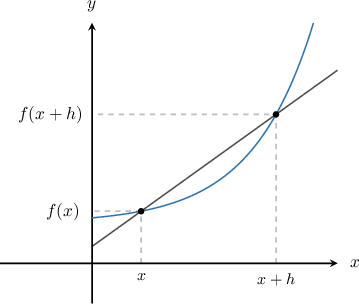
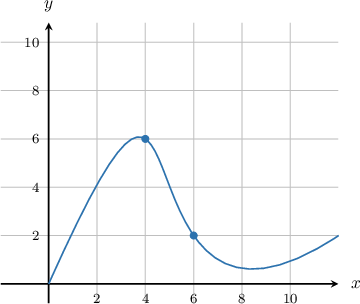
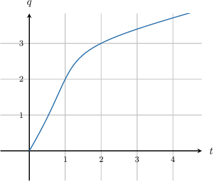

# Estimating Derivatives Using a Forward Difference Quotient

Source: https://www.mathacademy.com/topics/992?courseId=105
Topic ID: 992

## Prerequisites

- [Interpreting the Meaning of the Derivative in Context](./296-interpreting-the-meaning-of-the-derivative-in-context.md)

## Lesson

### Introduction

For a function $f(x),$ its derivative at a point $x$ is defined by the limit

$$

f'(x) = \lim\limits_{h\to 0} \frac{f(x+h) - f(x) }{h}.

$$

But often, computing this limit exactly is impossible or impractical. One example might be when we don't have an explicit expression for $f(x).$ In such cases, instead of finding an exact value for $f'(x)$, we can *approximate* the derivative using the formula

$$

f'(x)\approx \frac{f(x+h) - f(x) }{h}

$$

for small values of the "step size" $h,$ with $h>0.$

This expression is called the **forward difference approximation** because if $h >0$ then $x+h$ is a step forward (i.e., to the right) from $x.$

Generally, this and other similar methods are known as **finite-difference** approximations. The smaller the value of $h,$ the better the approximation.

### Example: Estimating a Derivative From a Table Using a Forward Difference Approximation

#### Question

A function $f(x)$ has values according to the table below:

Approximate at the point $x=3$ using a forward difference approximation.

#### Explanation

We use the forward difference approximation formula

$$

f'(x) \approx \frac{f(x+h) - f(x)}{h}

$$

at the point $x=3.$ We choose the step size $h$ to be as small as possible, in this case $h=1.$ This gives

$$

\begin{aligned}𝑓^{′}(3) & ≈\frac{𝑓(3+1)−𝑓(3)}{1} \\ & =\frac{𝑓(4)−𝑓(3)}{1} \\ & =\frac{(−0.3)−(−0.7)}{1} \\ & =\frac{0.4}{1} \\ & =0.4.\end{aligned}

$$

### Example: Estimating a Derivative From a Graph Using a Forward Difference Approximation

#### Question

The graph of the function $y=g(x)$ is shown below. Approximate $g'(x)$ at the point $x=4$ using a forward difference approximation with step size $h=2.$

#### Explanation

We use the forward difference approximation

$$

g'(x) \approx \frac{g(x+h) - g(x)}{h}

$$

at the point $x=4.$ Applying the above formula with $x=4$ and $h=2$ gives

$$

\begin{aligned}𝑔^{′}(4) & ≈\frac{𝑔(4+2)−𝑔(4)}{2} \\ & =\frac{𝑔(6)−𝑔(4)}{2} \\ & =\frac{2−6}{2} \\ & =\frac{−4}{2} \\ & =−2.\end{aligned}

$$

### Example: Estimating a Derivative From a Table Using a Forward Difference Approximation: Word Problem

#### Question

The position of a race car along a straight track, measured in feet from the starting line, is given by the function $s(t),$ where $t$ is the time in seconds. The values of $s(t)$ for different values of $t$ are given in the table below:

Approximate the velocity $s'(t)$ at the time $t=0.1$ using a forward difference approximation.

#### Explanation

We use the forward difference approximation

$$

s'(t) \approx \frac{s(t+h) - s(t)}{h}

$$

at the time $t=0.1.$ We choose the step size $h$ to be as small as possible, in this case $h=0.1.$ This gives

$$

\begin{aligned}𝑠^{′}(0.1) & ≈\frac{𝑠(0.1+0.1)−𝑠(0.1)}{0.1} \\ & =\frac{𝑠(0.2)−𝑠(0.1)}{0.1} \\ & =\frac{7−3}{0.1} \\ & =\frac{4}{0.1} \\ & =40.\end{aligned}

$$

So at $t=0.1$ the velocity is approximately $40\, \textrm{ft}/\textrm{s}.$

### Example: Estimating a Derivative From a Graph Using a Forward Difference Approximation: Word Problem

#### Question

An oil tank has leaked $q(t)$ liters of oil after $t$ hours. The graph of $q(t)$ is shown below. Approximate the rate at which the oil is leaking from the tank when $t=1$ using a forward difference approximation with step size $h=1.$

#### Explanation

We use the forward difference approximation

$$

q'(t) \approx \frac{q(t+h) - q(t)}{h}

$$

at the time $t=1$ with step size $h=1.$ This gives

$$

\begin{aligned}𝑞^{′}(1) & ≈\frac{𝑞(1+1)−𝑞(1)}{1} \\ & =\frac{𝑞(2)−𝑞(1)}{1} \\ & =3−2 \\ & =1.\end{aligned}

$$

So, after $1$ hour, the tank is leaking oil at a rate of approximately $1\,\textrm{liter}/ \textrm{hour}.$
