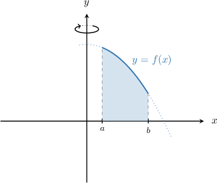
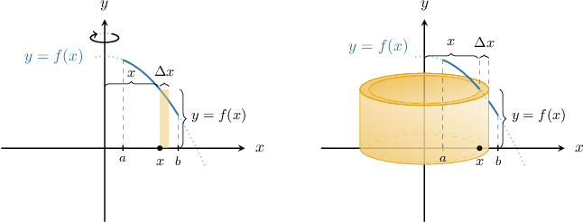
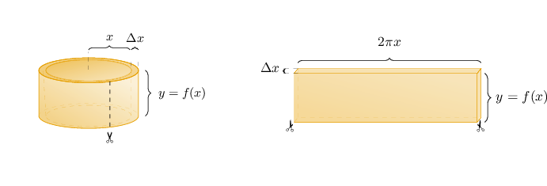
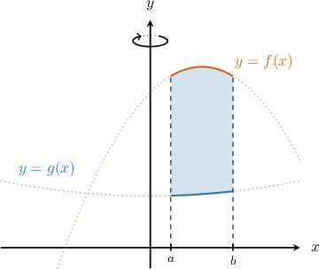
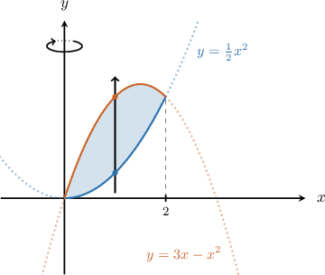
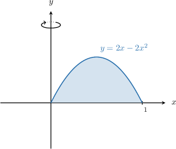
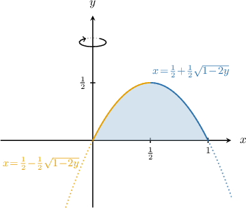

# The Shell Method: Rotation About the Y-Axis

Source: https://www.mathacademy.com/topics/1084?courseId=106
Topic ID: 1084

## Prerequisites

- [The Shell Method: Rotating a Region Between Two Curves About the X-Axis](./3641-the-shell-method-rotating-a-region-between-two-curves-about-the-x-axis.md)

## Lesson

### Introduction

Consider the plane region enclosed by the curve $y=f(x),$ the $x$-axis, and the vertical lines $x=a$ and $x=b,$ as shown below. If we rotate this region $2\pi$ radians about the $y$-axis, we get a solid of revolution.

We can compute the volume of the solid using the shell method. We divide the interval from $x=a$ to $x=b$ on the $x$-axis to get vertical slices. Consider one such slice of width $\Delta{x},$ as shown in the picture below (on the left). When this rectangle is rotated about the $y$-axis, it forms a solid shell (i.e., the skin of a cylinder).

Since we assume that $\Delta{x}$ is very small, the outer radius of the shell approximately equals the inner radius $x.$ The thickness of the shell is $\Delta{x}$ and its height is $y=f(x)$.

Imagine we cut this shell and unfold it to obtain a rectangular solid, as shown below. Its height is $y=f(x)$, its thickness is $\Delta{x},$ and its length is $2\pi x$ (the circumference of the shell).

The volume of the shell approximately equals the volume of the rectangular solid:

$$

\begin{aligned}𝑉_{shell} & ≈𝑉_{rec} \\ & =2𝜋𝑥⋅𝑦⋅Δ𝑥 \\ & =2𝜋𝑥𝑓(𝑥)Δ𝑥\end{aligned}

$$

The sum of all the shells will approximate the total volume we want. This approximation becomes more accurate as $\Delta{x} \to 0$. Therefore, the volume $V$ of the solid is given by

$$

\begin{aligned}𝑉 & =2𝜋∫_{𝑏𝑎}^{}𝑥𝑦\,d𝑥 \\ & =2𝜋∫_{𝑏𝑎}^{}𝑥\,𝑓(𝑥)\,d𝑥.\end{aligned}

$$

### Example: Finding the Volume of a Solid Using the Shell Method

#### Question

Consider the finite region bounded by the curve $y=2x^3-8x^2+8x$ and the $x$-axis. Calculate the volume of the solid generated when this region is rotated $2\pi$ radians about the $y$-axis.

#### Explanation

First, we determine the points where the curve intersects the $x$-axis by solving the following equation for $x\mathbin{:}$

$$

\begin{aligned}2𝑥^{3}−8𝑥^{2}+8𝑥 & =0 \\ 2𝑥(𝑥^{2}−4𝑥+4) & =0 \\ 2𝑥(𝑥−2)^{2} & =0\end{aligned}

$$

The solutions are $x=0$ and $x=2.$ So, we need to integrate from $x=0$ to $x=2.$

Using the shell method, the volume of the solid can be found as follows:

$$

\begin{aligned}𝑉 & =2𝜋∫_{𝑏𝑎}^{}𝑥\,𝑓(𝑥)\,d𝑥 \\ & =2𝜋∫_{20}^{}𝑥(2𝑥^{3}−8𝑥^{2}+8𝑥)\,d𝑥 \\ & =2𝜋∫_{20}^{}2𝑥^{4}−8𝑥^{3}+8𝑥^{2}\,d𝑥 \\ & =4𝜋∫_{20}^{}𝑥^{4}−4𝑥^{3}+4𝑥^{2}\,d𝑥 \\ & =4𝜋(\frac{𝑥^{5}}{5}−𝑥^{4}+\frac{4𝑥^{3}}{3})_{20}^{} \\ & =4𝜋[(\frac{2^{5}}{5}−2^{4}+\frac{4⋅2^{3}}{3})−0] \\ & =4𝜋[(\frac{2^{5}}{5}−\frac{2^{5}}{2}+\frac{2^{5}}{3})−0] \\ & =4𝜋⋅2^{5}(\frac{1}{5}−\frac{1}{2}+\frac{1}{3}) \\ & =4𝜋⋅32(\frac{1}{5}−\frac{1}{2}+\frac{1}{3}) \\ & =\frac{64𝜋}{15}\end{aligned}

$$

### Rotating the Region Between Two Curves About the Y-Axis

Consider the region enclosed by the curves $y=f(x)$ on the top, $y=g(x)$ on the bottom, and the vertical lines $x=a$ and $x=b,$ as shown below. We assume that $f(x) \geq g(x)$ for all $x \in [a,b].$

To find the volume of the solid generated when this region is rotated $2\pi$ radians about the $y$-axis, we use the shell method as follows:

$$

\begin{aligned}𝑉 & =2𝜋∫_{𝑏𝑎}^{}𝑥([upper]−[lower])\,d𝑥 \\ & =2𝜋∫_{𝑏𝑎}^{}𝑥([𝑓(𝑥)]−[𝑔(𝑥)])d𝑥\end{aligned}

$$

### Example: Finding the Volume of a Solid When a Region is Enclosed Between Two Curves

#### Question

Consider the finite region bounded between the curves $y=3x-x^2$ and $y=\dfrac{1}{2}x^2.$ Calculate the volume of the solid generated when this region is rotated $2\pi$ radians about the $y$-axis.

#### Explanation

First, let $f(x)=3x-x^2$ and $g(x)=\dfrac{1}{2}x^2.$

We start by determining the points where the curves intersect by solving the following equation for $x\mathbin{:}$

$$

\begin{aligned}𝑓(𝑥) & =𝑔(𝑥) \\ 3𝑥−𝑥^{2} & =\frac{1}{2}𝑥^{2} \\ 3𝑥−\frac{3}{2}𝑥^{2} & =0 \\ 𝑥−\frac{1}{2}𝑥^{2} & =0 \\ 2𝑥−𝑥^{2} & =0 \\ 𝑥(2−𝑥) & =0\end{aligned}

$$

The solutions are $x=0$ and $x=2.$ So, we need to integrate from $x=0$ to $x=2.$

Now, let's draw our usual vertical arrow through the region to determine the lower and upper functions.

The vertical arrow

- ** the region through the lower function $y=g(x)=\dfrac12 x^2,$ and

- ** through the upper function $y=f(x)=3x-x^2.$

Therefore, using the shell method, the volume of the solid can be calculated as follows:

$$

\begin{aligned}𝑉 & =2𝜋∫_{𝑏𝑎}^{}𝑥([upper]−[lower])\,d𝑥 \\ & =2𝜋∫_{20}^{}𝑥([3𝑥−𝑥^{2}]−[\frac{1}{2}𝑥^{2}])d𝑥 \\ & =2𝜋∫_{20}^{}𝑥(3𝑥−\frac{3}{2}𝑥^{2})d𝑥 \\ & =6𝜋∫_{20}^{}𝑥(𝑥−\frac{1}{2}𝑥^{2})d𝑥 \\ & =6𝜋∫_{20}^{}𝑥(\frac{2𝑥}{2}−\frac{1}{2}𝑥^{2})d𝑥 \\ & =3𝜋∫_{20}^{}𝑥(2𝑥−𝑥^{2})d𝑥 \\ & =3𝜋∫_{20}^{}(2𝑥^{2}−𝑥^{3})d𝑥 \\ & =3𝜋(\frac{2𝑥^{3}}{3}−\frac{𝑥^{4}}{4})_{20}^{} \\ & =3𝜋[(\frac{16}{3}−\frac{16}{4})−0] \\ & =4𝜋\end{aligned}

$$

### Advantages of the Shell Method

One of the advantages of using the shell method versus other methods is that the resulting integral can be much simpler to evaluate. This is often true when we want to rotate a curve of the form $y = f(x)$ about the $y$-axis.

For example, suppose we want to compute the volume generated when the region below is rotated about the $y$-axis:

According to the shell method, the volume $V$ is given by the following straightforward integral:

$$

\begin{aligned}𝑉 & =2𝜋∫_{10}^{}𝑥𝑓(𝑥)\,d𝑥 \\ & =2𝜋∫_{10}^{}𝑥(2𝑥−2𝑥^{2})\,d𝑥 \\ & =2𝜋∫_{10}^{}2𝑥^{2}−2𝑥^{3}\,d𝑥\end{aligned}

$$

Let's now compare this to the disc method.

To determine the volume using the disc method, we would first have to express our curve as two functions of $y,$ one for the right-hand side and one for the left-hand side, as follows:

$$

\begin{aligned}𝑥=\frac{1}{2}+\frac{1}{2}\sqrt{√1−2𝑦},\, & 𝑥≥\frac{1}{2} \\ 𝑥=\frac{1}{2}−\frac{1}{2}\sqrt{√1−2𝑦},\, & 𝑥<\frac{1}{2}\end{aligned}

$$

The required volume equals the difference between the volumes generated when the right and left curves are rotated about the $y$-axis. Thus, according to the disc method, the required volume is given by

$$

V = \pi \int_{0}^{1/2} \left( \left[ \dfrac{1}{2}+\dfrac{1}{2}\sqrt{1-2y} \right]^2 - \left[ \dfrac{1}{2}-\dfrac{1}{2}\sqrt{1-2y} \right]^2 \right) \textrm{d}y.

$$

As we can see, this integral is a lot more complicated than the one we obtained using the shell method!
