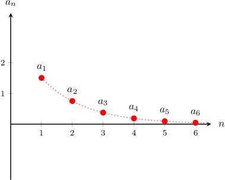
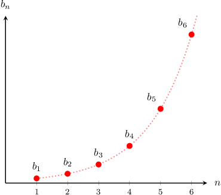

# Convergence of Geometric Sequences

Source: https://www.mathacademy.com/topics/1088?courseId=106
Topic ID: 1088

## Prerequisites

- [The Nth Term of a Geometric Sequence](../../../high-school/traditional/lessons/algebra-i/680-the-nth-term-of-a-geometric-sequence.md)
- [End Behavior of Functions](../../../high-school/traditional/lessons/algebra-i/2048-end-behavior-of-functions.md)

## Lesson

### Introduction

Suppose that the sequence $a_n$ is defined as

$$

a_n = 3\left(\dfrac 1 2\right)^n, \qquad n\geq 1.

$$

This is a geometric sequence with common ratio $r = \dfrac12.$ What is the behavior of this sequence as $n\to\infty?$

Let's start by calculating the first few terms of the sequence:

$$

a_1 = \dfrac32, \qquad a_2 = \dfrac34, \qquad a_3 = \dfrac38, \qquad a_4 = \dfrac{3}{16}, \qquad \ldots\,.

$$

Plotting the few terms of the sequence, we get a graph like the one below:

From the diagram, it appears that $a_n\to 0$ as $n\to\infty.$ This is indeed true.

Because $a_n$ approaches zero as $n\to \infty,$ we say that the sequence is **convergent** and that it **converges to**$0.$ We also say that the **limit of the sequence** is $0.$

The sequence is convergent because $|r| < 1,$ which causes the terms of the sequence to decrease to zero as $n$ increases.

### Divergent Geometric Sequences

Now let's look at the sequence $b_n,$ defined as

$$

b_n = 2^n, \qquad n\geq 1.

$$

This is a geometric sequence with common ratio $r = 2.$ What is the behavior of this sequence as $n\to\infty?$

Let's start by calculating the first few terms of the sequence:

$$

b_1 = 2, \qquad b_2 = 4, \qquad b_3 = 8, \qquad b_4 = 16, \qquad \ldots\,.

$$

Plotting the few terms of the sequence, we get a graph like the one below:

From the diagram, it appears that $b_n\to \infty$ as $n\to\infty.$ This is indeed true.

Because $b_n$ grows without bound as $n\to \infty,$ we say that the sequence is **divergent.** The sequence is divergent because $|r| > 1,$ which causes the terms of the sequence to increase as $n$ increases.

### Edge Cases

Okay, so we've seen that a geometric sequence is convergent for $|r| < 1$ and divergent when $|r| >1.$ But what about when $|r| = 1?$

We have two cases:

- When $r=1,$ the geometric sequence is convergent and converges to the first term. For example, consider the sequence $c_n = 2(1)^n,$ shown below: In this case, the sequence is convergent, and the limit of the sequence is $c_1 = 2.$

- When $r=-1,$ the geometric sequence is divergent. For example, consider the sequence $d_n = 2(-1)^n,$ shown below: In this case, the sequence oscillates between $2$ and $-2.$ It does not approach a fixed number, so it is divergent.

### A Summary of Convergence Results For Geometric Sequences

To summarize, suppose we have a geometric sequence with the first term $a_1$ and common ratio $r.$ Then, we have the following convergence properties:

- if $|r| < 1,$ the sequence is convergent and converges to $0$

- if $|r| > 1,$ the sequence is divergent

Moreover, we have the following edge cases:

- if $r=1,$ the sequence is convergent and converges to $a_1$

- if $r = -1,$ the sequence is divergent

### Example: Determining Whether a Geometric Sequence Converges

#### Question

Consider the following geometric sequence:

$$

6, \quad -2, \quad \dfrac{2}{3}, \quad -\dfrac{2}{9}, \quad \ldots

$$

Determine whether the sequence is convergent or divergent. If it converges, find the limit.

#### Explanation

Suppose we have a geometric sequence with the first term $a_1$ and common ratio $r.$ Then, we have the following convergence properties:

- if $|r| < 1,$ the sequence is convergent and converges to $0$

- if $|r| > 1,$ the sequence is divergent

Moreover, we have the following edge cases:

- if $r=1,$ the sequence is convergent and converges to $a_1$

- if $r = -1,$ the sequence is divergent

The given sequence is a geometric sequence with the common ratio

$$

r=\dfrac{a_2}{a_1}=\dfrac{(-2)}{6}= -\dfrac{1}{3}.

$$

Since $|r| = \dfrac{1}{3} < 1,$ the sequence converges to $0.$

### Example: Determining Whether a Geometric Sequence Converges Given the Nth Term

#### Question

Does the sequence $a_n=\left(\dfrac{5}{3}\right)^{n-1}$ for $n\geq 1$ converge or diverge? If it converges, what is its limit?

#### Explanation

Suppose we have a geometric sequence with the first term $a_1$ and common ratio $r.$ Then, we have the following convergence properties:

- if $|r| < 1,$ the sequence is convergent and converges to $0$

- if $|r| > 1,$ the sequence is divergent

Moreover, we have the following edge cases:

- if $r=1,$ the sequence is convergent and converges to $a_1$

- if $r = -1,$ the sequence is divergent

The given sequence $a_n=\left(\dfrac{5}{3}\right)^{n-1}$ is a geometric sequence with the common ratio $r =\dfrac{5}{3}.$

Since $|r| > 1,$ the sequence is divergent.

### Example: Determining Convergence Behavior of Geometric Sequences Written Recursively

#### Question

Consider the following sequence:

$$

a_{n+1} = -2a_n, \qquad a_1 = -4, \qquad n\geq 1.

$$

Determine whether the sequence is convergent or divergent. If it converges, find the limit.

#### Explanation

Suppose we have a geometric sequence with the first term $a_1$ and common ratio $r.$ Then, we have the following convergence properties:

- if $|r| < 1,$ the sequence is convergent and converges to $0$

- if $|r| > 1,$ the sequence is divergent

Moreover, we have the following edge cases:

- if $r=1,$ the sequence is convergent and converges to $a_1$

- if $r= -1,$ the sequence is divergent

The given sequence is a geometric sequence with the common ratio

$$

r=\dfrac{a_{n+1}}{a_n}= -2.

$$

Since $|r| >1$, the sequence diverges.
