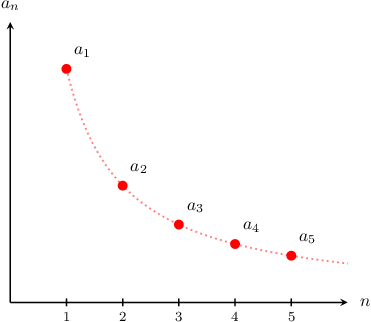
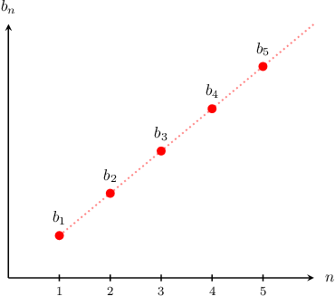
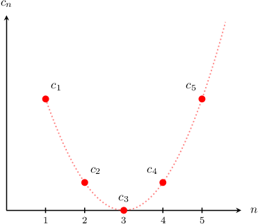
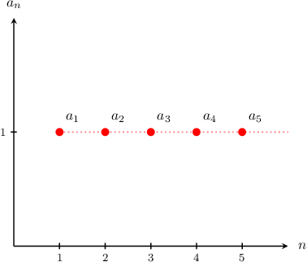
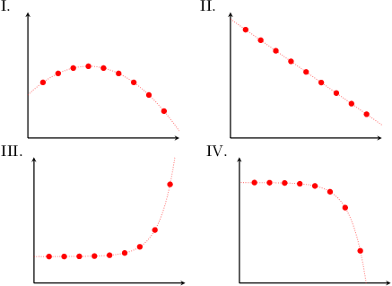

# Monotonic Sequences

Source: https://www.mathacademy.com/topics/1096?courseId=106
Topic ID: 1096

## Prerequisites

- [Multiplying Binomials](../../../high-school/traditional/lessons/algebra-i/371-multiplying-binomials.md)
- [Factorials](../../../high-school/traditional/lessons/geometry/774-factorials.md)
- [Increasing and Decreasing Functions](../../../high-school/traditional/lessons/algebra-i/1628-increasing-and-decreasing-functions.md)
- [Introduction to Sequences](../../../high-school/traditional/lessons/algebra-i/2271-introduction-to-sequences.md)
- [Further Solving Linear Inequalities](../../../middle-school/lessons/grade-7/4034-further-solving-linear-inequalities.md)

## Lesson

### Introduction

Let's consider the following sequence:

$$

a_{n} = \dfrac{1}{n}, \qquad n \geq 1

$$

This is a **decreasing sequence** because every term is less than (or equal to) the previous term. We can see this by plotting the first few terms.

Similarly, the sequence

$$

b_n = n, \qquad n \geq 1,

$$

is an **increasing sequence** because every term is greater than (or equal to) the previous term.

If a sequence is *either* increasing *or* decreasing, then we say that the sequence is **monotonic**.

Finally, let's consider the sequence

$$

c_n = (n-3)^2, \qquad n \geq 1.

$$

This sequence is **neither increasing nor decreasing**, because it is not increasing *for all* $n\geq 1$ nor decreasing *for all* $n\geq 1.$

### Constant Sequences

Constant sequences are *both* increasing *and* decreasing!

As an example, let's consider the following constant sequence:

$$

a_{n} = 1, \qquad n \geq 1,

$$

Notice that

- $a_n$ is *increasing* because every term is greater than *or equal to* the previous term, and

- $a_n$ is *decreasing* because every term is less than *or equal to* the previous term.

Therefore, $a_n$ is both increasing and decreasing.

### Example: Determining Visually Whether a Sequence Is Monotonic

#### Question

Which of the following graphs represents a decreasing sequence?

#### Explanation

Suppose the sequence $a_n$ is defined for $n\geq 1\mathbin{:}$

- $a_n$ is **** if every term is greater than or equal to the previous term.

- $a_n$ is **** if every term is less than or equal to the previous term.

Of the given options, only II and IV represent decreasing sequences. Each term in these sequences is smaller than or equal to the previous term.

**** Sequence I does ** represent a decreasing sequence because it increases for the first four terms.

### Example: Determining Whether a Simple Sequence Is Monotonic

#### Question

Which of the following sequences, defined for $n\geq 1,$ are decreasing?

1. $a_n = -2^n$

2. $b_n = n!$

3. $c_n = \dfrac{2}{\sqrt[3]n}$

#### Explanation

Suppose the sequence $a_n$ is defined for $n\geq 1\mathbin{:}$

- $a_n$ is **** if every term is greater than or equal to the previous term.

- $a_n$ is **** if every term is less than or equal to the previous term.

With that in mind, let's consider each sequence in turn.

- The sequence $a_n$ is decreasing. Computing the first few terms, we have From here, we see that every term is less than the previous term.

- The sequence $b_n$ is **. Computing the first few terms, we have From here, we see that every term is greater than the previous term.

- The sequence $c_n$ is decreasing. Computing the first few terms, we have From here, we see that as $n$ increases, the numerator remains constant while the denominator increases. So every term is less than the previous term.

Therefore, the correct answer is "$a_n$ and $c_n$ only."

### Using the Difference of Terms To Check Whether a Sequence Is Monotonic

Up to now, we've determined whether a sequence is increasing or decreasing by looking at the first few terms and observing the general trend. This approach is fine for very simple sequences.

For more complex sequences, we need a more rigorous approach.

Suppose the sequence $a_n$ is defined for $n\geq 1.$ To determine whether $a_n$ is increasing or decreasing, we can use the following definition:

- A sequence $a_n$ is *increasing* if every term is greater than or equal to the previous term. Therefore, for all $n\geq 1,$ we have

- A sequence $a_n$ is *decreasing* if every term is less than or equal to the previous term. Therefore, for all $n\geq 1,$ we have

- If neither of these conditions holds, the sequence is *neither increasing nor decreasing*.

Let's use this definition to show that the following sequence is increasing:

$$

a_n = n^2, \qquad n \geq 1

$$

Taking a general term and subtracting the previous term, we get

$$

\begin{aligned}𝑎_{𝑛+1}−𝑎_{𝑛} & =(𝑛+1)^{2}−𝑛^{2} \\ & =𝑛^{2}+2𝑛+1−𝑛^{2} \\ & =2𝑛+1.\end{aligned}

$$

Notice that this is *positive* for $n\geq 1.$ To see this concretely, set $b_n = 2n+1.$ Computing the first few terms of $b_n,$ we get

$$

3, \quad 5, \quad 7, \quad 9, \quad \ldots\,

$$

which is clearly positive for $n\geq 1.$ Therefore, we have shown that for $n\geq 1,$ we have

$$

b_n = a_{n+1} - a_n \geq 0.

$$

This shows that $a_n = n^2$ for $n\geq 1$ is increasing.

### Example: Determining Whether a Quadratic Sequence Is Monotonic

#### Question

Given $a_n =3-2n -n^2$ for $n\geq 1$, which of the following statements are true?

1. $a_{n+1} - a_n \geq 0$ for all $n\geq 1$

2. $a_n$ is an increasing sequence

3. $a_n$ is a decreasing sequence

#### Explanation

Suppose the sequence $a_n$ is defined for $n\geq 1.$ To determine whether $a_n$ is increasing or decreasing, we can use the following test:

- If a sequence $a_n$ is ** then for all $n\geq 1,$ we have

- If a sequence $a_n$ is ** then for all $n\geq 1,$ we have

- If neither of these conditions holds, the sequence is **.

With that in mind, let's analyze each statement.

- Statement I is false. Computing the difference $a_{n+1} - a_n,$ we get which is ** for all $n\geq 1.$ To see this concretely, set $b_n = -3-2n.$ Computing the first few terms of $b_n$ we get

- Statement II is false, whereas statement III is true. Since $a_{n+1} - a_n \leq 0$ for all $n\geq 1,$ we can conclude that $a_n$ is a decreasing sequence.

Therefore, the correct answer is "III only."
