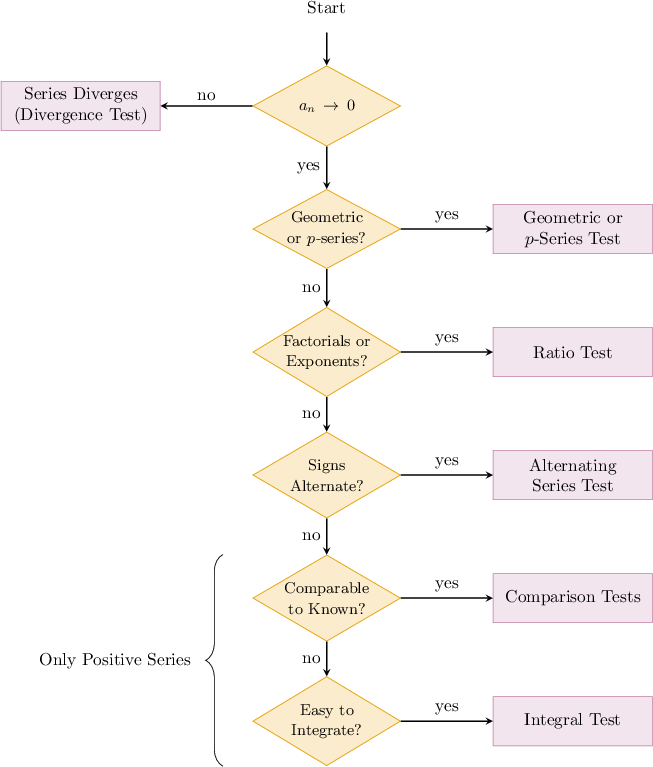

# Selecting Procedures for Analyzing Infinite Series

Source: https://www.mathacademy.com/topics/1172?courseId=106
Topic ID: 1172

## Prerequisites

- [The Integral Test](./744-the-integral-test.md)
- [The Ratio Test](./746-the-ratio-test.md)
- [The Alternating Series Test](./747-the-alternating-series-test.md)
- [The Limit Comparison Test](./750-the-limit-comparison-test.md)

## Lesson

### Introduction

We now have many convergence tests available in our toolbox. It's now about learning which tool to use for which job.

The flow chart below describes a process we can follow when we're confronted with an infinite series and want to determine which convergence test to use.

After some practice, you'll be able to quickly recognize which test to use.

### Example: Identifying Convergent Series Using Multiple Convergence Tests

#### Question

Which of the following series converge?

1. $\displaystyle \sum_{n=1}^\infty \dfrac{e^{2n}}{n^{99}}$

2. $\displaystyle \sum_{n=1}^\infty \dfrac{\ln(2n+1)}{n}$

3. $\displaystyle \sum_{n=1}^\infty \dfrac{4^n}{n!}$

#### Explanation

We use the flowchart below to determine which tests to use for each series.

With that in mind, let's test each series in turn.

- For the first series, we use the $n$th term test for divergence. Let Then, we have $\displaystyle\lim_{n\to\infty}a_n=\infty,$ since the exponential term in the numerator grows faster than the polynomial in the denominator. Therefore, by the $n$th term test, the series is divergent.

- For the second series, we use the comparison test. Observe that for all $n\geq 1.$ Now, the series is divergent by the $p$-series test. So, by the comparison test, the series is also divergent.

- For the final series, we use the ratio test. Let Working out the necessary limit, we get Since $L=0 < 1,$ we conclude that the series is convergent.

In conclusion, only series III converges.

### Example: Identifying True Statements About Infinite Series

#### Question

If the series $\displaystyle \sum_{n=1}^\infty a_n$ is convergent and $a_n$ is a positive, strictly decreasing sequence for all $n\geq 1,$ then which of the following statements ** be true?

1. Given that $f(n) = a_n,$ where $f(x)$ is continuous and strictly decreasing, then $\displaystyle\int_1^\infty f(x)\,\textrm d x$ converges.

2. $\displaystyle \sum_{n=1}^\infty (-1)^n a_n$ is convergent.

3. $\displaystyle\lim_{n\to\infty}\left| \dfrac{a_{n+1}}{a_n}\right| = 1.$

#### Explanation

Let's analyze each statement.

- Statement I is true. The sequence $a_n$ and the function $f(x)$ satisfy the conditions for the integral test. According to the integral test, since $\displaystyle \sum_{n=1}^\infty a_n$ is convergent, then $\displaystyle\int_1^\infty f(x)\,\textrm d x$ is convergent.

- Statement II is true. Since $\displaystyle \sum_{n=1}^\infty a_n$ is convergent, we must have that $\displaystyle \lim_{n\to\infty}a_n = 0.$ By the alternating series test, then, $\displaystyle \sum_{n=1}^\infty (-1)^n a_n$ is convergent.

- Statement III is false. Recall that with the ratio test, $L = \displaystyle\lim_{n\to\infty}\left| \dfrac{a_{n+1}}{a_n}\right| = 1$ gives no conclusion as to whether the series converges or diverges. In other words, there exist divergent series with $L=1.$

In conclusion, only statements I and II must be true.
