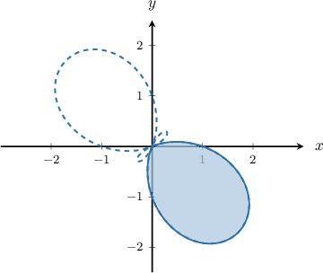

# Finding the Limits of Integration For a Given Polar Region

Source: https://www.mathacademy.com/topics/1345?courseId=106
Topic ID: 1345

## Prerequisites

- [Trigonometric Equations Containing Transformed Sine Functions](../../../high-school/integrated-math-honors/lessons/integrated-math-iii-honors/919-trigonometric-equations-containing-transformed-sine-functions.md)
- [Trigonometric Equations Containing Transformed Cosine Functions](../../../high-school/integrated-math-honors/lessons/integrated-math-iii-honors/921-trigonometric-equations-containing-transformed-cosine-functions.md)
- [Finding the Area of a Polar Region](./1000-finding-the-area-of-a-polar-region.md)

## Lesson

### Introduction

The area bounded by a polar curve $r = r(\theta)$ and the rays $\theta = \theta_1$ and $\theta = \theta_2$ is given by

$$

\dfrac 1 2\int_{\theta_1}^{\theta_2} r^2\,\textrm d \theta \, .

$$

Calculating the integral is often straightforward if we know the integration limits $\theta_1$ and $\theta_2$. But what if we don't know these values?

For example, suppose we want to calculate the total area of the first petal of the curve $r=\sin(3\theta),$ shown below.

The curve bounding the blue petal crosses itself at the origin. When it passes through the origin, we must have $r=0,$ and since $r=\sin(3\theta),$ we have

$$

\sin(3\theta)=0 \, .

$$

This gives us two solutions for $3\theta \in [0,2\pi)\mathbin{:}$

$$

3\theta = 0,\pi \qquad\Longrightarrow\qquad \theta=0,\dfrac{\pi}{3}

$$

Therefore, $\theta_1 = 0, \theta_2 = \dfrac\pi 3,$ and the area of the first petal is given by

$$

\begin{aligned}A & =\frac{1}{2}∫_{𝜋/30}^{}sin^{2}⁡(3𝜃)\,d𝜃 \\ & =\frac{1}{4}∫_{𝜋/30}^{}(1−cos⁡(6𝜃))\,d𝜃 \\ & =\frac{1}{4}(𝜃_{𝜋/30}^{}−\frac{1}{6}sin⁡(6𝜃)_{𝜋/30}^{}) \\ & =\frac{1}{4}(\frac{𝜋}{3}+0) \\ & =\frac{𝜋}{12}\,.\end{aligned}

$$

### Example: Identifying an Integral Expression For the Area of a Petal of a Sine Polar Rose in the First Quadrant

#### Question

Find the integral expression corresponding to the area of the first petal of the polar curve $r = \sin(5\theta),$ represented by the shaded region shown below.

#### Explanation

The area bounded by a polar curve is given by

$$

A = \dfrac{1}{2} \int_{\theta_1}^{\theta_2} r^2(\theta) \: \textrm{d}\theta .

$$

Since $r(\theta) = \sin(5\theta)$, we obtain

$$

\begin{aligned}𝐴 & =\frac{1}{2}∫_{𝜃_{2}𝜃_{1}}^{}(sin⁡(5𝜃))^{2}\,d𝜃 \\ & =\frac{1}{2}∫_{𝜃_{2}𝜃_{1}}^{}sin^{2}⁡(5𝜃)\,d𝜃.\end{aligned}

$$

We now proceed to find the integration limits.

The curve bounding the region crosses itself at the origin. Therefore, we want to find the values of $\theta$ for which $r=0$, or

$$

\sin(5\theta) = 0.

$$

This gives us two solutions for $5\theta\in[0,2\pi)\mathbin{:}$

$$

5\theta = 0, \pi \qquad \Longrightarrow \qquad \theta=0,\dfrac{\pi}{5}

$$

Therefore, the first petal is traversed for $\theta \in \left[0,\dfrac{\pi}{5}\right].$ Notice that this interval lies in the first quadrant, the same as our petal.

Therefore, our expression for the area is given by

$$

A = \dfrac{1}{2} \int_{0}^{\pi/5} \sin^2(5\theta) \: \textrm{d}\theta.

$$

### Using an Alternative Range for the Polar Angle

When working with polar coordinates, we primarily use the following domain for the polar angle $\theta\mathbin{:}$

$$

0\leq \theta \lt 2\pi

$$

However, it's sometimes a good idea to use the domain

$$

-\pi \leq \theta \lt \pi.

$$

Changing the domain for $\theta$ turns out to be especially useful when a polar petal spans the first and fourth quadrants.

Let's see an example.

### Example: Identifying an Integral Expression For the Area of a Petal of a Cosine Polar Rose

#### Question

Find the interval for $\theta$ corresponding to the first petal of the polar curve $r = \sqrt{2}\cos(6\theta),$ represented by the shaded region shown below.

#### Explanation

The area bounded by a polar curve is given by

$$

A = \dfrac{1}{2} \int_{\theta_1}^{\theta_2} r^2(\theta) \: \textrm{d}\theta .

$$

Since $r(\theta) = \sqrt{2}\cos(6\theta)$, we obtain

$$

\begin{aligned}𝐴 & =\frac{1}{2}∫_{𝜃_{2}𝜃_{1}}^{}(\sqrt{√2}cos⁡(6𝜃))^{2}\,d𝜃 \\ & =∫_{𝜃_{2}𝜃_{1}}^{}cos^{2}⁡(6𝜃)\,d𝜃.\end{aligned}

$$

We now proceed to find the integration limits.

The curve bounding the region crosses itself at the origin. Therefore, we want to find the values of $\theta$ for which $r=0$, or

$$

\sqrt{2}\cos(6\theta) = 0.

$$

Notice that the first petal lies between the first and fourth quadrants. So it's convenient to assume that $\theta$ can be negative.

We now solve the above equation for $6\theta\in[-\pi,\pi)\mathbin{:}$

$$

6\theta = -\dfrac{\pi}{2}, \dfrac{\pi}{2} \qquad \Longrightarrow \qquad \theta=-\dfrac{\pi}{12},\dfrac{\pi}{12}

$$

Therefore, the first petal is traversed for $\theta \in \left[-\dfrac{\pi}{12},\dfrac{\pi}{12}\right].$ Notice that this interval lies between the first and fourth quadrants, the same as our petal.

Therefore, our expression for the area is given by

$$

\int_{-\pi/12}^{\pi/12} \cos^2(6\theta) \: \textrm{d}\theta.

$$

### Example: Identifying an Integral Expression For the Area of a Petal of a General Polar Curve

#### Question

Which of the following represents the area enclosed by the first petal of the polar curve $r = 1+\sqrt{2}\cos\left(2\theta+\dfrac{\pi}{2}\right),$ represented by the shaded region shown below.

#### Explanation

The area bounded by a polar curve is given by

$$

A = \dfrac{1}{2} \int_{\theta_1}^{\theta_2} r^2(\theta) \: \textrm{d}\theta .

$$

Since $r(\theta) = 1+\sqrt{2}\cos\left(2\theta+\dfrac{\pi}{2}\right)$, we obtain

$$

\begin{aligned}𝐴 & =\frac{1}{2}∫_{𝜃_{2}𝜃_{1}}^{}(1+\sqrt{√2}cos⁡(2𝜃+\frac{𝜋}{2}))^{2}\,d𝜃\end{aligned}

$$

We now proceed to find the integration limits.

The curve bounding the region crosses itself at the origin. Therefore, we want to find the values of $\theta$ for which $r=0$, or

$$

\begin{aligned}1+\sqrt{√2}cos⁡(2𝜃+\frac{𝜋}{2}) & =0 \\ cos⁡(2𝜃+\frac{𝜋}{2}) & =−\frac{1}{\sqrt{√2}}.\end{aligned}

$$

From the diagram, the first petal extends from the third quadrant to the first quadrant. Since the petal begins in the third quadrant, it is convenient to allow negative values of $\theta$ when determining the interval.

The solutions for $2\theta+\dfrac{\pi}{2}$ closest to $0$ on either side are

$$

2\theta+\dfrac{\pi}{2} = -\dfrac{3\pi}{4}, \dfrac{3\pi}{4} \qquad \Longrightarrow \qquad 2\theta = -\dfrac{5\pi}{4}, \dfrac{\pi}{4} \qquad \Longrightarrow \qquad \theta = -\dfrac{5\pi}{8}, \dfrac{\pi}{8}

$$

Therefore, the first petal is traversed for

$$

\theta \in \left[-\dfrac{5\pi}{8}, \dfrac{\pi}{8}\right].

$$

Notice that this interval lies between the first and fourth quadrants, the same as our petal.

Therefore, our expression for the area is given by

$$

\displaystyle \dfrac{1}{2}\int_{-5\pi/8}^{\pi/8} \left( 1+\sqrt{2}\cos\left(2\theta+\dfrac{\pi}{2}\right)\right)^2 \: \textrm{d}\theta.

$$
