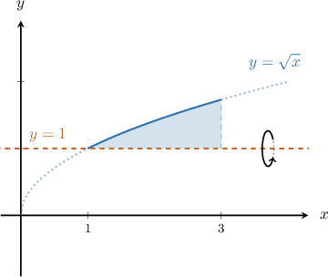
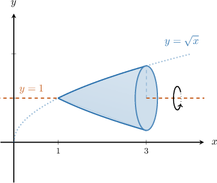
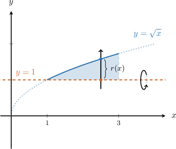
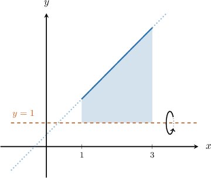
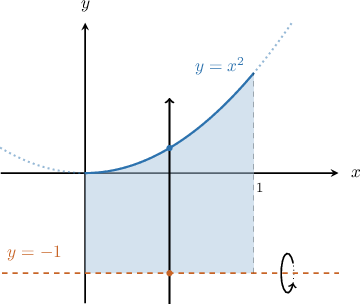
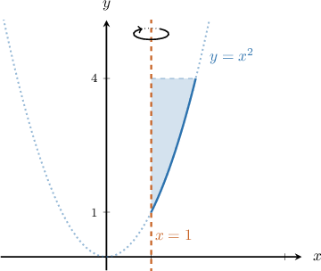
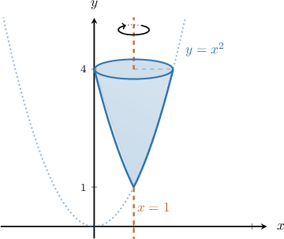
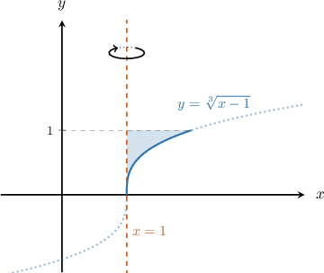
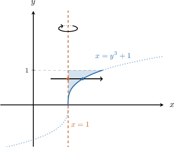
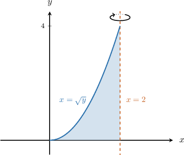

# Volumes of Revolution Using the Disc Method: Rotation About Other Axes

Source: https://www.mathacademy.com/topics/1677?courseId=106
Topic ID: 1677

## Prerequisites

- [The Area Between Curves Expressed as Functions of Y](./402-the-area-between-curves-expressed-as-functions-of-y.md)
- [Volumes of Revolution Using the Disc Method: Rotation About the Coordinate Axes](./413-volumes-of-revolution-using-the-disc-method-rotation-about-the-coordinate-axes.md)

## Lesson

### Introduction

Consider the region bounded by the curve $y=\sqrt{x},$ the horizontal line $y=1,$ and the vertical line $x=3,$ as shown in the picture below.

Let's rotate this region $360^\circ$ about the line $y=1$ to get the solid shown below. How can we find the volume of this solid?

We can find the volume using the disc method:

$$

V = \pi \int_{a}^{b} \left[ r(x) \right]^2 \:\textrm{d}x

$$

Here, $r(x)$ is the radius of the disc that corresponds to each point $x$ under consideration.

**Watch out!** Since the axis of revolution is $y=1$ (not $y=0$), we need to account for the change in the corresponding discs' radius.

The radius is *not* just $\sqrt{x}.$ Rather, the radius is the distance between the line $y=1$ and the function $y=\sqrt{x}.$

To find an expression for the radius, we can take the difference between the upper function and the lower function:

$$

\begin{aligned}𝑟(𝑥) & =(upper function)−(lower function) \\ & =(\sqrt{√𝑥})−(1) \\ & =\sqrt{√𝑥}−1.\end{aligned}

$$

Finally, we can express the volume as the following integral:

$$

\begin{aligned}𝑉 & =𝜋∫_{31}^{}(\sqrt{√𝑥}−1)^{2}\,d𝑥.\end{aligned}

$$

### Example: Identifying an Integral Representing the Volume of a Solid Generated by Rotation About a Horizontal Line

#### Question

The region enclosed by the curve $y=\dfrac 3 2x+\dfrac 1 2,$ for $x\in [1,3],$ and the horizontal line $y=1$ is rotated $2\pi$ radians about the line $y=1,$ as shown above. Find an integral that represents the volume of the resulting solid.

#### Explanation

First, notice that we are given that the limits of integration are from $x=1$ to $x=3$ along the $x$-axis.

To determine which is the lower function and which is the upper, let's draw our vertical arrow.

The vertical arrow

- ** the region through the lower function $y=1,$ and

- ** through the upper function $y=\dfrac 3 2x+\dfrac 1 2.$

Therefore, the integral that gives our volume is

$$

\begin{aligned}𝑉 & =𝜋∫_{31}^{}[\,(upper function)−(lower function)\,]^{2}\,d𝑥 \\ & =𝜋∫_{31}^{}[\,(\frac{3}{2}𝑥+\frac{1}{2})−(1)\,]^{2}\,d𝑥 \\ & =𝜋∫_{31}^{}(\frac{3}{2}𝑥−\frac{1}{2})^{2}\,d𝑥.\end{aligned}

$$

### Example: Computing the Volume of a Solid Generated by Rotation About a Horizontal Line

#### Question

Consider the region bounded by the curve $y=x^2$ and the horizontal line $y=-1$ from $x=0$ to $x=1,$ as shown in the picture. Calculate the volume of the solid generated when that region is rotated $360^{\circ}$about the line $y=-1.$

#### Explanation

First, note that the limits of integration are from $x=0$ to $x=1$ along the $x$-axis.

To determine which is the lower function and which is the upper, let's draw our vertical arrow.

The vertical arrow

- ** the region through the lower function $y=-1,$ and

- ** through the upper function $y=x^2.$

Therefore, the integral that gives our volume is

$$

\begin{aligned} V &= \pi \int_{0}^{1} \big[\: \left({\color{blue}\textrm{upper function}}\right) - \left({\color{brown}\textrm{lower function}}\right) \:\big]^2\,\textrm{d}x \\\[5pt] &= \pi \int_{0}^{1} \left[\: {\color{blue}x^2 }- \left({\color{brown}-1} \right)\:\right]^2\,\textrm{d}x \\\[5pt] &= \pi\int_{0}^{1} (x^2+1)^2 \, \textrm{d}x \\\[5pt] &= \pi\int_{0}^{1} (x^4+2x^2+1) \, \textrm{d}x \\\[5pt] &= \pi \left(\dfrac{x^5}{5}+\dfrac{2x^3}{3}+x \right) \Bigg|_{0}^{1} \\\[5pt] &= \pi \left( \left[ \dfrac{1}{5}+\dfrac{2}{3}+1 \right] - 0 \right) \\\[5pt] &= \dfrac{28 \pi}{15}. \end{aligned}

$$

### Rotation About a Vertical Line

Consider the region bounded by the curve $y=x^2,$ the vertical line $x=1,$ and the horizontal line $y=4,$ as shown in the picture below.

Let's rotate this region $360^\circ$ about the line $x=1$ to get the solid shown below.

To find the volume of this solid, we can use the disc method, as usual:

$$

V = \pi \int_{c}^{d} \left[ r(y) \right]^2 \:\textrm{d}y

$$

The only difference is that the radius $r(y)$ is now horizontal rather than vertical.

To find an expression for the radius, we compute the difference between the right and left functions.

- The right function corresponds to the curve $y=x^2.$ Solving for $x,$ we get $x = \pm \sqrt y.$ The region of interest is in the first quadrant, where $x$ is positive, so we must have $x = \sqrt{y}.$

- The left function corresponds to the vertical line $x=1.$

So, the radius is given by

$$

\begin{aligned}𝑟(𝑦) & =(right function)−(left function) \\ & =(\sqrt{√𝑦})−(1) \\ & =\sqrt{√𝑦}−1\,.\end{aligned}

$$

Therefore, the volume is represented by the integral

$$

V = \pi \int_1^4 \left( \sqrt{y} - 1 \right)^2 \,\textrm{d}y \, .

$$

### Example: Identifying an Integral Representing the Volume of a Solid Generated by Rotation About a Vertical Line

#### Question

The region enclosed by the curve $y=\sqrt[3]{x-1},$ the vertical line $x=1,$ and the horizontal line $y=1$ is rotated $2\pi$ radians about the line $x=1,$ as shown in the picture. Find an integral expression for the volume of the resulting solid.

#### Explanation

Since our region rotates about a vertical line, we need to write the equation of the given curve in terms of $y\mathbin{:}$

$$

y=\sqrt[3]{x-1} \qquad\Longrightarrow\qquad x=y^3+1

$$

Also, notice that the limits of integration are from $y=0$ to $y=1$ along the $y$-axis.

To determine which is the left and which is the right function, let's draw our horizontal arrow.

The horizontal arrow

- ** the region through the left function $x=1,$ and

- ** through the right function $x=y^3+1.$

Therefore, the integral that gives our volume is

$$

\begin{aligned}𝑉 & =𝜋∫_{10}^{}[\,(right function)−(left function)\,]^{2}\,d𝑦 \\ & =𝜋∫_{10}^{}[\,(𝑦^{3}+1)−(1)\,]^{2}\,d𝑦 \\ & =𝜋∫_{10}^{}(𝑦^{3})^{2}d𝑦 \\ & =𝜋∫_{10}^{}𝑦^{6}d𝑦.\end{aligned}

$$

### Example: Computing the Volume of a Solid Generated by Rotation About a Vertical Line

#### Question

Consider the region bounded by the curve $x=\sqrt{y},$ the vertical line $x=2,$ and the horizontal line $y=4,$ as shown in the picture. Calculate the volume of the solid generated when that region is rotated $2\pi$ radians about the line $x=2.$

#### Explanation

We want to determine the limits of integration. To do so, we find the intersections of the curve and the line $x=2$ by solving the following equation:

$$

\begin{aligned}\sqrt{√𝑦} & =2 \\ 𝑦 & =4\end{aligned}

$$

So, the limits of integration are from $y=0$ to $y=4$ along the $y$-axis.

To determine which is the left and which is the right function, let's draw our horizontal arrow.

The horizontal arrow

- ** the region through the left function $x=\sqrt{y},$ and

- ** through the right function $x=2.$

Therefore, the integral that gives our volume is

$$

\begin{aligned}𝑉 & =𝜋∫_{40}^{}[\,(right function)−(left function)\,]^{2}\,d𝑦 \\ & =𝜋∫_{40}^{}[\,(2)−(\sqrt{√𝑦})\,]^{2}\,d𝑦 \\ & =𝜋∫_{40}^{}[2−\sqrt{√𝑦}]^{2}d𝑦 \\ & =𝜋∫_{40}^{}(4−4\sqrt{√𝑦}+𝑦)d𝑦 \\ & =𝜋[4𝑦−\frac{8}{3}𝑦^{3/2}+\frac{𝑦^{2}}{2}]_{40}^{} \\ & =𝜋[(4(4)−\frac{8}{3}(4)^{3/2}+\frac{(4)^{2}}{2})−(0)] \\ & =𝜋[16−\frac{64}{3}+8] \\ & =\frac{8𝜋}{3}.\end{aligned}

$$
