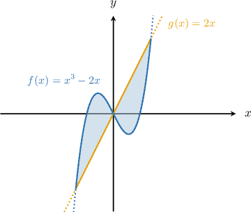
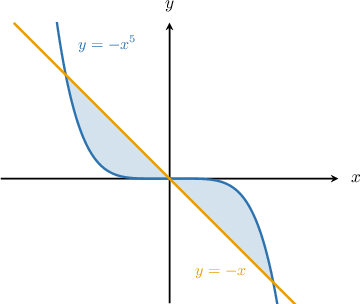
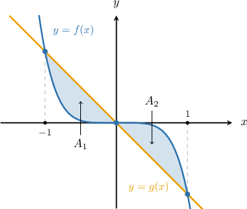
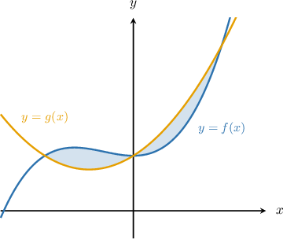
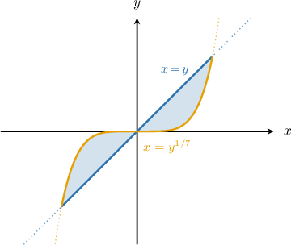
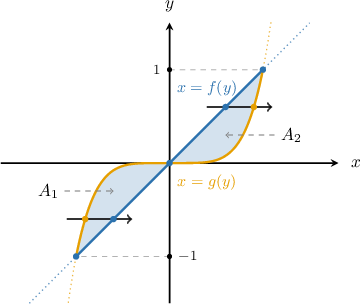

# Finding Areas Between Curves that Intersect at More Than Two Points

Source: https://www.mathacademy.com/topics/311?courseId=106
Topic ID: 311

## Prerequisites

- [The Area Between Curves Expressed as Functions of Y](./402-the-area-between-curves-expressed-as-functions-of-y.md)
- [Solving Cubic Equations by Grouping](../../../high-school/traditional/lessons/algebra-ii/727-solving-cubic-equations-by-grouping.md)

## Lesson

### Introduction

Let's find the total area of the finite region enclosed between curves the curves and as shown below.

First, we find the points where the curves intersect:

The area we want consists of two symmetric regions: and

For the area we have and the upper function is while the lower function is So, the area is given by

Since the regions are symmetric, we have that

Finally, the required area is given by

### Example: Constructing an Integral Expression That Represents the Area Between Two Curves

#### Question

Which expression represents the total finite area enclosed between the curves $y=-x^5$ and $y=-x,$ as shown below?

#### Explanation

Let $f(x)=-x^5$ and $g(x)=-x.$ First, we find the points where the two curves intersect:

$$

\begin{aligned}𝑓(𝑥) & =𝑔(𝑥) \\ −𝑥^{5} & =−𝑥 \\ 𝑥^{5}−𝑥 & =0 \\ 𝑥(𝑥^{4}−1) & =0 \\ 𝑥(𝑥^{2}−1)(𝑥^{2}+1) & =0 \\ 𝑥(𝑥−1)(𝑥+1)(𝑥^{2}+1) & =0 \\ 𝑥 & =−1,0,1\end{aligned}

$$

The area we want consists of two regions: $A_1$ and $A_2.$

- For the area $A_1,$ we have $x \in [-1,0],$ and the upper function is $g(x)$ while the lower function is $f(x).$ So, the area is given by

- For the area $A_2,$ we have $x \in [0,1],$ and the upper function is $f(x)$ while the lower function is $g(x).$ So, the area is given by

Therefore, the required area is given by

$$

\begin{aligned}𝐴 & =𝐴_{1}+𝐴_{2} \\ & =∫_{0−1}^{}(𝑥^{5}−𝑥)\,d𝑥+∫_{10}^{}(𝑥−𝑥^{5})\,d𝑥.\end{aligned}

$$

### Example: Finding the Area Between Two Curves Expressed as Functions of X That Intersect at Three Points

#### Question

Find the total finite area enclosed between the curves $y=f(x)=x^3+x^2+1$ and $y=g(x)=x^2+x+1,$ as shown below.

**

#### Explanation

First, we find the intersections of the two curves:

$$

\begin{aligned}𝑓(𝑥) & =𝑔(𝑥) \\ 𝑥^{3}+𝑥^{2}+1 & =𝑥^{2}+𝑥+1 \\ 𝑥^{3}−𝑥 & =0 \\ 𝑥(𝑥^{2}−1) & =0 \\ 𝑥 & =0,±1\end{aligned}

$$

The area we want consists of two regions: $A_1$ and $A_2.$

- For the area $A_1,$ we have $x \in [-1,0],$ and the upper function is $f(x)$ while the lower function is $g(x).$ So, the area is given by

- For the area $A_2,$ we have $x \in [0,1],$ and the upper function is $g(x)$ while the lower function is $f(x).$ So, the area is given by

Therefore, the required area is

$$

\begin{aligned}𝐴 & =𝐴_{1}+𝐴_{2}=\frac{1}{4}+\frac{1}{4}=\frac{1}{2}.\end{aligned}

$$

### Example: Finding the Area Between Two Curves Expressed as Functions of Y That Intersect at Three Points

#### Question

What is the total finite area enclosed between the curves $x=y$ and $x=y^{1/7},$ as shown below?

#### Explanation

Let $\color{black}f(y)=y\,$ and $\, \color{black}g(y)= y^{1/7}.$ First, we find the intersections of the two curves:

$$

\begin{aligned}𝑓(𝑦) & =𝑔(𝑦) \\ 𝑦 & =𝑦^{1/7} \\ 𝑦^{7} & =𝑦 \\ 𝑦(𝑦^{6}−1) & =0 \\ 𝑦(𝑦^{3}−1)(𝑦^{3}+1) & =0 \\ 𝑦 & =0,±1\end{aligned}

$$

The area we want consists of two regions: $A_1$ and $A_2.$

- For the area $A_1,$ we have $y \in [-1,0],$ and the right function is $f(y)$ while the left function is $g(y).$ So, the area is given by

- For the area $A_2,$ we have $y \in [0,1],$ and the right function is $g(y)$ while the left function is $f(y).$ So, the area is given by

Therefore, the required area is

$$

\begin{aligned}𝐴 & =𝐴_{1}+𝐴_{2}=\frac{3}{8}+\frac{3}{8}=\frac{3}{4}.\end{aligned}

$$
