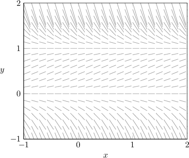
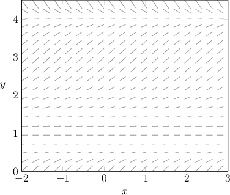
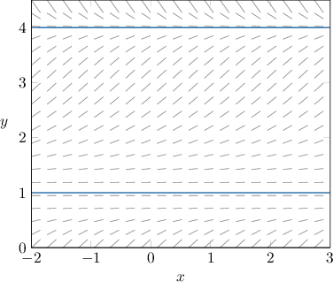
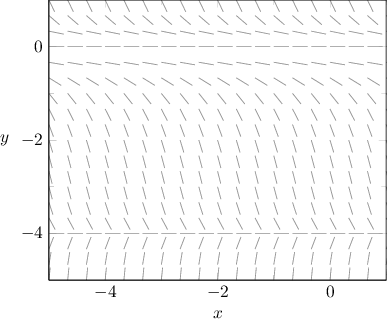
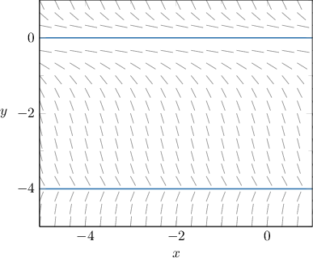
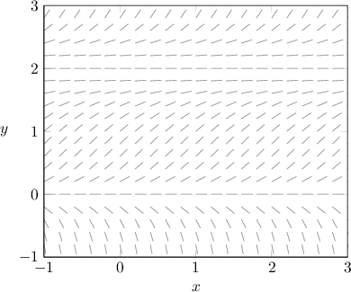
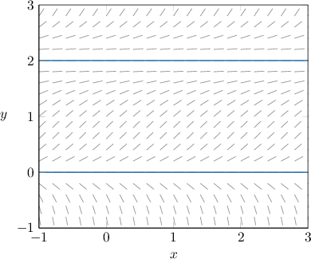
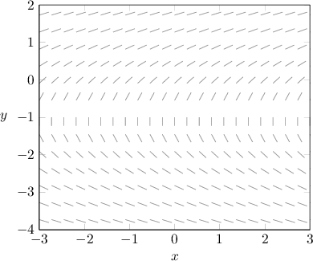
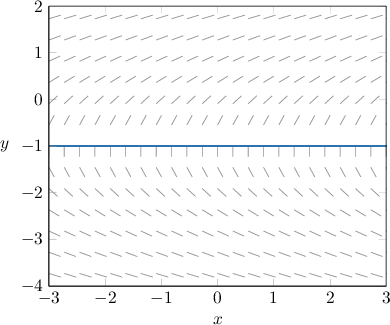

# Analyzing Slope Fields for Autonomous Differential Equations

Source: https://www.mathacademy.com/topics/3220?courseId=106
Topic ID: 3220

## Prerequisites

- [Limits at Infinity and Horizontal Asymptotes of Rational Functions](../../../ap-courses/lessons/ap-calculus-ab/1903-limits-at-infinity-and-horizontal-asymptotes-of-rational-functions.md)
- [Equilibrium Solutions of First-Order ODEs](./3184-equilibrium-solutions-of-first-order-odes.md)
- [Slope Fields for Autonomous Differential Equations](./3351-slope-fields-for-autonomous-differential-equations.md)
- [Solving Rational Inequalities](../../../high-school/integrated-math-honors/lessons/integrated-math-iii-honors/3355-solving-rational-inequalities.md)

## Lesson

### Introduction

Let's consider the differential equation $y' = 2y(1-y).$ The slope field for this equation is shown below.

Let's see how much information we can gather about the differential equation by referring *only* to its slope field.

- First, note that the slope field has horizontal symmetry. Therefore, the associated differential equation must be of the form $y' = f(y)$ (i.e., it must be autonomous). Indeed, the equation $y' = 2y(1-y)$ is autonomous.

- Second, recall that $y=c$ is an equilibrium solution of an autonomous differential equation $y' = f(y)$ if $f(c) = 0.$ Equilibrium solutions correspond to horizontal solution curves. In this case, there appear to be two equilibrium solutions, $y=0,$ and $y=1.$ Let's highlight these equilibrium solutions in our slope field. Note that $y=0$ and $y=1$ are indeed equilibrium solutions of $y' = 2y(1-y)$ since the right-hand side evaluates to zero on these lines.

- Third, the lines $y=0$ and $y=1$ split the plane into three regions. Let's sketch some solution curves, one for each region. The slopes of the solution curves in each region are summarized in the table below. Region $y < 0$ $0 < y < 1$ $y > 1$ Slope $\searrow$ $\nearrow$ $\searrow$ Sign $\color{red}-$ $\color{blue}+$ $\color{red}-$ The equation $y' = 2y(1-y)$ indeed exhibits this behavior. To see this a little more clearly, let $f(y) = 2y(1-y).$ A sketch of this function is shown below. Notice that the sign of $f(y)$ in the three regions agrees with the above table: $f(y)$ is positive for $0 < y < 1,$ and $f(y)$ is negative for $y<0$ and $y >1.$

### Example: Identifying an Equation That Generates a Slope Field Using Equilibrium Solutions

#### Question

Which of the following equations could have generated the slope field shown above?

1. $y' = y^2(y-1)$

2. $y' = y(y-1)(y-4)$

3. $y' = -(y-1)^2(y-4)$

#### Explanation

Notice that the slopes of the slope field are horizontal along the lines $y = 1$ and $y = 4,$ as shown above. Therefore, the right-hand side of the differential equation should evaluate to zero on both of these lines.

With that in mind, let's check each equation:

- The equation $y' = y^2(y-1)$ does ** give the required behavior. The right-hand side evaluates to zero at $y=0$ and $y=1.$

- The equation $y' = -y(y-1)(y-4)$ does ** give the required behavior. The right-hand side evaluates to zero at $y=1$ and $y=4,$ but it also evaluates to zero when $y=0,$ which is not behavior exhibited by our slope field.

- The equation $y' =-(y-1)^2(y-4)$ gives the required behavior. The right-hand side evaluates to zero at $y=1$ and $y=4.$

Therefore, the correct answer is "III only."

### Example: Identifying an Equation That Generates a Slope Field Using the Sign of the Slopes

#### Question

The diagram shown above is the slope field for which of the following differential equations?

1. $y = -y^2(y+4)$

2. $y = y(y-4)^2$

3. $y = y(y+4)$

#### Explanation

Notice the following properties of the given slope field:

- First, the slopes of the slope field are horizontal along the lines $y=-4$ and $y=0.$ Therefore, the right-hand side of the differential equation should equal zero on both of these lines. Of the given equations, the only equations that satisfy this condition are the following:

- Second, the lines $y=-4$ and $y=0$ divide the plane into $3$ regions. The sign of the slopes in each of the $3$ regions are easily deduced by considering the behavior of the solution curves in these regions. This information is summarized in the following table: Region $y < -4$ $-4 < y < 0$ $y > 0$ Slope $\nearrow$ $\searrow$ $\searrow$ Sign $\color{blue}+$ $\color{red}-$ $\color{red}-$ Of the remaining options, the only one that gives this behavior is

Therefore, the correct answer is $y' = -y^2(y+4).$

### Example: Identifying an Equation That Generates a Slope Field Using the Sign of the Slopes and Factoring

#### Question

The diagram shown above is the slope field for which of the following differential equations?

1. $y' = y^3 - 4y^2 + 4y$

2. $y' = y^2 - 2y$

3. $y' = y^3 + y^2$

#### Explanation

Notice the following properties of the given slope field:

- First, the slope field is zero along the lines $y = 0$ and $y = 2.$ Therefore, the right-hand side of the differential equation should evaluate to zero on these lines. Of the given equations, the only two that satisfy this condition are and

- Second, the lines $y = 0$ and $y = 2$ divide the plane into $3$ regions. The sign of the slopes in each of the $3$ regions are easily deduced by considering the behavior of the solution curves in these regions. This information is summarized in the following table: Region $y < 0$ $0 < y < 2$ $y > 2$ Slope $\searrow$ $\nearrow$ $\nearrow$ Sign $\color{red}-$ $\color{blue}+$ $\color{blue}+$ Of the two remaining options, the only one that gives this behavior is

Therefore, the correct answer is $y' =y^3 - 4y^2 + 4y.$

### Example: Identifying an Equation That Generates a Slope Field by Identifying Asymptotic Behavior

#### Question

Which of the following equations could have generated the slope field shown above?

1. $y' = \dfrac{y}{y+1}$

2. $y'= \dfrac1{y^2+y}$

3. $y' = \dfrac{2}{y+1}$

#### Explanation

Notice the following properties of the given slope field:

- The slopes of the slope field become vertical as $y\to -1.$

- The slopes of the slope field become horizontal as $y\to\pm\infty.$

- The slopes of the slope field are positive for $y > -1$ and negative for $y < -1.$

With that in mind, let's consider each equation.

- The equation $y' = \dfrac{y}{y+1}$ does ** give the required behavior. Notice that Therefore, the slopes of the slope field for this differential equation do not become horizontal as $y\to\pm\infty.$

- The equation $y' = \dfrac1{y^2+y}= \dfrac1{y(y+1)}$ does ** give the required behavior. The slopes of the slope field for this differential equation become vertical for ** $y \to -1$ ** $y \to 0,$ which is behavior not exhibited by our slope field.

- The equation $y' = \dfrac{2}{y+1}$ gives the required behavior. Notice that $y'\to 0$ as $y\to\pm\infty,$ and $y'\to \infty$ as $y\to -1.$ Also, the right-hand side of this equation is positive for $y > -1$ and negative for $y < -1.$

Therefore, the correct answer is "III only."
