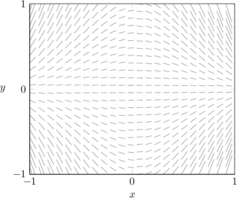
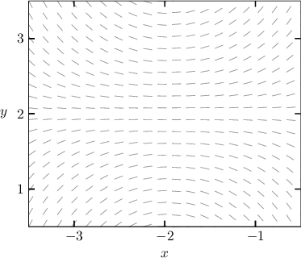
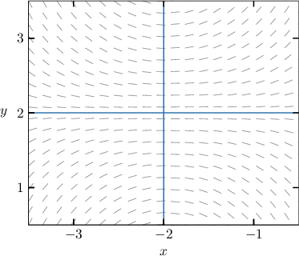
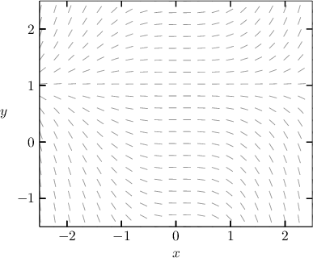
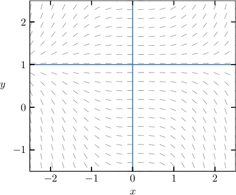
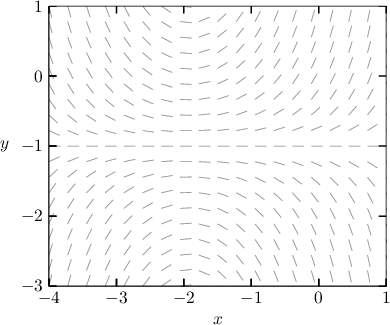
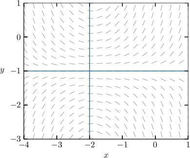
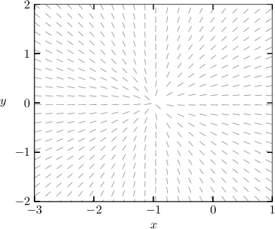
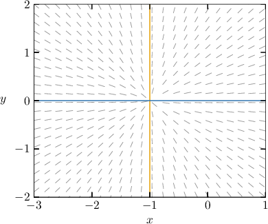

# Analyzing Slope Fields for Nonautonomous Differential Equations

Source: https://www.mathacademy.com/topics/3350?courseId=106
Topic ID: 3350

## Prerequisites

- [Analyzing Slope Fields for Directly Integrable Differential Equations](./3219-analyzing-slope-fields-for-directly-integrable-differential-equations.md)
- [Analyzing Slope Fields for Autonomous Differential Equations](./3220-analyzing-slope-fields-for-autonomous-differential-equations.md)
- [Slope Fields for Nonautonomous Differential Equations](./3352-slope-fields-for-nonautonomous-differential-equations.md)

## Lesson

### Introduction

Let's consider the differential equation $y' = -4xy.$ The slope field for this equation is shown below.

Let's see how much information we can gather about the differential equation by referring *only* to its slope field.

- First, note that the slope field has neither vertical nor horizontal symmetry. Therefore, the associated differential equation must be of the form $y' = f(x,y).$ Indeed, the equation $y' =-4xy$ is of this form.

- Second, notice that the solution curves appear to have stationary points along the lines $x=0$ and $y=0.$ This means that the right-hand side of our differential equation must evaluate to zero on these lines. Indeed, this is true of our equation.

- Third, the lines $x=0$ and $y=0$ split the plane into four regions. The slopes of the solution curves in each of these regions are summarized in the table below. $y > 0$ $\nearrow$ $({\color{blue}{+}})$ $\searrow$ $({\color{red}{-}})$ $y < 0$ $\searrow$ $({\color{red}{-}})$ $\nearrow$ $({\color{blue}{+}})$ $x< 0$ $x> 0$

Notice that the sign of $f(x,y)$ in the four regions agrees with the above table:

- $f(x,y)=-4xy$ is positive in the second and fourth quadrants, and

- $f(x,y)=-4xy$ is negative in the first and third quadrants.

### Example: Identifying an Equation That Generates a Slope Field Using Stationary Points

#### Question

The differential equation that generates the slope field shown above is given by $y' = (x-a)(y-b).$ Find the value of $a + b.$

#### Explanation

Notice that the slopes of the slope field are horizontal along the lines $x = -2$ and $y = 2,$ as shown above. Therefore, the right-hand side of the differential equation should evaluate to zero on both of these lines.

So, our differential equation must be

$$

y' = (x+2)(y-2).

$$

Therefore, we conclude that $a = -2,$ $b = 2,$ and $a + b=0.$

### Example: Identifying an Equation That Generates a Slope Field Using the Sign of the Slopes

#### Question

Which of the following equations could have generated the slope field shown above?

1. $y' = 2xy$

2. $y' = -x(y-1)^2$

3. $y' = \dfrac{1}{2}x^2(y-1)$

#### Explanation

Notice the following properties of the given slope field:

- First, the slopes of the slope field are horizontal along the lines $x=0$ and $y=1,$ as shown above. Therefore, the right-hand side of the differential equation should evaluate to zero on both of these lines.

- Second, the lines $x=0$ and $y=1$ divide the plane into $4$ regions. The sign of the slopes in each of the $4$ regions are easily deduced by considering the behavior of the solution curves in these regions. This information is summarized in the following table: $y > 1$ $\nearrow$ $({\color{blue}{+}})$ $\nearrow$ $({\color{blue}{+}})$ $y < 1$ $\searrow$ $({\color{red}{-}})$ $\searrow$ $({\color{red}{-}})$ $x< 0$ $x> 0$

With that in mind, let's consider each equation.

- Equation I does ** give the required behavior. The right-hand side of $y' = 2xy$ evaluates to zero at $x=0$ and $y=0.$

- Equation II does ** give the required behavior. The right-hand side of $y' = -x(y-1)^2$ evaluates to zero at $x=0$ and $y=1,$ but the sign of the slopes in the required regions (summarized below) do not correspond to the given slope field. $y > 1$ ${\color{blue}{+}}$ ${\color{red}{-}}$ $y < 1$ ${\color{blue}{+}}$ ${\color{red}{-}}$ $x< 0$ $x> 0$

- Equation III gives the required behavior. The right-hand side of $y' = \dfrac{1}{2}x^2(y-1)$ evaluates to zero at $x=0$ and $y=1,$ and the sign of the slopes in the required regions (summarized below) correspond to the given slope field. $y > 1$ ${\color{blue}{+}}$ ${\color{blue}{+}}$ $y < 1$ ${\color{red}{-}}$ ${\color{red}{-}}$ $x< 0$ $x> 0$

Therefore, the correct answer is "III only."

### Example: Identifying an Equation That Generates a Slope Field Using the Sign of the Slopes and Factoring

#### Question

The diagram shown above is the slope field for which of the following differential equations?

1. $y' = x^2(y+1)+2(y+1)$

2. $y' = x(y+1)+2(y+1)$

3. $y' = x(y+1)^2+2(y+1)^2$

#### Explanation

Notice the following properties of the given slope field:

- First, the slopes of the slope field are horizontal along the lines $x=-2$ and $y=-1,$ as shown above. Therefore, the right-hand side of the differential equation should evaluate to zero on both of these lines.

- Second, the lines $x=-2$ and $y=-1$ divide the plane into $4$ regions. The sign of the slopes in each of the $4$ regions are easily deduced by considering the behavior of the solution curves in these regions. This information is summarized in the following table: $y > -1$ $\searrow$ $({\color{red}{-}})$ $\nearrow$ $({\color{blue}{+}})$ $y < -1$ $\nearrow$ $({\color{blue}{+}})$ $\searrow$ $({\color{red}{-}})$ $x< -2$ $x> -2$

With that in mind, let's consider each equation.

- Equation I does ** give the required behavior. The right-hand side of evaluates to zero at $y = -1$ only.

- Equation II gives the required behavior. The right-hand side of evaluates to zero at $x = -2$ and $y = -1,$ and the sign of the slopes in the required regions (summarized below) correspond to the given slope field. $y > -1$ ${\color{red}{-}}$ ${\color{blue}{+}}$ $y < -1$ ${\color{blue}{+}}$ ${\color{red}{-}}$ $x< -2$ $x> -2$

- Equation III does ** give the required behavior. The right-hand side of evaluates to zero at $x=-2$ and $y=-1,$ but the sign of the slopes in the required regions (summarized below) do not correspond to the given slope field. $y > -1$ ${\color{red}{-}}$ ${\color{blue}{+}}$ $y < -1$ ${\color{red}{-}}$ ${\color{blue}{+}}$ $x< -2$ $x> -2$

Therefore, the correct answer is equation II.

### Example: Identifying an Equation That Generates a Slope Field Using Asymptotes

#### Question

Which of the following equations could have generated the slope field shown above?

1. $y' = x + y + 1$

2. $y' = \dfrac{xy}{y+1}$

3. $y' = \dfrac{y}{x+1}$

#### Explanation

Notice the following properties of the given slope field:

- The slopes of the slope field become vertical as $x \to -1.$

- The slopes of the slope field become horizontal at $y=0.$

With that in mind, let's consider each equation.

- Equation I does ** give the required behavior. The right-hand side of $y' = x + y + 1$ does not evaluate to zero on $y=0$ (the value depends on $x$).

- Equation II does ** give the required behavior. The right-hand side of $y' = \dfrac{xy}{y+1}$ evaluates to zero on $y=0,$ but and hence $y'$ depends on $y$ along the line $x=-1.$

- Equation III gives the required behavior. The right-hand side of $y' = \dfrac{y}{x+1}$ evaluates to zero on $y=0,$ and

Therefore, the correct answer is "III only."
