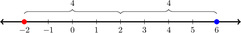

# Radius of Convergence of Power Series

Source: https://www.mathacademy.com/topics/3560?courseId=106
Topic ID: 3560

## Prerequisites

- [Radius of Convergence of Power Series Centered at the Origin](./984-radius-of-convergence-of-power-series-centered-at-the-origin.md)

## Lesson

### Introduction

Suppose we have the following infinite power series.

$$

\sum_{n=1}^{\infty} \dfrac{(x-2)^n}{n^2} = (x-2) + \dfrac{(x-2)^2}{2^2} + \dfrac{(x-2)^3}{3^2} + \cdots

$$

How do we determine the radius and interval of convergence for this series?

First, note that the terms of the series are all powers of $(x-2).$ For this reason, we say that the series is **centered** at $x=2.$

To compute the radius of convergence, we use the ratio test for convergence. We define

$$

a_n = \dfrac{(x-2)^n}{n^2},

$$

and we calculate the ratio of two successive terms and take the limit as $n\to \infty,$ as follows:

$$

\begin{aligned}𝐿 & =\underset{𝑛→∞}{lim}\frac{𝑎_{𝑛+1}}{𝑎_{𝑛}} \\ & =\underset{𝑛→∞}{lim}\frac{(𝑥−2)^{𝑛+1}}{(𝑛+1)^{2}}⋅\frac{𝑛^{2}}{(𝑥−2)^{𝑛}} \\ & =|𝑥−2|\underset{𝑛→∞}{lim}(\frac{𝑛^{2}}{(𝑛+1)^{2}}) \\ & =|𝑥−2|\underset{𝑛→∞}{lim}(\frac{𝑛^{2}}{𝑛^{2}+2𝑛+1}) \\ & =|𝑥−2|\underset{𝑛→∞}{lim}\frac{1}{(1+\frac{2}{𝑛}+\frac{1}{𝑛^{2}})} \\ & =|𝑥−2|⋅1 \\ & =|𝑥−2|\end{aligned}

$$

The series converges if

$$

L < {\color{blue}1} \qquad\Longrightarrow\qquad \left| x-{\color{red}2} \right| < {\color{blue}1}.

$$

Therefore,

- the radius of convergence is ${\color{blue}1},$ and

- the interval of convergence is centered at the point $x={\color{red}2}.$

To find the interval of convergence, we solve the inequality $\left| x-2 \right| < 1,$ as follows:

$$

\begin{aligned}|𝑥−2| & <1 \\ −1<𝑥−2 & <1 \\ 1<𝑥 & <3\end{aligned}

$$

So, the series converges for any $x$ in the open interval $(1,3).$

The ratio test gives no conclusion about the convergence of the series at the endpoints of this interval. So, we need to investigate the endpoints $x=1$ and $x=3$ separately using another test for convergence.

- We start with the left endpoint. When $x=1,$ we have which is convergent by the alternating series test.

- We then look at the right endpoint. When $x=3,$ we have which is convergent by the $p$-series test.

Finally, we conclude that the interval of convergence is $I=[1,3].$

### Example: Finding the Radius and Interval of Convergence of a Power Series

#### Question

Find the radius of convergence $R$ and interval of convergence $I$ for the series

$$

\sum_{n=1}^{\infty} \frac{(x+2)^{n}}{3^n\,n}\,.

$$

#### Explanation

To apply the ratio test, we define $a_n=\dfrac{(x+2)^{n}}{3^n\,n}.$ Then, we calculate the ratio of two successive terms and take the limit as $n\to\infty\mathbin{:}$

$$

\begin{aligned}𝐿 & =\underset{𝑛→∞}{lim}\frac{𝑎_{𝑛+1}}{𝑎_{𝑛}} \\ & =\underset{𝑛→∞}{lim}\frac{(𝑥+2)^{𝑛+1}}{3^{𝑛+1}(𝑛+1)}⋅\frac{3^{𝑛}\,𝑛}{(𝑥+2)^{𝑛}} \\ & =\underset{𝑛→∞}{lim}\frac{𝑛(𝑥+2)}{3(𝑛+1)} \\ & =\frac{𝑥+2}{3}\underset{𝑛→∞}{lim}(\frac{𝑛}{𝑛+1}) \\ & =\frac{𝑥+2}{3}\underset{𝑛→∞}{lim}\frac{1}{(1+\frac{1}{𝑛})} \\ & =\frac{𝑥+2}{3}⋅1 \\ & =\frac{|𝑥+2|}{3}\end{aligned}

$$

The series converges if $L<1.$ So, the series converges if

$$

\begin{aligned}\frac{|𝑥+2|}{3}<1 \\ |𝑥+2|<3 \\ −3<𝑥+2<3 \\ −5<𝑥<1,\end{aligned}

$$

which means that the radius of convergence is $3,$ and the series converges for any $x$ that lies in the open interval $(-5,1).$

The ratio test gives no conclusion about the convergence of the series when $L=1.$ So, when $|x+2|= 3,$ we do not know if the series converges. This means that the endpoints $x=-5$ and $x=1$ need to be investigated separately using another test for convergence.

- When $x=-5$ we have which is convergent by the alternating series test.

- When $x=1$ we have which is divergent by the $p$-series test.

So the interval of convergence is $I=[-5,1).$

### Example: Identifying True Statements Regarding the Convergence of a Power Series

#### Question

Given that the power series $\displaystyle \sum_{n=1}^{\infty}a_n (x-2)^n$ converges at $x=6,$ which of the following **** be true?

1. The series converges at $x=0$

2. The series converges at $x=7$

3. The series converges at $x=-2$

#### Explanation

The center of the expansion is $x=2,$ and since the series is convergent for $x=6,$ this means that the radius of convergence $R$ is ** $4,$ i.e., $R \geq 4.$ So, the series is convergent for every point in the interval $(-2,6].$ However, we know nothing about the convergence of the series at any point outside the interval $(-2,6].$

With this in mind, let's check each of our statements.

- Statement I is true. Since $0\in (-2,6],$ the series is convergent at $x=0.$

- Statement II is false. Since $7\notin (-2,6],$ we cannot guarantee that the series is convergent at $x=7.$

- Statement III is false. Since $-2\notin (-2,6],$ we cannot guarantee that the series is convergent at $x=-2.$

Therefore, only statement I must be true.
