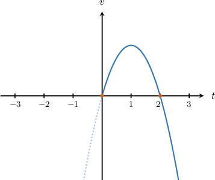
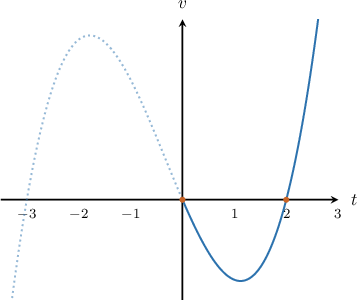

# Determining Characteristics of Moving Objects Using Integration

Source: https://www.mathacademy.com/topics/3582?courseId=106
Topic ID: 3582

## Prerequisites

- [The Second Derivative Test](../../../ap-courses/lessons/ap-calculus-ab/339-the-second-derivative-test.md)
- [Calculating Velocity Using Integration](./762-calculating-velocity-using-integration.md)
- [Determining Characteristics of Moving Objects Using Differentiation](../../../ap-courses/lessons/ap-calculus-ab/3581-determining-characteristics-of-moving-objects-using-differentiation.md)

## Lesson

### Introduction

Given the acceleration of a particle moving along a straight line relative to a fixed origin $O,$ we can find many characteristics of the particle.

Let the positive direction be left to right. Suppose the particle has acceleration, measured in $\text{m}/\text{s}^2,$ given by the function $a(t) = 6-6t$, where $t > 0$ is the time in seconds, and is stationary when $t=0\,\text{s}.$

Recall we can find the velocity $v(t)$ by integrating the acceleration with respect to time:

$$

\begin{aligned}𝑣(𝑡) & =∫𝑎(𝑡)\,d𝑡 \\ & =∫(6−6𝑡)\,d𝑡 \\ & =6𝑡−3𝑡^{2}+𝐶\end{aligned}

$$

Since the particle is stationary at the time $t=0,$ we know that $v(0)=0,$ so we have

$$

\begin{aligned}0 & =6(0)−3(0)^{2}+𝐶 \\ 0 & =𝐶,\end{aligned}

$$

and therefore the velocity of the particle is

$$

v(t) = 6t - 3t^2 = 3t(2-t).

$$

Plotting the graph of $v(t),$ we get the following picture.

From the resulting velocity function $v$ and its graph, we can find some characteristics of the particle.

- *Time intervals in which the particle is moving in the positive direction.* Remember that the particle moves to the right (the positive direction) when its velocity is positive, $v(t) > 0.$ So, from the graph, we see that the particle moves to the right when

- *Time intervals in which the particle is moving in the negative direction.* Also remember that the particle moves to the left (the negative direction) when its velocity is negative, $v(t) < 0.$ So, from the graph, we see that the particle moves to the left when

- *Moments when the particle is stationary.* The particle is stationary when $v = 0 \,\text{m}/\text{s}{:}$ Therefore, the particle is stationary when $t=0\,\text{s}$ and $t=2\,\text{s}.$

- *Moments when the velocity of the particle is maximal.* The maximum velocity $v_\text{max}$ of the particle occurs at the maximum of the velocity function $v.$ From calculus, we know that the extrema of $v$ occur at the critical points of $v.$ Since $v'(t) = a(t),$ to find the times where $v$ is a maximum, we just need to solve $a(t)=0$ and test each solution using the first or second derivative test. Solving $a(t)=0$ gives We now test the extreme value using the second derivative test. For this, we find the second derivative of and evaluate it at $t=1{:}$ Since $v''(1) < 0,$ we conclude that the velocity is maximized when $t=1\,\text{s}.$ Therefore, the maximum velocity is

### Example: Finding the Time Intervals on which a Particle is Moving in a Particular Direction

#### Question

A particle moves along a straight line relative to a fixed origin $O$ with acceleration, measured in $\textrm m / \textrm s^2,$ given by the function $a(t) = 3t^2+2t-6,$ where $t > 0$ is the time in seconds. The positive direction is left to right. If the particle is stationary when $t=0\,\textrm s,$ determine the time intervals in which the particle is moving to the right.

#### Explanation

First, we find $v(t)$ by integrating the acceleration with respect to time:

$$

\begin{aligned}𝑣(𝑡) & =∫𝑎(𝑡)\,d𝑡 \\ & =∫(3𝑡^{2}+2𝑡−6)\,d𝑡 \\ & =𝑡^{3}+𝑡^{2}−6𝑡+𝐶\end{aligned}

$$

We're told that the particle is stationary at the time $t=0.$ This means $v(0) = 0,$ so we have

$$

\begin{aligned}0 & =(0)^{3}+(0)^{2}−6(0)+𝐶 \\ 0 & =𝐶,\end{aligned}

$$

and therefore the velocity of the particle is

$$

v(t) = t^3+t^2-6t.

$$

To find the time interval in which the particle is moving to the **, we must solve the inequality $v > 0.$ This gives

$$

t^3+t^2-6t = t(t+3)(t-2) > 0.

$$

Plotting the graph of $v(t),$ we get the following picture.

The particle moves to the right when $v(t)$ is positive. So, from the graph, we see that the particle moves to the right when $t>2.$

### Example: Finding the Times at Which a Particle Reaches Its Maximum Velocity

#### Question

A particle moves along a straight line relative to a fixed origin $O$ with acceleration, measured in $\textrm m / \textrm s^2,$ given by the function $a(t) = 6t-3t^2,$ where $t>0$ is the time in seconds. If the particle has velocity $v=2\,\textrm m / \textrm s$ when $t=1\,\textrm s,$ calculate the maximum velocity $v_{\text{max}}$ of the particle and determine the time when the particle reaches its maximum velocity.

#### Explanation

The extrema of the velocity $v$ occur at the critical points of $v.$

Since $\dfrac{\textrm d v}{\textrm d t} = a(t),$ to find the times where $v$ is a maximum, we just need to solve $a(t) = 0$ and test each solution using the first or second derivative test.

Solving $a(t) = 0$ gives

$$

\begin{aligned}𝑎(𝑡) & =0 \\ 6𝑡−3𝑡^{2} & =0 \\ 3𝑡(2−𝑡) & =0 \\ 𝑡 & =0,\,2.\end{aligned}

$$

Since $t> 0$, the extremum of the velocity function occurs when $t = 2\,\textrm s.$

We now test the extreme value using the second derivative test. For this, we find the second derivative of $v(t)$ and evaluate it at $t=2\mathbin{:}$

$$

\begin{aligned}𝑣^{″}(𝑡) & =\frac{d^{2}𝑣}{d𝑡^{2}} \\ & =\frac{d}{d𝑡}(\frac{d𝑣}{d𝑡}) \\ & =\frac{d}{d𝑡}(𝑎(𝑡)) \\ & =\frac{d}{d𝑡}(6𝑡−3𝑡^{2}) \\ & =6−6𝑡 \\ 𝑣^{″}(2) & =6−6(2) \\ & =−6\end{aligned}

$$

Since $v''(2) < 0,$ we conclude that the velocity is maximized when $t=2\,\textrm s.$

Now, we find $v(t)$ by integrating the acceleration with respect to time:

$$

\begin{aligned}𝑣(𝑡) & =∫𝑎(𝑡)d𝑡 \\ & =∫(6𝑡−3𝑡^{2})d𝑡 \\ & =3𝑡^{2}−𝑡^{3}+𝐶\end{aligned}

$$

To determine $C$, we use the fact that $v(1) = 2.$ Substituting this into the above gives

$$

\begin{aligned}3(1)^{2}−(1)^{3}+𝐶 & =2 \\ 3−1+𝐶 & =2\,⟹\,𝐶=0.\end{aligned}

$$

Therefore, the velocity $v$ of the particle at time $t$ is $v(t) =3t^2-t^3.$

Finally, we calculate the maximum velocity:

$$

v_{\text{max}}= v(2) = 3(2)^2 - (2)^3 =4\,\textrm m / \textrm s

$$

So the maximum velocity $v_{\text{max}}=4\,\textrm m / \textrm s$ is reached at $t=2\,\textrm s.$

### Example: Finding the Times at Which a Particle is Stationary

#### Question

A particle moves along a straight line relative to a fixed origin $O$ with acceleration, measured in $\textrm m / \textrm s^2,$ given by the function $a(t) =2t-6$, where $t>0$ is the time in seconds. If the particle has velocity $v=4\,\textrm m / \textrm s$ when $t=1\,\textrm s$, determine the moments in time when the particle is stationary.

#### Explanation

The particle is stationary when $v=0\,\textrm m / \textrm s.$

First, we find $v(t)$ by integrating the acceleration with respect to time:

$$

\begin{aligned}𝑣(𝑡) & =∫𝑎(𝑡)d𝑡 \\ & =∫(2𝑡−6)d𝑡 \\ & =𝑡^{2}−6𝑡+𝐶.\end{aligned}

$$

To determine $C$, we use the fact that $v(1) =4.$ Substituting this into the above gives

$$

\begin{aligned}4 & =(1)^{2}−6(1)+𝐶 \\ 4 & =−5+𝐶 \\ 𝐶 & =9.\end{aligned}

$$

Therefore, the velocity $v$ of the particle at time $t$ is $v(t) = t^2-6t + 9.$

Now, we find the moments in time when $v=0\,\textrm m / \textrm s\mathbin{:}$

$$

\begin{aligned}𝑡^{2}−6𝑡+9 & =0 \\ (𝑡−3)^{2} & =0 \\ 𝑡 & =3.\end{aligned}

$$

Therefore, the particle is stationary when $t=3 \,\textrm s.$
