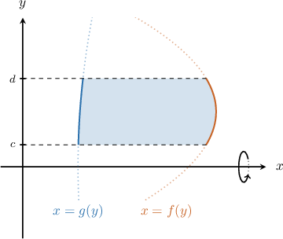
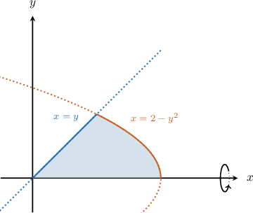
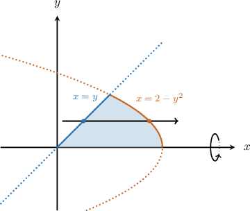
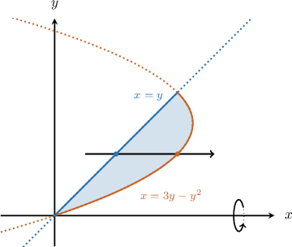

# The Shell Method: Rotating a Region Between Two Curves About the X-Axis

Source: https://www.mathacademy.com/topics/3641?courseId=106
Topic ID: 3641

## Prerequisites

- [The Shell Method: Rotating a Region About the X-Axis](./415-the-shell-method-rotating-a-region-about-the-x-axis.md)

## Lesson

### Introduction

Consider the region enclosed by the curves $x=f(y)$ on the right, $x=g(y)$ on the left, and the horizontal lines $y=c$ and $y=d,$ as shown below. We assume that $f(y) \geq g(y)$ for all $y \in [c,d].$

To find the volume of the solid generated when this region is rotated $2\pi$ radians about the $x$-axis, we use the shell method as follows:

$$

\begin{aligned}𝑉 & =2𝜋∫_{𝑑𝑐}𝑦([right]−[left])\,d𝑦 \\ & =2𝜋∫_{𝑑𝑐}𝑦([𝑓(𝑦)]−[𝑔(𝑦)])d𝑦\end{aligned}

$$

### Example: Constructing an Integral Representing the Volume of a Solid

#### Question

Consider the finite region bounded by the curves $x=2-y^2,$ $x=y,$ and the $x$-axis, as shown below. Using the shell method, find an integral expression for the volume generated when this region is rotated $2\pi$ radians about the $x$-axis.

#### Explanation

First, let $f(y)=2-y^2$ and $g(y)=y.$

We start by determining the points where the curves intersect by solving the following equation for $y\mathbin{:}$

$$

\begin{aligned}𝑓(𝑦) & =𝑔(𝑦) \\ 2−𝑦^{2} & =𝑦 \\ 𝑦^{2}+𝑦−2 & =0 \\ (𝑦+2)(𝑦−1) & =0 \\ 𝑦 & =−2,1\end{aligned}

$$

The solution corresponding to our region is $y=1.$ So, we need to integrate from $y=0$ to $y=1.$

Now, let's draw our usual horizontal arrow through the region to determine the left and right functions.

The horizontal arrow

- ** the region through the left function $x=g(y)=y,$ and

- ** through the right function $x=f(y)=2-y^2.$

Therefore, using the shell method, the volume of the solid can be expressed as follows:

$$

\begin{aligned}𝑉 & =2𝜋∫_{𝑑𝑐}𝑦([right]−[left])\,d𝑦 \\ & =2𝜋∫_{10}𝑦([2−𝑦^{2}]−[𝑦])d𝑦 \\ & =2𝜋∫_{10}𝑦(2−𝑦−𝑦^{2})d𝑦\end{aligned}

$$

### Example: Finding the Volume of a Solid Using the Shell Method

#### Question

Consider the finite region bounded by the curves $x=3y-y^2$ and $x=y,$ as shown below. Calculate the volume of the solid generated when this region is rotated $2\pi$ radians about the $x$-axis.

#### Explanation

First, let $f(y)=3y-y^2$ and $g(y)=y.$

We start by determining the points where the curves intersect by solving the following equation for $y\mathbin{:}$

$$

\begin{aligned}𝑓(𝑦) & =𝑔(𝑦) \\ 3𝑦−𝑦^{2} & =𝑦 \\ 2𝑦−𝑦^{2} & =0 \\ 𝑦(2−𝑦) & =0 \\ 𝑦 & =0,\,2\end{aligned}

$$

The solutions corresponding to our region are $y=0$ and $y=2.$ So, we need to integrate from $y=0$ to $y=2.$

Now, let's draw our usual horizontal arrow through the region to determine the left and right functions.

The horizontal arrow

- ** the region through the left function $x=g(y)=y,$ and

- ** through the right function $x=f(y)=3y-y^2.$

Therefore, using the shell method, the volume of the solid can be found as follows:

$$

\begin{aligned}𝑉 & =2𝜋∫_{𝑑𝑐}𝑦([right]−[left])\,d𝑦 \\ & =2𝜋∫_{20}𝑦([3𝑦−𝑦^{2}]−[𝑦])d𝑦 \\ & =2𝜋∫_{20}𝑦(2𝑦−𝑦^{2})d𝑦 \\ & =2𝜋∫_{20}(2𝑦^{2}−𝑦^{3})d𝑦 \\ & =2𝜋(2∫_{20}𝑦^{2}\,d𝑦−∫_{20}𝑦^{3}d𝑦) \\ & =2𝜋(2⋅\frac{𝑦^{3}}{3}_{20}−\frac{𝑦^{4}}{4}_{20}) \\ & =2𝜋(2(\frac{8}{3}−0)−(\frac{16}{4}−0)) \\ & =2𝜋(\frac{16}{3}−4) \\ & =\frac{8𝜋}{3}\end{aligned}

$$
