# Horizontal and Vertical Tangents to Polar Curves in Non-Differentiable Cases

Source: https://www.mathacademy.com/topics/3895?courseId=106
Topic ID: 3895

## Prerequisites

- [L'Hopital's Rule](../../../ap-courses/lessons/ap-calculus-ab/463-l-hopital-s-rule.md)
- [Horizontal and Vertical Tangents to Polar Curves](./3584-horizontal-and-vertical-tangents-to-polar-curves.md)

## Lesson

### Introduction

Let's consider the curve $r = 1+\cos\theta$ for $0\leq \theta < 2\pi,$ shown below.

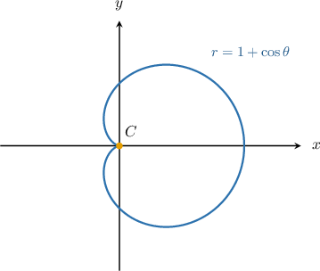

Using previously discussed techniques, it's straightforward to show that at point $C$ where $\theta = \pi,$ we have

$$

\dfrac{\textrm d y}{\textrm d x} = \dfrac{y'(\theta)}{x'(\theta)} = \dfrac00.

$$

To see what's happening at this point, let's zoom in and observe the behavior of the curve.

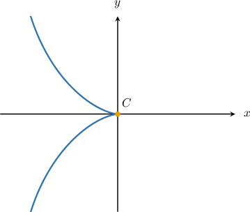

If we look carefully, we notice that the tangent lines flatten out as we approach the point $C$ from either direction.

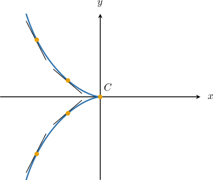

Therefore, as we take the *limit* of the tangent lines as we approach $C,$ it would appear that they become horizontal.

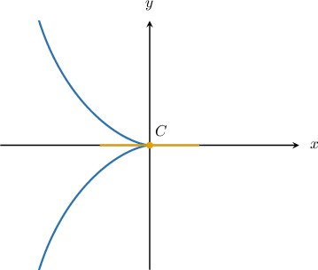

When the limit of the tangent lines becomes horizontal like this, we say that the curve has a horizontal tangent at $C.$

### Using Limits to Find Horizontal Tangents

So, it seems that the curve $r = 1+\cos\theta$ has a horizontal tangent at $\theta = \pi.$ However, to be sure of this, we need to check that the tangent lines flatten out as we approach $\theta = \pi.$ In other words, we need to check that

$$

\lim\limits_{\theta \to \pi} \dfrac{\textrm d y}{\textrm d x} = 0.

$$

Let's now verify that this is true:

Using techniques discussed in previous lessons, it's straightforward to show that

$$

x'(\theta)=-\sin\theta(2\cos\theta+1), \qquad y'(\theta)=2\cos^2\theta +\cos\theta - 1.

$$

Therefore,

$$

\begin{aligned}\underset{𝜃→𝜋}{lim}\frac{d𝑦}{d𝑥} & =\underset{𝜃→𝜋}{lim}(\frac{2cos^{2}⁡𝜃+cos⁡𝜃−1}{−sin⁡𝜃(2cos⁡𝜃+1)}) \\ & =−\underset{𝜃→𝜋}{lim}(\frac{2cos^{2}⁡𝜃+cos⁡𝜃−1}{sin⁡𝜃(2cos⁡𝜃+1)}) \\ & =−\underset{𝜃→𝜋}{lim}(\frac{2cos^{2}⁡𝜃+cos⁡𝜃−1}{2sin⁡𝜃cos⁡𝜃+sin⁡𝜃}) \\ & =−\underset{𝜃→𝜋}{lim}(\frac{2cos^{2}⁡𝜃+cos⁡𝜃−1}{sin⁡2𝜃+sin⁡𝜃}).\end{aligned}

$$

We already know that substituting $\theta = \pi$ gives the indeterminate form $\dfrac00,$ so evaluating this limit by direct substitution won't work. However, we can evaluate this limit using L'Hopital's rule.

Applying L'Hopital's rule, we get

$$

\begin{aligned}\underset{𝜃→𝜋}{lim}\frac{d𝑦}{d𝑥} & =−\underset{𝜃→𝜋}{lim}(\frac{2cos^{2}⁡𝜃+cos⁡𝜃−1}{sin⁡2𝜃+sin⁡𝜃}) \\ & =−\underset{𝜃→𝜋}{lim}(\frac{(2cos^{2}⁡𝜃+cos⁡𝜃−1)^{′}}{(sin⁡2𝜃+sin⁡𝜃)^{′}}) \\ & =−\underset{𝜃→𝜋}{lim}(\frac{−4cos⁡𝜃sin⁡𝜃−sin⁡𝜃}{2cos⁡2𝜃+cos⁡𝜃}) \\ & =\underset{𝜃→𝜋}{lim}(\frac{4cos⁡𝜃sin⁡𝜃+sin⁡𝜃}{2cos⁡2𝜃+cos⁡𝜃}) \\ & =\frac{4cos⁡𝜋sin⁡𝜋+sin⁡𝜋}{2cos⁡2𝜋+cos⁡𝜋} \\ & =\frac{4⋅(−1)⋅(0)+0}{2⋅1+(−1)} \\ & =\frac{0}{1} \\ & =0.\end{aligned}

$$

Therefore, since

$$

\lim\limits_{\theta \to \pi} \dfrac{\textrm d y}{\textrm d x} = 0

$$

we conclude that our curve does indeed have a horizontal tangent at $\theta = \pi.$

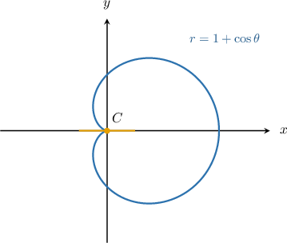

### Example: Finding Horizontal Tangents in Non-Differentiable Cases

#### Question

Consider the polar curve $r=2(1+\sin\theta)$ for $\theta \in \left[0, 2\pi\right).$ Given that

$$

x'(\theta) = 2\cos2\theta - 2\sin\theta, \qquad y'(\theta) = 2\cos\theta+2\sin2\theta,

$$

and $x'\left(\dfrac{3\pi}{2}\right) = 0,$ which of the following statements are true?

1. $y'\left(\dfrac{3\pi}2\right) = 0$

2. $\lim\limits_{\theta \to 3\pi/2} \dfrac{\textrm d y}{\textrm d x}=0$

3. The curve has a horizontal tangent at $\theta = \dfrac{3\pi}{2}.$

**

#### Explanation

When a polar curve is differentiable at a point $\theta_0$, there is a horizontal tangent at $\theta_0$ if

$$

\dfrac{\textrm d y}{\textrm d x} = \dfrac{y'(\theta_0)}{x'(\theta_0)} = 0

$$

which is equivalent to

$$

y'(\theta_0) = 0 \qquad \text{and}\qquad x'(\theta_0) \neq 0.

$$

However, if the curve is continuous at $\theta_0$ yet the derivative $y'(x)$ takes the indeterminate form $\dfrac00$ at this point, we say that the curve has a horizontal tangent at this point if

$$

\lim\limits_{\theta \to \theta_0} \dfrac{\textrm d y}{\textrm d x} = 0.

$$

In this case, we're told that $x'\left(\dfrac{3\pi}2\right)=0.$

With that in mind, let's examine our statements in turn.

- Statement I is true. Substituting $\theta = \dfrac{3\pi}2$ into the expression for $y'(\theta),$ we get

- Statement II is false. Computing the limit as $\theta\to \dfrac{3\pi}{2}$ using L'Hopital's rule, we obtain

- Statement III is false. Since the limit in part II does ** equal to $0,$ there curve does ** have a horizontal tangent at $\theta=\dfrac{3\pi}{2}.$ In fact, it is a vertical tangent.

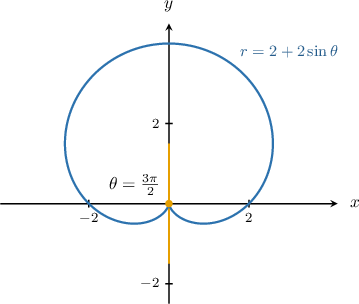

Therefore, the correct answer is "I only."

****: We'll discuss vertical tangents in more detail later in this lesson.

### Vertical Tangents to Polar Curves in Non-Differentiable Cases

Let's consider the curve $r = 1-\sin\theta$ for $0\leq \theta < 2\pi,$ shown below.

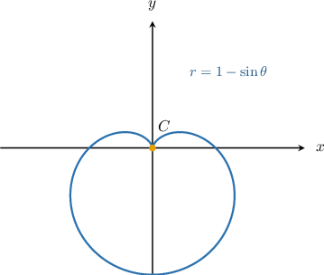

Using previously discussed techniques, it's straightforward to show that at point $C$ where $\theta = \dfrac\pi 2,$ we have

$$

\dfrac{\textrm d y}{\textrm d x} = \dfrac{y'(\theta)}{x'(\theta)} = \dfrac00.

$$

To see what's happening, let's zoom in and observe the behavior of the curve at this point.

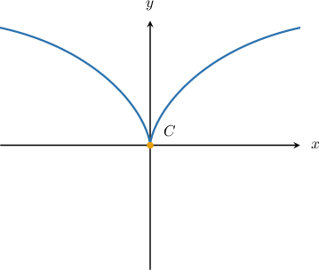

If we look carefully, we notice that the tangent lines become steeper and steeper as we approach the point $C$ from either direction.

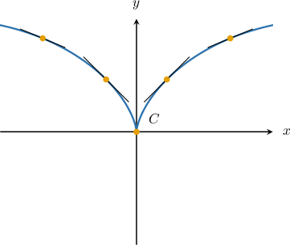

Therefore, as we take the *limit* as we approach $C,$ it would appear that these tangent lines become vertical.

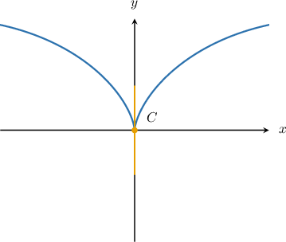

When the limit of the tangent lines becomes vertical like this, we say that the curve has a vertical tangent at $C.$

### Using Limits to Find Vertical Tangents

So, it seems that the curve $r = 1-\sin\theta$ has a vertical tangent at $\theta = \dfrac\pi 2.$ However, to be sure of this, we need to check that the tangent lines' slopes grow to infinity as we approach $\theta = \dfrac \pi 2.$ In other words, we need to check that

$$

\lim\limits_{\theta \to (\pi/2)^{-}} \dfrac{\textrm d y}{\textrm d x} = \pm\infty \qquad\text{and}\qquad \lim\limits_{\theta \to (\pi/2)^{+}} \dfrac{\textrm d y}{\textrm d x} = \pm\infty.

$$

Let's now verify that this is true:

Using techniques discussed in previous lessons, it's straightforward to show that

$$

x'(\theta)=-\sin\theta-\cos(2\theta), \qquad y'(\theta)=\cos\theta - \sin2\theta.

$$

Therefore,

$$

\begin{aligned}\underset{𝜃→𝜋/2}{lim}\frac{d𝑦}{d𝑥} & =\underset{𝜃→𝜋/2}{lim}(\frac{cos⁡𝜃−sin⁡2𝜃}{−sin⁡𝜃−cos⁡(2𝜃)}) \\ & =−\underset{𝜃→𝜋/2}{lim}(\frac{cos⁡𝜃−sin⁡(2𝜃)}{sin⁡𝜃+cos⁡(2𝜃)}).\end{aligned}

$$

We already know that substituting $\theta = \dfrac\pi 2$ gives the indeterminate form $\dfrac00,$ so evaluating this limit by direct substitution won't work. However, we can evaluate this limit using L'Hopital's rule.

- Applying L'Hopital's rule to evaluate the left-sided limit, we get Evaluating the limit in the numerator, we get For the limit in the denominator, it can be shown that where the notation $0^-$ means that the denominator approaches zero from the negative numbers. Therefore, we have

- Using similar methods, it can be shown that the right-sided limit is

Since the limits of our derivative are both infinite, we conclude that there is a vertical tangent to the curve at $\theta=\dfrac{\pi}{2}.$

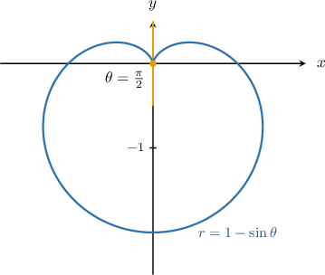

### Example: Finding Vertical Tangents in Non-Differentiable Cases

#### Question

Consider the polar curve $r=\cot^2\theta$ for $\theta \in \left(0, \pi\right).$ Given that

$$

x'(\theta) = -\cot\theta(\cos\theta + 2\cot\theta\csc\theta), \qquad y'(\theta) = -\cot\theta\csc\theta(1+\sin^2\theta),

$$

and $y'\left(\dfrac{\pi}{2}\right) = 0,$ which of the following statements are true?

1. $x'\left(\dfrac\pi2\right) = 0$

2. $\lim\limits_{\theta \to (\pi/2)^{+}} \dfrac{\textrm d y}{\textrm d x}=-\infty$

3. The curve has a vertical tangent at $\theta = \dfrac\pi 2$

**

$$

\begin{aligned}cos⁡𝜃+2cot⁡𝜃csc⁡𝜃→0^{+}\,as\,𝜃→(\frac{𝜋}{2})^{−} \\ cos⁡𝜃+2cot⁡𝜃csc⁡𝜃→0^{−}\,as\,𝜃→(\frac{𝜋}{2})^{+}\end{aligned}

$$

**

#### Explanation

For a given polar curve, there is a vertical tangent at $\theta = \theta_0$ if

$$

\dfrac{\textrm d y}{\textrm d x} = \dfrac{y'(\theta_0)}{x'(\theta_0)}

$$

is infinite. This means that

$$

y'(\theta_0) \neq 0 \qquad \text{and}\qquad x'(\theta_0) = 0.

$$

However, if the curve is continuous at $\theta_0$ yet the derivative takes the indeterminate form $\dfrac00$ at this point, we say that the curve has a vertical tangent at this point if

$$

\lim\limits_{\theta \to \theta_0^{-}} \dfrac{\textrm d y}{\textrm d x} = \pm\infty \qquad\text{and}\qquad \lim\limits_{\theta \to \theta_0^{+}} \dfrac{\textrm d y}{\textrm d x} = \pm\infty.

$$

In this case, we're told that $y'\left(\dfrac\pi2\right)=0.$

With that in mind, let's examine our statements in turn.

- Statement I is true. Substituting $\theta = \dfrac\pi2$ into the expression for $x'(\theta),$ we get

- Statement II is true. Computing the limit as $\theta\to\left(\dfrac{\pi}{2}\right)^+,$ we obtain Evaluating the limit in the numerator, we get Therefore, using the second hint, we have

- Statement III is true. Using the calculations from part I, and the first hint, we have

Since the limits of our derivative are both infinite, there is a vertical tangent to the curve at $\theta=\dfrac{\pi}{2}.$

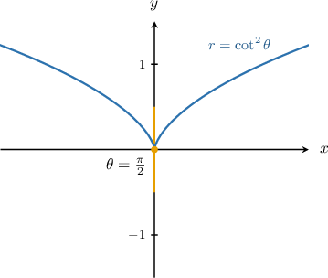

Therefore, the correct answer is "I, II, and III."
