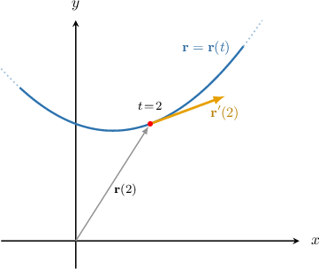

# Differentiating Vector-Valued Functions

Source: https://www.mathacademy.com/topics/4139?courseId=106
Topic ID: 4139

## Prerequisites

- [Second and Higher-Order Derivatives](../../../ap-courses/lessons/ap-calculus-ab/281-second-and-higher-order-derivatives.md)
- [Defining Vector-Valued Functions](./475-defining-vector-valued-functions.md)
- [Differentiating Parametric Curves](./798-differentiating-parametric-curves.md)
- [Differentiating Inverse Reciprocal Trigonometric Functions](../../../ap-courses/lessons/ap-calculus-ab/1721-differentiating-inverse-reciprocal-trigonometric-functions.md)

## Lesson

### Introduction

Differentiating vector-valued functions is easy: we just differentiate each component separately. So, if

$$

\mathbf{r}(t) = \left< x(t), \, y(t) \right>,

$$

then

$$

\dfrac{\textrm d \mathbf{r} }{\textrm dt} = \mathbf{r}'(t) = \left< x'(t), \, y'(t) \right>.

$$

For example, if $\mathbf{r}(t) = \left< t+1, \, t^2+2 \right>,$ then

$$

\begin{aligned}\frac{d𝐫}{d𝑡} & =⟨\frac{d}{d𝑡}(𝑡+1),\,\frac{d}{d𝑡}(𝑡^{2}+2)⟩ \\ & =⟨1,\,2𝑡⟩\end{aligned}

$$

Geometrically, the derivative of a vector-valued function $\mathbf r(t)$ at the point $t$ gives a vector that's tangent to the curve traced out by $\mathbf r(t)$ at $t.$

Let's see some examples.

### Example: Finding the Derivative of a Vector-Valued Function

#### Question

Given that $\mathbf r(t) = \langle 10t^4,\, 6\ln t\rangle,$ what is $\mathbf r'\left(\dfrac{1}{2}\right)?$

#### Explanation

We differentiate each component separately.

- For the $x$-component $x(t) = 10t^4,$ we have and therefore

- For the $y$-component $y(t) = 6 \ln t,$ we have and therefore

So, we conclude that

$$

\begin{aligned}𝐫^{′}(\frac{1}{2}) & =⟨𝑥^{′}(\frac{1}{2}),\,𝑦^{′}(\frac{1}{2})⟩ \\ & =⟨5,\,12⟩.\end{aligned}

$$

### Derivatives of Vector-Valued Functions

We can differentiate vector-valued functions with three components in the same way.

For example, if

$$

\mathbf{f}(t) = \big\langle x(t), \: y(t), \: z(t) \big\rangle

$$

is our vector-valued function, then the derivative is computed as follows:

$$

\dfrac{ \text{d}\mathbf{f}}{\text{d}t} = \left\langle \dfrac{ \text{d}x}{\text{d}t}, \: \dfrac{ \text{d}y}{\text{d}t}, \: \dfrac{ \text{d}z}{\text{d}t} \right\rangle

$$

For example, suppose that we are given the vector function

$$

\mathbf f (t) = \left\langle t^3, \: \ln(t+3), \: \sqrt{t}\right\rangle.

$$

To compute the derivative $\mathbf f'\!(t),$ we find the derivative of each component function, as follows:

$$

\begin{aligned}\frac{d𝐟}{d𝑡} & =\frac{d}{d𝑡}⟨𝑡^{3},\,ln⁡(𝑡+3),\,\sqrt{√𝑡}⟩ \\ & =⟨\frac{d}{d𝑡}(𝑡^{3}),\,\frac{d}{d𝑡}(ln⁡(𝑡+3)),\,\frac{d}{d𝑡}(\sqrt{√𝑡})⟩ \\ & =⟨3𝑡^{2},\,\frac{1}{𝑡+3},\,\frac{1}{2\sqrt{√𝑡}}⟩\end{aligned}

$$

### Example: The Derivative of a Three-Component Vector-Valued Function

#### Question

Find the derivative of $\mathbf f(t) = \langle \sin t,\cos t, t \rangle$ at $t= \dfrac{\pi}4.$

#### Explanation

First, we find $\mathbf f'(t)$ by differentiating each component:

$$

\begin{aligned}𝐟^{′}(𝑡) & =⟨\frac{d}{d𝑡}(sin⁡𝑡),\,\frac{d}{d𝑡}(cos⁡𝑡),\,\frac{d}{d𝑡}(𝑡)⟩ \\ & =⟨cos⁡𝑡,\,−sin⁡𝑡,\,1⟩\end{aligned}

$$

Now, to compute $\mathbf f'\left(\dfrac{\pi}4\right),$ we substitute $t=\dfrac{\pi}4$ into the expression for $\mathbf f'(t)\mathbin{:}$

$$

\begin{aligned}𝐟^{′}(\frac{𝜋}{4}) & =⟨cos⁡(\frac{𝜋}{4}),\,−sin⁡(\frac{𝜋}{4}),\,1⟩ \\ & =⟨\frac{\sqrt{√2}}{2},\,−\frac{\sqrt{√2}}{2},\,1⟩\end{aligned}

$$

### Example: The Second Derivative of a Vector-Valued Function

#### Question

Given that $\mathbf r(t) = \langle t^6,\, t^5\rangle,$ Calculate $\mathbf r''(t).$

#### Explanation

To find the second derivative of a vector-valued function, we find the second derivatives of the components.

- For $x(t) = t^6,$ we have

- For $y(t) = t^5,$ we have

So, we conclude that

$$

\begin{aligned}𝐫^{″}(𝑡) & =⟨𝑥^{″}(𝑡),\,𝑦^{″}(𝑡)⟩ \\ & =⟨30𝑡^{4},\,20𝑡^{3}⟩ \\ & =10⟨3𝑡^{4},\,2𝑡^{3}⟩.\end{aligned}

$$
