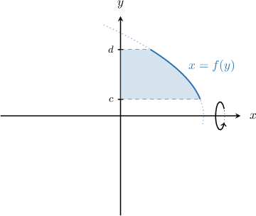
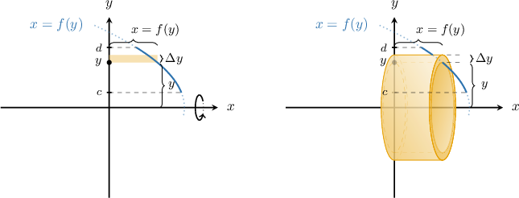
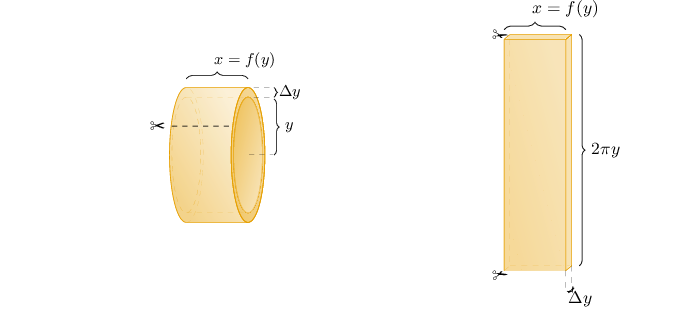
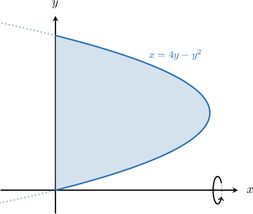
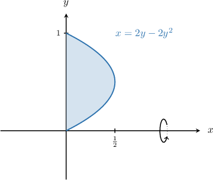
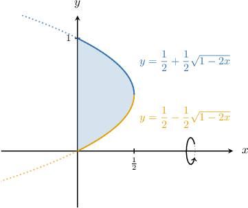
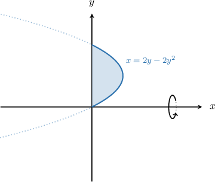

# The Shell Method: Rotating a Region About the X-Axis

Source: https://www.mathacademy.com/topics/415?courseId=106
Topic ID: 415

## Prerequisites

- [Volumes of Revolution Using the Washer Method: Rotation About the Coordinate Axes](./414-volumes-of-revolution-using-the-washer-method-rotation-about-the-coordinate-axes.md)
- [Volumes of Rectangular Solids](../../../high-school/traditional/lessons/geometry/1753-volumes-of-rectangular-solids.md)

## Lesson

### Introduction

Consider the plane region enclosed by the curve $x=f(y),$ the $y$-axis, and the horizontal lines $y=c$ and $y=d,$ as shown below. If we rotate this region $2\pi$ radians about the $x$-axis, we get a solid of revolution.

One way of computing the volume of the solid is to divide the interval from $y=c$ to $y=d$ on the $y$-axis to get horizontal slices. This approach is called the **shell method**.

Consider one such slice of height $\Delta{y},$ as shown in the picture below (on the left). When this rectangle is rotated about the $x$-axis, it forms a solid **shell** (i.e., the skin of a cylinder).

Since we assume that $\Delta{y}$ is very small, the outer radius of the shell approximately equals the inner radius $y.$ The thickness of the shell is $\Delta{y}$ and its height is $x=f(y)$.

Imagine we cut this shell and unfold it to obtain a rectangular solid, as shown below. Its width is $x=f(y)$, its thickness is $\Delta{y},$ and its height is $2\pi y$ (the circumference of the shell).

The volume of the shell approximately equals the volume of the rectangular solid:

$$

\begin{aligned}𝑉_{shell} & ≈𝑉_{rec} \\ & =2𝜋𝑦⋅𝑥⋅Δ𝑦 \\ & =2𝜋𝑦𝑓(𝑦)Δ𝑦\end{aligned}

$$

The sum over all the shells will approximate the total volume that we want. This approximation becomes more accurate as $\Delta{y} \to 0$. Therefore, the volume $V$ of the solid is given by

$$

\begin{aligned}𝑉 & =2𝜋∫_{𝑑𝑐}𝑦𝑥\,d𝑦 \\ & =2𝜋∫_{𝑑𝑐}𝑦\,𝑓(𝑦)\,d𝑦.\end{aligned}

$$

### Example: Constructing an Integral Representing the Volume of a Solid

#### Question

Consider the finite region bounded by the curve $x=4y-y^2$ and the $y$-axis, as shown above. Using the shell method, find an integral that gives the volume of the solid generated when that region is rotated $2\pi$ radians about the $x$-axis.

#### Explanation

First, we determine the points where the curve intersects the $y$-axis by solving the following equation for $y\mathbin{:}$

$$

\begin{aligned}4𝑦−𝑦^{2} & =0 \\ 𝑦(4−𝑦) & =0\end{aligned}

$$

The solutions are $y=0, \, 4.$ So, we need to integrate from $y=0$ to $y=4.$

Using the shell method, the volume of the solid can be expressed as follows:

$$

\begin{aligned}𝑉 & =2𝜋∫_{𝑑𝑐}𝑦𝑓(𝑦)\,d𝑦 \\ & =2𝜋∫_{40}𝑦(4𝑦−𝑦^{2})d𝑦\end{aligned}

$$

### Advantages of the Shell Method

One of the advantages of using the shell method versus other methods is that the resulting integral can be much simpler to evaluate. This is often true when we want to rotate a curve of the form $x = f(y)$ about the $x$-axis.

For example, suppose we want to compute the volume generated when the region below is rotated about the $x$-axis:

According to the shell method, the volume $V$ is given by the following straightforward integral:

$$

\begin{aligned}𝑉 & =2𝜋∫_{10}𝑦𝑓(𝑦)\,d𝑦 \\ & =2𝜋∫_{10}𝑦(2𝑦−2𝑦^{2})\,d𝑦 \\ & =2𝜋∫_{10}2𝑦^{2}−2𝑦^{3}\,d𝑦\end{aligned}

$$

Let's now compare this to the disc method.

To determine this volume using the disc method, we'd first need to express our curve as two separate functions of $x,$ one for the lower part and one for the upper part, as follows:

$$

\begin{aligned}𝑦=\frac{1}{2}+\frac{1}{2}\sqrt{1−2𝑥},\, & 𝑦≥\frac{1}{2} \\ 𝑦=\frac{1}{2}−\frac{1}{2}\sqrt{1−2𝑥},\, & 𝑦<\frac{1}{2}\end{aligned}

$$

The required volume is equal to the difference between the volumes generated when the upper and lower curves are rotated about the $x$-axis. Thus, according to the disc method, the required volume is given by

$$

V = \pi \int_{0}^{1/2} \left( \left[ \dfrac{1}{2}+\dfrac{1}{2}\sqrt{1-2x} \right]^2 - \left[ \dfrac{1}{2}-\dfrac{1}{2}\sqrt{1-2x} \right]^2 \right) \text{d}x.

$$

As we can see, this integral is a lot more complicated than the one we obtained using the shell method!

### Example: Finding the Volume of a Solid Using the Shell Method

#### Question

Consider the finite region bounded by the curve $x=2y-2y^2$ and the $y$-axis, as shown below. Calculate the volume of the solid generated when this region is rotated $2\pi$ radians about the $x$-axis.

#### Explanation

First, we determine the points where the curve intersects the $y$-axis by solving the following equation for $y\mathbin{:}$

$$

\begin{aligned}2𝑦−2𝑦^{2} & =0 \\ 2𝑦(1−𝑦) & =0\end{aligned}

$$

The solutions are $y=0,$ and $y=1.$ So, we need to integrate from $y=0$ to $y=1.$

Using the shell method, the volume of the solid can be found as follows:

$$

\begin{aligned}𝑉 & =2𝜋∫_{𝑑𝑐}𝑦𝑓(𝑦)\,d𝑦 \\ & =2𝜋∫_{10}𝑦(2𝑦−2𝑦^{2})d𝑦 \\ & =4𝜋∫_{10}(𝑦^{2}−𝑦^{3})d𝑦 \\ & =4𝜋(∫_{10}𝑦^{2}\,d𝑦−∫_{10}𝑦^{3}d𝑦) \\ & =4𝜋(\frac{𝑦^{3}}{3}_{10}−\frac{𝑦^{4}}{4}_{10}) \\ & =4𝜋((\frac{1}{3}−0)−(\frac{1}{4}−0)) \\ & =4𝜋(\frac{1}{3}−\frac{1}{4}) \\ & =\frac{𝜋}{3}\end{aligned}

$$
