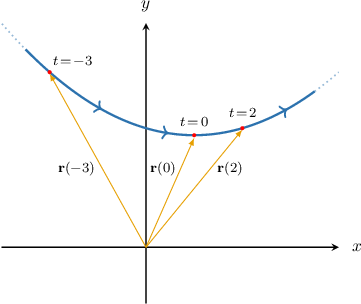

# Defining Vector-Valued Functions

Source: https://www.mathacademy.com/topics/475?courseId=106
Topic ID: 475

## Prerequisites

- [Graphing Curves Defined Parametrically](../../../high-school/integrated-math-honors/lessons/integrated-math-iii-honors/803-graphing-curves-defined-parametrically.md)
- [Calculating the Magnitude of Cartesian Vectors in 3D](../../../high-school/integrated-math-honors/lessons/integrated-math-iii-honors/1277-calculating-the-magnitude-of-cartesian-vectors-in-3d.md)

## Lesson

### Introduction

Suppose that we have the parametric equations

$$

x(t) = t+1, \qquad y(t) = t^2+2, \qquad t\in (-\infty, \infty).

$$

These parametric equations trace out a curve in the $xy$-plane. We can combine these into a single function, called a **vector-valued** function $\mathbf r (t),$ as follows:

$$

\mathbf r (t) = \langle x(t), \: y(t)\rangle = \langle t+1, \: t^2+2\rangle

$$

The function $\mathbf r (t)$ takes a **parameter** $t$ as input and returns a **position vector**. For a given value of $t,$ each value of $\mathbf{r}(t)$ has its tail at the origin and its terminal point at the coordinates $(t+1, \: t^2+2).$

Evaluating vector-valued functions is straightforward. Just remember that the output is a vector, not a scalar.

For the vectors in the graph above, we have

$$

\begin{aligned}𝐫(−3) & =⟨(−3)+1,\,(−3)^{2}+2⟩=⟨−2,\,11⟩, \\ 𝐫(0) & =⟨(0)+1,\,(0)^{2}+2⟩=⟨1,\,2⟩, \\ 𝐫(2) & =⟨(2)+1,\,(2)^{2}+2⟩=⟨3,\,6⟩.\end{aligned}

$$

### Example: Evaluating a Vector-Valued Function

#### Question

Given that $\mathbf r (t) = \langle 6t, 2t^2-1\rangle,$ calculate $\mathbf r (3).$

#### Explanation

We substitute $t=3$ into our function, and we get

$$

\begin{aligned}𝐫(3) & =⟨6(3),\,2(3)^{2}−1⟩ \\ & =⟨18,\,17⟩.\end{aligned}

$$

### Three-Component Functions

We can also define vector-valued functions with three components. For example,

$$

\mathbf{f} (t) = t \ \mathbf{i} + 2t^2 \ \mathbf{j} + 3t^3 \ \mathbf{k}.

$$

This particular definition uses the so-called $\mathbf{i}$-$\mathbf{j}$-$\mathbf{k}$ notation.

We can represent the same function using **angle bracket** notation, as follows:

$$

\mathbf f (t) = \langle t, \: 2t^2, \: 3t^3 \rangle

$$

Another notation that's often convenient is **bracket** notation:

$$

\begin{aligned}𝑡 \\ 2𝑡^{2} \\ 3𝑡^{3}\end{aligned}

$$

It's important to realize that all three notations represent the same function.

### Example: Evaluating a Three-Component Vector-Valued Function

#### Question

Find the value of the vector function $\mathbf f(t) = \left\langle \cos t, \: \sin t, \: t \right\rangle$ at $t = \pi.$

#### Explanation

To evaluate, we substitute $t = \pi$ into the function, as follows:

$$

\begin{aligned}𝐟(𝜋) & =⟨cos⁡𝜋,\,sin⁡𝜋,\,𝜋⟩=⟨−1,0,𝜋\,⟩\end{aligned}

$$

So, the value of $\mathbf f (t)$ at $t = \pi$ is $\langle -1, 0, \pi \rangle.$

We can also express the answer using $\mathbf i$-$\mathbf j$-$\mathbf k$ notation or square bracket notation, as follows:

$$

\begin{aligned}−1 \\ 0 \\ 𝜋\end{aligned}

$$

### The Magnitude of a Vector-Valued Function

The **magnitude** of a vector-valued function

$$

\mathbf{r}(t) = \left< x(t), \: y(t) \right>,

$$

denoted $|\mathbf{r}(t)|,$ is defined as follows:

$$

|\mathbf{r}(t)| = \sqrt{(x(t))^2+(y(t))^2}

$$

The magnitude of a three-dimensional vector-valued function

$$

\mathbf{r}(t) = \left< x(t), \: y(t), \: z(t) \right>

$$

is defined similarly:

$$

|\mathbf{r}(t)| = \sqrt{(x(t))^2+(y(t))^2+(z(t))^2}

$$

**Note:** An alternative notation that's often used for the magnitude of a vector-valued function is $||\mathbf r(t) ||.$

### Example: Finding the Magnitude of a Vector-Valued Function

#### Question

Find $\left|\mathbf r\left(4\right)\right|$ given that $\mathbf r(t) = \left\langle 2-t, 2\sqrt{t}, \, t-1\right\rangle,$

#### Explanation

Evaluating the function at $t=4,$ we get

$$

\begin{aligned}𝐫(4) & =⟨2−4,\,2\sqrt{√4},\,4−1⟩ \\ & =⟨−2,\,4,\,3⟩.\end{aligned}

$$

Computing the magnitude of this vector, we obtain

$$

\begin{aligned}|𝐫(4)| & =\sqrt{√(−2)^{2}+(4)^{2}+(3)^{2}} \\ & =\sqrt{√4+16+9} \\ & =\sqrt{√29}.\end{aligned}

$$
