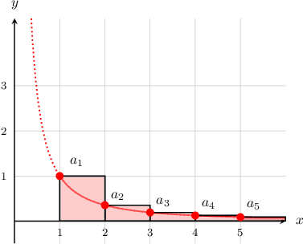
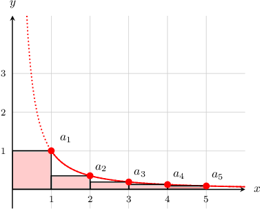

# The Integral Test

Source: https://www.mathacademy.com/topics/744?courseId=106
Topic ID: 744

## Prerequisites

- [Approximating Areas With the Left Riemann Sum](../../../ap-courses/lessons/ap-calculus-ab/477-approximating-areas-with-the-left-riemann-sum.md)
- [Improper Integrals](./758-improper-integrals.md)
- [Convergent and Divergent Infinite Series](./982-convergent-and-divergent-infinite-series.md)
- [Approximating Areas With the Right Riemann Sum](../../../ap-courses/lessons/ap-calculus-ab/1281-approximating-areas-with-the-right-riemann-sum.md)
- [Determining Intervals on Which a Function Is Increasing or Decreasing](../../../ap-courses/lessons/ap-calculus-ab/1359-determining-intervals-on-which-a-function-is-increasing-or-decreasing.md)

## Lesson

### Introduction

The **integral test** is used to determine whether an infinite series $\displaystyle{\sum_{n=1}^\infty a_n}$ converges or diverges. It states the following:

*If $f(x)$ is a positive, continuous, and decreasing function for $x\geq 1$ such that $f(n)=a_n,$ and the integral*

$$

\int_1^\infty f(x) \: \text{d}x

$$

*is convergent, then the series*

$$

\sum_{n=1}^\infty a_n

$$

*is also convergent. The opposite is also true, i.e., if the integral is divergent, then the series is also divergent.*

For example, suppose that we want to determine the convergence of the series

$$

\sum_{n=1}^\infty \dfrac 1 {n^{3/2}}.

$$

We can compare it to the integral

$$

\int_1^\infty \dfrac {1} {x^{3/2}} \: \text{d}x.

$$

Here, $f(x) = \dfrac{1}{x^{3/2}}$ is a positive, continuous, and decreasing function for $x\geq1,$ so the integral test applies. Let's compute the integral:

$$

\begin{aligned}∫_{∞1}\frac{1}{𝑥^{3/2}}\,d𝑥 & =\underset{𝑏→∞}{lim}∫_{𝑏1}\frac{1}{𝑥^{3/2}}\,d𝑥 \\ & =\underset{𝑏→∞}{lim}[−2(\frac{1}{𝑥^{1/2}})]_{𝑏1} \\ & =−2\underset{𝑏→∞}{lim}[\frac{1}{𝑏^{1/2}}−\frac{1}{1^{1/2}}] \\ & =−2[0−1] \\ & =2\end{aligned}

$$

Since the integral is convergent, the integral test guarantees that the series $\displaystyle\sum_{n=1}^\infty \dfrac 1 {n^{3/2}}$ is also convergent.

### Example: Applying the Integral Test to a Convergent Series

#### Question

Given the sequence $a_n = \dfrac{1}{n^2}$ and the function $f(x) = \dfrac{1}{x^2},$ which of the following statements are true?

1. $\displaystyle \int_{1}^{\infty} f(x) \: \text{d}x$ is convergent

2. $\displaystyle \int_{1}^{\infty} f(x) \: \text{d}x$ is divergent

3. The series $\displaystyle \sum_{n=1}^\infty a_n$ is convergent

#### Explanation

We carry out the integration as follows:

$$

\begin{aligned}∫_{∞1}\frac{1}{𝑥^{2}}\,d𝑥 & =∫_{∞1}𝑓(𝑥)\,d𝑥 \\ & =\underset{𝑏→∞}{lim}∫_{𝑏1}𝑥^{−2}\,d𝑥 \\ & =\underset{𝑏→∞}{lim}[\frac{𝑥^{−1}}{−1}]_{𝑏1} \\ & =\underset{𝑏→∞}{lim}[−𝑥^{−1}]_{𝑏1} \\ & =−\underset{𝑏→∞}{lim}[𝑥^{−1}]_{𝑏1} \\ & =−\underset{𝑏→∞}{lim}[\frac{1}{𝑥}]_{𝑏1} \\ & =−\underset{𝑏→∞}{lim}([\frac{1}{𝑏}]−[\frac{1}{1}]) \\ & =−([0]−[1]) \\ & =−(−1) \\ & =1\end{aligned}

$$

So the integral is convergent.

Moreover, the function $f(x)= \dfrac{1}{x^2}$ satisfies $f(n)=a_n$ and is positive, continuous, and decreasing for $x \geq 1,$ so the integral test applies. Since the integral is convergent, the integral test guarantees that the series $\displaystyle\sum_{n=1}^\infty \frac{1}{n^2}$ is also convergent.

In conclusion, only statements I and III are true.

### Example: Applying the Integral Test to a Divergent Series

#### Question

Given the sequence $a_n = \dfrac{1}{2n+1}$ and the function $f(x) = \dfrac{1}{2x+1},$ which of the following statements are true?

1. $\displaystyle \int_{1}^{\infty} f(x) \: \text{d}x$ is convergent

2. $\displaystyle \int_{1}^{\infty} f(x) \: \text{d}x$ is divergent

3. The series $\displaystyle \sum_{n=1}^\infty a_n$ is divergent

#### Explanation

We carry out the integration as follows:

$$

\begin{aligned}∫_{∞1}\frac{1}{2𝑥+1}d𝑥 & =\underset{𝑏→∞}{lim}∫_{𝑏1}\frac{1}{2𝑥+1}d𝑥 \\ & =\underset{𝑏→∞}{lim}[\frac{1}{2}ln⁡|2𝑥+1|]_{𝑏1} \\ & =\underset{𝑏→∞}{lim}([\frac{1}{2}ln⁡|2𝑏+1|]−[\frac{1}{2}ln⁡|2(1)+1|]) \\ & =\underset{𝑏→∞}{lim}([\frac{1}{2}ln⁡|2𝑏+1|]−[\frac{1}{2}ln⁡|3|]) \\ & =\underset{𝑏→∞}{lim}(\frac{1}{2}ln⁡\frac{2𝑏+1}{3}) \\ & =∞.\end{aligned}

$$

So the integral is divergent.

Moreover, the function $f(x)= \dfrac{1}{2x+1}$ satisfies $f(n)=a_n$ and is positive, continuous, and decreasing for $x\geq 1,$ so the integral test applies. Since the integral is divergent, the integral test guarantees that the series $\displaystyle\sum_{n=1}^\infty \frac{1}{2n+1}$ is also divergent.

In conclusion, only statements II and III are true.

### Comparing the Sum of the Series to the Value of an Integral

Let's go back to the first example, and compare the series $\displaystyle\sum_{n=1}^\infty \dfrac{1}{n^{3/2}}$ with the integral $\displaystyle \int_1^\infty \dfrac{1}{x^{3/2}} \: \textrm d x$ by considering the plot below.

The value of

$$

\displaystyle\sum_{n=1}^\infty \dfrac{1}{n^{3/2}}

$$

is equal to the sum of the rectangular blocks (extending all the way to $\infty$), whereas

$$

\displaystyle \int_1^\infty \dfrac{1}{x^{3/2}} \: \textrm d x = 2

$$

is the area under the curve over the interval $[1,\infty).$

Since the sum of the rectangular blocks is larger than the area under the curve, we can conclude that

$$

\displaystyle\sum_{n=1}^\infty \dfrac{1}{n^{3/2}} >\displaystyle \int_1^\infty \dfrac{1}{x^{3/2}} \: \textrm d x = 2.

$$

We can think of the summation as being a left Riemann sum approximation to the integral with step size $h=1$ over the domain $[1,\infty).$ Since $f(x)$ is decreasing, the Riemann sum approximation is an overestimate of the integral.

### Example: Comparing the Sum of a Series to the Value of Its Corresponding Integral

#### Question

Let $f$ be a positive, continuous, and decreasing function. If $\displaystyle\int_1^\infty f(x)\,\textrm d x = 12,$ then which of the following statements must be true?

1. $\displaystyle\sum_{n=1}^\infty f(n)$ is convergent

2. $\displaystyle\sum_{n=1}^\infty f(n) = 12$

3. $\displaystyle\sum_{n=1}^\infty f(n) > 12$

4. $\displaystyle\sum_{n=1}^\infty f(n) < 12$

5. $\displaystyle\sum_{n=1}^\infty f(n) = 0$

#### Explanation

Since $\displaystyle\int_1^\infty f(x)\,\textrm d x$ is convergent, and the function $f(x)$ is positive, continuous, and decreasing, the integral test guarantees that $\displaystyle\sum_{n=1}^\infty f(n)$ is convergent.

The sum $\displaystyle\sum_{n=1}^\infty f(n)$ is equal to the left Riemann sum approximation of the integral $\displaystyle\int_1^\infty f(x)\,\textrm d x = 12$ with a step size $h=1$ over the domain $[1,\infty).$

The left Riemann sum will always overestimate a decreasing function. Therefore, the summation overestimates the integral, and we have

$$

\displaystyle\sum_{n=1}^\infty f(n) > \displaystyle\int_1^\infty f(x)\,\textrm d x = 12.

$$

So the correct statements are I and III.

### Why Does the Integral Test Work?

We've gotten some practice using the integral test to determine whether a series converges or diverges. But why does the integral test work?

Let's start off by visualizing a positive, continuous, and decreasing function $f(x)$ on a graph. Let's also visualize the series $a_n$ such that $f(n)=a_n.$

The integral $\displaystyle \int_1^\infty f(x) \: \textrm dx$ represents the area under the curve, while the series $\displaystyle \sum_{n=1}^\infty a_n$ represents the area of all the rectangles.

Based on the plot above, we see that for $x>1,$ the combined area of all the rectangles is greater than the area under the curve. So, we have

$$

\begin{aligned}∫_{∞1}𝑓(𝑥)\,d𝑥 & <𝑎_{1}+𝑎_{2}+𝑎_{3}+… \\ ∫_{∞1}𝑓(𝑥)\,d𝑥 & <\underset{\underset{𝑛=1}{∑}}{\overset{}{∞}}𝑎_{𝑛}.\end{aligned}

$$

This means that if $\displaystyle \int_1^\infty f(x)$ is divergent, then so is $\displaystyle \sum_{n=1}^\infty a_n.$

Notice that we can also draw the rectangles a different way, as shown below.

Based on the plot above, we see that for $x>1,$ the combined area of all the rectangles is less than the area under the curve. So, we have

$$

\begin{aligned}𝑎_{2}+𝑎_{3}+𝑎_{4}+… & <∫_{∞1}𝑓(𝑥)\,d𝑥 \\ \underset{\underset{𝑛=2}{∑}}{\overset{}{∞}}𝑎_{𝑛} & <∫_{∞1}𝑓(𝑥)\,d𝑥.\end{aligned}

$$

This means that if $\displaystyle \int_1^\infty f(x)$ is convergent, then so is $\displaystyle \sum_{n=2}^\infty a_n.$ Moreover, since $a_1$ is a finite number and

$$

\displaystyle \sum_{n=1}^\infty a_n = a_1 + \displaystyle \sum_{n=2}^\infty a_n,

$$

then $\displaystyle \sum_{n=1}^\infty a_n$ must also be convergent.
