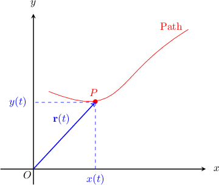

# Calculating Velocity for Plane Motion Using Differentiation

Source: https://www.mathacademy.com/topics/763?courseId=106
Topic ID: 763

## Prerequisites

- [Determining Characteristics of Moving Objects Using Differentiation](../../../ap-courses/lessons/ap-calculus-ab/3581-determining-characteristics-of-moving-objects-using-differentiation.md)
- [Calculating Displacement for Plane Motion](../../../high-school/integrated-math-honors/lessons/integrated-math-iii-honors/3767-calculating-displacement-for-plane-motion.md)
- [Differentiating Vector-Valued Functions](./4139-differentiating-vector-valued-functions.md)

## Lesson

### Introduction

We can find the velocity $v(t)$ of a moving particle moving up and down the $x$-axis by computing the derivative of its position function $x(t).$ This same idea works in $2$ dimensions as well.

In two dimensions, we can represent a particle's position using a vector-valued function

$$

\mathbf{r} = \langle x(t), y(t)\rangle,

$$

which gives the particle's position relative to a fixed origin $O$ at time $t.$

Here, $x(t)$ tells us how the $x$-coordinate of the particle changes with time, and $y(t)$ does the same for the $y$-coordinate. As time progresses, the particle moves along a **path**, and its position vector $\mathbf{r}(t)$ changes with time.

The particle's velocity vector is then given by the derivative of its position vector,

$$

\mathbf{v} = \frac{\text{d}\mathbf{r}}{\text{d}t} = \left\langle \frac{\text{d}x}{\text{d}t},\frac{\text{d}y}{\text{d}t} \right\rangle.

$$

In other words, we differentiate the $x$-coordinate and the $y$-coordinate independently with respect to time. The resulting derivatives are the $x$ and $y$ components of the velocity vector.

### Example: Finding the Velocity Vector of a Particle Moving in Two Dimensions

#### Question

The position vector $\mathbf{r}$ of a particle $P$ relative to a fixed origin $O$ at time $t > 0$ is given by

$$

\mathbf{r} = \langle 3t^3, 2t^2\rangle.

$$

Calculate the velocity vector $\mathbf{v}.$

#### Explanation

The particle's velocity vector is given by the derivative of its position vector:

$$

\begin{aligned}𝐯 & =\frac{d𝐫}{d𝑡} \\ & =⟨\frac{d𝑥}{d𝑡},\,\frac{d𝑦}{d𝑡}⟩ \\ & =⟨\frac{d}{d𝑡}(3𝑡^{3}),\,\frac{d}{d𝑡}(2𝑡^{2})⟩ \\ & =⟨9𝑡^{2},\,4𝑡⟩.\end{aligned}

$$

### Example: Calculating the Velocity Vector of a Particle Moving in Two Dimensions at a Given Time

#### Question

The position vector $\mathbf{r}$ of a particle $P$ (relative to a fixed origin $O$) at time $t > 0$ is given by

$$

\mathbf{r} = \langle 12t, 2t^3\rangle.

$$

Calculate the velocity vector $\mathbf{v}$ at time $t=1.$

#### Explanation

The particle's velocity vector is given by the derivative of its position vector:

$$

\begin{aligned}𝐯 & =\frac{d𝐫}{d𝑡} \\ & =⟨\frac{d𝑥}{d𝑡},\,\frac{d𝑦}{d𝑡}⟩ \\ & =⟨\frac{d}{d𝑡}(12𝑡),\,\frac{d}{d𝑡}(2𝑡^{3})⟩ \\ & =⟨12,6𝑡^{2}⟩\end{aligned}

$$

To find the velocity when $t=1$, we substitute into the above:

$$

\begin{aligned}𝐯(1) & =⟨12,6(1)^{2}⟩ \\ & =⟨12,6⟩\end{aligned}

$$

### The Speed of a Particle

If the velocity of a particle at time $t$ is

$$

\mathbf{v} = \left< u, v \right> = \left< \dfrac{\textrm dx}{\textrm dt}, \, \dfrac{\textrm dy}{\textrm dt} \right>,

$$

then its speed is given by the magnitude $|\mathbf{v}|,$ as follows:

$$

|\mathbf{v}| = \sqrt{ u^2 + v^2} = \sqrt{\left(\frac{\text{d}x}{\text{d}t}\right)^2 + \left(\frac{\text{d}y}{\text{d}t}\right)^2}

$$

### Example: Calculating the Speed of a Particle at a Given Time

#### Question

The position vector $\mathbf{r}$ of a particle $P$ relative to a fixed origin $O$ at time $t > 0$ is given by

$$

\mathbf{r} = \langle 6t^2+2, 2t^3\rangle.

$$

Calculate the speed of the particle at time $t=2.$

#### Explanation

First, we calculate the velocity vector $\mathbf{v}.$ Differentiating the position vector, we get

$$

\begin{aligned}𝐯 & =\frac{d𝐫}{d𝑡} \\ & =⟨\frac{d𝑥}{d𝑡},\frac{d𝑦}{d𝑡}⟩ \\ & =⟨\frac{d}{d𝑡}(6𝑡^{2}+2),\,\frac{d}{d𝑡}(2𝑡^{3})⟩ \\ & =⟨12𝑡,6𝑡^{2}⟩.\end{aligned}

$$

To find the velocity when $t=2$, we substitute into the above:

$$

\begin{aligned}𝐯(2) & =⟨12(2),6(2)^{2}⟩ \\ & =⟨24,24⟩.\end{aligned}

$$

To find the speed at $t=2$ we calculate the magnitude of $\mathbf{v}(2),$ and we get

$$

\begin{aligned}|𝐯(2)| & =\sqrt{24^{2}+24^{2}} \\ & =\sqrt{2(24^{2})} \\ & =24\sqrt{2}.\end{aligned}

$$

So, the speed when $t=2$ is $24\sqrt{2}\approx 33.94$ to two decimal places.

### Times When the Particle is Stationary

A particle is stationary if its velocity is zero. This means that

$$

\begin{aligned}⟨\frac{d𝑥}{d𝑡},\,\frac{d𝑦}{d𝑡}⟩ & =⟨0,0⟩.\end{aligned}

$$

Therefore, to find the times when a particle is stationary, we need to solve $\dfrac{\text{d}x}{\text{d}t} = 0$ and $\dfrac{\text{d}y}{\text{d}t} = 0$ simultaneously.

### Example: Calculating the Times at Which a Particle Is Stationary

#### Question

A particle $P$ moves in the $x$-$y$ plane (relative to a fixed origin $O$) with position vector

$$

\mathbf{r} = \langle t^2-2t, t^3-3t \rangle, \quad t\in[0,\infty).

$$

Calculate the times at which the particle is stationary.

#### Explanation

First, we calculate the velocity vector $\mathbf{v}.$ Differentiating the position vector, we get

$$

\begin{aligned}𝐯 & =\frac{d𝐫}{d𝑡} \\ & =⟨\frac{d𝑥}{d𝑡},\frac{d𝑦}{d𝑡}⟩ \\ & =⟨\frac{d}{d𝑡}(𝑡^{2}−2𝑡),\,\frac{d}{d𝑡}(𝑡^{3}−3𝑡)⟩ \\ & =⟨2𝑡−2,\,3𝑡^{2}−3⟩.\end{aligned}

$$

The particle is stationary when its velocity is zero. This gives,

$$

\begin{aligned}𝐯(𝑡) & =𝟎 \\ ⟨2𝑡−2,3𝑡^{2}−3⟩ & =⟨0,0⟩.\end{aligned}

$$

So we need

$$

\begin{aligned}2𝑡−2 & =0\,⇒\,𝑡=1, \\ 3𝑡^{2}−3 & =0\,⇒\,𝑡=±1.\end{aligned}

$$

Note that $t=-1$ is outside of the domain of $t,$ so we discard it.

The solution $t=1$ is the only solution that satisfies both equations, so this is the only time when the object is stationary.
