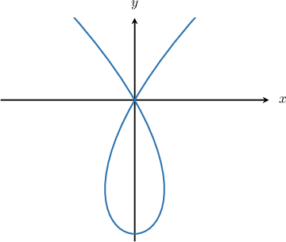
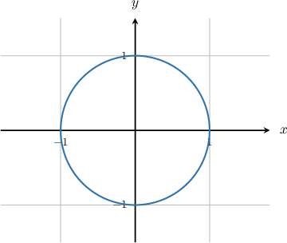

# Differentiating Parametric Curves

Source: https://www.mathacademy.com/topics/798?courseId=106
Topic ID: 798

## Prerequisites

- [Graphing Curves Defined Parametrically](../../../high-school/integrated-math-honors/lessons/integrated-math-iii-honors/803-graphing-curves-defined-parametrically.md)
- [Selecting Procedures for Calculating Derivatives](../../../ap-courses/lessons/ap-calculus-ab/1115-selecting-procedures-for-calculating-derivatives.md)

## Lesson

### Introduction

A curve or function is defined parametrically if $x$ and $y$ are given in terms of a third parameter $t.$ This can often give rise to some interesting shapes.

For example, we can define a curve as

$$

x=t^3-3t, \qquad y=3t^2-9, \qquad -\infty < t <\infty.

$$

If we plot the curve, it looks as follows:

If we're given a parametric curve, how do we calculate $\dfrac{\textrm{d}y}{\textrm{d}x}?$ The answer is to use the chain rule.

The chain rule states that

$$

\frac{\mathrm{d}y}{\mathrm{d}x} = \frac{\mathrm{d}y}{\mathrm{d}t} \cdot \frac{\mathrm{d}t}{\mathrm{d}x}.

$$

We can rearrange this formula into a nicer version, as follows:

$$

\begin{aligned}\frac{d𝑦}{d𝑥} & =\frac{d𝑦}{d𝑡}⋅\frac{d𝑡}{d𝑥} \\ & =\frac{d𝑦}{d𝑡}⋅\frac{1}{d𝑥/d𝑡} \\ & =\frac{d𝑦/d𝑡}{d𝑥/d𝑡} \\ & =\frac{𝑦^{′}(𝑡)}{𝑥^{′}(𝑡)}\end{aligned}

$$

Let's use the above formula to calculate $\dfrac{\mathrm{d}y}{\mathrm{d}x}$ for the given parametric curve

$$

x=t^3-3t, \qquad y=3t^2-9.

$$

Differentiating $x$ and $y,$ we get

$$

x'(t)=3t^2-3, \qquad y'(t)=6t.

$$

Therefore, we have

$$

\begin{aligned}\frac{d𝑦}{d𝑥} & =\frac{𝑦^{′}(𝑡)}{𝑥^{′}(𝑡)} \\ & =\frac{6𝑡}{3𝑡^{2}−3} \\ & =\frac{2𝑡}{𝑡^{2}−1}.\end{aligned}

$$

Since the curve is defined in terms of the parameter $t,$ the derivative is also defined in terms of $t.$

### Example: Finding the Derivative of a Parametric Curve

#### Question

For the parametric curve

$$

x=\cos{t}, \quad y=\sin{t}, \qquad 0\leq t<2\pi,

$$

calculate $\dfrac{\mathrm{d}y}{\mathrm{d}x}.$

#### Explanation

We will use the formula

$$

\frac{\mathrm{d}y}{\mathrm{d}x} = \dfrac{y'(t)}{x'(t)}.

$$

Differentiating $x$ and $y,$ we get

$$

x'(t) = -\sin{t}, \qquad y'(t)=\cos{t}.

$$

Therefore,

$$

\frac{\mathrm{d}y}{\mathrm{d}x} = \dfrac{\cos t}{-\sin t} = -\cot t.

$$

### Example: Calculating the Slope of the Tangent to a Parametric Curve at a Given Point

#### Question

For the parametric curve

$$

x=te^t, \quad y=e^{-t}, \qquad -\infty < t <\infty,

$$

calculate the slope of the tangent to the curve at the point where $t=1.$

#### Explanation

We will use the formula

$$

\frac{\mathrm{d}y}{\mathrm{d}x} = \dfrac{y'(t)}{x'(t)}.

$$

Differentiating $x$ and $y,$ we get

$$

x'(t) = e^t + te^t = (1+t)e^t, \qquad y'(t)=-e^{-t}.

$$

So we have

$$

\begin{aligned}\frac{d𝑦}{d𝑥} & =\frac{−𝑒^{−𝑡}}{(1+𝑡)𝑒^{𝑡}} \\ & =−\frac{1}{(1+𝑡)𝑒^{2𝑡}}.\end{aligned}

$$

Therefore, when $t=1,$ the slope of the tangent to the curve is

$$

\begin{aligned}\frac{d𝑦}{d𝑥}_{𝑡=1} & =−\frac{1}{𝑒^{2(1)}(1+1)} \\ & =−\frac{1}{2𝑒^{2}}.\end{aligned}

$$
