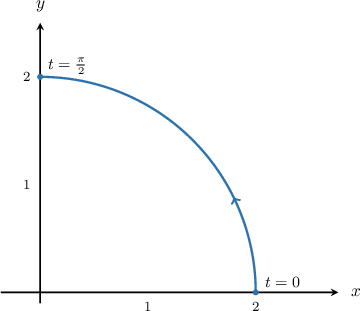
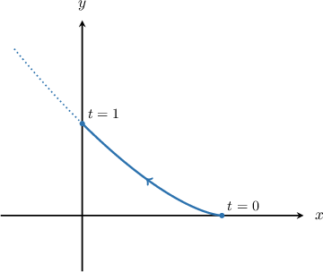
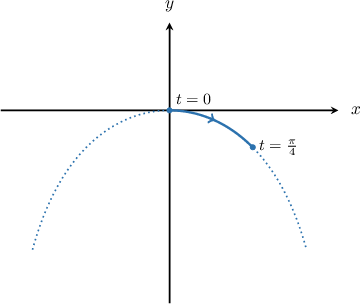
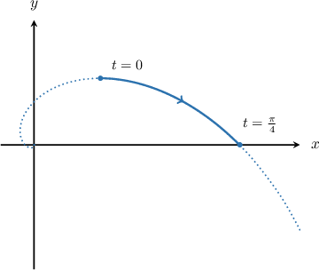
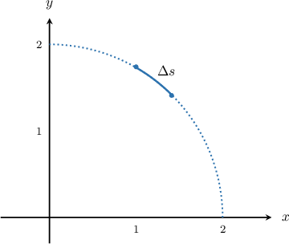
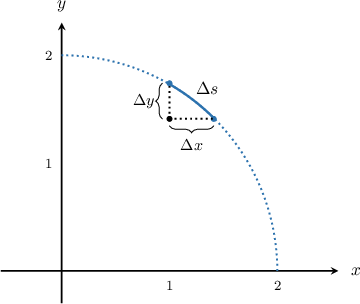

# The Arc Length of a Parametric Curve

Source: https://www.mathacademy.com/topics/997?courseId=106
Topic ID: 997

## Prerequisites

- [The Arc Length of a Planar Curve](./760-the-arc-length-of-a-planar-curve.md)
- [Differentiating Parametric Curves](./798-differentiating-parametric-curves.md)
- [Integration Using the Double-Angle Formulas](./1038-integration-using-the-double-angle-formulas.md)

## Lesson

### Introduction

Suppose we would like to find the arc length of the curve defined parametrically as

$$

x=2\cos{t}, \quad y=2\sin{t}

$$

from $t=0$ to $t=\dfrac{\pi}{2},$ as shown below.

It can be shown that the arc length $L$ of a curve defined parametrically by

$$

x=x(t), \quad y=y(t), \qquad t\in [t_1,t_2],

$$

is given by the formula

$$

L = \int_{t_1}^{t_2} \sqrt{\left(\dfrac{\textrm{d}x}{\textrm{d}t}\right)^2+\left(\dfrac{\textrm{d}y}{\textrm{d}t}\right)^2}\,\textrm{d}t.

$$

The intuition behind this formula is given at the end of this tutorial.

According to the formula, the length of the blue arc is

$$

\begin{aligned}𝐿 & =∫_{𝜋/20}^{}\sqrt{√(\frac{d𝑥}{d𝑡})^{2}+(\frac{d𝑦}{d𝑡})^{2}}\,d𝑡 \\ & =∫_{𝜋/20}^{}\sqrt{√(\frac{d}{d𝑡}(2cos⁡𝑡))^{2}+(\frac{d}{d𝑡}(2sin⁡𝑡))^{2}}\,d𝑡 \\ & =∫_{𝜋/20}^{}\sqrt{√(−2sin⁡𝑡)^{2}+(2cos⁡𝑡)^{2}}\,d𝑡 \\ & =∫_{𝜋/20}^{}\sqrt{√4(sin^{2}⁡𝑡+cos^{2}⁡𝑡)}\,d𝑡 \\ & =∫_{𝜋/20}^{}2\,d𝑡 \\ & =2𝑡_{𝜋/20}^{} \\ & =2(\frac{𝜋}{2}−0) \\ & =𝜋.\end{aligned}

$$

### Example: Finding an Integral Expression For the Arc Length of a Parametric Curve

#### Question

Find an integral expression for the arc length of the curve defined parametrically as

$$

x=1-t, \quad y= \dfrac{2}{3} t^{3/2}, \qquad t\in[0,1].

$$

#### Explanation

To compute the arc length $L$ of a parametrically defined curve, we use the formula

$$

L = \int_{t_1}^{t_2} \sqrt{ \left( \dfrac{\textrm{d}x}{\textrm{d}t}\right)^2 + \left( \dfrac{\textrm{d}y}{\textrm{d}t}\right)^2}\:\textrm{d}t.

$$

Computing the derivatives of $x$ and $y,$ we have

$$

\begin{aligned}\frac{d𝑥}{d𝑡} & =\frac{d}{d𝑡}(1−𝑡)=−1\end{aligned}

$$

and

$$

\begin{aligned}\frac{d𝑦}{d𝑡} & =\frac{d}{d𝑡}(\frac{2}{3}𝑡^{3/2})=𝑡^{1/2}.\end{aligned}

$$

We substitute these derivatives in the formula for arc length, and we get

$$

\begin{aligned}𝐿 & =∫_{𝑡_{2}𝑡_{1}}^{}\sqrt{√(\frac{d𝑥}{d𝑡})^{2}+(\frac{d𝑦}{d𝑡})^{2}}\,d𝑡 \\ & =∫_{10}^{}\sqrt{√(−1)^{2}+(𝑡^{1/2})^{2}}\,d𝑡 \\ & =∫_{10}^{}\sqrt{√1+𝑡}\,d𝑡.\end{aligned}

$$

### Example: Finding an Integral Expression For the Arc Length of a Parametric Curve Containing Special Functions

#### Question

Find the expression that gives the length of the curve defined by the parametric equations $x=t, \, y=\ln{(\cos{t})}$ from $t=0$ to $t=\dfrac{\pi}{4}$ (see graph below).

#### Explanation

To compute the arc length $L$ of a parametrically defined curve, we use the formula

$$

L = \int_{t_1}^{t_2} \sqrt{ \left( \dfrac{\textrm{d}x}{\textrm{d}t}\right)^2 + \left( \dfrac{\textrm{d}y}{\textrm{d}t}\right)^2}\:\textrm{d}t.

$$

Computing the derivatives of $x$ and $y,$ we have

$$

\begin{aligned}\frac{d𝑥}{d𝑡} & =\frac{d}{d𝑡}(𝑡)=1\end{aligned}

$$

and

$$

\begin{aligned}\frac{d𝑦}{d𝑡} & =\frac{d}{d𝑡}(ln⁡(cos⁡𝑡))=−tan⁡𝑡\,.\end{aligned}

$$

We substitute these derivatives in the formula for arc length, and we get

$$

\begin{aligned}𝐿 & =∫_{𝑡_{2}𝑡_{1}}^{}\sqrt{√(\frac{d𝑥}{d𝑡})^{2}+(\frac{d𝑦}{d𝑡})^{2}}\,d𝑡 \\ & =∫_{𝜋/40}^{}\sqrt{√(1)^{2}+(−tan⁡𝑡)^{2}}\,d𝑡 \\ & =∫_{𝜋/40}^{}\sqrt{√1+tan^{2}⁡𝑡}\,d𝑡 \\ & =∫_{𝜋/40}^{}\sqrt{√sec^{2}⁡𝑡}\,d𝑡 \\ & =∫_{𝜋/40}^{}sec⁡𝑡\,d𝑡\,.\end{aligned}

$$

### Example: Finding the Arc Length of a Parametric Curve

#### Question

Find the arc length of the curve defined parametrically as

$$

x=e^t(\cos{t}+\sin{t}), \quad y=e^t(\cos{t}-\sin{t}) , \quad t\in \left[0,\dfrac{\pi}{4}\right].

$$

#### Explanation

Computing the derivatives of $x$ and $y,$ we have

$$

\begin{aligned}\frac{d𝑥}{d𝑡} & =\frac{d}{d𝑡}(𝑒^{𝑡}(cos⁡𝑡+sin⁡𝑡)) \\ & =𝑒^{𝑡}(cos⁡𝑡+sin⁡𝑡)+𝑒^{𝑡}(−sin⁡𝑡+cos⁡𝑡) \\ & =2𝑒^{𝑡}cos⁡𝑡\end{aligned}

$$

and

$$

\begin{aligned}\frac{d𝑦}{d𝑡} & =\frac{d}{d𝑡}(𝑒^{𝑡}(cos⁡𝑡−sin⁡𝑡)) \\ & =𝑒^{𝑡}(cos⁡𝑡−sin⁡𝑡)+𝑒^{𝑡}(−sin⁡𝑡−cos⁡𝑡) \\ & =−2𝑒^{𝑡}sin⁡𝑡.\end{aligned}

$$

We substitute these derivatives in the formula for arc length, and we get

$$

\begin{aligned}𝐿 & =∫_{𝑡_{2}𝑡_{1}}^{}\sqrt{√(\frac{d𝑥}{d𝑡})^{2}+(\frac{d𝑦}{d𝑡})^{2}}\,d𝑡 \\ & =∫_{𝜋/40}^{}\sqrt{√(2𝑒^{𝑡}cos⁡𝑡)^{2}+(−2𝑒^{𝑡}sin⁡𝑡)^{2}}\,d𝑡 \\ & =∫_{𝜋/40}^{}\sqrt{√4𝑒^{2𝑡}(cos^{2}⁡𝑡+sin^{2}⁡𝑡)}\,d𝑡 \\ & =∫_{𝜋/40}^{}2𝑒^{𝑡}\,d𝑡 \\ & =2𝑒^{𝑡}_{𝜋/40}^{} \\ & =2(𝑒^{𝜋/4}−1).\end{aligned}

$$

### The Intuition Behind the Main Formula

Let's go back to our first example, which was to find the arc length of the curve defined by

$$

x=2\cos{t}, \quad y=2\sin{t}, \quad t\in\left[ 0, \dfrac{\pi}{2} \right].

$$

First, we divide the interval $\left[0, \dfrac{\pi}{2} \right]$ into small subintervals of equal length. Consider a part of the blue arc that corresponds to one of those subintervals and let the length of that part be $\Delta{s}$.

We can now denote the horizontal displacement as $\Delta{x}$ and the vertical shift as $\Delta{y}.$

To approximate the length $\Delta{s}$ we apply the Pythagorean theorem, as follows:

$$

\begin{aligned}Δ𝑠 & ≈\sqrt{√(Δ𝑥)^{2}+(Δ𝑦)^{2}}.\end{aligned}

$$

To approximate the total length $L,$ we need to sum up all of the little $\Delta s$ terms, so

$$

L \approx \sum \Delta s = \sum \sqrt{\left( \Delta{x} \right)^2 + \left( \Delta{y} \right)^2}.

$$

We then take the limit as $\Delta x, \Delta y \rightarrow 0.$ As we do this, the sum becomes a definite integral, and our approximation approaches the exact value of $L$. So, using the chain rule, we arrive at

$$

\begin{aligned}𝐿 & =∫\sqrt{√(d𝑥)^{2}+(d𝑦)^{2}} \\ & =∫_{𝑡_{2}𝑡_{1}}^{}\sqrt{√(\frac{d𝑥}{d𝑡}⋅d𝑡)^{2}+(\frac{d𝑦}{d𝑡}⋅d𝑡)^{2}} \\ & =∫_{𝑡_{2}𝑡_{1}}^{}\sqrt{√(\frac{d𝑥}{d𝑡})^{2}⋅(d𝑡)^{2}+(\frac{d𝑦}{d𝑡})^{2}⋅(d𝑡)^{2}} \\ & =∫_{𝑡_{2}𝑡_{1}}^{}\sqrt{√(\frac{d𝑥}{d𝑡})^{2}+(\frac{d𝑦}{d𝑡})^{2}}⋅\sqrt{√d𝑡^{2}} \\ & =∫_{𝑡_{2}𝑡_{1}}^{}\sqrt{√(\frac{d𝑥}{d𝑡})^{2}+(\frac{d𝑦}{d𝑡})^{2}}\,d𝑡.\end{aligned}

$$
