# Phase Lines of First-Order ODEs

Source: https://www.mathacademy.com/topics/2532?courseId=61
Topic ID: 2532

## Prerequisites

- [Analyzing Slope Fields for Autonomous Differential Equations](./3220-analyzing-slope-fields-for-autonomous-differential-equations.md)

## Lesson

### Introduction

The **phase line** of an autonomous differential equation

$$

\dfrac{\text{d}y}{\text{d}x} = f(y)

$$

is a vertical $y$-axis marked with equilibrium values and arrows indicating whether solutions increase or decrease in each interval.

Since the rate of change depends only on $y$ (and not on $x$), we can sketch a one-dimensional diagram that describes how the system behaves in different intervals of $y.$

Let's see a concrete example and construct the phase line for the autonomous differential equation

$$

\dfrac{\text{d}y}{\text{d}x} = (y+1)(y-1).

$$

To draw the phase line of the differential equation, we proceed using the following three steps:

**Step 1**: Find the equilibrium solutions of the differential equation.

In this case, we have

$$

\begin{aligned}(𝑦+1)(𝑦−1) & =0 \\ 𝑦 & =−1,1.\end{aligned}

$$

Therefore, the equilibrium solutions are $y=-1$ and $y=1.$

**Step 2**: Find the intervals of $y$ for which $f(y)>0$ and $f(y) < 0.$

Constructing a sign table, we get the following:

So, we have that $f(y)$ is positive for $y\in (-\infty, -1) \cup (1, \infty),$ and negative for $y\in (-1,1).$

**Step 3**: Draw the phase line using the following recipe:

- Draw a vertical $y$-axis

- Mark the equilibrium solutions

- Draw arrows pointing up in the intervals where $f(y) > 0$

- Draw arrows pointing down in the intervals where $f(y) < 0$

Applying the above recipe, we get the following phase line for our differential equation.

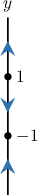

### Example: Identifying the Phase Line That Corresponds to a Differential Equation

#### Question

Find the phase line of the differential equation $\dfrac{\text{d}y}{\text{d}x} = y^2 + 2y.$

#### Explanation

To draw the phase line of the differential equation, we proceed using the following three steps:

****: Find the equilibrium solutions of the differential equation.

In this case, we have

$$

\begin{aligned}𝑦^{2}+2𝑦 & =0 \\ 𝑦(𝑦+2) & =0 \\ 𝑦 & =−2,0.\end{aligned}

$$

Therefore, the equilibrium solutions are $y=-2$ and $y=0.$

****: Find the intervals of $y$ for which $f(y)>0$ and $f(y)< 0.$

Constructing a sign table, we get the following:

So, we have that $f(y)$ is positive for $y\in (-\infty, -2) \cup (0, \infty),$ and negative for $y\in (-2,0).$

****: Draw the phase line using the following recipe:

- Draw a vertical $y$-axis

- Mark the equilibrium solutions

- Draw arrows pointing up in the intervals where $f(y) > 0$

- Draw arrows pointing down in the intervals where $f(y) < 0$

Applying the above recipe, we get the following phase line for our differential equation.

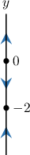

### Analyzing Properties of a Differential Equation Given Its Phase Line

Suppose that we know that the autonomous differential equation

$$

\dfrac{\text{d}y}{\text{d}x} = f(y)

$$

has the following phase line:

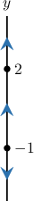

What does this phase line tell us about the function $f(y)$?

We can interpret the key features of the phase line as follows:

- The solid dots are the **equilibrium solutions**, where From the diagram, the equilibrium solutions are $y=-1$ and $y=2$.

- The arrows show the sign of $\dfrac{\text{d}y}{\text{d}x} = f(y)$ on the intervals between the equilibrium solutions: On the interval $(-\infty, -1),$ the arrow points down, so the derivative $f(y)$ is *negative*. On the interval $(-1, 2),$ the arrow points up, so the derivative $f(y)$ is *positive*. On the interval $(2, \infty),$ the arrow points up, so the derivative $f(y)$ is *positive*.

The graph of a *possible* derivative function $f(y)$ looks as follows.

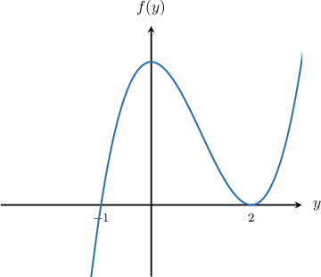

On the next slide, we will see how we can use the given phase line to identify the corresponding differential equation.

### Example: Identifying a Differential Equation Corresponding to a Phase Line

#### Question

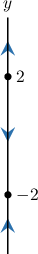

Consider the phase line shown above. Which of the following differential equations could have this phase line?

1. $\dfrac{\text{d}y}{\text{d}x}= y^2 -4$

2. $\dfrac{\text{d}y}{\text{d}x}= 4-y^2$

3. $\dfrac{\text{d}y}{\text{d}x}= (y-2)^2$

#### Explanation

First, notice that all three differential equations are of the form

$$

\dfrac{\textrm d y}{\textrm d x} = f(y).

$$

The phase line gives us the following information:

- The equilibrium solutions are $y=-2$ and $y=2.$

- $f(y)$ is positive for $y \in (-\infty, -2) \cup (2, \infty).$

- $f(y)$ is negative for $y\in (-2,2).$

With this in mind, let's study each of the given equations.

- We start by considering $y'= y^2 -4.$ First, we see that $f(y)=(y+2)(y-2),$ so $f(y)=0$ if $y=-2,2.$ So, the equilibrium solutions correspond to those shown in the phase line. Now, we can construct a sign table for $f(y)$ as follows: $(-\infty,-2)$ $(-2,2)$ $(2,\infty)$ $y+2$ ${\color{red}-}$ ${\color{blue}+}$ ${\color{blue}+}$ $y-2$ ${\color{red}-}$ ${\color{red}-}$ ${\color{blue}+}$ $f(y)$ ${\color{blue}+}$ ${\color{red}-}$ ${\color{blue}+}$ So, we have that $f(y)$ is negative for $y\in (-2,2),$ and $f(y)$ is positive for $y \in (-\infty, -2) \cup (2,\infty).$ This corresponds to the arrows shown on the phase line. Therefore, equation I has the given phase line.

- Next, we consider $y'=4-y^2.$ First, $f(y)=4-y^2,$ so $f(y)=0$ if $y=-2,2.$ So, the equilibrium solutions correspond to those shown in the phase line. However, we note that $f(y) < 0$ for $y\in (-\infty, -2).$ This does ** correspond to the arrows shown on the phase line. Therefore, equation II does not have the given phase line.

- Finally, we consider $y'=(y-2)^2.$ In this case, $f(y)= (y-2)^2,$ and the equilibrium solution is $y=2$ only. Therefore, equation III does not have the given phase line.

Therefore, the correct answer is "I only."

### Example: Identifying Phase Lines From Graphs

#### Question

Consider the differential equation $\dfrac{\text{d}y}{\text{d}x} = f(y),$ where the graph of $f(y)$ is shown below. What is the phase line corresponding to this differential equation?

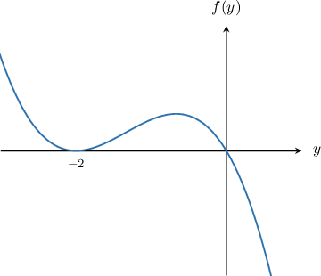

#### Explanation

From the graph of the function $f(y),$ we can deduce the following information:

- The solutions to $f(y) = 0$ are $y = -2$ and $y = 0.$ Therefore $y = -2, 0$ are the equilibrium solutions of the differential equation.

- $f(y) >0$ when $y \in (-\infty,-2) \cup (-2,0).$

- $f(y)< 0$ when $y \in (0, \infty).$

Therefore, we can draw the phase line using the following recipe:

- Draw a vertical $y$-axis

- Mark the equilibrium solutions

- Draw arrows pointing up in the intervals where $f(y) > 0$

- Draw arrows pointing down in the intervals where $f(y) < 0$

Applying the above recipe, we get the following phase line for our differential equation.

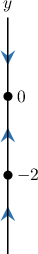

### Connection Between Phase Lines and Slope Fields

Below is the slope field for the autonomous differential equation $\dfrac{\text{d}y}{\text{d}x} = (y+1)(y-1).$

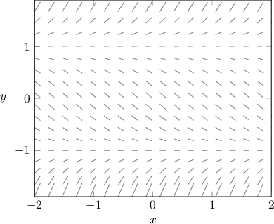

Notice that for autonomous differential equations, the slope marks are invariant horizontally; that is, any two points with the same $y$-coordinate have the same slope.

Therefore, drawing more than one vertical line of slope marks is redundant, since each vertical line is identical.

Instead of drawing the full slope field, we can represent all the necessary information on a single vertical line. This is the **phase line**.

The diagram below shows how the slope field for

$$

\dfrac{\text{d}y}{\text{d}x} = \underbrace{(y+1)(y-1)}_{\large f(y)}

$$

corresponds to its phase line.

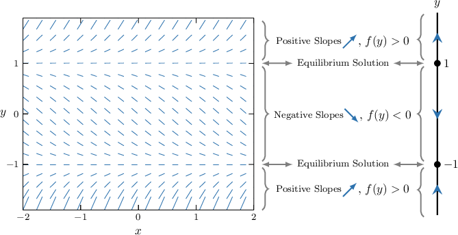

The direction of the arrows on the phase line is determined by the sign of $f(y)$:

- If $f(y) > 0$ on an interval, the slopes are positive ($\dfrac{dy}{dx} > 0$), and solutions $y(x)$ increase. The arrow on the phase line points **up**.

- If $f(y) < 0$ on an interval, the slopes are negative ($\dfrac{dy}{dx} < 0$), and solutions $y(x)$ decrease. The arrow on the phase line points **down**.

### Example: Phase Lines and Slope Fields

#### Question

The slope field of the differential equation $\dfrac{\text{d}y}{\text{d}x}=f(y)$ is shown below. What is the phase line of the given equation?

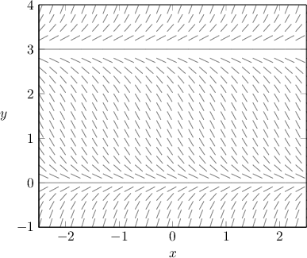

#### Explanation

From the slope field, we can deduce the following:

- $y = 0$ and $y = 3$ are equilibrium solutions.

- For all $y \in (0,3),$ the slopes of the slope field are negative. Therefore, $f(y) < 0$ in this region.

- For all $y \in (-\infty,0) \cup (3,\infty),$ the slopes of the slope field are positive. Therefore, $f(y) > 0$ in this region.

Now, we can draw the phase line using the following recipe:

- Draw a vertical $y$-axis

- Mark the equilibrium solutions

- Draw arrows pointing up in the intervals where $f(y) > 0$

- Draw arrows pointing down in the intervals where $f(y) < 0$

Applying the above recipe, we get the following phase line for our differential equation.

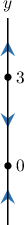
