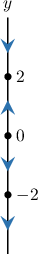
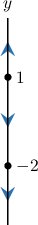
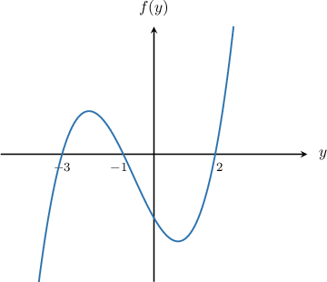
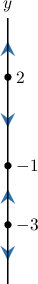
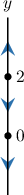
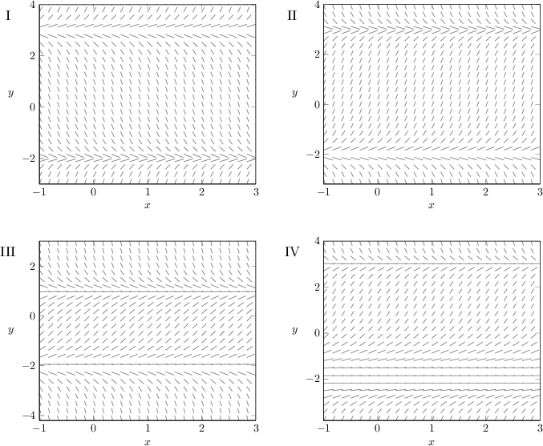
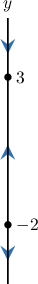
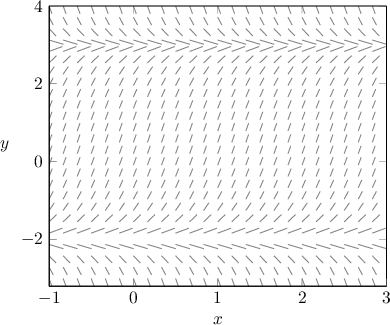

# Classifying Equilibrium Solutions of First-Order ODEs

Source: https://www.mathacademy.com/topics/2533?courseId=61
Topic ID: 2533

## Prerequisites

- [Phase Lines of First-Order ODEs](./2532-phase-lines-of-first-order-odes.md)

## Lesson

### Introduction

There are three types of equilibrium solutions for an *autonomous* differential equation of the form

$$

\dfrac{\mathrm{d}y}{\mathrm{d}x} = f(y),

$$

where the right-hand side doesn't depend explicitly on $x.$ We can classify each using the differential equation's phase line.

Let's see each type, and classify the equilibrium solutions for the differential equation whose phase line is shown below.

- An equilibrium solution is a **sink** if the arrows directly above and below it on the phase line both point *toward* the equilibrium solution. For the phase line above, $y=2$ is a sink.

- An equilibrium solution is a **source** if the arrows directly above and below it on the phase line both point *away* from the equilibrium solution. For the phase line above, $y=0$ is a source.

- An equilibrium solution is a **node** if the arrows directly above and below it on the phase line point in the same direction. For the phase line above, $y=-2$ is a node since the arrows above and below it both point downward.

### Example: Classifying Equilibrium Points Using Phase Lines

#### Question

A particular autonomous differential equation has the phase line shown above. Which of the following statements are true?

1. $y=1$ is a source

2. $y=-2$ is a sink

3. $y=-2$ is a node

#### Explanation

We can classify the equilibrium solutions of an autonomous ODE $y' = f(y)$ by examining its phase line.

- An equilibrium solution is a ** if the arrows directly above and below it on the phase line both point ** the equilibrium solution.

- An equilibrium solution is a ** if the arrows directly above and below it on the phase line both point ** from the equilibrium solution.

- An equilibrium solution is a ** if the arrows directly above and below it on the phase line point in the same direction.

Let's check each statement:

- Statement I is true. Notice that the arrow just above the point $y=1$ points upward, and the arrow just below it points downward. In other words, both arrows point ** from $y=1.$ This means that $y = 1$ is a source.

- Statement II is false, while statement III is true. Notice that the arrow just above the point $y=-2$ points downward, and the arrow just below it points downward too. In other words, both arrows point in the ** direction on either side of $y=-2.$ This means that $y=-2$ is a node.

Therefore, the correct answer is "I and III only".

### Example: Classifying Equilibrium Points Using a Graph

#### Question

Consider the differential equation $\dfrac{\textrm{d}y}{\textrm{d}x}=f(y)$ where the graph of $f(y)$ is shown above. Which of the following statements are true?

1. $y= -3$ is a sink.

2. $y= -1$ is a node.

3. $y= 2$ is a source.

#### Explanation

We can classify the equilibrium solutions of an autonomous ODE $y' = f(y)$ by examining its phase line.

- An equilibrium solution is a ** if the arrows directly above and below it on the phase line both point ** the equilibrium solution.

- An equilibrium solution is a ** if the arrows directly above and below it on the phase line both point ** from the equilibrium solution.

- An equilibrium solution is a ** if the arrows directly above and below it on the phase line point in the same direction.

The phase line that corresponds to the given graph is as follows:

Therefore, we have:

- Statement I is false. From the phase line, we see that $y=-3$ is a source.

- Statement II is false. From the phase line, we see that $y=-1$ is a sink.

- Statement III is true. From the phase line, we see that $y=2$ is a source.

Therefore, the correct answer is "III only".

### Example: Classifying the Equilibrium Points of a Given Differential Equation

#### Question

Which of the following statements is true regarding the equilibrium solutions of $y'= y^3-2y^2?$

1. $y=0$ is a source, and $y=2$ is a node

2. $y=0$ is a node, and $y=2$ is a source

3. $y=0$ is a node, and $y=2$ is a sink

#### Explanation

We can classify the equilibrium solutions of an autonomous ODE $y' = f(y)$ by examining its phase line.

- An equilibrium solution is a ** if the arrows directly above and below it on the phase line both point ** the equilibrium solution.

- An equilibrium solution is a ** if the arrows directly above and below it on the phase line both point ** from the equilibrium solution.

- An equilibrium solution is a ** if the arrows directly above and below it on the phase line point in the same direction.

First, we need to find the equilibrium solutions. So, we solve $f(y)=0\mathbin{:}$

$$

\begin{aligned}𝑓(𝑦) & =0 \\ 𝑦^{3}−2𝑦^{2} & =0 \\ 𝑦^{2}(𝑦−2) & =0 \\ 𝑦 & =0,2\end{aligned}

$$

So, the equilibrium solutions are $y=0$ and $y=2.$

Now, we analyze the sign of $f(y)$ using a sign table, as follows:

We can now draw the phase line for this equation.

Finally, we classify the equilibrium solutions:

- $y=0$ is a node because it is neither a source nor a sink.

- $y=2$ is a source because the nearby solutions diverge away from this point.

Therefore, the correct answer is "$y=0$ is a node, and $y=2$ is a source".

### Example: Identifying Slope Fields Corresponding to Some Equilibrium Point Classifications

#### Question

A particular autonomous differential equation has the following properties:

- $y= -2$ is a source

- $y= 3$ is a sink

Which of the following could be the slope field of the differential equation?

#### Explanation

We can classify the equilibrium solutions of an autonomous ODE $y' = f(y)$ by examining its phase line.

- An equilibrium solution is a ** if the arrows directly above and below it on the phase line both point ** the equilibrium solution.

- An equilibrium solution is a ** if the arrows directly above and below it on the phase line both point ** from the equilibrium solution.

- An equilibrium solution is a ** if the arrows directly above and below it on the phase line point in the same direction.

First, we draw the phase line with the given information.

Note that there are $2$ equilibrium points, $y=-2$ and $y=3.$

- We're given that $y=-2$ is a source. We represent this on the phase line by drawing an upward-pointing arrow just above $y=-2$ and a downward-pointing arrow just below it.

- We're given that $y=3$ is a sink. We represent this on the phase line by drawing a downward-pointing arrow just above $y=3$ and an upward-pointing arrow just below it (already drawn by the above property).

Of the given options, the only slope field that correspond with this phase line is the following:

Note that:

- The slope field is horizontal at $y=-2$ and $y=3.$

- The slopes near $y=-2$ appear to diverge away from this line.

- The slopes near $y=3$ appear to converge toward this line.
