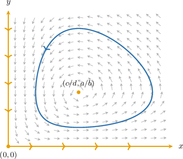
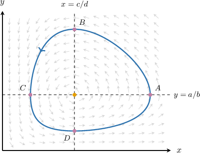
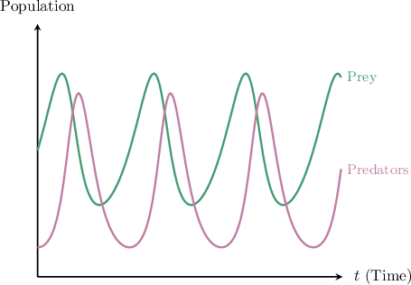
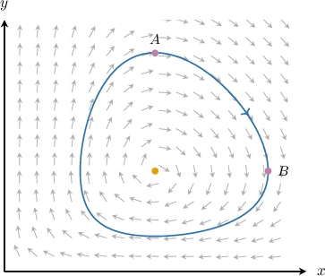

# The Lotka-Volterra Predator-Prey Model

Source: https://www.mathacademy.com/topics/3191?courseId=61
Topic ID: 3191

## Prerequisites

- [Linear Approximations Near Equilibria](./6378-linear-approximations-near-equilibria.md)

## Lesson

### Introduction

The **Lotka–Volterra predator-prey model** describes the interaction between two species (predator and prey) and is given by the nonlinear system of the form

$$

\begin{aligned}𝑥^{′}=𝑎𝑥−𝑏𝑥𝑦 \\ 𝑦^{′}=−𝑐𝑦+𝑑𝑥𝑦\end{aligned}

$$

where $a,b,c,d$ are positive real constants. Here,

- $x=x(t)$ is the *prey population*, and

- $y=y(t)$ is the *predator population*.

Remember that a derivative represents a *rate of change*.

- In the first equation, $x' = ax - bxy,$ the prey changes due to the following: The *intrinsic growth*, which is given by the $ax$ term. If there are no predators ($y=0$), then $x' = ax > 0$ and the prey grows exponentially. The *predation*, which is given by the $-bxy$ term. When prey and predators interact, the term $-bxy$ decreases $x.$

- In the second equation, $y' = -cy + dxy,$ the predators change due to the following: The *intrinsic decay*, which is given by the $-cy$ term. If there is no prey ($x=0$), then $y' = -cy < 0$ and predators decline exponentially. The *feeding/reproduction*, which is given by the $dxy$ term. When prey and predators interact, the term $dxy$ increases $y.$

Let's see a concrete example.

### Example: Identifying and Interpreting the Lotka-Volterra Model

#### Question

$$

\begin{aligned}𝑥^{′}=−8𝑥+2𝑥𝑦 \\ 𝑦^{′}=4𝑦−𝑥𝑦\end{aligned}

$$

Consider the Lotka-Volterra model above for the functions $x(t)$ and $y(t).$ Provide an interpretation of each equation in the model.

#### Explanation

The Lotka-Volterra predator-prey model is given by

$$

\begin{aligned}𝑥^{′}=𝑎𝑥−𝑏𝑥𝑦 \\ 𝑦^{′}=−𝑐𝑦+𝑑𝑥𝑦\end{aligned}

$$

where $a,b,c,d$ are positive real constants.

First, recall that a derivative represents a rate of change.

For the $x'$ equation, we have

$$

x' = -8x + 2xy.

$$

Therefore, $x$ must represent the predator. Indeed,

- it decays exponentially in the absence of prey (the $-8x$ term), and

- increases when interacting with prey (the $2xy$ term).

For the $y'$ equation, we have

$$

y' = 4y - xy.

$$

Therefore, $y$ must represent the prey. Indeed,

- it grows exponentially in the absence of predators (the $4y$ term), and

- decreases when interacting with predators (the $-xy$ term).

### Equilibrium Points

Recall that the equilibrium (fixed) points of a system $\mathbf{x}'(t) = \mathbf{f}(x,y)$ are the points for which $\mathbf{f}(x,y)=\mathbf{0}.$ So, for the Lotka–Volterra model

$$

\begin{aligned}𝑥^{′}=𝑎𝑥−𝑏𝑥𝑦 \\ 𝑦^{′}=−𝑐𝑦+𝑑𝑥𝑦\end{aligned}

$$

the equilibria are the solutions of the following system of equations:

$$

\begin{aligned}𝑎𝑥−𝑏𝑥𝑦=0 \\ −𝑐𝑦+𝑑𝑥𝑦=0\end{aligned}

$$

Solving the first equation, we get

$$

\begin{aligned}𝑎𝑥−𝑏𝑥𝑦 & =0 \\ 𝑥(𝑎−𝑏𝑦) & =0.\end{aligned}

$$

So, $x=0$ or $y=\dfrac{a}{b}.$ We consider both cases separately.

- If $x=0,$ substituting it into the second equation, we have Thus, one equilibrium is $(0,0).$

- If $y=\dfrac{a}{b},$ substituting it into the second equation, we have Thus, another equilibrium is $\left(\dfrac{c}{d},\dfrac{a}{b}\right).$

Therefore, there are two equilibria:

- The *origin* $\boxed{(0,0)}.$

- The *nonzero equilibrium* $\boxed{\left(\dfrac{c}{d},\,\dfrac{a}{b}\right)}.$

### Example: Finding Equilibrium Points of the Lotka-Volterra System

#### Question

$$

\begin{aligned}𝑥^{′}=−4𝑥+7𝑥𝑦 \\ 𝑦^{′}=9𝑦−5𝑥𝑦\end{aligned}

$$

Consider the Lotka-Volterra model above, where $x=x(t)$ represents the predators and $y=y(t)$ represents the prey. Find the nonzero equilibrium of the model.

#### Explanation

The equilibrium (fixed) points of a system $\mathbf{x}'(t) = \mathbf{f}(x,y)$ are the points for which $f(x,y)=\mathbf{0}.$ So, we get the following system of linear equations:

$$

\begin{aligned}−4𝑥+7𝑥𝑦=0 \\ 9𝑦−5𝑥𝑦=0\end{aligned}

$$

Solving the first equation, we get

$$

\begin{aligned}−4𝑥+7𝑥𝑦 & =0 \\ 𝑥(−4+7𝑦) & =0.\end{aligned}

$$

So, $x=0$ or $y=\dfrac{4}{7}.$ We consider both cases separately.

- If $x=0,$ substituting it into the second equation, we have Thus, one equilibrium is $(0,0).$

- If $y=\dfrac{4}{7},$ substituting it into the second equation, we have Thus, another equilibrium is $\left(\dfrac{9}{5}, \dfrac{4}{7}\right).$

Therefore, the nonzero equilibrium of the model is $\left(\dfrac{9}{5}, \dfrac{4}{7} \right).$

### Local Behavior Near the Origin

Consider the Lotka–Volterra predator-prey model

$$

\begin{aligned}𝑥^{′}=𝑎𝑥−𝑏𝑥𝑦 \\ 𝑦^{′}=−𝑐𝑦+𝑑𝑥𝑦\end{aligned}

$$

where $a,b,c,d$ are positive real constants, $x=x(t)$ is the prey population, and $y=y(t)$ is the predator population.

To classify the equilibrium at the origin, we need to find the corresponding Jacobian matrix.

Let's denote $f_1(x,y)=ax-bxy$ and $f_2(x,y)=-cy+dxy.$

Now, we compute the partial derivatives:

$$

\begin{aligned}\frac{𝜕𝑓_{1}}{𝜕𝑥} & =\frac{𝜕}{𝜕𝑥}(𝑎𝑥−𝑏𝑥𝑦)=𝑎−𝑏𝑦,\, & \frac{𝜕𝑓_{1}}{𝜕𝑦} & =\frac{𝜕}{𝜕𝑦}(𝑎𝑥−𝑏𝑥𝑦)=−𝑏𝑥 \\ \frac{𝜕𝑓_{2}}{𝜕𝑥} & =\frac{𝜕}{𝜕𝑥}(−𝑐𝑦+𝑑𝑥𝑦)=𝑑𝑦,\, & \frac{𝜕𝑓_{2}}{𝜕𝑦} & =\frac{𝜕}{𝜕𝑦}(−𝑐𝑦+𝑑𝑥𝑦)=−𝑐+𝑑𝑥\end{aligned}

$$

Thus, the Jacobian matrix is

$$

[\begin{aligned}𝑎−𝑏𝑦 & −𝑏𝑥 \\ 𝑑𝑦 & −𝑐+𝑑𝑥\end{aligned}]

$$

Next, we evaluate the Jacobian at the equilibrium $[\begin{aligned}0 \\ 0\end{aligned}]$ to get

$$

[\begin{aligned}𝑎−𝑏(0) & −𝑏(0) \\ 𝑑(0) & −𝑐+𝑑(0)\end{aligned}]

$$

Since this matrix is diagonal, the eigenvalues are simply the diagonal entries: $\lambda_1 = a$ and $\lambda_2 = -c.$ Because $a,c$ are positive constants, we have $\lambda_1 > 0$ and $\lambda_2 < 0.$ Since the eigenvalues are real with opposite signs, our equilibrium is an *unstable saddle*.

### Local Behavior Near the Nonzero Equilibrium

Next, we evaluate the Jacobian matrix

$$

[\begin{aligned}𝑎−𝑏𝑦 & −𝑏𝑥 \\ 𝑑𝑦 & −𝑐+𝑑𝑥\end{aligned}]

$$

at the nonzero equilibrium $[\begin{aligned}𝑐/𝑑 \\ 𝑎/𝑏\end{aligned}]$ to get

$$

\begin{aligned}𝑎−𝑏(\frac{𝑎}{𝑏}) & −𝑏(\frac{𝑐}{𝑑}) \\ 𝑑(\frac{𝑎}{𝑏}) & −𝑐+𝑑(\frac{𝑐}{𝑑})\end{aligned}

$$

To find the eigenvalues, we write down the characteristic equation:

$$

\begin{aligned}\begin{matrix}−𝜆 & −\frac{𝑏𝑐}{𝑑} \\ \frac{𝑎𝑑}{𝑏} & −𝜆\end{matrix} & =0 \\ (−𝜆)⋅(−𝜆)−(−\frac{𝑏𝑐}{𝑑})⋅\frac{𝑎𝑑}{𝑏} & =0 \\ 𝜆^{2}+𝑎𝑐 & =0\end{aligned}

$$

Solving the equation, we get the eigenvalues

$$

\lambda_{1,2} = \pm \sqrt{ac}\,\text{i}.

$$

Since the eigenvalues are purely imaginary, our equilibrium is a *stable center*.

**Note:** For the Lotka-Volterra model, it is safe to classify the nonzero equilibrium as a center when the linearization has purely imaginary eigenvalues. However, we will not go into detail on why in this lesson.

Just keep in mind that for a general nonlinear system, the Jacobian test alone would be inconclusive in this case (additional analysis is required to determine whether the equilibrium is a true center or a spiral sink/source).

Therefore, a typical phase portrait of the system looks as shown below.

The global picture in the first quadrant is the following:

- There are two straight-line types of solutions which intersect at the saddle point $(0,0){:}$ Along the $x$-axis, trajectories approach infinity (unstable line). Indeed, in the absence of the predators, the prey increases exponentially. Along the $y$-axis, trajectories approach the origin (stable line). Indeed, in the absence of the prey, the predators decrease exponentially.

- The curved trajectories circle around the nonzero equilibrium point $\left(\dfrac{c}{d},\dfrac{a}{b}\right).$

### Example: Classifying Equilibria of the Lotka-Volterra Model

#### Question

Consider the Lotka-Volterra model above, where $x=x(t)$ represents the predators and $y=y(t)$ represents the prey.

$$

\begin{aligned}𝑥^{′}=−0.4𝑥+0.4𝑥𝑦 \\ 𝑦^{′}=𝑦−4𝑥𝑦\end{aligned}

$$

Evaluate the Jacobian of the system at the equilibrium point $\mathbf{x^\ast}=[0.25, \, 1]^T,$ and classify this equilibrium point.

#### Explanation

Let's denote $f_1(x,y)=-0.4x+0.4xy$ and $f_2(x,y)=y-4xy.$

Now, we compute the partial derivatives:

$$

\begin{aligned}\frac{𝜕𝑓_{1}}{𝜕𝑥} & =\frac{𝜕}{𝜕𝑥}(−0.4𝑥+0.4𝑥𝑦)=−0.4+0.4𝑦,\, & \frac{𝜕𝑓_{1}}{𝜕𝑦} & =\frac{𝜕}{𝜕𝑦}(−0.4𝑥+0.4𝑥𝑦)=0.4𝑥 \\ \frac{𝜕𝑓_{2}}{𝜕𝑥} & =\frac{𝜕}{𝜕𝑥}(𝑦−4𝑥𝑦)=−4𝑦,\, & \frac{𝜕𝑓_{2}}{𝜕𝑦} & =\frac{𝜕}{𝜕𝑦}(𝑦−4𝑥𝑦)=1−4𝑥\end{aligned}

$$

Thus, the Jacobian matrix is

$$

[\begin{aligned}−0.4+0.4𝑦 & 0.4𝑥 \\ −4𝑦 & 1−4𝑥\end{aligned}]

$$

Next, we evaluate the Jacobian at the equilibrium $[\begin{aligned}0.25 \\ 1\end{aligned}]$ to get

$$

[\begin{aligned}−0.4+0.4(1) & 0.4(0.25) \\ −4(1) & 1−4(0.25)\end{aligned}]

$$

To find the eigenvalues of the Jacobian matrix, we write down the characteristic equation:

$$

\begin{aligned}\begin{matrix}−𝜆 & 0.1 \\ −4 & −𝜆\end{matrix} & =0 \\ (−𝜆)(−𝜆)−(−4)⋅0.1 & =0 \\ 𝜆^{2}+0.4 & =0\end{aligned}

$$

Solving the equation, we get the eigenvalues $\lambda_{1,2} = \pm 0.2\sqrt{10}\,\text{i}.$ Since the eigenvalues are purely imaginary, our equilibrium is a stable center.

**** For the Lotka-Volterra model (as in this problem), it is safe to classify the nonzero equilibrium as a center when the linearization has purely imaginary eigenvalues.

**** In contrast, for a general nonlinear system, the Jacobian test alone is inconclusive (additional analysis is required to determine whether the equilibrium is a true center or a spiral sink/source).

### Population Dynamics Graph

Let's now consider a typical curved trajectory in more detail.

It can be split into four parts by the lines $x=\dfrac{c}{d}$ and $y=\dfrac{a}{b}$ passing through the nonzero equilibrium:

- From $A$ to $B,$ the number of prey *decreases* and the number of predators *increases*.

- From $B$ to $C,$ the number of prey *decreases* and the number of predators *decreases*.

- From $C$ to $D,$ the number of prey *increases* and the number of predators *decreases*.

- From $D$ to $A,$ the number of prey *increases* and the number of predators *increases*.

The corresponding population dynamics graphs look as depicted below.

### Example: Analyzing a Solution of the Lotka-Volterra Model Given the Phase Portrait

#### Question

Consider the phase portrait above showing a solution of a Lotka-Volterra predator-prey model

$$

\begin{aligned}𝑥^{′}=−10𝑥+5𝑥𝑦 \\ 𝑦^{′}=21𝑦−7𝑥𝑦\end{aligned}

$$

where $x=x(t), y=y(t),$ and $a,b,c,$ and $d$ are positive constants.

Describe the trajectory and the dynamics of the system from point $A$ to point $B$ on the solution.

#### Explanation

The Lotka-Volterra predator-prey model is given by

$$

\begin{aligned}𝑥^{′}=−𝑎𝑥+𝑏𝑥𝑦 \\ 𝑦^{′}=𝑐𝑦−𝑑𝑥𝑦\end{aligned}

$$

where $a,b,c,d$ are positive real constants. Here, $x=x(t)$ represents the predators and $y=y(t)$ represents the prey.

With that in mind, let's describe the system:

- The trajectory circles around the nonzero equilibrium.

- From $A$ to $B,$ the number of prey decreases and the number of predators increases.
