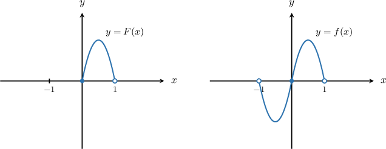

# Fourier Sine Series

Source: https://www.mathacademy.com/topics/3196?courseId=61
Topic ID: 3196

## Prerequisites

- [Applying the Integration By Parts Twice](../../../ap-courses/lessons/ap-calculus-bc/416-applying-the-integration-by-parts-twice.md)
- [Properties of Fourier Series](./6709-properties-of-fourier-series.md)

## Lesson

### Introduction

In the earlier topics, we saw that *symmetry* can force many Fourier coefficients to be zero automatically. In particular, if a $2\pi$-periodic function is *odd*, then its Fourier series has *sine terms only*.

A **Fourier sine series** uses this idea when a function is initially given only on the half-interval, say, $[0,\pi),$ but we want a full Fourier series on $[-\pi,\pi)$ (and then a $2\pi$-periodic extension to all real $x$).

To do this, we start with a function $F(x)$ on $[0,\pi)$ and define its **odd extension** $f(x)$ to $(-\pi,\pi)$ by

$$

\begin{aligned}𝐹(𝑥), & 𝑥∈[0,𝜋), \\ −𝐹(−𝑥), & 𝑥∈(−𝜋,0).\end{aligned}

$$

For example, a function $F(x),$ defined on $x \in [0,1),$ and its odd extension $f(x)$ to $x \in (-1,1)$ are shown below.

By construction, $f$ is an *odd* function, meaning $f(-x)=-f(x)$. Because $f$ is odd, its Fourier series on $[-\pi,\pi)$ has *sine terms only*:

$$

f(x)\sim \sum_{n=1}^{\infty} b_n\sin(nx)

$$

Since $f(x)$ is odd and $\sin(nx)$ is odd for any $n \geq 1,$ then $f(x)\sin(nx)$ must be even. So, the sine coefficients can be computed using the *half-range formula*:

$$

\begin{aligned}𝑏_{𝑛} & =\frac{1}{𝜋}∫_{𝜋−𝜋}𝑓(𝑥)sin⁡(𝑛𝑥)\,d𝑥 \\ & =\frac{1}{𝜋}⋅2∫_{𝜋0}𝑓(𝑥)sin⁡(𝑛𝑥)\,d𝑥 \\ & =\frac{2}{𝜋}∫_{𝜋0}𝑓(𝑥)sin⁡(𝑛𝑥)\,d𝑥\end{aligned}

$$

So in practice, the workflow is the following:

1. Start with $F$ on $[0,\pi)$ and form the odd extension $f$ on $(-\pi,\pi).$

2. Compute $b_n$ from the half-range integral on $[0,\pi).$

3. Write the Fourier sine series of $f.$

Let's see some concrete examples.

### Example: Understanding the Odd Extension of a Function

#### Question

Let $F(x)=x^2+10x$ for $x\in[0,6),$ and let $f(x)$ be the **** extension of $F(x)$ to $x \in (-6,6).$ What is the value of $f(-1)?$

#### Explanation

If $F(x)$ is defined on $x\in[0,6),$ the odd extension of $F$ is the function $f$ such that

$$

\begin{aligned}𝐹(𝑥), & 𝑥∈[0,6), \\ −𝐹(−𝑥), & 𝑥∈(−6,0).\end{aligned}

$$

In our case, for $x\in(-6,0),$ we get

$$

\begin{aligned}𝑓(𝑥) & =−𝐹(−𝑥) \\ & =−((−𝑥)^{2}+10(−𝑥)) \\ & =−(𝑥^{2}−10𝑥) \\ & =−𝑥^{2}+10𝑥.\end{aligned}

$$

Therefore, we have

$$

\begin{aligned}𝑓(−1) & =−(−1)^{2}+10(−1)=−11.\end{aligned}

$$

### Example: Computing the Sine Coefficients From the Half-Range Formula

#### Question

Let $F(x)=4x$ for $x\in[0,\pi).$ Find the missing parts in the Fourier sine series of the **** $2\pi$-periodic extension $f(x)$ of the function $F(x)$ below.

$$

𝐴𝐴𝐴𝐴𝐴_{𝐴𝐴}

$$

#### Explanation

For our Fourier sine series, the coefficients are given by

$$

b_n=\frac{2}{\pi}\int_0^\pi f(x)\sin(nx)\,\text{d}x.

$$

In our case, $f(x)=4x$ for $x \in (0,\pi).$ So, substituting into the formula, we get

$$

b_n = \dfrac{8}{\pi}\int_0^\pi x \sin(nx)\,\text{d}x.

$$

We use the integration by parts:

$$

\begin{aligned}𝑢=𝑥\, & ⇒\,𝑢^{′}=1 \\ 𝑣^{′}=sin⁡(𝑛𝑥)\, & ⇒\,𝑣=−\frac{1}{𝑛}cos⁡(𝑛𝑥)\end{aligned}

$$

Thus, we obtain

$$

\begin{aligned}𝑏_{𝑛} & =\frac{8}{𝜋}(𝑢𝑣\,_{𝜋0}−∫_{𝜋0}𝑣𝑢^{′}\,d𝑥) \\ & =\frac{8}{𝜋}(−\frac{1}{𝑛}[𝑥cos⁡(𝑛𝑥)]_{𝜋0}+\frac{1}{𝑛}∫_{𝜋0}cos⁡(𝑛𝑥)\,d𝑥) \\ & =−\frac{8}{𝑛𝜋}((𝜋⋅cos⁡(𝑛𝜋)−0⋅cos⁡(0))−\frac{1}{𝑛}[sin⁡(𝑛𝑥)]_{𝜋0}) \\ & =−\frac{8}{𝑛𝜋}(𝜋cos⁡(𝑛𝜋)−\frac{1}{𝑛}(sin⁡(𝑛𝜋)−sin⁡(0))) \\ & =−\frac{8cos⁡(𝑛𝜋)}{𝑛}.\end{aligned}

$$

Therefore, since $\cos(n\pi)=(-1)^n,$ we have

$$

b_n = -\dfrac{8(-1)^n}{n}=\dfrac{8(-1)^{n+1}}{n}.

$$

Finally, the Fourier sine series is

$$

f(x) \sim \sum_{n=1}^\infty \dfrac{8(-1)^{n+1}}{n} \cdot \sin(nx).

$$
