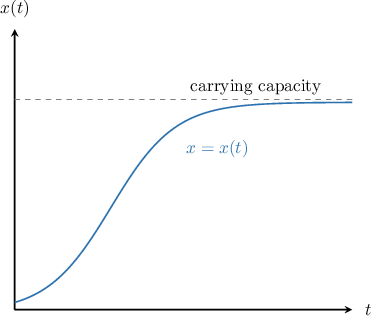
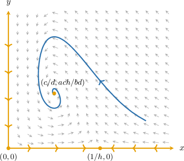
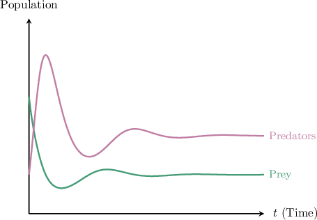
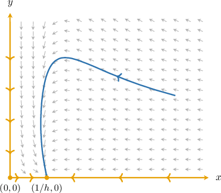
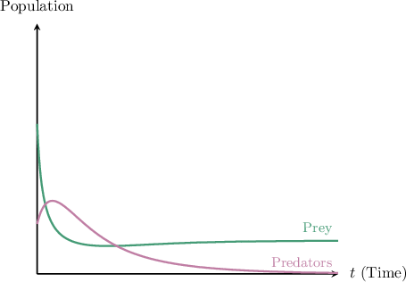

# The Lotka-Volterra Model With Carrying Capacity

Source: https://www.mathacademy.com/topics/3231?courseId=61
Topic ID: 3231

## Prerequisites

- [The Lotka-Volterra Predator-Prey Model](./3191-the-lotka-volterra-predator-prey-model.md)
- [Qualitative Analysis of the Logistic Growth Equation](./3551-qualitative-analysis-of-the-logistic-growth-equation.md)

## Lesson

### Introduction

The Lotka–Volterra predator-prey model with **carrying capacity** is given by

$$

\begin{aligned}𝑥^{′}=𝑎𝑥(1−ℎ𝑥)−𝑏𝑥𝑦 \\ 𝑦^{′}=−𝑐𝑦+𝑑𝑥𝑦\end{aligned}

$$

where $a,b,c,d,h$ are positive real constants. Here,

- $x=x(t)$ is the *prey population*, and

- $y=y(t)$ is the *predator population*.

The only difference from the Lotka–Volterra model is the factor $(1-hx)$ in the prey equation. Notice that if $h=0,$ we get the standard model:

$$

\begin{aligned}𝑥^{′}=𝑎𝑥−𝑏𝑥𝑦 \\ 𝑦^{′}=−𝑐𝑦+𝑑𝑥𝑦\end{aligned}

$$

In our modified version of the model, the *intrinsic growth* of prey is given by the $ax(1-hx)$ term. Now, if there are no predators ($y=0$), then

$$

x' = ax(1-hx).

$$

Recall that general solutions to this equation are logistic functions with two horizontal asymptotes defined by the equilibrium solutions, which can be found by solving the following equation:

$$

\begin{aligned}𝑎𝑥(1−ℎ𝑥)=0\,⇒\,𝑥=0,\,\frac{1}{ℎ}\end{aligned}

$$

So, the equilibria are $x=0$ and $x=\dfrac{1}{h}.$ The nonzero equilibrium gives the *carrying capacity* (the limit the number of prey is approaching as $t$ goes to infinity).

### Example: Determining the Carrying Capacity for the Prey

#### Question

$$

\begin{aligned}𝑥^{′}=6𝑥(1−0.1𝑥)−3𝑥𝑦 \\ 𝑦^{′}=−7𝑦+5𝑥𝑦\end{aligned}

$$

Consider the modified Lotka-Volterra model, where $x=x(t)$ represents the prey and $y=y(t)$ represents the predators. Find the maximum carrying capacity for the prey in the case of the complete absence of predators.

#### Explanation

The Lotka-Volterra predator-prey model with carrying capacity is given by

$$

\begin{aligned}𝑥^{′}=𝑎𝑥(1−ℎ𝑥)−𝑏𝑥𝑦 \\ 𝑦^{′}=−𝑐𝑦+𝑑𝑥𝑦\end{aligned}

$$

where $a,b,c,d,h$ are positive real constants. Here, $x=x(t)$ represents the prey and $y=y(t)$ represents the predators.

In our case, the equation describing the dynamics of the prey is given by

$$

x' = 6x(1-0.1x) - 3xy

$$

where

- the $6x(1-0.1x)$ term defines the growth, and

- the $-3xy$ term defines the decay due to interaction with predators.

In the case of the complete absence of predators, we have $y = 0,$ and this equation becomes

$$

x' = 6x(1-0.1x).

$$

General solutions to this equation are logistic functions with two horizontal asymptotes defined by the equilibrium solutions, which can be found by solving the following equation:

$$

\begin{aligned}6𝑥(1−0.1𝑥)=0\,⇒\,𝑥=0,\,10\end{aligned}

$$

So, the equilibria are $x=0$ and $x=10.$ The nonzero equilibrium gives the maximum capacity.

Therefore, the maximum carrying capacity for the prey in the case of the complete absence of predators is $10.$

### Equilibrium Points

Recall that the equilibrium (fixed) points of a system $\mathbf{x}'(t) = \mathbf{f}(x,y)$ are the points for which $f(x,y)=\mathbf{0}.$ So, for the Lotka–Volterra model

$$

\begin{aligned}𝑥^{′}=𝑎𝑥(1−ℎ𝑥)−𝑏𝑥𝑦 \\ 𝑦^{′}=−𝑐𝑦+𝑑𝑥𝑦\end{aligned}

$$

the equilibria are the solutions of the following system of equations:

$$

\begin{aligned}𝑎𝑥(1−ℎ𝑥)−𝑏𝑥𝑦=0 \\ −𝑐𝑦+𝑑𝑥𝑦=0\end{aligned}

$$

Factoring the second equation, we get

$$

\begin{aligned}−𝑐𝑦+𝑑𝑥𝑦 & =0 \\ 𝑦(−𝑐+𝑑𝑥) & =0.\end{aligned}

$$

So, $y=0$ or $x=\dfrac{c}{d}.$ We consider both cases separately.

- If $y=0,$ substituting it into the first equation, we have Thus, the first two equilibria are $(0,0)$ and $\left(\dfrac{1}{h},0\right).$

- If $x=\dfrac{c}{d},$ substituting it into the first equation, we have Thus, another equilibrium is $\left(\dfrac{c}{d}, \dfrac{a}{b}\left(1-\dfrac{c}{d}h\right)\right).$

Therefore, the equilibria of the model are

$$

(0,0), \qquad \left(\dfrac{1}{h},0\right), \qquad \left(\dfrac{c}{d}, \dfrac{a}{b}\left(1-\dfrac{c}{d}h\right)\right).

$$

### Example: Finding Equilibrium Points of the Modified Lotka-Volterra System

#### Question

$$

\begin{aligned}𝑥^{′}=5𝑥(1−0.2𝑥)−4𝑥𝑦 \\ 𝑦^{′}=−6𝑦+3𝑥𝑦\end{aligned}

$$

Consider the Lotka-Volterra model with carrying capacity above, where $x=x(t)$ represents the prey and $y=y(t)$ represents the predators. Find the equilibria of the model.

#### Explanation

The equilibrium (fixed) points of a system $\mathbf{x}'(t) = \mathbf{f}(x,y)$ are the points for which $f(x,y)=\mathbf{0}.$ So, we get the following system of linear equations:

$$

\begin{aligned}5𝑥(1−0.2𝑥)−4𝑥𝑦=0 \\ −6𝑦+3𝑥𝑦=0\end{aligned}

$$

Factoring the second equation, we get

$$

\begin{aligned}−6𝑦+3𝑥𝑦 & =0 \\ 𝑦(−6+3𝑥) & =0.\end{aligned}

$$

So, $y=0$ or $x=2.$ We consider both cases separately.

- If $y=0,$ substituting it into the first equation, we have Thus, the first two equilibria are $(0,0)$ and $(5,0).$

- If $x=2,$ substituting it into the first equation, we have Thus, another equilibrium is $(2, 0.75).$

Therefore, the equilibria of the model are

$$

(0,0), \qquad (5, 0), \qquad (2, 0.75).

$$

### Local Behavior Near the Origin

Consider the modified Lotka–Volterra predator-prey model with carrying capacity

$$

\begin{aligned}𝑥^{′}=𝑎𝑥(1−ℎ𝑥)−𝑏𝑥𝑦 \\ 𝑦^{′}=−𝑐𝑦+𝑑𝑥𝑦\end{aligned}

$$

where $a,b,c,d,h$ are positive real constants, $x=x(t)$ is the prey population, and $y=y(t)$ is the predator population.

To classify the equilibrium at the origin, we need to find the corresponding Jacobian matrix.

Let's denote $f_1(x,y)=ax(1-hx)-bxy$ and $f_2(x,y)=-cy+dxy.$

Now, we compute the partial derivatives:

$$

\begin{aligned}\frac{𝜕𝑓_{1}}{𝜕𝑥} & =\frac{𝜕}{𝜕𝑥}(𝑎𝑥(1\,−\,ℎ𝑥)−𝑏𝑥𝑦)=𝑎(1\,−\,2ℎ𝑥)−𝑏𝑦, & \frac{𝜕𝑓_{1}}{𝜕𝑦} & =\frac{𝜕}{𝜕𝑦}(𝑎𝑥(1\,−\,ℎ𝑥)−𝑏𝑥𝑦)=−𝑏𝑥, \\ \frac{𝜕𝑓_{2}}{𝜕𝑥} & =\frac{𝜕}{𝜕𝑥}(−𝑐𝑦+𝑑𝑥𝑦)=𝑑𝑦, & \frac{𝜕𝑓_{2}}{𝜕𝑦} & =\frac{𝜕}{𝜕𝑦}(−𝑐𝑦+𝑑𝑥𝑦)=−𝑐+𝑑𝑥.\end{aligned}

$$

Thus, the Jacobian matrix is

$$

[\begin{aligned}𝑎(1−2ℎ𝑥)−𝑏𝑦 & −𝑏𝑥 \\ 𝑑𝑦 & −𝑐+𝑑𝑥\end{aligned}]

$$

Next, we evaluate the Jacobian at the equilibrium $[\begin{aligned}0 \\ 0\end{aligned}]$ to get

$$

[\begin{aligned}𝑎(1−2ℎ(0))−𝑏(0) & −𝑏(0) \\ 𝑑(0) & −𝑐+𝑑(0)\end{aligned}]

$$

The eigenvalues of the Jacobian matrix are $\lambda_1 = a > 0$ and $\lambda_2 = -c < 0.$ Since eigenvalues are real with opposite signs, our equilibrium is an *unstable saddle*.

Thus, the equilibrium at the origin for this model behaves identically to that of the standard Lotka–Volterra model.

### Local Behavior Near the Nonzero Equilibria

Recall that the system

$$

\begin{aligned}𝑥^{′}=𝑎𝑥(1−ℎ𝑥)−𝑏𝑥𝑦 \\ 𝑦^{′}=−𝑐𝑦+𝑑𝑥𝑦\end{aligned}

$$

has equilibria at

$$

(0,0), \qquad \left(\dfrac{1}{h}, 0\right), \qquad \left(\dfrac{c}{d}, \dfrac{a}{b}\left(1 - \dfrac{c}{d}h\right)\right).

$$

Notice that the second component of the third equilibrium point is positive only when

$$

h < \dfrac{d}{c},

$$

which guarantees that the third fixed point will lie in the first quadrant. For now, let's consider only this case.

We now evaluate the Jacobian matrix

$$

[\begin{aligned}𝑎(1−2ℎ𝑥)−𝑏𝑦 & −𝑏𝑥 \\ 𝑑𝑦 & −𝑐+𝑑𝑥\end{aligned}]

$$

at the nonzero equilibrium $[\begin{aligned}1/ℎ \\ 0\end{aligned}]$ to get

$$

\begin{aligned}𝑎(1−2ℎ(\frac{1}{ℎ}))−𝑏(0) & −𝑏(\frac{1}{ℎ}) \\ 𝑑(0) & −𝑐+𝑑(\frac{1}{ℎ})\end{aligned}

$$

Because we are considering the case when $h < \dfrac{d}{c},$ we have that

$$

\dfrac{c}{h}\left(\dfrac{d}{c}-h\right) > 0.

$$

The eigenvalues of the Jacobian matrix are $\lambda_1 = -a < 0$ and $\lambda_2 = \dfrac{c}{h}\left(\dfrac{d}{c}-h\right) > 0.$ Since eigenvalues are real with opposite signs, our equilibrium is an *unstable saddle*.

Analyzing the type of the third equilibrium in full generality becomes considerably more cumbersome. Therefore, we'll examine a concrete example later in the lesson. For now, we simply note that the third equilibrium is an *asymptotically stable (spiral) sink*.

A typical phase portrait of the system, in the case when $h < \dfrac{d}{c},$ looks as shown below.

The global picture is the following:

- There are two straight-line types of solutions: Along the $x$-axis, trajectories approach the equilibrium at $\left(\dfrac{1}{h},0\right).$ Indeed, in the absence of the predators, the prey approaches the carrying capacity. Along the $y$-axis, trajectories approach the origin. Indeed, in the absence of the prey, the predators decrease exponentially.

- The curved trajectories converge to the equilibrium point $\left(\dfrac{c}{d}, \dfrac{a}{b}\left(1 - \dfrac{c}{d}h\right)\right).$

The corresponding population dynamics graphs look as depicted below.

### A Worked Example for the Equilibrium on the x-Axis

Consider the Lotka-Volterra model with carrying capacity below, where $x=x(t)$ represents the prey and $y=y(t)$ represents the predators.

$$

\begin{aligned}𝑥^{′}=4𝑥(1−0.25𝑥)−𝑥𝑦 \\ 𝑦^{′}=−2𝑦+3𝑥𝑦\end{aligned}

$$

We'll evaluate its Jacobian at the equilibrium point $\mathbf{x^\ast}=[4, \, 0]^T$ that lies on the $x$-axis.

Let's denote $f_1(x,y)=4x(1-0.25x)-xy$ and $f_2(x,y)=-2y+3xy.$

Now, we compute the partial derivatives:

$$

\begin{aligned}\frac{𝜕𝑓_{1}}{𝜕𝑥} & =\frac{𝜕}{𝜕𝑥}(4𝑥(1−0.25𝑥)−𝑥𝑦)=4−2𝑥−𝑦,\, & \frac{𝜕𝑓_{1}}{𝜕𝑦} & =\frac{𝜕}{𝜕𝑦}(4𝑥(1−0.25𝑥)−𝑥𝑦)=−𝑥 \\ \frac{𝜕𝑓_{2}}{𝜕𝑥} & =\frac{𝜕}{𝜕𝑥}(−2𝑦+3𝑥𝑦)=3𝑦,\, & \frac{𝜕𝑓_{2}}{𝜕𝑦} & =\frac{𝜕}{𝜕𝑦}(−2𝑦+3𝑥𝑦)=−2+3𝑥\end{aligned}

$$

Thus, the Jacobian matrix is

$$

[\begin{aligned}4−2𝑥−𝑦 & −𝑥 \\ 3𝑦 & −2+3𝑥\end{aligned}]

$$

Next, we evaluate the Jacobian at the equilibrium $[\begin{aligned}4 \\ 0\end{aligned}]$ to get

$$

[\begin{aligned}4−2(4)−0 & −4 \\ 3(0) & −2+3(4)\end{aligned}]

$$

The eigenvalues of the Jacobian matrix are $\lambda_1 = 10$ and $\lambda_2=-4$. Since the eigenvalues are real with opposite signs, our equilibrium is an *unstable saddle*.

Let's now see an example with the equilibrium that lies in the first quadrant (the third equilibrium).

### Example: Classifying Equilibria of the Modified Lotka-Volterra Model: Stable Case

#### Question

Consider the Lotka-Volterra model with carrying capacity below, where $x=x(t)$ represents the prey and $y=y(t)$ represents the predators.

$$

\begin{aligned}𝑥^{′}=5𝑥(1−𝑥)−𝑥𝑦 \\ 𝑦^{′}=−𝑦+2𝑥𝑦\end{aligned}

$$

Evaluate the Jacobian of the system at the equilibrium point $\mathbf{x^\ast}=[0.5, \, 2.5]^T,$ and classify this equilibrium point.

#### Explanation

Let's denote $f_1(x,y)=5x(1-x)-xy$ and $f_2(x,y)=-y+2xy.$

Now, we compute the partial derivatives:

$$

\begin{aligned}\frac{𝜕𝑓_{1}}{𝜕𝑥} & =\frac{𝜕}{𝜕𝑥}(5𝑥(1−𝑥)−𝑥𝑦)=5−10𝑥−𝑦,\, & \frac{𝜕𝑓_{1}}{𝜕𝑦} & =\frac{𝜕}{𝜕𝑦}(5𝑥(1−𝑥)−𝑥𝑦)=−𝑥 \\ \frac{𝜕𝑓_{2}}{𝜕𝑥} & =\frac{𝜕}{𝜕𝑥}(−𝑦+2𝑥𝑦)=2𝑦,\, & \frac{𝜕𝑓_{2}}{𝜕𝑦} & =\frac{𝜕}{𝜕𝑦}(−𝑦+2𝑥𝑦)=−1+2𝑥\end{aligned}

$$

Thus, the Jacobian matrix is

$$

[\begin{aligned}5−10𝑥−𝑦 & −𝑥 \\ 2𝑦 & −1+2𝑥\end{aligned}]

$$

Next, we evaluate the Jacobian at the equilibrium $[\begin{aligned}0.5 \\ 2.5\end{aligned}]$ to get

$$

[\begin{aligned}5−10(0.5)−2.5 & −0.5 \\ 2(2.5) & −1+2(0.5)\end{aligned}]

$$

To find the eigenvalues of the Jacobian matrix, we write down the characteristic equation:

$$

\begin{aligned}\begin{matrix}−2.5−𝜆 & −0.5 \\ 5 & −𝜆\end{matrix} & =0 \\ (−2.5−𝜆)(−𝜆)−5(−0.5) & =0 \\ 𝜆(2.5+𝜆)+2.5 & =0 \\ 𝜆^{2}+2.5𝜆+2.5 & =0\end{aligned}

$$

Solving the equation, we get the eigenvalues $\lambda_{1,2} = -1.25 \pm 0.25\sqrt{15}\,\text{i}.$ Since the eigenvalues are complex with negative real parts, our equilibrium is an asymptotically stable spiral sink.

### Predator Extinction Case

Again, recall that the system

$$

\begin{aligned}𝑥^{′}=𝑎𝑥(1−ℎ𝑥)−𝑏𝑥𝑦 \\ 𝑦^{′}=−𝑐𝑦+𝑑𝑥𝑦\end{aligned}

$$

has equilibria at

$$

(0,0), \qquad \left(\dfrac{1}{h}, 0\right), \qquad \left(\dfrac{c}{d}, \dfrac{a}{b}\left(1 - \dfrac{c}{d}h\right)\right).

$$

We have already considered the case when $h < \dfrac{d}{c},$ which guarantees that the third equilibrium will lie in the first quadrant. Let's now consider the remaining cases.

- When $h = \dfrac{d}{c},$ the third equilibrium coincides with the second one. So, we have only two equilibria:

- When $h > \dfrac{d}{c},$ the third equilibrium is in the fourth quadrant (its $y$-coordinate is negative). So, we have only two equilibria that make sense in the context of the model:

Hence, we get only two equilibria.

The trajectories near the origin remain similar. However, the equilibrium at

$$

\left(\dfrac{1}{h}, 0\right)

$$

will be an *asymptotically stable sink*.

A typical phase portrait of the system, in the case when $h \geq \dfrac{d}{c},$ looks as shown below.

The global picture is the following:

- There are two straight-line types of solutions: Along the $x$-axis, trajectories approach the equilibrium at $\left(\dfrac{1}{h},0\right).$ Indeed, in the absence of the predators, the prey approaches the carrying capacity. Along the $y$-axis, trajectories approach the origin. Indeed, in the absence of the prey, the predators decrease exponentially.

- The curved trajectories converge to the equilibrium point $\left(\dfrac{1}{h}, 0\right).$

The corresponding population dynamics graphs look as depicted below.

Eventually, the *predators go extinct* while the prey approaches the carrying capacity of the system.

Let's see a concrete example.

### Example: Classifying Equilibria of the Modified Lotka-Volterra Model: Predator Extinction Case

#### Question

Consider the Lotka-Volterra model with carrying capacity below, where $x=x(t)$ represents the prey and $y=y(t)$ represents the predators.

$$

\begin{aligned}𝑥^{′}=4𝑥(1−2𝑥)−3𝑥𝑦 \\ 𝑦^{′}=−5𝑦+4𝑥𝑦\end{aligned}

$$

Evaluate the Jacobian of the system at the equilibrium point $\mathbf{x^\ast}=[0.5, \, 0]^T,$ and classify this equilibrium point.

#### Explanation

Let's denote $f_1(x,y)=4x(1-2x)-3xy$ and $f_2(x,y)=-5y+4xy.$

Now, we compute the partial derivatives:

$$

\begin{aligned}\frac{𝜕𝑓_{1}}{𝜕𝑥} & =\frac{𝜕}{𝜕𝑥}(4𝑥(1−2𝑥)−3𝑥𝑦)=4−16𝑥−3𝑦,\, & \frac{𝜕𝑓_{1}}{𝜕𝑦} & =\frac{𝜕}{𝜕𝑦}(4𝑥(1−2𝑥)−3𝑥𝑦)=−3𝑥 \\ \frac{𝜕𝑓_{2}}{𝜕𝑥} & =\frac{𝜕}{𝜕𝑥}(−5𝑦+4𝑥𝑦)=4𝑦,\, & \frac{𝜕𝑓_{2}}{𝜕𝑦} & =\frac{𝜕}{𝜕𝑦}(−5𝑦+4𝑥𝑦)=−5+4𝑥\end{aligned}

$$

Thus, the Jacobian matrix is

$$

[\begin{aligned}4−16𝑥−3𝑦 & −3𝑥 \\ 4𝑦 & −5+4𝑥\end{aligned}]

$$

Next, we evaluate the Jacobian at the equilibrium $[\begin{aligned}0.5 \\ 0\end{aligned}]$ to get

$$

[\begin{aligned}4−16(0.5)−3(0) & −3(0.5) \\ 4(0) & −5+4(0.5)\end{aligned}]

$$

The eigenvalues of the Jacobian matrix are $\lambda_1 = -4$ and $\lambda_2=-3.$ Since the eigenvalues are real and both negative, our equilibrium is an asymptotically stable sink.
