# Phase Portraits for Linear Systems With Real Distinct Eigenvalues

Source: https://www.mathacademy.com/topics/3239?courseId=61
Topic ID: 3239

## Prerequisites

- [Phase Portraits for Decoupled Linear Systems](./3242-phase-portraits-for-decoupled-linear-systems.md)

## Lesson

### Introduction

In this topic, we'll study *phase portraits* of linear systems

$$

[\begin{aligned}𝑥(𝑡) \\ 𝑦(𝑡)\end{aligned}]

$$

in the case where the $2 \times 2$ matrix $A$ has two *real, distinct* eigenvalues $\lambda_1$ and $\lambda_2$ with corresponding eigenvectors $\mathbf{v}_1$ and $\mathbf{v}_2.$

If $\mathbf{v}$ is an eigenvector corresponding to an eigenvalue $\lambda,$ then

$$

\mathbf{x}(t)=c\,e^{\lambda t}\mathbf{v}

$$

gives us a solution that represents a line through the origin parallel to $\mathbf{v}.$ So, when $\lambda_1$ and $\lambda_2$ are real and distinct, we always have two special straight-line solutions:

$$

\mathbf{x}(t)=c_1 e^{\lambda_1 t}\mathbf{v}_1 \qquad\text{and}\qquad \mathbf{x}(t)=c_2 e^{\lambda_2 t}\mathbf{v}_2

$$

Along the line parallel to the eigenvector $\mathbf{v}$:

- If $\lambda<0,$ then $e^{\lambda t}\to 0$ as $t\to\infty,$ so trajectories move *toward* the origin (*stable line*).

- If $\lambda>0,$ then $e^{\lambda t}\to\infty$ as $t\to\infty,$ so trajectories move *away* from the origin (*unstable line*).

Usually, to sketch the phase portrait, we proceed as follows:

1. Draw the two eigenvector lines through the origin (one line parallel to the eigenvector $\mathbf{v}_1$ and another parallel to the eigenvector $\mathbf{v}_2$).

2. Add arrows on each eigenvector line: toward the origin if its eigenvalue is negative, or away from the origin if its eigenvalue is positive.

3. Add a few curved trajectories that are generally "pulled" toward the stable direction(s) and "pushed" along unstable direction(s).

Let's see some concrete examples.

### A Worked Example: One Positive and One Negative Eigenvalue

Sketch the phase portrait of the system of linear differential equations

$$

\begin{aligned}𝑥^{′}(𝑡)=−2𝑥(𝑡)+4𝑦(𝑡) \\ 𝑦^{′}(𝑡)=2𝑥(𝑡)\end{aligned}

$$

given that the eigenvalues of the system's matrix are $\lambda_1=-4$ and $\lambda_2=2,$ for which the corresponding eigenvectors are $[\begin{aligned}2 \\ −1\end{aligned}]$ and $[\begin{aligned}1 \\ 1\end{aligned}]$ respectively.

Recall that the general solution of the system is

$$

[\begin{aligned}𝑥(𝑡) \\ 𝑦(𝑡)\end{aligned}]

$$

The line that passes through the origin and is parallel to $[\begin{aligned}2 \\ −1\end{aligned}]$ has the equation

$$

y =-\dfrac{1}{2}x

$$

and the straight-line solutions of the form $[\begin{aligned}2 \\ −1\end{aligned}]$ lie on that line.

Since $e^{-4t} \to 0$ as $t \to \infty,$ these solutions approach the origin as $t \to \infty.$

Let's add the solutions to the phase space.

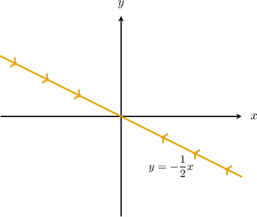

The line that passes through the origin and is parallel to $[\begin{aligned}1 \\ 1\end{aligned}]$ has the equation

$$

y= x

$$

and the straight-line solutions of the form $[\begin{aligned}1 \\ 1\end{aligned}]$ lie on that line.

Since $e^{2t} \to \infty$ as $t \to \infty,$ these solutions approach infinity as $t \to \infty.$

Let's add the solutions to the phase space.

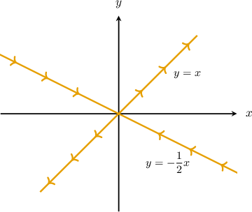

The phase portrait of our system looks as follows:

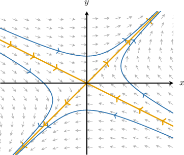

### A Worked Example: Two Positive Eigenvalues

Let's sketch the phase portrait of the system of linear differential equations

$$

\begin{aligned}𝑥^{′}(𝑡)=3𝑥(𝑡)+𝑦(𝑡) \\ 𝑦^{′}(𝑡)=2𝑥(𝑡)+4𝑦(𝑡)\end{aligned}

$$

given that the eigenvalues of the system's matrix are $\lambda_1=5$ and $\lambda_2=2,$ for which the corresponding eigenvectors are $[\begin{aligned}1 \\ 2\end{aligned}]$ and $[\begin{aligned}1 \\ −1\end{aligned}]$ respectively.

Recall that the general solution of the system is

$$

[\begin{aligned}𝑥(𝑡) \\ 𝑦(𝑡)\end{aligned}]

$$

The line that passes through the origin and is parallel to $[\begin{aligned}1 \\ 2\end{aligned}]$ has the equation

$$

y= 2x

$$

and the straight-line solutions of the form $[\begin{aligned}1 \\ 2\end{aligned}]$ lie on that line.

Since $e^{5t} \to \infty$ as $t \to \infty,$ these solutions approach infinity as $t \to \infty.$

Let's add the solutions to the phase space.

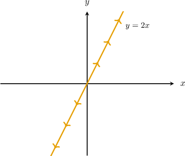

The line that passes through the origin and is parallel to $[\begin{aligned}1 \\ −1\end{aligned}]$ has the equation

$$

y= -x

$$

and the straight-line solutions of the form $[\begin{aligned}1 \\ −1\end{aligned}]$ lie on that line.

Since $e^{2t} \to \infty$ as $t \to \infty,$ these solutions approach infinity as $t \to \infty.$

Let's add the solutions to the phase space.

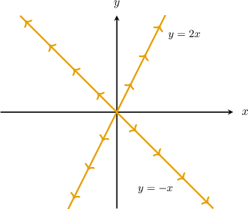

For this particular system, we have

$$

0 < \lambda_2 < \lambda_1

$$

thus, $\lambda_1 = 5$ is the dominant eigenvalue.

Since the dominant eigenvalue is $\lambda_1=5,$ solutions become parallel to the straight-line solution containing the vector $\mathbf{v}_1$ as $t \to \infty.$

The phase portrait of our system looks as follows:

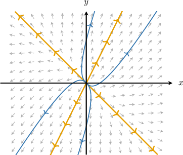

### Example: Sketching the Phase Portrait of a System

#### Question

Sketch the phase portrait of the system of linear differential equations above, given that the eigenvalues of the system's matrix are and for which the corresponding eigenvectors are and respectively.

#### Explanation

The general solution of the system is

The line that passes through the origin and is parallel to has the equation and the straight-line solutions of the form lie on that line.

Since as these solutions approach the origin as

Let's add the solutions to the phase space.

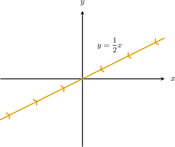

The line that passes through the origin and is parallel to has the equation and the straight-line solutions of the form lie on that line.

Since as these solutions approach the origin as

Let's add the solutions to the phase space.

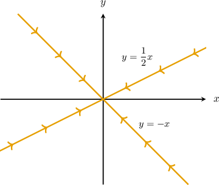

For this particular system, we have thus, is the eigenvalue that determines the long-term behavior (dominant eigenvalue).

Since the dominant eigenvalue is solutions become parallel to the straight-line solution containing the vector as they move towards the origin.

The phase portrait of our system looks as follows:

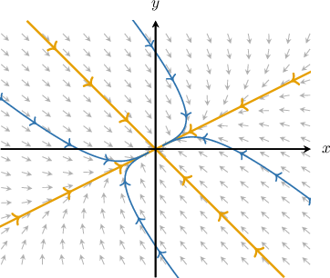

### Example: Identifying the Parameters of a System Given Its Phase Portrait

#### Question

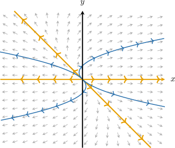

The phase portrait for a system of linear differential equations whose matrix has two real, distinct eigenvalues is shown above. The eigenvalues of the system's matrix are $\lambda_1$ and $\lambda_2,$ for which the corresponding eigenvectors are $\mathbf{v}_1 = [-1, \ 1]^T$ and $\mathbf{v}_2 = [1, \ 0]^T,$ respectively.

Identify the relations between $\lambda_1,$ $\lambda_2,$ and $0.$

#### Explanation

The straight-line solutions of the system have the form

$$

[\begin{aligned}−1 \\ 1\end{aligned}]

$$

The line that passes through the origin and is parallel to $[\begin{aligned}−1 \\ 1\end{aligned}]$ has the equation

$$

y= -x,

$$

as shown below.

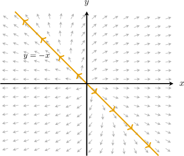

The tangents along this line are pointing away from the origin, meaning that the solutions of the form $[\begin{aligned}−1 \\ 1\end{aligned}]$ must approach infinity as $t \to \infty.$ So, we must have $\lambda_1 > 0.$

The line that passes through the origin and is parallel to $[\begin{aligned}1 \\ 0\end{aligned}]$ has the equation

$$

y= 0,

$$

as shown below.

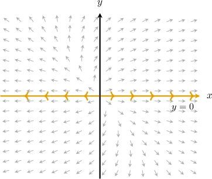

The tangents along this line are pointing away from the origin, meaning that the solutions of the form $[\begin{aligned}1 \\ 0\end{aligned}]$ must approach infinity as $t \to \infty.$ So, we must have $\lambda_2 > 0.$

So, for this particular system, both eigenvalues are positive. The dominant eigenvalue is the one with the greatest magnitude.

Now, since the solutions become parallel to the straight-line solution containing the vector $\mathbf{v}_2$ as they move away from the origin, the dominant eigenvalue is $\lambda_2.$

Therefore, $\lambda_2 > \lambda_1 > 0.$

### Classification of Equilibria

Finally, let’s summarize what we’ve learned so far.

Again, we are considering a linear system

$$

[\begin{aligned}𝑥(𝑡) \\ 𝑦(𝑡)\end{aligned}]

$$

in the case where the $2 \times 2$ matrix $A$ has two *real, distinct* eigenvalues $\lambda_1$ and $\lambda_2$ with corresponding eigenvectors $\mathbf{v}_1$ and $\mathbf{v}_2.$

Recall that if $\lambda_1, \lambda_2 \neq 0,$ the system has a single equilibrium point at the origin $(0,0).$ To classify this equilibrium, we look at the signs of $\lambda_1$ and $\lambda_2.$

First, we describe the straight-line solutions:

- Along the line parallel to $\mathbf{v}_1,$ solutions have the form $\mathbf{x}(t)=c_1e^{\lambda_1 t}\mathbf{v}_1$ where $c_1 \in \mathbb{R}.$ If $\lambda_1<0,$ it's a *stable* line (direction). If $\lambda_1>0,$ it's an *unstable* line (direction).

- Along the line parallel to $\mathbf{v}_2,$ solutions have the form $\mathbf{x}(t)=c_2e^{\lambda_2 t}\mathbf{v}_2$ where $c_2 \in \mathbb{R}.$ If $\lambda_2<0,$ it's a *stable* line (direction). If $\lambda_2>0,$ it's an *unstable* line (direction).

As for the classification of the equilibrium at the origin, we get the following:

- *Unstable node (source)* if $\lambda_1>0$ and $\lambda_2>0.$

- *Stable node (sink)* if $\lambda_1<0$ and $\lambda_2<0.$ In fact, it's asymptotically stable, as the trajectories converge to the origin.

- *Saddle point* if $\lambda_1\lambda_2<0$ (one positive, one negative).

Let's apply this classification to concrete examples.

### Example: Classifying Systems of Linear Differential Equations With Distinct Real Eigenvalues

#### Question

$$

\begin{aligned}𝑥^{′}(𝑡)=9𝑥(𝑡)+6𝑦(𝑡) \\ 𝑦^{′}(𝑡)=−6𝑥(𝑡)−6𝑦(𝑡)\end{aligned}

$$

Consider the system of linear differential equations above. The eigenvalues of the system's matrix are $\lambda_1=6$ and $\lambda_2=-3,$ for which the corresponding eigenvectors are $\mathbf{v}_1 = [-2, \ 1]^T$ and $\mathbf{v}_2 = [-1, \ 2]^T,$ respectively. Complete the following statements about the system by filling in the blanks.

Identify stable and unstable lines, and classify the equilibrium point (origin).

#### Explanation

The general solution of the system is

$$

[\begin{aligned}𝑥(𝑡) \\ 𝑦(𝑡)\end{aligned}]

$$

- The line that passes through the origin and is parallel to $[\begin{aligned}−2 \\ 1\end{aligned}]$ has the equation The straight-line solutions of the form $[\begin{aligned}−2 \\ 1\end{aligned}]$ lie on that line and approach infinity as $t \to \infty.$ So, $y=-\dfrac12x$ is an unstable line.

- The line that passes through the origin and is parallel to $[\begin{aligned}−1 \\ 2\end{aligned}]$ has the equation The straight-line solutions of the form $[\begin{aligned}−1 \\ 2\end{aligned}]$ lie on that line and approach the origin as $t \to \infty.$ So, $y=-2x$ is a stable line.

Therefore, the equilibrium point (origin) is a saddle point.

**** The phase portrait of the system looks as follows:

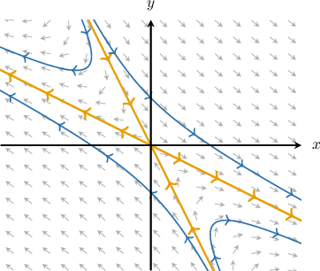
