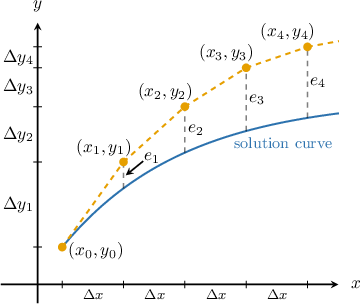
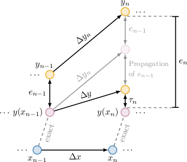

# Error in Numerical Methods

Source: https://www.mathacademy.com/topics/3246?courseId=61
Topic ID: 3246

## Prerequisites

- [Euler's Method: Calculating Multiple Steps](./3668-euler-s-method-calculating-multiple-steps.md)

## Lesson

### Introduction

Even when a numerical method begins a step from the exact solution value, it typically does not land exactly on the true solution at the next point. This discrepancy reflects how accurately the method approximates the solution over a single step.

The **local truncation error** (**LTE**) of a numerical method is the error made in a *single step* that begins from an *exact value*. The LTE of a numerical method at step $n$ from $x$ with exact value $y_\text{exact}(x)$ to $x_\text{new} = x + \Delta x$ is

$$

\begin{aligned}𝜏_{𝑛} & =𝑦_{exact}(𝑥_{new})−𝑦_{new} \\ & =𝑦_{exact}(𝑥_{new})−(𝑦_{exact}(𝑥)+Δ𝑦).\end{aligned}

$$

LTE isolates the intrinsic one-step accuracy of a method. It answers: "*How well does a single step approximate the exact solution if there were no accumulated errors?*"

Suppose a numerical method advances the solution using the increment formula

$$

\Delta y = \Phi(x, y, \Delta x) \cdot \Delta x,

$$

for some function $\Phi.$ Then, the LTE at step $n$ is

$$

\begin{aligned}𝜏_{𝑛} & =𝑦_{exact}(𝑥_{new})−(𝑦_{exact}(𝑥)+Δ𝑦) \\ & =𝑦_{exact}(𝑥_{new})−(𝑦_{exact}(𝑥)+Φ(𝑥,𝑦_{exact}(𝑥),Δ𝑥)⋅Δ𝑥) \\ & =𝑦_{exact}(𝑥_{new})−𝑦_{exact}(𝑥)−Φ(𝑥,𝑦_{exact}(𝑥),Δ𝑥)⋅Δ𝑥.\end{aligned}

$$

In the next slide, we will apply this formula to calculate the local truncation error for a given numerical method.

### Example: Computing Local Truncation Error Given Numerical Solutions to an Initial Value Problem

#### Question

An initial value problem has the exact solution $y_{\text{exact}}(x) = \cos(2x).$ A numerical method is used to approximate the solution to the initial value problem, resulting in the table below, where $y$ denotes the approximate solution at each step, and $\tau_n$ is the local truncation error at each step. At each step, the exact value is used to approximate the new value.

Calculate the local truncation error at each step. Round your answers to three decimal places.

#### Explanation

The local truncation error (LTE) is the error made in a ** of a numerical method, when the step begins from an **. The LTE of a numerical method at step $n$ from $x$ with exact value $y_{\text{exact}}(x)$ to $x_\text{new} = x + \Delta x$ is

$$

\begin{aligned}𝜏_{𝑛} & =𝑦_{exact}(𝑥_{new})−𝑦_{new} \\ & =𝑦_{exact}(𝑥_{new})−(𝑦_{exact}(𝑥)+Δ𝑦).\end{aligned}

$$

We find the LTE at each step, rounding to three decimal places in each case:

- After the first step, we have $y_\text{new} = 0.925.$ So, the LTE of the first step is

- After the second step, we have $y_\text{new} = 0.692.$ So, the LTE of the second step is

- After the third step, we have $y_\text{new} = 0.368.$ So, the LTE of the third step is

Therefore, the completed table is as given below.

### Example: Computing the LTE for a Numerical Method Given an Initial Value Problem

#### Question

Consider the following initial value problem:

$$

y' = -\sin x, \qquad y(0) = 1

$$

Suppose we wish to approximate the solution using the following method:

$$

\begin{aligned}Δ𝑦 & =𝑦^{′}⋅Δ𝑥 \\ 𝑦_{new} & =𝑦+Δ𝑦\end{aligned}

$$

Given that the exact solution is $y_{\text{exact}}(x) = \cos x,$ compute the local truncation error $\tau_{6}$ for the step starting at $x=1$ with step size $\Delta x=0.2.$ Round your answer to three decimal places.

#### Explanation

The local truncation error (LTE) is the error made in a ** of a numerical method, when the step begins from an **. The LTE of a numerical method at step $n$ from $x$ with exact value $y_{\text{exact}}(x)$ to $x_\text{new} = x + \Delta x$ is

$$

\begin{aligned}𝜏_{𝑛} & =𝑦_{exact}(𝑥_{new})−𝑦_{new} \\ & =𝑦_{exact}(𝑥_{new})−(𝑦_{exact}(𝑥)+Δ𝑦).\end{aligned}

$$

We're given that the exact solution is $y_{\text{exact}}(x) = \cos x.$ So, the $y$-value at the start of the step $x=1$ is $y_{\text{exact}}(1)=\cos(1).$

Now, let's find the $y$-increment given by the numerical method.

First, the slope at the start of the step is

$$

\begin{aligned}𝑦_{′exact}(1) & =−sin⁡(1) \\ & =−0.8415.\end{aligned}

$$

So, the increment at this step is

$$

\begin{aligned}Δ𝑦 & =𝑦_{′exact}(1)⋅Δ𝑥 \\ & =−0.8415⋅0.2 \\ & ≈−0.1683.\end{aligned}

$$

Next, we compute the exact value at $x_\text{new}{:}$

$$

\begin{aligned}𝑦_{exact}(𝑥_{new}) & =𝑦_{exact}(𝑥+Δ𝑥) \\ & =𝑦_{exact}(1+0.2) \\ & =𝑦_{exact}(1.2) \\ & =cos⁡(1.2)\end{aligned}

$$

Finally, we calculate the LTE for the step starting at $x=1{:}$

$$

\begin{aligned}𝜏_{6} & =cos⁡(1.2)−(cos⁡(1)+Δ𝑦) \\ & =cos⁡(1.2)−(cos⁡(1)−0.1683) \\ & ≈−0.010\end{aligned}

$$

### Example: Writing an Expression for the LTE for a Given Numerical Method

#### Question

Suppose we wish to approximate the solution to an initial value problem using Euler's method:

$$

\begin{aligned}Δ𝑦 & =𝑦^{′}⋅Δ𝑥 \\ 𝑦_{new} & =𝑦+Δ𝑦\end{aligned}

$$

If the exact solution is $y_{\text{exact}}(x) = x^3,$ find an expression for the local truncation error for the step from $x$ to $x_\text{new} = x + \Delta x.$

#### Explanation

The local truncation error (LTE) is the error made in a ** of a numerical method, when the step begins from an **. The LTE of a numerical method at step $n$ from $x$ with exact value $y_{\text{exact}}(x)$ to $x_\text{new} = x + \Delta x$ is

$$

\begin{aligned}𝜏_{𝑛} & =𝑦_{exact}(𝑥_{new})−𝑦_{new} \\ & =𝑦_{exact}(𝑥_{new})−(𝑦_{exact}(𝑥)+Δ𝑦).\end{aligned}

$$

We're given that the exact solution of the initial value problem is $y_{\text{exact}}(x) = x^3.$ Now, let's find the $y$-increment given by the numerical method.

First, the slope at a step starting at $x$ is

$$

\begin{aligned}𝑦_{′exact}(𝑥)=(𝑥^{3})^{′}=3𝑥^{2}.\end{aligned}

$$

So, the increment given by the numerical method is

$$

\begin{aligned}Δ𝑦 & =𝑦_{′exact}(𝑥)⋅Δ𝑥 \\ & =3𝑥^{2}⋅Δ𝑥.\end{aligned}

$$

Next, we compute the exact value at $x_\text{new}{:}$

$$

\begin{aligned}𝑦_{exact}(𝑥_{new}) & =𝑦_{exact}(𝑥+Δ𝑥) \\ & =(𝑥+Δ𝑥)^{3} \\ & =𝑥^{3}+3𝑥^{2}⋅Δ𝑥+3𝑥⋅(Δ𝑥)^{2}+(Δ𝑥)^{3}\end{aligned}

$$

Finally, we calculate the LTE for step $n$ starting at $x{:}$

$$

\begin{aligned}𝜏_{𝑛} & =𝑦_{exact}(𝑥_{new})−(𝑦_{exact}(𝑥)+Δ𝑦) \\ & =[𝑥^{3}+3𝑥^{2}⋅Δ𝑥+3𝑥⋅(Δ𝑥)^{2}+(Δ𝑥)^{3}]−[𝑥^{3}+3𝑥^{2}⋅Δ𝑥] \\ & =𝑥^{3}−𝑥^{3}+(3𝑥^{2}−3𝑥^{2})⋅Δ𝑥+3𝑥⋅(Δ𝑥)^{2}+(Δ𝑥)^{3} \\ & =3𝑥⋅(Δ𝑥)^{2}+(Δ𝑥)^{3}\end{aligned}

$$

### Global Truncation Error

In practice, numerical methods apply many steps in sequence, using previously computed values to advance the solution. As a result, errors from earlier steps can propagate to later steps, leading to a growing discrepancy between the numerical and exact solutions over time.

The **global truncation error** (**GTE**) of a numerical method is the total error accumulated over several steps. More formally, the GTE of a numerical method after step $n$ from $x_{n-1}$ to $x_n = x_{n-1} + \Delta x$ is

$$

e_n = y(x_n) - y_n,

$$

where $y(x_n)$ is the exact value at $x_n,$ and $y_n$ is the numerical value produced after $n$ steps.

GTE is the accumulated discrepancy between the numerical and true solutions after many steps.

Notice that, for step $1$ and initial value $y(x_0)=y_0,$ the GTE and LTE are identical:

$$

\begin{aligned}𝑒_{1} & =𝑦(𝑥_{1})−𝑦_{1} \\ & =𝑦(𝑥_{1})−(𝑦_{0}+Δ𝑦_{1}) \\ & =𝑦(𝑥_{1})−(𝑦(𝑥_{0})+Δ𝑦_{1}) \\ & =𝜏_{1}\end{aligned}

$$

The plot below shows the numerical solution and the exact solution for a method implementation, along with the vertical gaps $e_n.$

### Example: Computing Global Truncation Error Given Numerical Solutions to an Initial Value Problem

#### Question

A numerical method is used to approximate a solution to an initial value problem, resulting in the table below. If the exact solution is $y(x) = \sqrt{x + 2},$ find, rounded to three decimal places, the global truncation error at each step.

#### Explanation

The global truncation error (GTE) is the total error accumulated after several steps of a numerical method. The GTE of a numerical method at step $n$ from $x_{n-1}$ to $x_n = x_{n-1} + \Delta x$ is

$$

e_n = y(x_n) - y_n,

$$

where $y(x_n)$ is the exact value at $x_n,$ and $y_n$ is the numerical value produced after $n$ steps.

We are given the numerical values $y_n$ produced at each step in the table. Now, we compute the exact value $y(x_n)$ at each value of $x_n{:}$

- The exact value at $x_0=0$ is $y(0) = \sqrt{0 + 2} = \sqrt{2}.$

- The exact value at $x_1=0.3$ is $y(0.3) = \sqrt{0.3 + 2}.$

- The exact value at $x_2=0.6$ is $y(0.6) = \sqrt{0.6 + 2}.$

- The exact value at $x_3=0.9$ is $y(0.9) = \sqrt{0.9 + 2}.$

Let's add these values to the table.

Finally, we find the GTE at each step, rounding to three decimal places in each case:

- The GTE of the first step is

- The GTE of the second step is

- The GTE of the third step is

Therefore, the completed table is as given below.

### Relationship Between Local and Global Truncation Errors

How do local errors build to grow into global errors?

Again, suppose a numerical method advances the solution using the increment formula

$$

\Delta y = \Phi(x, y, \Delta x) \cdot \Delta x,

$$

for some function $\Phi.$

- LTE $\tau_n$ measures the error made in *one step*, where the step begins from the exact value $y(x_{n-1}).$

- GTE $e_n$ measures the accumulated error after *many steps*, starting from $x_0$ and using the numerical method recursively.

So, at each step, we can think of the GTE as a combination of

- the total accumulated error from the previous steps ($e_{n-1}$),

- the way the method propagates these errors forward, and

- a new error introduced in the current step ($\tau_n$).

In particular, the global truncation error satisfies the following:

$$

e_n = e_{n-1} + \left[ \Phi(x_{n-1}, y(x_{n-1}), \Delta x) - \Phi(x_{n-1}, y_{n-1}, \Delta x)\right] \cdot \Delta x + \tau_n

$$

Indeed, using the iterative notation, at step $n,$ the local truncation error is

$$

\begin{aligned}𝜏_{𝑛} & =𝑦(𝑥_{𝑛})−(𝑦(𝑥_{𝑛−1})+Φ(𝑥_{𝑛−1},𝑦(𝑥_{𝑛−1}),Δ𝑥)⋅Δ𝑥).\end{aligned}

$$

Rearranging, we get an expression for the exact value $y(x_n){:}$

$$

y(x_n) = y(x_{n-1}) + \Phi(x_{n-1}, y(x_{n-1}), \Delta x) \cdot \Delta x + \tau_n

$$

Then, substituting this expression into the equation for GTE, we obtain our recursion:

$$

\begin{aligned}𝑒_{𝑛} & =𝑦(𝑥_{𝑛})−𝑦_{𝑛} \\ & =𝑦(𝑥_{𝑛})−(𝑦_{𝑛−1}+Δ𝑦_{𝑛−1}) \\ & =[𝑦(𝑥_{𝑛−1})+Φ(𝑥_{𝑛−1},𝑦(𝑥_{𝑛−1}),Δ𝑥)⋅Δ𝑥+𝜏_{𝑛}]−[𝑦_{𝑛−1}+Φ(𝑥_{𝑛−1},𝑦_{𝑛−1},Δ𝑥)⋅Δ𝑥] \\ & =(𝑦(𝑥_{𝑛−1})−𝑦_{𝑛−1})+(Φ(𝑥_{𝑛−1},𝑦(𝑥_{𝑛−1}),Δ𝑥)−Φ(𝑥_{𝑛−1},𝑦_{𝑛−1},Δ𝑥))⋅Δ𝑥+𝜏_{𝑛} \\ & =\underset{GTE at step n-1}{\underset{}{𝑒_{𝑛−1}}}+\underset{propagation of 𝑒_{𝑛−1}}{\underset{}{[Φ(𝑥_{𝑛−1},𝑦(𝑥_{𝑛−1}),Δ𝑥)−Φ(𝑥_{𝑛−1},𝑦_{𝑛−1},Δ𝑥)]⋅Δ𝑥}}+\underset{LTE at step n}{\underset{}{𝜏_{𝑛}}}\end{aligned}

$$

The diagram below illustrates this propagation, where $\Delta y_n$ is the increment produced by the numerical method at step $n$ starting from the previous numerical value $y_{n-1},$ while $\Delta y$ is the increment produced by the same formula but starting from the exact value $y(x_{n-1}).$

