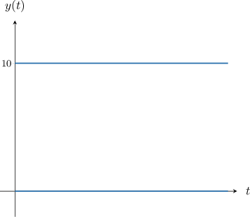
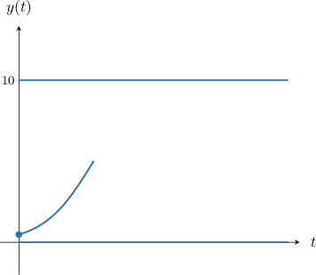
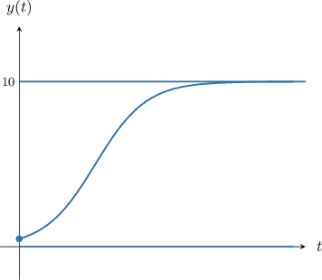
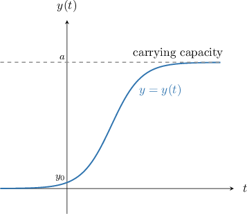
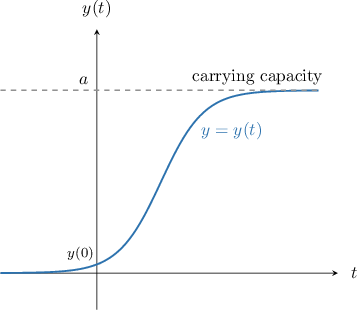
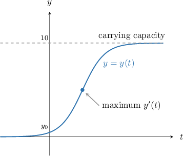
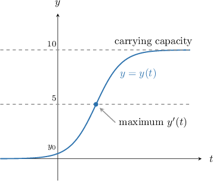
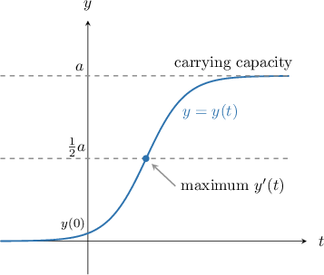
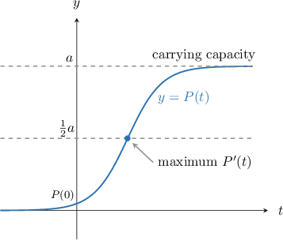

# Qualitative Analysis of the Logistic Growth Equation

Source: https://www.mathacademy.com/topics/3551?courseId=61
Topic ID: 3551

## Prerequisites

- [Logistic Growth Models With First-Order ODEs](./1163-logistic-growth-models-with-first-order-odes.md)
- [Equilibrium Solutions of First-Order ODEs](./3184-equilibrium-solutions-of-first-order-odes.md)

## Lesson

### Introduction

For some differential equations, it's possible to sketch the solution curves *without* calculating the general solution. Instead, we gather information about the solutions using the differential equation itself.

As an example, consider the following logistic growth equation:

$$

y' = 5y(10-y)

$$

In practical applications, we're usually interested in the domain $t > 0,$ so we will stick to this constraint for the moment.

The equation is autonomous, so let's start by finding the equilibrium solutions. Setting up the equation $y'(t) = 0$ gives

$$

5y(10-y) = 0.

$$

So, there are two equilibrium solutions, $y=0,$ and $y=10.$ Let's create a diagram and plot these two solutions.

We will now sketch a solution curve that lies between these two equilibrium solutions.

Notice the following:

- Since $0 < y < 10$ for all $t,$ we have that $5y(10-y)$ is positive for all $t.$

- Therefore, $y'(t)$ is positive for all $t.$

- Hence, $y(t)$ is increasing for all $t.$

Using this information, we can start to sketch a solution curve.

Next, we note the following regarding the end-behavior of our solution:

- The expression $5y(10-y)\to 0$ as $y\to10.$

- Therefore, $y'\to 0$ as $y\to 10.$

In other words, the curve flattens as $y$ approaches $10.$ Adding this behavior to our diagram, we get a complete sketch of the solution curve.

Gathering information about the solutions to a differential equation without solving it is called **qualitative analysis.**

### Some Key Features of a Logistic Growth Curve

In general, the logistic growth boundary value problem for the function $y(t)$ is given by

$$

y' = ky(a-y), \qquad y(0) = y_0,

$$

where $k > 0,$ and $0 < y < a.$

A diagram showing a typical logistic growth curve is shown below.

Note the following:

- In practical situations, we usually set $t > 0.$ If we relax this constraint, we have This behavior can be confirmed using an analysis similar to what we saw earlier.

- The parameter $a$ is the **carrying capacity,** and is the limiting value of $y(t)$ for large $t.$ We can write If $y(t)$ represents how some population changes with time, the carrying capacity gives the maximum possible population.

- We have assumed that $0 < y < a$ for all $t.$ Other cases are possible, though we do not consider those here.

### Example: Determining the Carrying Capacity of a Logistic Growth Model

#### Question

Consider the following differential equation for the function $y = y(t)\mathbin{:}$

$$

y' = 2y\left(60 - \frac{y}{3} \right), \qquad y(0) = 10

$$

What is $\displaystyle \lim_{t\to\infty}{y(t)}?$

#### Explanation

A logistic growth equation has the form

$$

y' = ky(a-y),

$$

where $k > 0$ is a constant of proportionality, and $a > y$ is the carrying capacity.

A diagram showing a typical logistic growth curve is shown below.

First, let's rewrite the right-hand side of the given equation so that it matches the form above:

$$

\begin{aligned}𝑦^{′} & =2𝑦(60−\frac{𝑦}{3}) \\ & =2𝑦(\frac{180−𝑦}{3}) \\ & =\frac{2𝑦}{3}(180−𝑦)\end{aligned}

$$

From here, we see that $a = 180.$ Hence, the carrying capacity is $180.$

For a given logistic growth model, $y\to a$ as $t\to\infty.$ Therefore,

$$

\lim_{t\to\infty}{y(t)} = 180.

$$

### Example: Determining the Carrying Capacity of a Logistic Growth Model In Context

#### Question

The population $y(t)$ of some foxes in a forest follows the logistic growth model

$$

y' =0.5y - 0.002y^2, \qquad y(0) = 25,

$$

where $t$ is the time, in months, since the observations began. According to this model, what is the maximum possible fox population?

#### Explanation

A logistic growth equation has the form

$$

y' = ky(a-y),

$$

where $k > 0$ is a constant of proportionality, and $a > y$ is the carrying capacity.

The carrying capacity $a$ represents the maximum possible population. A diagram showing a typical logistic growth curve is shown below.

First, let's rewrite the right-hand side of the given equation so that it matches the form above:

$$

\begin{aligned}𝑦^{′} & =0.5𝑦−0.002𝑦^{2} \\ & =0.002𝑦(250−𝑦)\end{aligned}

$$

From here, we see that $a = 250.$ Hence, the carrying capacity is $250,$ and we conclude that the number of foxes cannot exceed $250.$

### Identifying the Point of Fastest Increase

Let's go back to the following logistic growth equation:

$$

y' = 5y(10-y), \qquad y(0) = y_0.

$$

The logistic growth curve for this problem is sketched below.

The curve contains an inflection point, that is, a point where $y(t)$ is growing at its fastest possible rate. What information can we deduce about this point?

To find the inflection point, we solve $y''(t) = 0.$ First, we differentiate the differential equation using implicit differentiation:

$$

\begin{aligned}𝑦^{″} & =(5𝑦)^{′}⋅(10−𝑦)+(5𝑦)⋅(10−𝑦)^{′} \\ & =5⋅(10−𝑦)⋅𝑦^{′}+(5𝑦)⋅(−1)⋅𝑦^{′} \\ & =𝑦^{′}⋅(5⋅(10−𝑦)+(5𝑦)⋅(−1)) \\ & =𝑦^{′}⋅(50−5𝑦−5𝑦) \\ & =𝑦^{′}⋅(50−10𝑦)\end{aligned}

$$

We now need to solve $y''(t) = 0,$ i.e.,

$$

y'\cdot\left(50-10y\right) = 0.

$$

We know that $y'$ is increasing for all $t,$ so $y'\neq 0.$ Therefore, we must have

$$

50-10y = 0\quad \Rightarrow\quad y = 5.

$$

Let's mark this on our diagram.

The fact that the inflection point occurs when $y$ is precisely half the carrying capacity is *not* a coincidence. In fact, this is always the case. The general situation is shown below.

### Example: Identifying the Point of Fastest Increase of a Logistic Growth Model

#### Question

The rate of growth in the number of people $P(t)$ infected with a particular virus follows the logistic growth model

$$

\dfrac{\mathrm{d} P}{\mathrm{d} t} = 4P - 0.000\,01 P^2, \qquad P(0) = 5\,000,

$$

where $t$ is the time, in days, since the virus outbreak began. For which value of $P$ is the number of people infected with the virus growing at the fastest possible rate?

#### Explanation

A logistic growth equation has the form

$$

P' = kP(a-P),

$$

where $k > 0$ is a constant of proportionality, and $a > P$ is the carrying capacity.

For a logistic growth model, the fastest rate of growth occurs when $P = \dfrac12a.$

First, let's rewrite the right-hand side of the given equation so that it matches the form above:

$$

\begin{aligned}\frac{d𝑃}{d𝑡} & =4𝑃−0.000\,01𝑃^{2} \\ & =0.000\,01𝑃(400\,000−𝑃)\end{aligned}

$$

From here, we see that $a = 400\,000.$ Hence, the carrying capacity is $400\,000,$ and $P$ grows at its fastest possible rate when

$$

P = \dfrac12a = \dfrac12\cdot 400\,000 = 200\,000.

$$
