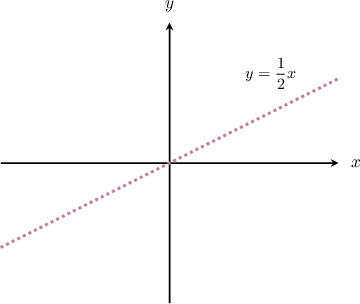
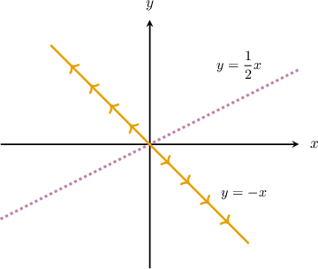
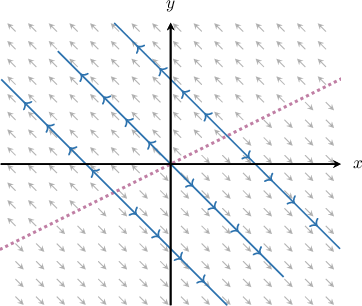
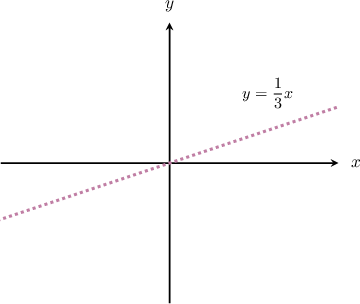
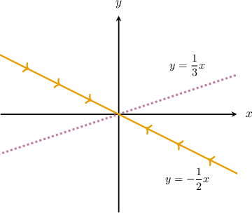
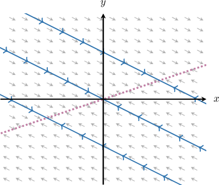
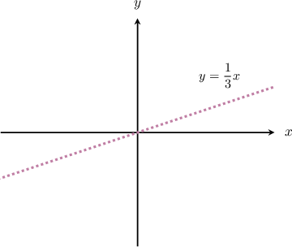
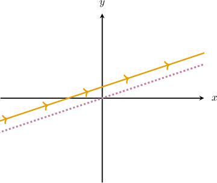
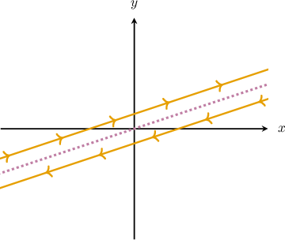
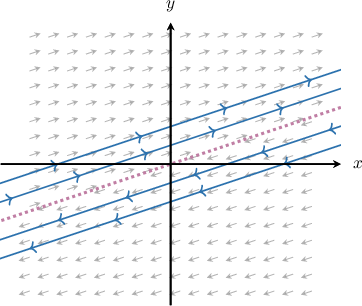

# Phase Portraits for Linear Systems With Zero Eigenvalues

Source: https://www.mathacademy.com/topics/6379?courseId=61
Topic ID: 6379

## Prerequisites

- [Phase Portraits for Linear Systems With Repeated Eigenvalues](./3240-phase-portraits-for-linear-systems-with-repeated-eigenvalues.md)

## Lesson

### Introduction

In this topic, we'll study phase portraits of linear systems

$$

[\begin{aligned}𝑥(𝑡) \\ 𝑦(𝑡)\end{aligned}]

$$

when the $2 \times 2$ matrix $A$ has at least one *zero eigenvalue*.

A zero eigenvalue is special because $e^{0\cdot t}=1,$ so the corresponding component of a solution has *no exponential growth or decay*. Geometrically, this often creates a **line of equilibrium points** (infinitely many fixed points), instead of a single equilibrium at the origin.

Indeed, equilibrium points satisfy $\mathbf{x}'=\mathbf{0},$ so for $\mathbf{x}'=A\mathbf{x}$ we solve

$$

A\mathbf{x}=\mathbf{0}.

$$

That is, equilibrium points form the *null space* of $A.$

- If $\det(A) \neq 0,$ then the null space is $\{\mathbf{0}\}$ and the only equilibrium is the origin.

- If $\det(A)=0,$ then the null space contains infinitely many points (typically a line through the origin in $2\times2$ cases).

A zero eigenvalue guarantees $\det(A)=0$, so in that case the null space is nontrivial.

Let's see a concrete example.

### Example: Finding Equilibrium Points of a System

#### Question

$$

\begin{aligned}𝑥^{′}(𝑡)=2𝑥(𝑡)+2𝑦(𝑡) \\ 𝑦^{′}(𝑡)=5𝑥(𝑡)+5𝑦(𝑡)\end{aligned}

$$

Find an equation of the line in the phase space that contains all equilibrium points of the system above.

#### Explanation

Writing our system in matrix form, we have

$$

[\begin{aligned}2 & 2 \\ 5 & 5\end{aligned}]

$$

where $[\begin{aligned}𝑥(𝑡) \\ 𝑦(𝑡)\end{aligned}]$

The equilibrium (fixed) points of a system $\mathbf{x}'(t) = \mathbf{f}(x,y)$ are the points for which $\mathbf{f}(x,y)=\mathbf{0}.$ So, we get the following system of linear equations:

$$

\begin{aligned}2𝑥+2𝑦=0 \\ 5𝑥+5𝑦=0\end{aligned}

$$

Notice that the second equation is a multiple of the first one. So, we can disregard the second equation.

From the first equation, we get

$$

2x+2y=0 \quad\Rightarrow\quad 2y=-2x \quad\Rightarrow\quad y=-x.

$$

Therefore, the equilibrium points are given by

$$

[\begin{aligned}𝑥(𝑡) \\ 𝑦(𝑡)\end{aligned}]

$$

This determines the line with the equation $y=-x.$

### Systems With One Zero Eigenvalue

Suppose a $2 \times 2$ system has eigenvalues $\lambda_1=0$ and $\lambda_2\neq 0$ with eigenvectors $\mathbf{v}_1$ and $\mathbf{v}_2.$

Then, the eigenvector direction for $\lambda_1=0$ gives a **line of equilibria**:

$$

\mathbf{x}_E = c_1 \mathbf{v}_1, \qquad c_1 \in \mathbb{R}

$$

The other eigenvalue $\lambda_2$ determines what happens off the equilibrium line:

- If $\lambda_2>0,$ trajectories move *away* from the equilibrium line (*unstable* direction).

- If $\lambda_2<0,$ trajectories move *toward* the equilibrium line (*stable* direction).

A typical solution has the form

$$

\mathbf{x}(t)=c_1\mathbf{v}_1 + c_2 e^{\lambda_2 t}\mathbf{v}_2, \qquad c_1,c_2 \in \mathbb{R}.

$$

So trajectories are *parallel to $\mathbf{v}_2,$* shifted by the equilibrium vector $c_1\mathbf{v}_1.$

To illustrate, let's consider the following example

$$

\begin{aligned}𝑥^{′}(𝑡)=𝑥(𝑡)−2𝑦(𝑡) \\ 𝑦^{′}(𝑡)=−𝑥(𝑡)+2𝑦(𝑡)\end{aligned}

$$

where we know the eigenvalues of the system's matrix are $\lambda_1=0$ and $\lambda_2=3,$ with corresponding eigenvectors $[\begin{aligned}2 \\ 1\end{aligned}]$ and $[\begin{aligned}−1 \\ 1\end{aligned}]$ respectively.

Let's sketch the phase portrait of the system.

The general solution of the system is

$$

[\begin{aligned}𝑥(𝑡) \\ 𝑦(𝑡)\end{aligned}]

$$

- First, notice that $[\begin{aligned}2 \\ 1\end{aligned}]$ are the equilibrium solutions of the system since $\mathbf{x}'_E(t) = \mathbf{0}.$ These solutions form the line with the equation $y=\dfrac{1}{2}x$ in the phase space, as shown below.

- Now, the line that passes through the origin and is parallel to $[\begin{aligned}−1 \\ 1\end{aligned}]$ has the equation $y= -x$ and the straight-line solutions of the form $[\begin{aligned}−1 \\ 1\end{aligned}]$ lie on that line. Since $e^{3t} \to \infty$ as $t \to \infty,$ these solutions approach infinity as $t \to \infty.$

All other non-equilibrium solutions are parallel to the vector $\mathbf{v}_2.$ So, the phase portrait of our system looks as follows:

### Example: Identifying the Phase Portrait of a System With One Zero Eigenvalue

#### Question

$$

\begin{aligned}𝑥^{′}(𝑡)=−2𝑥(𝑡)+6𝑦(𝑡) \\ 𝑦^{′}(𝑡)=𝑥(𝑡)−3𝑦(𝑡)\end{aligned}

$$

Consider the system of linear differential equations above. The eigenvalues of the system's matrix are $\lambda_1=0$ and $\lambda_2=-5,$ with corresponding eigenvectors are $\mathbf{v}_1 = [3, \ 1]^T$ and $\mathbf{v}_2 = [-2, \ 1]^T,$ respectively. Using this information, sketch the phase portrait of the system.

#### Explanation

The general solution of the system is

$$

[\begin{aligned}𝑥(𝑡) \\ 𝑦(𝑡)\end{aligned}]

$$

Let's now sketch the phase portrait.

- First, notice that $[\begin{aligned}3 \\ 1\end{aligned}]$ are the equilibrium solutions of the system since $\mathbf{x}'_E(t) = \mathbf{0}.$ These solutions form the line with the equation $y=\dfrac13x$ in the phase space, as shown below.

- Now, the line that passes through the origin and is parallel to $[\begin{aligned}−2 \\ 1\end{aligned}]$ has the equation $y=- \dfrac12x$ and the straight-line solutions of the form $[\begin{aligned}−2 \\ 1\end{aligned}]$ lie on that line. Since $e^{-5t} \to 0$ as $t \to \infty,$ these solutions approach the origin as $t \to \infty.$

All other non-equilibrium solutions are parallel to the vector $\mathbf{v}_2.$ So, the phase portrait of our system looks as follows:

### Systems With Repeated Zero Eigenvalue

Now, suppose a $2 \times 2$ system has a repeated zero eigenvalue $\lambda=0$ (multiplicity $2$). Here, the vector field carries no exponential growth or decay in any direction. There are two subcases.

- If there are two independent eigenvectors (we have a zero matrix), then every direction behaves like an equilibrium direction, and solutions are constant: So *every point is an equilibrium*, and the phase portrait is a field of zero vectors.

- If there is only one eigenvector (we have a singular nonzero matrix), then we use a generalized eigenvector $\mathbf{w}$ with $(A-0\cdot I)\mathbf{w}=A\mathbf{w}=\mathbf{v}$, and solutions look like Notice that here $\mathbf{x}_E=c_1\mathbf{v}$ still gives a *line of equilibrium points*, while other trajectories align with the eigenspace structure, yielding a **shear flow** where solutions grow linearly with $t$ (algebraic growth).

Let's see a concrete example of the second case.

### Example: Identifying the Phase Portrait of a System With Repeated Zero Eigenvalue

#### Question

$$

\begin{aligned}𝑥^{′}(𝑡)=−3𝑥(𝑡)+9𝑦(𝑡) \\ 𝑦^{′}(𝑡)=−𝑥(𝑡)+3𝑦(𝑡)\end{aligned}

$$

Consider the system of linear differential equations above. The eigenvector corresponding to the only eigenvalue $\lambda=0$ of the system's matrix $A$ is $\mathbf{v} = [3, \ 1]^T.$ The vector $\mathbf{w} = [-1, \ 0]^T$ is such that $(A - \lambda I)\mathbf{w}= \mathbf{v}.$ Sketch the phase portrait of the system.

#### Explanation

Since we have a repeated eigenvalue $\lambda=0$ (of multiplicity two) and only one corresponding eigenvector $\mathbf{v},$ the solution of the system is given by

$$

\mathbf{x}(t) = c_1\mathbf{v} e^{\lambda t} + c_2 (\mathbf{v} te^{\lambda t} + \mathbf{w}e^{\lambda t} \, ),

$$

where $\mathbf{w}$ is a solution to the equation $(A - \lambda I)\mathbf{w}= \mathbf{v}.$

In our case,

$$

[\begin{aligned}3 \\ 1\end{aligned}]

$$

Thus, the general solution of the system is

$$

\begin{aligned}[\begin{matrix}𝑥(𝑡) \\ 𝑦(𝑡)\end{matrix}] & =𝑐_{1}[\begin{matrix}3 \\ 1\end{matrix}]+𝑐_{2}([\begin{matrix}3 \\ 1\end{matrix}]𝑡+[\begin{matrix}−1 \\ 0\end{matrix}]) \\ & =𝑐_{1}[\begin{matrix}3 \\ 1\end{matrix}]+𝑐_{2}[\begin{matrix}3𝑡−1 \\ 𝑡\end{matrix}],\,𝑐_{1},𝑐_{2}∈ℝ.\end{aligned}

$$

First, notice that $[\begin{aligned}3 \\ 1\end{aligned}]$ are equilibrium solutions of the system since $\mathbf{x}'_E(t) = \mathbf{0}.$ These solutions form the line with the equation $y=\dfrac13x$ in the phase space, as shown below.

Now, we consider some general solutions of the form

$$

[\begin{aligned}𝑥(𝑡) \\ 𝑦(𝑡)\end{aligned}]

$$

For example:

- When $c_1=1$ and $c_2=1,$ we get the following curve: Let's add it to the phase space:

- When $c_1=-1$ and $c_2=-1,$ we get the following curve: Let's add it to the phase space:

The phase portrait of our system looks as follows:

