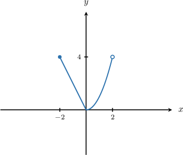
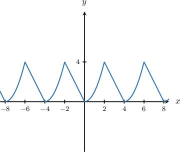
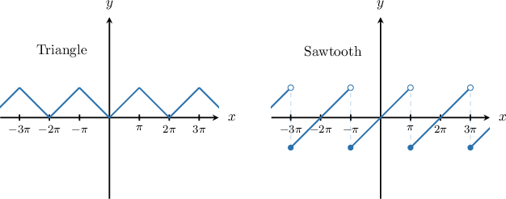

# Differentiating and Integrating Fourier Series

Source: https://www.mathacademy.com/topics/6383?courseId=61
Topic ID: 6383

## Prerequisites

- [Fourier Series of Arbitrary Period](./6382-fourier-series-of-arbitrary-period.md)
- [Piecewise Continuity and Piecewise Smoothness](./6669-piecewise-continuity-and-piecewise-smoothness.md)

## Lesson

### Introduction

When a Fourier series represents a function $f$, it is often much easier to differentiate the series term-by-term than to recompute a brand-new Fourier series from scratch.

However, term-by-term differentiation is only guaranteed to work when the underlying periodic function is sufficiently "well-behaved".

The theorem about **term-by-term differentiation of Fourier series** states the following:

Suppose that

$$

f(x) \sim \dfrac{a_0}{2} + \sum_{n=1}^{\infty} a_n\cos\bigg(\dfrac{n\pi}{L}x\bigg)+b_n\sin\bigg(\dfrac{n\pi}{L}x\bigg)

$$

is a $2L$-periodic function which is

- piecewise smooth, and

- continuous.

Then, the Fourier series of $f'(x)$ can be obtained by differentiating term-by-term the Fourier series of $f(x){:}$

$$

f'(x) \sim \sum_{n=1}^{\infty} -\dfrac{n\pi a_n}{L}\sin\bigg(\dfrac{n\pi}{L}x\bigg)+\dfrac{n\pi b_n}{L}\cos\bigg(\dfrac{n\pi}{L}x\bigg)

$$

In other words, if $f(x)$ is the $2L$-periodic extension of a function $F(x)$ defined on $x \in [-L,L),$ then the Fourier series of $f'(x)$ can be obtained by differentiating term-by-term the Fourier series of $f(x)$ provided that

- $F(x)$ is continuous on $x \in (-L,L),$

- $F(x)$ is piecewise smooth on $x \in (-L,L),$ and

- $\lim\limits_{x \to -L^+} F(x) = \lim\limits_{x \to L^-} F(x).$

**Note:** The constant term $\dfrac{a_0}{2}$ disappears after differentiating, since $\dfrac{\text{d}}{\text{d}x}\!\left(\dfrac{a_0}{2}\right)=0.$

In the next slides, we will apply this theorem to a specific example to see how it works in practice.

### Example: Identifying Properties of Periodic Extensions

#### Question

$$

\begin{aligned}−2𝑥, & 𝑥∈[−2,0) \\ 𝑥^{2}, & 𝑥∈[0,2)\end{aligned}

$$

The above function $F(x)$ is defined on $x \in [-2,2).$ Let $f(x)$ be the $4$-periodic extension of $F(x)$ to $x\in\mathbb{R}.$ Determine whether each statement below is true or false.

1. $F(x)$ is continuous on $x\in(-2,2).$

2. $F(x)$ is piecewise smooth on $x\in(-2,2).$

3. $\lim\limits_{x \to -2^+} F(x) = \lim\limits_{x \to 2^-} F(x).$

4. $f(x)$ is piecewise smooth and continuous on $\mathbb{R}.$

#### Explanation

Let's examine the given statements in turn.

- Statement I is true. The function $F(x)$ is continuous on $x \in (-2,2).$ Its graph is shown below.

- Statement II is true. The function $F(x)$ is piecewise smooth on $x \in (-2,2).$ It consists of two smooth pieces.

- Statement III is true. Indeed, we have and So, $\lim\limits_{x \to -2^+} F(x) = \lim\limits_{x \to 2^-} F(x).$

- Statement IV is true since statements I, II, and III are all true.

**** The $4$-periodic extension of $F(x)$ to $x \in \mathbb{R}$ has the graph shown below.

### Example: Differentiating a Fourier Series

#### Question

Let $f(x)$ be the $10$-periodic extension of the function $F(x)=\dfrac{5}{2}x^2-3$ defined on $[-5,5).$ Fill in the blanks in the reasoning below, showing the derivation of the Fourier series of the $10$-periodic extension of $G(x)=5x$ from the corresponding Fourier series of $f(x).$

The Fourier series of $f(x)$ is given by

$$

𝑋𝑋𝑋𝑋𝑋

$$

Since $f$ is $𝑋𝑋𝑋𝑋𝑋𝑋𝑋𝑋$ and $𝑋𝑋𝑋𝑋𝑋𝑋𝑋𝑋$ on $\mathbb{R},$ we may differentiate its Fourier series term-by-term to get

$$

𝑋𝑋𝑋𝑋𝑋𝑋

$$

#### Explanation

First, notice that $F(x)$ is an even function. So, the Fourier series of its $2L$-periodic extension has the form

$$

\dfrac{a_0}{2} + \sum_{n=1}^\infty a_n \cos\left(\dfrac{n\pi x}{L}\right).

$$

In our case, $L=5.$ Thus, the Fourier series of $f(x)$ is given by

$$

f(x) \sim \dfrac{107}{6} + \sum_{n=1}^\infty \dfrac{250(-1)^n}{n^2\pi^2} \boxed{\cos\left(\dfrac{n\pi x}{5}\right)}.

$$

Now, notice that

- the function $F$ is continuously differentiable on $(-5,5),$

- continuous on $[-5,5),$ and

- satisfies $F(-5)=F(5),$ if we extend the value at $x=5$ using the formula $F(x)=\dfrac{5}{2}x^2-3.$

Therefore, the $10$-periodic extension $f$ is $\boxed{\text{continuous}}$ and $\boxed{\text{piecewise smooth}}$ on $\mathbb{R},$ so we may differentiate its Fourier series term-by-term:

$$

\begin{aligned}\frac{d}{d𝑥}(\frac{5}{2}𝑥^{2}−3) & ∼\frac{d}{d𝑥}(\frac{107}{6})+\underset{\underset{𝑛=1}{∑}}{\overset{}{∞}}\frac{d}{d𝑥}(\frac{250(−1)^{𝑛}}{𝑛^{2}𝜋^{2}}cos⁡(\frac{𝑛𝜋𝑥}{5})) \\ 5𝑥 & ∼0+\underset{\underset{𝑛=1}{∑}}{\overset{}{∞}}\frac{250(−1)^{𝑛}}{𝑛^{2}𝜋^{2}}⋅(−\frac{𝑛𝜋}{5}sin⁡(\frac{𝑛𝜋𝑥}{5})) \\ 5𝑥 & ∼\underset{\underset{𝑛=1}{∑}}{\overset{}{∞}}\frac{−50(−1)^{𝑛}}{𝑛𝜋}sin⁡(\frac{𝑛𝜋𝑥}{5}) \\ 5𝑥 & ∼\underset{\underset{𝑛=1}{∑}}{\overset{}{∞}}\frac{50(−1)^{𝑛+1}}{𝑛𝜋}⋅sin⁡(\frac{𝑛𝜋𝑥}{5}).\end{aligned}

$$

### A Word on Convergence

Term-by-term differentiation is a huge time-saver: it lets us obtain a Fourier series for $f'(x)$ without recomputing Fourier coefficients from scratch.

But differentiation also tends to make Fourier series "less convergent", it "spends" one power of $n$. So, we need to be careful about what the differentiated series actually does.

In a $2L$-periodic Fourier series, differentiating

$$

\cos\!\left(\dfrac{n\pi x}{L}\right) \qquad \text{or} \qquad \sin\!\left(\dfrac{n\pi x}{L}\right)

$$

introduces a factor of $\dfrac{n\pi}{L}$. So, very roughly,

$$

\big(\text{new coefficient size}\big) \approx n \cdot \big(\text{old coefficient size}\big).

$$

That means one level of coefficient decay is "used up" when we differentiate.

For example, consider the so-called *triangle wave* and *sawtooth wave*, the $2\pi$-periodic extensions from $x \in [-\pi,\pi)$ to $x \in \mathbb{R}$ of the functions $y=|x|$ and $y=x,$ respectively.

Their Fourier series are the following:

$$

|x| \sim \dfrac{\pi}{2}-\dfrac{4}{\pi}\sum_{n=1}^{\infty}\dfrac{\cos\!\big((2n-1)x\big)}{(2n-1)^2} \qquad\text{and}\qquad x \sim 2\sum_{n=1}^{\infty}\dfrac{(-1)^{n+1}}{n}\sin(nx)

$$

The convergence of their corresponding derivatives is summarized in the table below.

Notice that:

- For the continuous and piecewise smooth *triangle wave*: The function has enough "smoothness" (continuity) that its Fourier coefficients decay quickly at a rate of $\sim \dfrac{1}{n^2}.$ Differentiation "costs" one level of decay: Since the terms $\dfrac{1}{n}$ still approach $0,$ the series can converge. At the "corners," it settles on the average of the left- and right-hand slopes.

- For the discontinuous but piecewise smooth *sawtooth wave*: The function's jump discontinuities "use up" the smoothness budget. The coefficients decay only at a rate of $\sim \dfrac{1}{n}.$ Differentiation cancels out the decay entirely: Since the terms of the series do not approach $0,$ the series fails the basic divergence test and does not converge.

### Integrating Fourier Series

Just like differentiation, integration can also be applied directly to a Fourier series. This is often useful when we already know the Fourier series of $f(x)$ and want a series for an antiderivative of $f(x)$ without recomputing Fourier coefficients from scratch.

The theorem about **term-by-term integration of Fourier series** states the following:

Suppose that

$$

f(x) \sim \dfrac{a_0}{2} + \sum_{n=1}^{\infty} a_n\cos\bigg(\dfrac{n\pi}{L}x\bigg)+b_n\sin\bigg(\dfrac{n\pi}{L}x\bigg)

$$

is a $2L$-periodic function which is piecewise continuous. Then, an antiderivative $F(x)$, where $F'(x) = f(x)$, can be found by integrating the Fourier series of $f(x)$ term-by-term:

$$

F(x) \sim \dfrac{a_0}{2}x + C + \sum_{n=1}^{\infty} \bigg( \dfrac{a_n L}{n\pi}\sin\bigg(\dfrac{n\pi}{L}x\bigg)-\dfrac{b_n L}{n\pi}\cos\bigg(\dfrac{n\pi}{L}x\bigg) \bigg)

$$

where $C$ is an arbitrary constant of integration.

**Watch out!** Note the following caveats:

1. The expression for the antiderivative $F(x)$ is not a Fourier series in the usual sense because it contains the linear term $\dfrac{a_0}{2}x.$

2. Even if $f(x)$ is periodic, its antiderivative $F(x)$ is not necessarily periodic. In particular, if $a_0 \neq 0,$ then the term $\dfrac{a_0}{2}x$ grows without bound as $x$ increases.

If we want a periodic antiderivative, we typically need the average value of $f$ over one period to be $0$ (equivalently, $a_0=0$), so that the linear term disappears.

**Note:** Integration is generally "safer" than differentiation for Fourier series. Differentiation can slow convergence or even destroy it, whereas integration divides the $n$th coefficient by $n,$ which typically improves convergence.

Next, let's see a concrete example.

### Example: Integrating a Fourier Series

#### Question

Let $f(x)$ be the $8$-periodic extension of the function $F(x)=-\dfrac{3}{4}x^2$ defined on $[-4,4).$ Fill in the blanks in the reasoning below, showing the derivation of a series converging to the $8$-periodic extension of

$$

G(x) = -\dfrac{1}{4}x^3 = \int_0^x f(t) \, \text{d}t

$$

from the corresponding Fourier series of $f(x).$

The Fourier series of $f(x)$ is given by

$$

𝑋𝑋𝑋𝑋

$$

Since $f$ is $𝑥𝑥𝑥𝑥𝑥𝑥𝑥𝑥𝑥𝑥𝑥$ on $\mathbb{R},$ we may integrate its Fourier series term-by-term to get

$$

𝑋𝑋𝑋𝑋

$$

#### Explanation

First, notice that $F(x)$ is an even function. So, the Fourier series of its $2L$-periodic extension has the form

$$

\dfrac{a_0}{2}+\sum_{n=1}^\infty a_n \cos\left(\dfrac{n\pi x}{L}\right).

$$

In our case, $L=4$ and we are already given the coefficients for $n \geq 1.$ Thus, the Fourier series of $f(x)$ is given by

$$

f(x) \sim -4+\sum_{n=1}^\infty \dfrac{48(-1)^{n+1}}{n^2\pi^2} \boxed{\cos\left(\dfrac{n\pi x}{4}\right)}.

$$

Now, notice that the function $F$ is continuous on $(-4,4).$ Therefore, the $8$-periodic extension $f$ is $\boxed{\text{piecewise continuous}}$ on $\mathbb{R},$ so we may integrate its Fourier series term-by-term:

$$

\begin{aligned}∫_{𝑥0}(−\frac{3}{4}𝑡^{2})\,d𝑡 & ∼∫_{𝑥0}(−4+\underset{\underset{𝑛=1}{∑}}{\overset{}{∞}}\frac{48(−1)^{𝑛+1}}{𝑛^{2}𝜋^{2}}cos⁡(\frac{𝑛𝜋𝑡}{4}))d𝑡 \\ [−\frac{1}{4}𝑡^{3}]_{𝑥0} & ∼[−4𝑡]_{𝑥0}+\underset{\underset{𝑛=1}{∑}}{\overset{}{∞}}\frac{48(−1)^{𝑛+1}}{𝑛^{2}𝜋^{2}}⋅[\frac{4}{𝑛𝜋}sin⁡(\frac{𝑛𝜋𝑡}{4})]_{𝑥0} \\ −\frac{1}{4}𝑥^{3} & ∼−4𝑥+\underset{\underset{𝑛=1}{∑}}{\overset{}{∞}}\,\frac{192(−1)^{𝑛+1}}{𝑛^{3}𝜋^{3}}⋅sin⁡(\frac{𝑛𝜋𝑥}{4})\end{aligned}

$$
