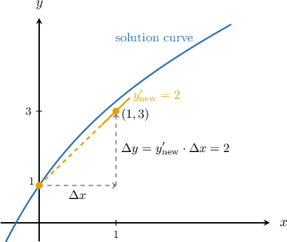
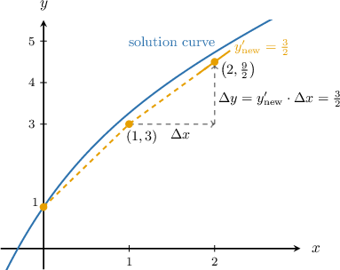

# The Implicit Euler Method

Source: https://www.mathacademy.com/topics/6396?courseId=61
Topic ID: 6396

## Prerequisites

- [Euler's Method: Calculating Multiple Steps](./3668-euler-s-method-calculating-multiple-steps.md)

## Lesson

### Introduction

Suppose we wish to approximate a solution to an initial value problem

$$

y' = f(x,y), \qquad y_0 = y(x_0).

$$

Recall that Euler's method approximates a solution by evaluating the slope at the current point:

$$

\Delta y = y' \cdot \Delta x

$$

Although this method is simple, it's not too accurate and can be unstable for some problems, meaning errors compound quickly. One alternative is the implicit Euler method, which instead evaluates the slope at the *next* point, where $x_\text{new} = x + \Delta x$ and $y_\text{new} = y + \Delta y.$

That is, the **implicit Euler method** (or **backward Euler method**) with step size $\Delta x$ is given by

$$

\Delta y = y'_\text{new} \cdot \Delta x,

$$

with $y'_\text{new} = f(x_\text{new},y_\text{new})$ evaluated at the next $x$ and $y$ values.

But how can we evaluate the slope at the next point if we need to know the slope to find the coordinates of the next point?

Well, since $y_\text{new}$ is found by adding $\Delta y$ to $y,$ we have

$$

\begin{aligned}𝑦_{new} & =𝑦+Δ𝑦 \\ 𝑦_{new} & =𝑦+𝑦_{′new}^{}⋅Δ𝑥 \\ 𝑦_{new} & =𝑦+𝑓(𝑥_{new},𝑦_{new})⋅Δ𝑥.\end{aligned}

$$

Notice that $y_\text{new}$ appears on both sides. This makes the update implicit: we solve for $y_\text{new}$ directly, rather than explicitly calculating the value of $\Delta y$ beforehand!

In this lesson, we'll focus on IVPs whose slope function is linear in $y,$ i.e., of the form

$$

f(x,y) = a(x)y + b(x).

$$

In such cases, we can simply solve the implicit equation for $y_\text{new},$ as demonstrated in the following worked example.

For more complex slope functions, we require a root-finding method, such as Newton's method to solve the implicit equation iteratively. We'll cover this in a later lesson.

### A Worked Example

Consider the following initial value problem:

$$

y' = x-y+4, \qquad y(0)=1

$$

Let's use the **implicit** Euler method with one step to approximate the value of $y(1).$

First, since we want to find the value of $y$ at $x=1,$ we will use a step size of

$$

\Delta x = 1 - 0 = 1.

$$

Then, in general, the change $\Delta y$ for our ODE is given by

$$

\begin{aligned}Δ𝑦 & =𝑦_{′new}^{}⋅Δ𝑥 \\ & =(𝑥_{new}−𝑦_{new}+4)⋅1 \\ & =𝑥_{new}−𝑦_{new}+4.\end{aligned}

$$

Now, we substitute this into $y_\text{new} = y + \Delta y$ and solve for $y_\text{new}{:}$

$$

\begin{aligned}𝑦_{new} & =𝑦+Δ𝑦 \\ 𝑦_{new} & =𝑦+𝑥_{new}−𝑦_{new}+4 \\ 2𝑦_{new} & =𝑦+𝑥_{new}+4 \\ 𝑦_{new} & =\frac{1}{2}(𝑦+𝑥_{new}+4)\end{aligned}

$$

We obtain a general formula for the new $y$ value, $y_\text{new},$ in terms of the new value $x_\text{new}$ and the current value $y$ - all values we know at any given step!

Plugging in our known values $x_\text{new} = x + \Delta x = 0 + 1 = 1$ and $y = 1,$ we get a new $y$-value of

$$

\begin{aligned}𝑦_{new} & =\frac{1}{2}(1+1+4)=3.\end{aligned}

$$

Therefore, we conclude that $y(1) \approx 3.$ We can view our approximation made by the implicit Euler method in the coordinate plane as follows:

### Example: Determining a General Update Formula for the Implicit Euler Method

#### Question

Consider the following initial value problem:

$$

y' = 2x^2+3xy, \qquad y(0)=-1

$$

The **** Euler method is applied with step size $\Delta x = 1.$ Find the general formula for the new $y$ value, $y_\text{new},$ in terms of the new value $x_\text{new}$ and the current value $y.$

#### Explanation

For an initial value problem

$$

y' = f(x,y), \qquad y_0 = y(x_0),

$$

the implicit Euler method with step size $\Delta x$ is given by

$$

\Delta y = y'_\text{new} \cdot \Delta x,

$$

with $y'_\text{new} = f(x_\text{new},y_\text{new})$ evaluated at the next $x$ and $y$ values.

In general, $\Delta y$ is given by

$$

\begin{aligned}Δ𝑦 & =𝑦_{′new}^{}⋅Δ𝑥 \\ & =(2𝑥_{2new}^{}+3𝑥_{new}𝑦_{new})⋅1 \\ & =2𝑥_{2new}^{}+3𝑥_{new}𝑦_{new}.\end{aligned}

$$

We substitute this into $y_\text{new} = y + \Delta y$ and solve for the general formula for $y_\text{new}{:}$

$$

\begin{aligned}𝑦_{new} & =𝑦+Δ𝑦 \\ 𝑦_{new} & =𝑦+2𝑥_{2new}^{}+3𝑥_{new}𝑦_{new} \\ 𝑦_{new}−3𝑥_{new}𝑦_{new} & =𝑦+2𝑥_{2new}^{} \\ 𝑦_{new}(1−3𝑥_{new}) & =𝑦+2𝑥_{2new}^{} \\ 𝑦_{new} & =\frac{𝑦+2𝑥_{2new}^{}}{1−3𝑥_{new}}\end{aligned}

$$

### Example: Computing One Step Using the Implicit Euler Method

#### Question

Consider the following initial value problem:

$$

y' = x^2y + e^x, \qquad y(0)=-1

$$

Use the **** Euler method with one step to approximate $y\left(\dfrac12\right).$

#### Explanation

For an initial value problem

$$

y' = f(x,y), \qquad y_0 = y(x_0),

$$

the implicit Euler method with step size $\Delta x$ is given by

$$

\Delta y = y'_\text{new} \cdot \Delta x,

$$

with $y'_\text{new} = f(x_\text{new},y_\text{new})$ evaluated at the next $x$ and $y$ values.

First, since we want to find the value of $y$ at $x=\dfrac12,$ we will use a step size of

$$

\Delta x = \dfrac12 - 0 = \dfrac12.

$$

Now, let's proceed with the implicit Euler method. In our case,

$$

\begin{aligned}Δ𝑦 & =𝑦_{′new}^{}⋅Δ𝑥 \\ & =(𝑥_{2new}^{}𝑦_{new}+𝑒^{𝑥_{new}})⋅\frac{1}{2} \\ & =\frac{1}{2}(𝑥_{2new}^{}𝑦_{new}+𝑒^{𝑥_{new}}).\end{aligned}

$$

We substitute this into $y_\text{new} = y + \Delta y$ and solve for the general formula for $y_\text{new}{:}$

$$

\begin{aligned}𝑦_{new} & =𝑦+Δ𝑦 \\ 𝑦_{new} & =𝑦+\frac{1}{2}(𝑥_{2new}^{}𝑦_{new}+𝑒^{𝑥_{new}})\end{aligned}

$$

which gives

$$

\begin{aligned}𝑦_{new}−\frac{1}{2}𝑥_{2new}^{}𝑦_{new} & =𝑦+\frac{1}{2}𝑒^{𝑥_{new}} \\ (1−\frac{1}{2}𝑥_{2new}^{})𝑦_{new} & =𝑦+\frac{1}{2}𝑒^{𝑥_{new}} \\ 𝑦_{new} & =\frac{𝑦+\frac{1}{2}𝑒^{𝑥_{new}}}{2}.\end{aligned}

$$

Now, in the first step, the new $x$ value is $x_\text{new} = x + \Delta x = 0 + \dfrac12 = \dfrac12.$ Hence, the new $y$ value is

$$

\begin{aligned}𝑦_{new} & =\frac{𝑦+\frac{1}{2}𝑒^{𝑥_{new}}}{2} \\ & =\frac{−1+\frac{1}{2}𝑒^{1/2}}{2} \\ & =\frac{4(\sqrt{√𝑒}−2)}{7}.\end{aligned}

$$

Therefore, we conclude that $y\left(\dfrac12\right) = \dfrac{4}{7} \left(\sqrt{e} - 2\right).$

### Multiple Iterations of the Implicit Euler Method

Once the first iteration of an implicit Euler method implementation is complete, we can continue applying the same general update formula iteratively.

In our previous example, we used one iteration of the implicit Euler method on the initial value problem

$$

y' = x-y+4, \qquad y(0)=1

$$

using the general formula

$$

y_\text{new} = \dfrac12(y + x_\text{new} + 4)

$$

to approximate the value of $y(1)\approx3.$ Let's now approximate the value of $y(2)$ with one more step.

Since the step size $\Delta x = 1$ remains the same, the update formula derived in the previous step still applies.

From the previous step, we have $x=1$ and $y=3.$ Hence, the new $x$-value is $x_\text{new} = 1 + 1 = 2,$ and the new $y$-value is

$$

\begin{aligned}𝑦_{new}=\frac{1}{2}(3+2+4)=\frac{9}{2}.\end{aligned}

$$

Therefore, we conclude that $y(2) \approx \dfrac92.$ We can visualize this second step as follows:

### Example: Computing Two Steps Using the Implicit Euler Method

#### Question

Consider the following initial value problem:

$$

y' = 4x^2 - y, \qquad y(0)=0

$$

Use the **** Euler method with two steps of equal size to approximate $y\left(\dfrac12\right)$ and $y(1).$

#### Explanation

For an initial value problem

$$

y' = f(x,y), \qquad y_0 = y(x_0),

$$

the implicit Euler method with step size $\Delta x$ is given by

$$

\Delta y = y'_\text{new} \cdot \Delta x,

$$

with $y'_\text{new} = f(x_\text{new},y_\text{new})$ evaluated at the next $x$ and $y$ values.

First, note that we are given $y(0)$ and asked to find $y(1).$ The distance from $x=0$ to $x=1$ is $1,$ and since we are asked to use two steps of equal size, our step size must be

$$

\Delta x = \dfrac{1-0}2 = \dfrac12.

$$

Now, let's proceed with the implicit Euler method. In general, $\Delta y$ is given by

$$

\begin{aligned}Δ𝑦 & =𝑦_{′new}^{}⋅Δ𝑥 \\ & =(4(𝑥_{new})^{2}−𝑦_{new})⋅\frac{1}{2} \\ & =2(𝑥_{new})^{2}−\frac{1}{2}𝑦_{new}.\end{aligned}

$$

We substitute this into $y_\text{new} = y + \Delta y$ and solve for the general formula for $y_\text{new}{:}$

$$

\begin{aligned}𝑦_{new} & =𝑦+Δ𝑦 \\ 𝑦_{new} & =𝑦+2(𝑥_{new})^{2}−\frac{1}{2}𝑦_{new} \\ \frac{3}{2}𝑦_{new} & =𝑦+2(𝑥_{new})^{2} \\ 𝑦_{new} & =\frac{2(𝑦+2(𝑥_{new})^{2})}{3}\end{aligned}

$$

We now proceed to calculate our approximations of $y\left(\dfrac12\right)$ and $y(1).$

****.

From the initial conditions, we have

$$

x = 0,\qquad y = 0.

$$

Therefore, the new $x$ value is

$$

x_\text{new} = x + \Delta x = 0 + \dfrac12 = \dfrac12.

$$

Hence, the new $y$ value is

$$

\begin{aligned}𝑦_{new} & =\frac{2(𝑦+2(𝑥_{new})^{2})}{3} \\ & =\frac{2(0+2(\frac{1}{2})^{2})}{2} \\ & =\frac{1}{3}.\end{aligned}

$$

****.

From the previous step, we have

$$

x = \dfrac12, \qquad y = \dfrac13.

$$

Therefore, the new $x$ value is

$$

x_\text{new} = x + \Delta x = \dfrac12 + \dfrac12 = 1.

$$

Hence, the new $y$ value is

$$

\begin{aligned}𝑦_{new} & =\frac{2(𝑦+2(𝑥_{new})^{2})}{3} \\ & =\frac{2(\frac{1}{3}+2⋅1^{2})}{3} \\ & =\frac{14}{9}.\end{aligned}

$$

Therefore, we conclude that

$$

y\left(\dfrac12\right)\approx\dfrac{1}{3}, \qquad y(1)\approx\dfrac{14}{9}.

$$
