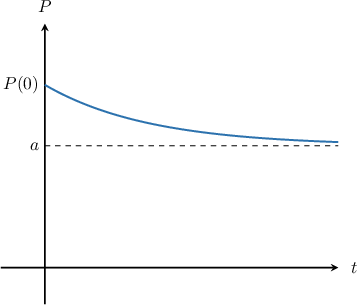

# Inhibited Decay Models With First-Order ODEs

Source: https://www.mathacademy.com/topics/649?courseId=61
Topic ID: 649

## Prerequisites

- [Inhibited Growth Models With First-Order ODEs](./1924-inhibited-growth-models-with-first-order-odes.md)

## Lesson

### Introduction

In many real situations, a quantity decreases quickly at first, but then the decrease slows down and the quantity levels off near some fixed value.

For example, consider a cup of hot coffee placed in a room. At first, the coffee cools rapidly because it is much hotter than the surrounding air. As time passes and the coffee temperature gets closer to room temperature, the cooling slows down. Eventually, the temperature levels off and approaches the room temperature rather than continuing to decrease.

This type of behavior is described by an **inhibited decay model**.

An *inhibited decay equation* models situations where the rate at which a quantity $P$ decreases depends on how far it is from a target value $a$, called the **equilibrium value**. This equilibrium value represents the level that the quantity approaches over time.

An inhibited decay equation has the form

$$

\dfrac{\mathrm{d}P}{\mathrm{d}t} = -r(P-a),

$$

and an inhibited decay initial value problem has the form

$$

\dfrac{\mathrm{d}P}{\mathrm{d}t} = -r(P-a), \qquad P(0) = P_0

$$

where $r > 0$ is a constant of proportionality, and $P > a$ for all $t > 0.$

In this model, the equilibrium value $a$ acts as a lower bound. The solution decreases over time but never drops below $a,$ instead approaching it more and more slowly. The figure below illustrates this behavior.

**Note:** Inhibited growth and inhibited decay use the same basic idea: the rate of change is proportional to the difference between $P$ and the equilibrium value $a$. The only difference is whether the solution approaches $a$ from below (growth) or from above (decay).

Inhibited decay models can be written in expanded form. To identify an expanded equation as inhibited decay, we factorise out the *negative* coefficient of $P.$ For example, the equation

$$

\dfrac{\text{d}P}{\text{d}t} = 20-5P,

$$

*is* an inhibited decay equation for $P > 4$ and $t > 0,$ since it can be expressed with $r=5$ and $a=4$ as

$$

\dfrac{\text{d}P}{\text{d}t} = -5(P-4).

$$

### Example: Identifying Inhibited Decay Equations and Initial Value Problems

#### Question

Given that $y > 50$ and $t > 0,$ which of the following is an inhibited decay equation?

1. $\dfrac{\mathrm{d} y}{\mathrm{d} t} =600+12y \\[5pt]$

2. $\dfrac{\mathrm{d} y}{\mathrm{d} t} =600-12y \\[5pt]$

3. $\dfrac{\mathrm{d} y}{\mathrm{d} t} =600-12y^2$

#### Explanation

An inhibited decay equation has the form

$$

\dfrac{\mathrm{d} y}{\mathrm{d} t} = -k(y - a),

$$

where $k > 0$ is a constant of proportionality, and $y > a$ for all $t > 0.$

From the given options, II is the only inhibited decay equation

$$

\dfrac{\mathrm{d} y}{\mathrm{d} t} =600-12y.

$$

To see this, let's factor the right-hand side of the equation. This gives,

$$

\dfrac{\mathrm{d} y}{\mathrm{d} t} = -12(y-50).

$$

In this case, the constant of proportionality is $k=12,$ and $a=50.$ Note that for inhibited decay, we must have $y > 50$ for all $t > 0.$

### Newton's Law of Cooling

Now that we’ve practiced identifying inhibited decay models, let’s look at a classic example: **Newton’s law of cooling**.

This law describes how the temperature of an object changes when it is placed in an environment with a different temperature. Formally, it states that

*The rate at which the temperature $T(t)$ of a body changes is proportional to the difference between its temperature and its surroundings.*

This leads to the differential equation

$$

\dfrac{\text{d}T}{\text{d}t} = -k(T-T_S),

$$

where $T_S$ is the temperature of the surroundings, and $k > 0$ is a constant of proportionality.

Let’s put this into action. Suppose a thermometer is placed in a pot of boiling water and reads $100^\circ\text{C}.$ The pot is then placed in a $20^\circ\text{C}$ room, and the thermometer's reading begins to decrease.

Given that after $7$ minutes its reading is $60^\circ\text{C},$ let's model the thermometer's temperature after $t$ minutes.

In this case, the temperature of the surroundings is $T_S = 20^\circ\text{C}.$ So, by Newton's law of cooling, we have

$$

\dfrac{\text{d}T}{\text{d}t} = -k(T-20),

$$

where $T(t)$ is the temperature reading of the thermometer and $k>0$ is a constant of proportionality.

First, we integrate our differential equation by separating the variables:

$$

\begin{aligned}\frac{d𝑇}{𝑇−20} & =−𝑘d𝑡 \\ ∫\frac{d𝑇}{𝑇−20} & =−𝑘∫d𝑡 \\ ln⁡|𝑇−20| & =−𝑘𝑡+𝐶\end{aligned}

$$

Next, we solve for $T(t),$ as follows:

$$

\begin{aligned}𝑇−20 & =𝑒^{−𝑘𝑡+𝐶} \\ 𝑇−20 & =𝑒^{𝐶}𝑒^{−𝑘𝑡} \\ 𝑇−20 & =𝐾𝑒^{−𝑘𝑡} \\ 𝑇 & =20+𝐾𝑒^{−𝑘𝑡}\end{aligned}

$$

Note that $K=e^C$ is a constant of integration.

We'll determine the value of $K$ and $k$ in the next slide.

### Newton's Law of Cooling (Continued)

From the previous slide, the temperature of the thermometer is given by

$$

T = 20 + Ke^{-kt},

$$

where $K$ and $k$ are constants to be determined.

We're told that the initial temperature of the water was $100^\circ\text{C}.$ So, we apply the initial condition $T(0) = 100{:}$

$$

\begin{aligned}100 & =20+𝐾𝑒^{0} \\ 100 & =20+𝐾 \\ 𝐾 & =80\end{aligned}

$$

So, we have the following expression for $T(t){:}$

$$

T(t) = 20 + 80e^{-kt}

$$

We can compute $k$ using the fact that $T(7)=60{:}$

$$

\begin{aligned}60 & =20+80𝑒^{−7𝑘} \\ 40 & =80𝑒^{−7𝑘} \\ \frac{1}{2} & =𝑒^{−7𝑘} \\ ln⁡(\frac{1}{2}) & =−7𝑘 \\ −ln⁡(2) & =−7𝑘 \\ 𝑘 & =\frac{1}{7}ln⁡(2)\end{aligned}

$$

Therefore, the temperature, in $^\circ\text{C},$ of the thermometer after $t$ minutes is

$$

T = 20 + 80e^{-t\ln(2)/7}.

$$

### Example: Modeling Inhibited Decay

#### Question

A loaf of bread just taken out of the oven has a temperature of $180^{\circ}\text{C}.$ After placing it on the table, the temperature $T(t)$ of the bread decreases at a rate that obeys Newton's law of cooling. Here, $T$ is measured in degrees Celsius, and $t > 0$ is the time in minutes. If the room temperature is $25^{\circ}\text{C},$ which differential equation could be used to model the bread's temperature? Assume that $k > 0$ is a constant of proportionality.

#### Explanation

Newton's law of cooling states that the rate at which the temperature $T(t)$ of a body changes is proportional to the difference between its temperature and its surroundings. Therefore, we have the differential equation

$$

\dfrac{\textrm d T}{\textrm d t} = -k(T - T_S),

$$

where $T_S$ is the temperature of the surroundings, and $k > 0$ is a constant of proportionality.

In our case, $T_S = 25^{\circ}\text{C},$ and we have

$$

\dfrac{\textrm d T}{\textrm d t} = -k(T - 25).

$$

### Example: Solving an Inhibited Decay Model

#### Question

The temperature $T(t),$ in degrees Celsius, of a fluorescent light bulb after turning off can be modeled by the differential equation

$$

\dfrac{\mathrm{d}T}{\mathrm{d}t} = -0.25(T-23)

$$

where $t > 0$ is the time, measured in minutes. If the initial temperature of the bulb is $80^\circ \rm C,$ calculate the temperature of the bulb after $4$ minutes. Round your answer to the nearest integer.

#### Explanation

We're told that the temperature of the fluorescent light bulb is modeled by the inhibited decay equation

$$

\dfrac{\mathrm{d}T}{\mathrm{d}t} = -0.25(T-23).

$$

First, we integrate our differential equation by separating the variables:

$$

\begin{aligned}\frac{d𝑇}{𝑇−23} & =−0.25\,d𝑡 \\ ∫\frac{d𝑇}{𝑇−23} & =−∫0.25\,d𝑡 \\ ln⁡|𝑇−23| & =−0.25𝑡+𝐶\end{aligned}

$$

Since this is the solution to an inhibited decay equation, we have $T - 23 > 0$ for all $t > 0.$ Next, we solve for $T(t),$ as follows:

$$

\begin{aligned}𝑇−23 & =𝑒^{−0.25𝑡+𝐶} \\ 𝑇−23 & =𝑒^{𝐶}𝑒^{−0.25𝑡} \\ 𝑇−23 & =𝐾𝑒^{−0.25𝑡} \\ 𝑇 & =23+𝐾𝑒^{−0.25𝑡}\end{aligned}

$$

Note that $K=e^{C}$ is a constant of integration.

We're told that the initial temperature of the light bulb was $80^\circ \rm C.$ So, we apply the initial condition $T(0)=80,$ and solve for $K{:}$

$$

\begin{aligned}80 & =23+𝐾𝑒^{0} \\ 80 & =23+𝐾 \\ 𝐾 & =57\end{aligned}

$$

Therefore, the solution to our initial value problem is

$$

T(t) = 23+57e^{-0.25t}.

$$

Finally, the temperature of the bulb after $t=4$ minutes is

$$

T(4) = 23+57e^{-0.25\cdot 4}\approx 44^\circ\text{C},

$$

rounded to the nearest integer.
