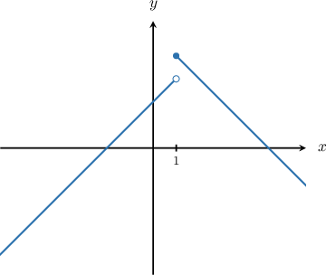
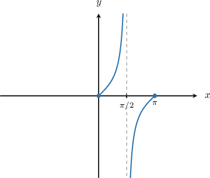
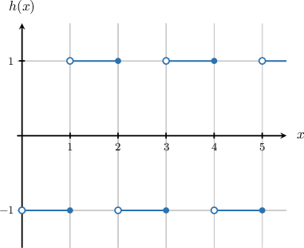
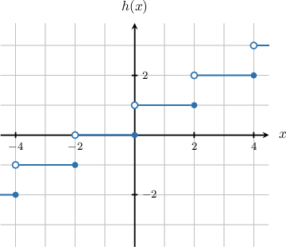

# Piecewise Continuity and Piecewise Smoothness

Source: https://www.mathacademy.com/topics/6669?courseId=61
Topic ID: 6669

## Prerequisites

- [The Floor and Ceiling Functions](./290-the-floor-and-ceiling-functions.md)
- [Continuity Over an Interval](../../../ap-courses/lessons/ap-calculus-ab/612-continuity-over-an-interval.md)
- [Selecting Procedures for Calculating Derivatives](../../../ap-courses/lessons/ap-calculus-ab/1115-selecting-procedures-for-calculating-derivatives.md)
- [Continuity and Differentiability of Functions](../../../ap-courses/lessons/ap-calculus-ab/1691-continuity-and-differentiability-of-functions.md)
- [Point Discontinuities](../../../ap-courses/lessons/ap-calculus-ab/2002-point-discontinuities.md)
- [Jump Discontinuities](../../../ap-courses/lessons/ap-calculus-ab/2003-jump-discontinuities.md)
- [The Unit Step Function](./2760-the-unit-step-function.md)
- [Sets and Functions](../linear-algebra/3334-sets-and-functions.md)
- [Further Continuity of Piecewise Functions](../../../ap-courses/lessons/ap-calculus-ab/3831-further-continuity-of-piecewise-functions.md)
- [Infinite Sets](../linear-algebra/4386-infinite-sets.md)

## Lesson

### Introduction

We often want to deal with functions that behave "nicely" on a closed interval:

- Often, they should be continuous most of the time, and

- any discontinuities should be simple and well-behaved.

A function $f(x)$ is **piecewise continuous** on $x\in [a,b]$ if

- it is continuous on $[a,b]$ except at *finitely many points*, and

- at each point of discontinuity, *the one-sided limits exist and are finite*.

In other words, there can only be finitely many discontinuities, and each of them must be either

- a point discontinuity (also called a removable discontinuity), or

- a jump discontinuity.

**Note:** Every *continuous* function is *piecewise continuous* since it has no discontinuities at all.

Let's consider two examples on the interval $x \in [0,\pi].$

- The function is piecewise continuous on $x\in[0,\pi]$ since it is continuous on $x\in[0,\pi]$ except at the point $x=1,$ where there is a jump discontinuity and the one-sided limits exist and are finite:

- The function is not piecewise continuous on $x\in[0,\pi]$ since the one-sided limits at $x=\dfrac{\pi}{2}$ are infinite:

### Example: Identifying Piecewise-Continuous Functions Over Closed Intervals

#### Question

Which of the following functions are piecewise continuous on $x\in [0,\pi].$

$$

\begin{aligned}𝑥+2,\, & 𝑥<1 \\ 5−𝑥,\, & 𝑥≥1.\end{aligned}

$$

#### Explanation

A function $f(x)$ is piecewise continuous on $x\in [a,b]$ if

- it is continuous on $[a,b]$ except at finitely many points, and

- at each point of discontinuity, the one-sided limits exist and are finite.

In other words, there can only be finitely many discontinuities, and each of them must be either a point or a jump discontinuity.

With that in mind, let's examine each function.

- The function $f(x)$ is not piecewise continuous over $x\in [0,\pi]$ since the one-sided limits at $x=\dfrac{\pi}{2}$ are infinite:

- The function $g(x)$ is piecewise continuous over $x\in [0,\pi]$ since it is continuous over $x\in [0,\pi].$

- The function $h(x)$ is piecewise continuous over $x\in [0,\pi]$ since it is continuous over $x\in [0,\pi]$ except at the point $x=1,$ where the one-sided limits exist and are finite:

Therefore, the correct answer is "$g$ and $h$ only."

### Piecewise Continuity

So far, we have talked about what it means for a function to be piecewise continuous on a closed interval $[a,b].$

To define piecewise continuity on a more general interval, we check what happens on every closed and bounded subinterval.

Suppose $I \subseteq \mathbb{R}.$ A function $f: I \to \mathbb{R}$ is **piecewise continuous on $I$** if it is piecewise continuous on every closed and bounded subinterval $[a,b] \subset I.$

For example, consider the floor function $f(x) = \lfloor x \rfloor$ on the interval $[0, \infty).$

- It has infinitely many jump discontinuities at the integers $x = 1, 2, 3, \dots$

- However, any closed and bounded subinterval $[a,b] \subset [0, \infty)$ contains only finitely many integers.

- Thus, $f$ is piecewise continuous on every such $[a,b],$ so it is piecewise continuous on $[0, \infty).$

**Note:** If a function has infinitely many discontinuities on some closed and bounded interval $[a,b],$ then it is *not* piecewise continuous on any interval that contains $[a,b].$

### Example: Identifying Piecewise-Continuous Functions Over Infinite Intervals

#### Question

Which of the following functions are piecewise continuous on $x\in [0,\infty).$

$$

\begin{aligned}𝑓(𝑥) & =\begin{aligned}1,\, & ⌈𝑥⌉ is even \\ −1,\, & ⌈𝑥⌉ is odd\end{aligned} \\ 𝑔(𝑥) & =𝑢(𝑥−1)+𝑢\,(𝑥−\frac{1}{2})+𝑢\,(𝑥−\frac{1}{3})+⋯ \\ ℎ(𝑥) & =⌈\frac{𝑥}{2}⌉\end{aligned}

$$

Note that $u(x)$ is the unit step function, and $\lceil x \rceil$ is the ceiling function.

#### Explanation

Suppose $I\subseteq \mathbb R.$ A function $f: I \to \mathbb R$ is piecewise continuous on $I$ if it is piecewise continuous on every closed and bounded subinterval $[a,b]\subset I.$

With that in mind, let's examine each function.

- The function $f(x)$ is piecewise continuous over $x\in [0,\infty).$ The function has jump discontinuities at $x=1,2,3,\ldots,$ and any closed interval $[a,b]\subset [0,\infty)$ will contain finitely many discontinuities.

- The function $g(x)$ is not piecewise continuous over $x\in [0,\infty).$ Consider the closed subinterval $x\in [0,1].$ Notice that the function has jump discontinuities at $x=1,\dfrac12,\dfrac13,\dfrac14,\ldots,$ so it has infinitely many discontinuities on this closed interval.

- The function $h(x)$ is piecewise continuous over $x\in [0,\infty).$ The function has jump discontinuities at $x=0,2,4,\ldots,$ and any closed interval $[a,b]\subset [0,\infty)$ will contain finitely many discontinuities.

Therefore, the correct answer is "$f$ and $h$ only."

### Piecewise Smoothness

So far, we have studied *piecewise continuity*, which allows a function to have finitely many simple discontinuities on an interval.

Sometimes, however, we need a stronger condition: not only should the function behave well on each piece, but its *derivative* should also behave well on each piece.

A function is **piecewise smooth** on if both and are piecewise continuous on In other words, is piecewise smooth on if

- is piecewise continuous on and

- exists and is continuous except possibly at finitely many points, where its one-sided limits exist and are finite.

In other words, a piecewise-smooth function may have finitely many breakpoints, but between those points the function and its derivative behave well, and the derivative cannot become unbounded.

### Piecewise-Smooth and Non-Piecewise-Smooth Functions

Let's look at two examples on the interval

- The function is piecewise smooth. We split the interval at into the two open intervals and On these intervals, so Both and are piecewise continuous on each interval and have finite one-sided limits as Therefore, is piecewise smooth on

- Now consider the function This function is *not* piecewise smooth on Although is piecewise continuous, its derivative is not. For its derivative is This derivate is continous on the open subintervals and but failed to have finite one-sided limits as

This shows an important difference:

- *piecewise continuity* allows finitely many simple discontinuities;

- *piecewise smoothness* requires the function to be smooth on each interval between finitely many breakpoints, and prevents the derivative from becoming unbounded.

### Example: Identifying Piecewise-Smooth Functions

#### Question

Which of the following functions are piecewise smooth on

#### Explanation

A function is **** on if

- is piecewise continuous on and

- exists and is continuous except possibly at finitely many points, where its one-sided limits exist and are finite.

With that in mind, let's examine each function.

- The function is piecewise smooth on We split the interval at into the two open intervals and On these intervals, so Here, and are piecewise continuous on each open interval, and they both have finite limits at the endpoints of the subintervals.

- The function is piecewise smooth on We split the interval at On each open interval, and the function is linear. On these intervals, so Here, and are piecewise continuous on each open interval, and they both have finite limits at the endpoints of the subintervals.

- The function is not piecewise smooth on For While this derivative is continuous on the open pieces and the limits of the derivative as are not finite. In fact, the derivative becomes unbounded near Thus, the condition for finite limits at the endpoints is not met.

Therefore, the correct answer is " and only."
