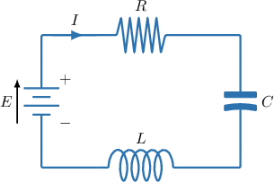
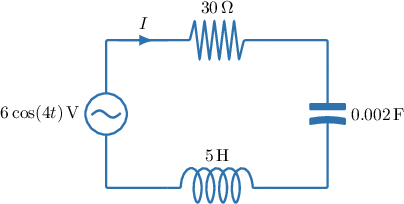
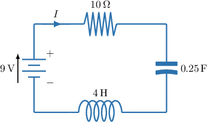
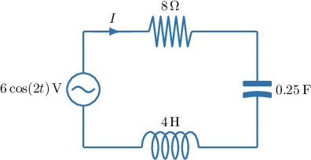

# Modeling Current in RCL Circuits With Second-Order ODEs

Source: https://www.mathacademy.com/topics/6726?courseId=61
Topic ID: 6726

## Prerequisites

- [Second-Order Inhomogeneous ODEs With Polynomial Forcing](./881-second-order-inhomogeneous-odes-with-polynomial-forcing.md)
- [Modeling Capacitor Charge in RCL Circuits With Second-Order ODEs](./1845-modeling-capacitor-charge-in-rcl-circuits-with-second-order-odes.md)

## Lesson

### Introduction

In this lesson, we will use Kirchhoff's voltage law to derive a second-order differential equation that governs the current $I(t)$ in an RCL circuit.

In a series RCL circuit, Kirchhoff's voltage law states that the source voltage equals the sum of the voltage drops:

$$

E(t)=V_R+V_C+V_L

$$

For the three components:

- Resistor: the voltage drop is proportional to the current,

- Capacitor: the charge $q$ and capacitor voltage satisfy $q=CV_C,$ so

- Inductor: the voltage drop is proportional to the rate of change of current,

Substituting these into Kirchhoff's voltage law gives

$$

E=RI+\dfrac{q}{C}+L\,\dfrac{\mathrm{d}I}{\mathrm{d}t}.

$$

To obtain a differential equation in terms of $I$ only, we first differentiate both sides with respect to $t{:}$

$$

\begin{aligned}\frac{d}{d𝑡}(𝐸) & =\frac{d}{d𝑡}(𝑅𝐼+\frac{𝑞}{𝐶}+𝐿\,\frac{d𝐼}{d𝑡}) \\ \frac{d𝐸}{d𝑡} & =𝑅\,\frac{d𝐼}{d𝑡}+\frac{1}{𝐶}⋅\frac{d𝑞}{d𝑡}+𝐿\,\frac{d^{2}𝐼}{d𝑡^{2}}\end{aligned}

$$

Now, recall that the current $I(t),$ measured in amperes, is defined as the rate of flow of charge $q(t),$ measured in coulombs:

$$

I=\dfrac{\mathrm{d}q}{\mathrm{d}t}

$$

Since $\dfrac{\mathrm{d}q}{\mathrm{d}t}=I,$ we get the second-order differential equation governing the current:

$$

L\,\dfrac{\mathrm{d}^2I}{\mathrm{d}t^2}+R\,\dfrac{\mathrm{d}I}{\mathrm{d}t}+\dfrac{1}{C}I=\dfrac{\mathrm{d}E}{\mathrm{d}t}

$$

Finally, dividing both sides by $L$ gives an equivalent form:

$$

\dfrac{\mathrm{d}^2I}{\mathrm{d}t^2}+\dfrac{R}{L}\cdot\dfrac{\mathrm{d}I}{\mathrm{d}t}+\dfrac{1}{LC}I=\dfrac{1}{L} \cdot \dfrac{\mathrm{d}E}{\mathrm{d}t}

$$

Let's see a more concrete derivation in the next example.

### Example: Constructing an Equation Governing the Charge in an RCL Circuit

#### Question

Find the differential equation governing the current $I$ (in amperes) at time $t$ (in seconds) in the circuit given in the diagram above.

**

#### Explanation

The circuit is a series RCL circuit with a source electromotive force (EMF) of $6\cos(4t)\,\textrm{V},$ a resistor of resistance $30\,\Omega,$ a capacitor of capacitance $0.002\,\textrm{F},$ and an inductor of inductance $5\,\textrm{H}.$

The current $I,$ measured in amperes, is defined as the rate of flow of charge $q,$ measured in coulombs.

$$

I=\dfrac{\mathrm{d}q}{\mathrm{d}t}

$$

Kirchhoff's voltage law states that in a series circuit, the source voltage (EMF) equals the sum of the voltage drops.

In an RCL circuit, there are three voltage drops:

- The voltage drop across the resistor is proportional to the current, with a constant of proportionality $R=30\,\Omega.$ So,

- The voltage drop across the capacitor is related to its charge by $q = CV_C.$ Therefore,

- The voltage drop across the inductor is proportional to the rate of change of current, with a constant of proportionality $L=5\,\textrm{H}.$ Hence,

Therefore, by Kirchhoff's voltage law, these values are related by the equation

$$

6\cos(4t)=30I+500q+5\,\dfrac{\mathrm{d}I}{\mathrm{d}t}.

$$

Differentiating with respect to $t,$ the differential equation governing the current in the circuit is

$$

\begin{aligned}\frac{d}{d𝑡}(6cos⁡(4𝑡)) & =\frac{d}{d𝑡}(30𝐼+500𝑞+5\,\frac{d𝐼}{d𝑡}) \\ −24sin⁡(4𝑡) & =30\,\frac{d𝐼}{d𝑡}+500\,\frac{d𝑞}{d𝑡}+5\,\frac{d^{2}𝐼}{d𝑡^{2}},\end{aligned}

$$

which, when substituting in $I=\dfrac{\mathrm{d}q}{\mathrm{d}t},$ gives

$$

\dfrac{\mathrm{d}^2I}{\mathrm{d}t^2}+6\,\dfrac{\mathrm{d}I}{\mathrm{d}t}+100I=-\dfrac{24}{5}\sin(4t).

$$

### Initial Conditions for Solving the ODE Governing the Current in an RCL Circuit

When we solve a second-order differential equation for the current $I(t),$ we often write the solution in the form

$$

I(t)=I_c(t)+I_p(t),

$$

where

- $I_c(t)$ is the **transient current**, which decays to $0$ as $t\to\infty,$ and

- $I_p(t)$ is the **steady-state current**, which governs the current’s long-term behavior.

To determine a unique solution for $I(t),$ we must specify two initial conditions, typically $I(0)$ and $I'(0).$

The current is often given directly as an initial condition, for example, $I(0)=I_0.$ We are also often given the initial *capacitor charge*, $q(0)=q_0.$

To find the other condition $I'(0),$ we use Kirchhoff's voltage law equation:

$$

E(t) = RI+\dfrac{q}{C}+L\,\dfrac{\mathrm{d}I}{\mathrm{d}t}

$$

Solving for $\dfrac{\mathrm{d}I}{\mathrm{d}t}$ gives

$$

\dfrac{\mathrm{d}I}{\mathrm{d}t} = \dfrac{1}{L}E - \dfrac{R}{L}I - \dfrac{q}{LC}.

$$

Now evaluate at $t=0{:}$

$$

I'(0) = \dfrac{1}{L}E(0) - \dfrac{R}{L}I(0) - \dfrac{1}{LC}q(0)

$$

So, if the initial charge $q(0)$ and initial current $I(0)$ are given, we can compute $I'(0)$ by substituting those values into the formula above.

In the next slide, we'll determine the initial conditions of a differential equation that governs the current in a given circuit.

### A Worked Example

Suppose a circuit with a constant EMF of $E=8\,\textrm{V},$ resistance of $R=6\,\Omega,$ capacitance of $C=0.25\,\textrm{F},$ and inductance of $L=2\,\textrm{H},$ satisfies Kirchhoff's voltage law equation

$$

8=6I+4q+2\,\dfrac{\mathrm{d}I}{\mathrm{d}t}.

$$

First, let's derive the differential equation for $I$ by differentiating both sides with respect to $t{:}$

$$

0=6\,\dfrac{\mathrm{d}I}{\mathrm{d}t}+4\,\dfrac{\mathrm{d}q}{\mathrm{d}t}+2\,\dfrac{\mathrm{d}^2I}{\mathrm{d}t^2}.

$$

Since $\dfrac{\mathrm{d}q}{\mathrm{d}t}=I,$ the differential equation for $I$ is

$$

\dfrac{\mathrm{d}^2I}{\mathrm{d}t^2}+3\,\dfrac{\mathrm{d}I}{\mathrm{d}t}+2I=0.

$$

Now suppose the initial charge and current are $q(0)=\dfrac12$ and $I(0)=1,$ respectively. Solving our first relation for $\dfrac{\mathrm{d}I}{\mathrm{d}t},$ we have

$$

\dfrac{\mathrm{d}I}{\mathrm{d}t} = 4-3I-2q.

$$

Then, the initial conditions for the current we use to solve the ODE are $I(0)=1$ and

$$

\begin{aligned}𝐼^{′}(0) & =4−3𝐼(0)−2𝑞(0) \\ & =4−3⋅1−2⋅\frac{1}{2} \\ & =0.\end{aligned}

$$

Solving the resulting initial value problem

$$

\dfrac{\mathrm{d}^2I}{\mathrm{d}t^2}+3\,\dfrac{\mathrm{d}I}{\mathrm{d}t}+2I=0, \qquad I(0) = 1, \quad I'(0) = 0,

$$

we obtain

$$

I(t)=2e^{-t}-e^{-2t}.

$$

### Example: Solving an Equation Governing the Current in an RCL Circuit: Constant EMF

#### Question

Find an equation for the current (in amperes) in the circuit given in the diagram above, expressing your answer in terms of time $t$ (in seconds) only, and given that the initial charge on the capacitor is $\dfrac25\,\textrm{C}$ and the initial current is $\dfrac34\,\textrm{A}.$

**

#### Explanation

The circuit is a series RCL circuit with a source electromotive force (EMF) of $9\,\textrm{V},$ a resistor of resistance $10\,\Omega,$ a capacitor of capacitance $0.25\,\textrm{F},$ and an inductor of inductance $4\,\textrm{H}.$

The current $I,$ measured in amperes, is defined as the rate of flow of charge $q,$ measured in coulombs.

$$

I=\dfrac{\mathrm{d}q}{\mathrm{d}t}

$$

Kirchhoff's voltage law states that in a series circuit, the source voltage (EMF) equals the sum of the voltage drops.

In an RCL circuit, there are three voltage drops:

- The voltage drop across the resistor is proportional to the current, with a constant of proportionality $R=10\,\Omega.$ So,

- The voltage drop across the capacitor is related to its charge by $q = CV_C.$ Therefore,

- The voltage drop across the inductor is proportional to the rate of change of current, with a constant of proportionality $L=4\,\textrm{H}.$ Hence,

Therefore, by Kirchhoff's voltage law, these values are related by the equation

$$

9=10I+4q+4\,\dfrac{\mathrm{d}I}{\mathrm{d}t}.

$$

Differentiating with respect to $t,$ the differential equation governing the current in the circuit is

$$

\begin{aligned}\frac{d}{d𝑡}(9) & =\frac{d}{d𝑡}(10𝐼+4𝑞+4\,\frac{d𝐼}{d𝑡}) \\ 0 & =10\,\frac{d𝐼}{d𝑡}+4\,\frac{d𝑞}{d𝑡}+4\,\frac{d^{2}𝐼}{d𝑡^{2}},\end{aligned}

$$

which, when substituting in $I=\dfrac{\mathrm{d}q}{\mathrm{d}t},$ gives

$$

\dfrac{\mathrm{d}^2I}{\mathrm{d}t^2}+\dfrac52\cdot\dfrac{\mathrm{d}I}{\mathrm{d}t}+I=0.

$$

The given equation is a second-order linear homogeneous equation with constant coefficients. To find the general solution, we must take a linear combination of two linearly independent solutions.

Assuming the solutions take the form $I=e^{\lambda t},$ we obtain two solutions, namely, $I=e^{-2t}$ and $I=e^{-t/2}.$ So, the general solution in our case is

$$

I(t)=Ae^{-2t}+Be^{-t/2}.

$$

We're told that the circuit starts with an initial charge of $\dfrac25\,\textrm{C}$ on the capacitor and an initial current of $\dfrac34\,\textrm{A}.$ Now, solving the Kirchhoff's law equation for $\dfrac{\mathrm{d}I}{\mathrm{d}t},$ we have

$$

\dfrac{\mathrm{d}I}{\mathrm{d}t}=\dfrac94-\dfrac52I-q.

$$

So, we can apply the initial conditions $I(0)=\dfrac34$ and

$$

\begin{aligned}𝐼^{′}(0) & =\frac{9}{4}−\frac{5}{2}𝐼(0)−𝑞(0) \\ & =\frac{9}{4}−\frac{5}{2}⋅\frac{3}{4}−\frac{2}{5} \\ & =−\frac{1}{40},\end{aligned}

$$

and solve for $A$ and $B.$

- Substituting $I(0)=\dfrac34$ into our general solution gives

- Differentiating $I,$ we get Substituting in $I'(0)=-\dfrac1{40}$ gives

Putting the two equations in $A$ and $B$ together gives the following system:

$$

\begin{aligned}\frac{3}{4}=𝐴+𝐵 \\ −\frac{1}{40}=−2𝐴−\frac{1}{2}𝐵\end{aligned}

$$

Solving this system gives $A=-\dfrac{7}{30}$ and $B=\dfrac{59}{60}.$ Therefore, the equation for the current (in amperes) in the circuit is

$$

I(t)=-\dfrac{7}{30}e^{-2t}+\dfrac{59}{60}e^{-t/2}.

$$

### Example: Solving an Equation Governing the Current in an RCL Circuit: Sinusoidal EMF

#### Question

Find, in amperes, the amplitude of the steady state current for the RCL circuit shown above.

**

#### Explanation

The diagram shows a series RCL circuit with a source electromotive force (EMF) of $6\cos(2t)\,\textrm{V},$ a resistor of resistance $8\,\Omega,$ a capacitor of capacitance $0.25\,\textrm{F},$ and an inductor of inductance $4\,\textrm{H}.$

The current $I,$ measured in amperes, is defined as the rate of flow of charge $q,$ measured in coulombs.

$$

I=\dfrac{\mathrm{d}q}{\mathrm{d}t}

$$

Kirchhoff's voltage law states that in a series circuit, the source voltage (EMF) equals the sum of the voltage drops.

In an RCL circuit, there are three voltage drops:

- The voltage drop across the resistor is proportional to the current, with a constant of proportionality $R=8\,\Omega.$ So,

- The voltage drop across the capacitor is related to its charge by $q = CV_C.$ Therefore,

- The voltage drop across the inductor is proportional to the rate of change of current, with a constant of proportionality $L=4\,\textrm{H}.$ Hence,

Therefore, by Kirchhoff's voltage law, these values are related by the equation

$$

6\cos(2t)=8I+4q+4\,\dfrac{\mathrm{d}I}{\mathrm{d}t}.

$$

Differentiating with respect to $t,$ the differential equation governing the current in the circuit is

$$

\begin{aligned}\frac{d}{d𝑡}(6cos⁡(2𝑡)) & =\frac{d}{d𝑡}(8𝐼+4𝑞+4\,\frac{d𝐼}{d𝑡}) \\ −12sin⁡(2𝑡) & =8\,\frac{d𝐼}{d𝑡}+4\,\frac{d𝑞}{d𝑡}+4\,\frac{d^{2}𝐼}{d𝑡^{2}},\end{aligned}

$$

which, when substituting in $I=\dfrac{\mathrm{d}q}{\mathrm{d}t},$ gives

$$

\dfrac{\mathrm{d}^2I}{\mathrm{d}t^2}+2\,\dfrac{\mathrm{d}I}{\mathrm{d}t}+I=-3\sin(2t).

$$

The given equation is a second-order linear equation with constant coefficients. To find the general solution, we must sum the complementary and particular solutions.

- To find the complementary solution $I_c,$ we solve the corresponding homogeneous equation, given by Solving using an integration technique, such as a trial solution, we obtain the complementary solution where $A$ and $B$ are constants.

- Next, we find a particular solution. Note that the right-hand side of the inhomogeneous equation is sinusoidal with argument $2t.$ So, we assume that the particular solution is also sinusoidal with argument $2t,$ i.e., To find the values of $\alpha$ and $\beta,$ we substitute this, as well as into the inhomogeneous equation and group like terms on the left-hand side: Equating the coefficients, we get the following system of equations: Solving this system gives $\alpha=\dfrac{12}{25}$ and $\beta=\dfrac{9}{25}.$ Therefore, the particular solution is

Now, since the general solution is given by the sum of the complementary solution and the particular solution, the general solution in our case is

$$

I(t) = I_c(t) + I_p(t) = Ae^{-t} + Bte^{-t} + \dfrac{12}{25}\cos(2t) + \dfrac{9}{25}\sin(2t).

$$

Note the following:

- The quantity $I_c(t) = Ae^{-t} + Bte^{-t}$ is the **, since it goes to zero as $t \to \infty.$

- The function $I_p(t) = \dfrac{12}{25}\cos(2t) + \dfrac{9}{25}\sin(2t)$ is the **. It governs the current's long-term behavior.

Therefore, as $t\to\infty,$ we have

$$

I(t)\approx I_p(t) = \dfrac{12}{25}\cos(2t) + \dfrac{9}{25}\sin(2t).

$$

Finally, the amplitude of the steady-state current, in amperes, is given by

$$

\sqrt{\left(\dfrac{12}{25}\right)^2 + \left(\dfrac{9}{25}\right)^2} = \dfrac35.

$$
