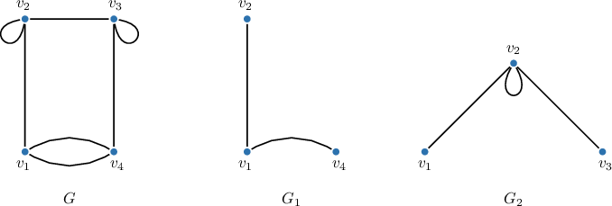
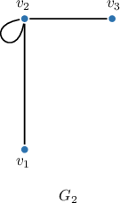
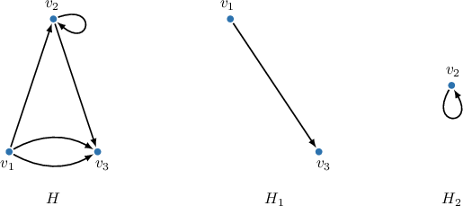
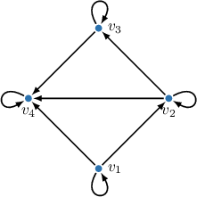
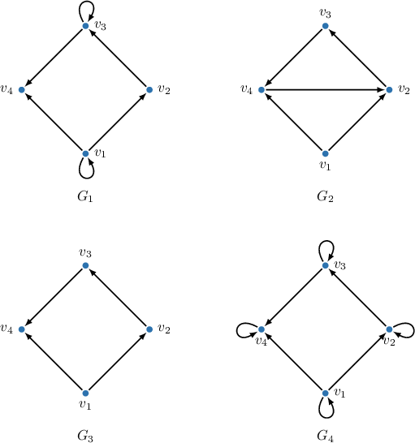
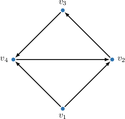
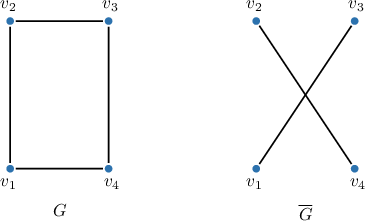
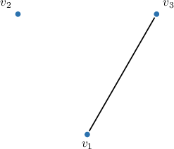
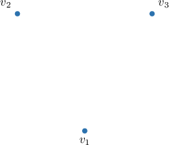
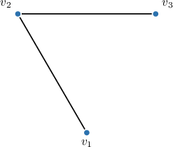

# Subgraphs and Graph Complements

Source: https://www.mathacademy.com/topics/1260?courseId=109
Topic ID: 1260

## Prerequisites

- [Introduction to Graphs](./950-introduction-to-graphs.md)

## Lesson

### Introduction

A **subgraph** of a graph $G$ is a graph whose vertices form a subset of the vertices of $G$ and whose edges form a subset of the edges of $G.$ In other words, a subgraph is a part of the original graph.

Notice that a subgraph must be a valid graph, i.e., if it includes an edge, it must also include both of its endpoint vertices from the original graph.

For example, consider the graph $G$ below and two of its valid subgraphs, $G_1$ and $G_2.$

Please note that although the graph $G_2=(V_2, E_2)$ may not seem like a valid subgraph of $G=(V, E),$ it actually is.

- The set of vertices of $G_2$ is $V_2=\{v_1, v_2, v_3\},$ which is clearly a subset of $V=\{v_1, v_2, v_3, v_4\}.$

- The set of edges of $G_2$ is $E_2=\{v_1- v_2, v_2-v_2, v_2 - v_3\},$ and each of these edges also belongs to $E.$

We can redraw $G_2$ using a different layout to make it clear that it is a subgraph of $G,$ as follows.

Subgraphs of directed graphs are defined in the same way. For example, consider the graph $H$ below and its two valid subgraphs, $H_1$ and $H_2.$

### Example: Identifying a Subgraph of a Graph

#### Question

Which of the following is **** a subgraph of the above graph?

#### Explanation

A subgraph of a graph $G$ is a graph whose vertices form a subset of the set of vertices in $G$ and whose edges form a subset of the set of edges in $G.$ In other words, a subgraph is a part of the original graph.

Among the given options, only $G_2$ is not a subgraph of the original graph:

Notice that it contains the edge directed from $v_4$ to $v_2$ (whereas the original graph has the edge directed from $v_2$ to $v_4$).

### Complement of a Graph

The **complement** (or *edge-complement*) of a simple (no loops or multiple edges) graph $G$ is the simple graph $\overline{G}$ that has the same vertex set as $G$ but whose edge set includes only the edges that are not present in $G.$

In other words, to construct the complement of a graph, we add edges where they are missing in $G$ and remove edges where they exist in $G$.

For example, consider the graph $G$ and its complement $\overline{G}$ shown below.

### Example: Finding the Complement of a Graph

#### Question

What is the complement of the graph below?

#### Explanation

The ** of a simple (no loops or multiple edges) graph $G$ is the simple graph $\overline{G}$ with the same vertex set as in the graph $G,$ and an edge belongs to $\overline{G}$ if and only if it does not belong to $G.$

So, we start by drawing all the vertices of our initial graph.

Now, we add edges that were not included in the initial graph. There are $v_1 - v_2$ and $v_2-v_3.$

