# Directed Acyclic Graphs

Source: https://www.mathacademy.com/topics/1296?courseId=109
Topic ID: 1296

## Prerequisites

- [Cycles in Graphs](./1702-cycles-in-graphs.md)
- [Transitive Relations](../methods-of-proof/4822-transitive-relations.md)

## Lesson

### Introduction

Recall that a cycle in a graph is a walk with no repeated vertices, except for the first and last, which are the same.

A **directed acyclic graph** (**DAG**) is a directed graph that contains no directed cycles.

An example of a DAG is shown below.

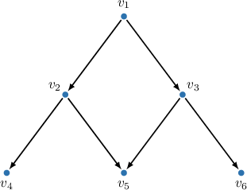

### Directed Cyclic vs Directed Acyclic Graphs

The same graph that visually appears to have cycles when treated as undirected may or may not be acyclic when directed.

Among the graphs below:

- $G_1$ is an undirected cyclic graph with a cycle $v_1 - v_2 - v_3 - v_4 - v_1.$

- $G_2$ is a directed cyclic graph with a cycle $v_1 \to v_2 \to v_3 \to v_4 \to v_1.$

- $G_3$ is a directed acyclic graph with no cycles.

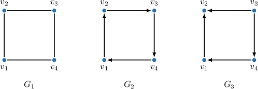

### Example: Identifying a Directed Acyclic Graph

#### Question

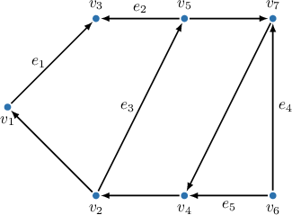

Which of the labeled edges in the graph above should be removed to obtain a directed acyclic graph?

#### Explanation

Recall that a directed cycle in a directed graph is a walk with no repeated vertices, except the first and last vertex, which are the same.

A directed acyclic graph (DAG) is a directed graph that contains no directed cycles.

By examining our graph, we can see it contains only one cycle:

$$

v_2 \overset{e_3}{\to} v_5 \to v_7 \to v_4 \to v_2

$$

Hence, to obtain a DAG, we should break this cycle by removing one of its edges. Of the given labeled edges, only the edge $e_3$ is a part of the cycle. Therefore, we remove $e_3.$

### The Reachability Relation, Successors, and Predecessors

For a directed acyclic graph (DAG), the **reachability relation** between two vertices is defined as follows:

*A vertex is **reachable** from a vertex if there exists a directed path from to *

Two properties of the reachability relation for directed acyclic graphs are:

- *Transitivity*: if is reachable from and is reachable from then is reachable from

- *Antisymmetry*: If is reachable from and is reachable from then

Notice that the reachability relation is transitive and *symmetric* (if is reachable from, then is reachable from) for undirected graphs because undirected paths can be reversed.

The vertices reachable from are called the **successors** of The set of all successors of a vertex in a DAG is called the **successor set** of The following image highlights the successor set of vertex along with the edges leading to those successors.

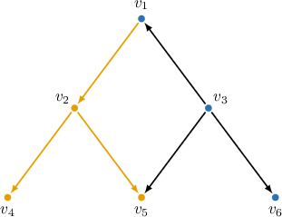

Thus, the successor set of is

Note that the successor set of does not contain In general, the successor set of includes itself only if there is a path that starts and ends at

The vertices from which it is possible to reach are called the **predecessors** of The set of all predecessors of a vertex in a DAG is called the **predecessor set** of

The following image highlights the predecessor set of vertex along with the edges leading to that set.

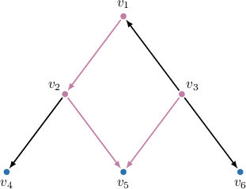

Thus, the predecessor set of is

Note again that is not included in the predecessor set of unless there is a path that starts and ends at

### Example: Identifying Reachable and Unreachable Vertices

#### Question

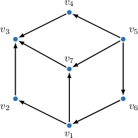

Find the successor set of $v_6$ in the directed acyclic graph above.

#### Explanation

A vertex $u$ is reachable from a vertex $v$ in a directed graph if there exists a directed path starting at $v$ and ending at $u.$ The vertices reachable from $v$ are called successors, and together, they form the successor set of $v.$

Additionally, the reachability relation is transitive: if $u$ is reachable from $v$ and $w$ is reachable from $u,$ then $w$ is reachable from $v.$

First, by examining the graph, we can see that $v_1$ is reachable from $v_6.$

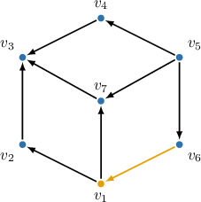

Next, the vertices $v_2$ and $v_7$ are reachable from $v_1.$ Hence, by transitivity, $v_2$ and $v_7$ are reachable from $v_6.$

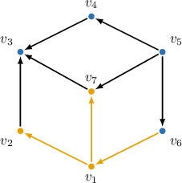

Finally, the vertex $v_3$ is reachable from $v_2$ and $v_7.$ Hence, by transitivity, $v_3$ is reachable from $v_6.$

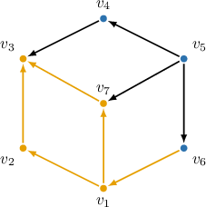

No other vertices can be reached. Therefore, the successor set of $v_6$ is $\{v_1, v_2, v_3, v_7\}.$

### Transitive Closure and Transitive Reduction

The **transitive closure** of a directed acyclic graph (DAG) is a graph where every possible edge is added while preserving the same reachability relation between vertices as in the original DAG. The transitive closure of a DAG is uniquely determined.

The algorithm for building the transitive closure is straightforward: for every pair of vertices $v$ and $u$ such that $u$ is reachable from $v$ indirectly through a sequence of edges, add a direct edge $v \to u.$

For example, consider the directed acyclic graph below.

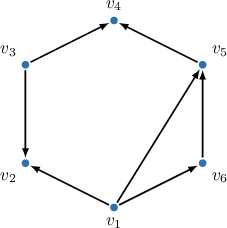

To build the transitive closure, we add a directed edge for every pair of vertices $v$ and $u$ where $u$ is reachable from $v$ indirectly, as follows:

- $v_4$ is reachable from $v_1$ through the path $v_1 \to v_6 \to v_5 \to v_4;$ hence, we add a new edge $v_1 \to v_4.$

- $v_4$ is reachable from $v_6$ through the path $v_6 \to v_5 \to v_4;$ hence, we add a new edge $v_6 \to v_4.$

- No other edges can be added while preserving the same reachability relation.

The original DAG and its transitive closure are shown below.

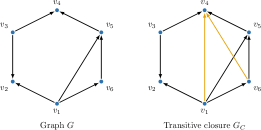

The **transitive reduction** of a directed acyclic graph (DAG) is a graph where all unnecessary edges are removed while preserving the same reachability relation between vertices as in the original DAG. The transitive reduction of a DAG is uniquely determined.

The algorithm for building the transitive reduction is straightforward: attempt to remove each existing edge $e$ and check whether *all* the reachability relations of the original DAG are preserved.

For example, consider the directed acyclic graph below.

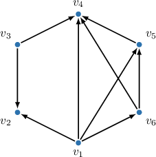

To build the transitive reduction, we attempt to remove each existing edge while ensuring that all reachability relations of the original DAG are preserved, as follows:

- The edge $v_1 \to v_4$ can be removed because $v_4$ remains reachable from $v_1$ through the path $v_1 \to v_5 \to v_4.$

- The edge $v_1 \to v_5$ can be removed because $v_5$ remains reachable from $v_1$ through the path $v_1 \to v_6 \to v_5.$

- The edge $v_6 \to v_4$ can also be removed because $v_4$ remains reachable from $v_6$ through the path $v_6 \to v_5 \to v_4.$

- No additional edges can be removed while preserving the same reachability relation.

The original DAG and its transitive reduction are shown below.

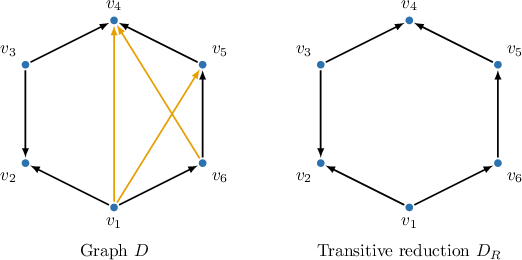

Notice that if we first build the transitive closure of a DAG and then apply the transitive reduction to this closure, we do not generally obtain the original DAG. The two examples above illustrate this point.

### Example: Identifying Transitive Closures and Transitive Reductions

#### Question

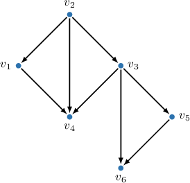

Find the transitive reduction of the directed acyclic graph given above.

#### Explanation

The transitive reduction of a directed acyclic graph is a graph where all unnecessary edges are removed while preserving the same reachability relation between vertices as in the original DAG. The transitive reduction of a DAG is uniquely determined.

To build the transitive reduction, attempt to remove each existing edge while preserving ** the reachability relations of the original DAG.

For the given graph, we have the following:

- The edge $(v_2,v_4)$ can be removed because $v_4$ remains reachable from $v_2$ through the path $v_2 \to v_1 \to v_4.$

- The edge $(v_3,v_6)$ can be removed because $v_6$ remains reachable from $v_3$ through the path $v_3 \to v_5 \to v_6.$

- No other edges can be removed while preserving the same reachability relation.

The original DAG and its transitive reduction are shown below.

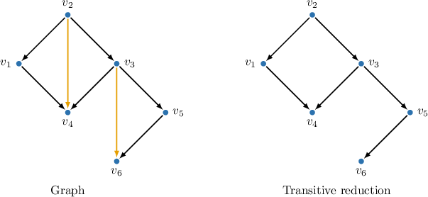
