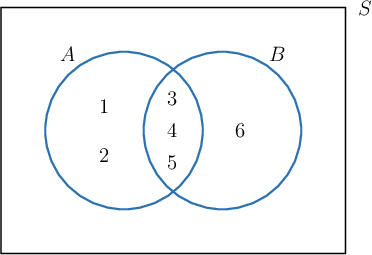

# The Inclusion-Exclusion Principle

Source: https://www.mathacademy.com/topics/1344?courseId=109
Topic ID: 1344

## Prerequisites

- [The Floor and Ceiling Functions](../differential-equations/290-the-floor-and-ceiling-functions.md)
- [Combinations With Repetition](./1343-combinations-with-repetition.md)
- [The Union of Sets](../../../high-school/traditional/lessons/geometry/2826-the-union-of-sets.md)
- [The Intersection of Sets](../../../high-school/traditional/lessons/geometry/2827-the-intersection-of-sets.md)
- [Set Complements](../linear-algebra/2829-set-complements.md)

## Lesson

### Introduction

The **inclusion-exclusion principle** states that for any two sets $A$ and $B,$ we have

$$

|A\cup B| = |A| + |B| - |A\cap B|,

$$

where we recall that $|X|$ denotes the number of elements (or cardinality) of a set $X.$

For example, let's consider the sets $A = \{1,2,3,4,5 \}$ and $B = \{3,4,5,6 \},$ as shown in the Venn diagram below. Note that $|A| = 5$ and $|B| = 4.$

For the given sets, we have $A \cap B = \{3,4,5 \},$ so $|A \cap B| = 3.$ Then, by the inclusion-exclusion principle, we have

$$

\begin{aligned}|𝐴∪𝐵| & =5+4−3=6.\end{aligned}

$$

Indeed, since $A \cup B = \{1,2,3,4,5,6 \},$ it's true that $|A \cup B| = 6.$

The inclusion-exclusion principle has some nice intuition. To count the number of elements that are in either $A$ or $B,$ we

- add the number of elements in $A$ and the number of elements in $B$ and then

- subtract the number of elements we counted twice (the elements that are in both $A$ and $B$).

### Example: Counting the Number of Integers Satisfying Divisibility Criteria

#### Question

How many integers between $1$ and $100$ are divisible by $3$ or $5?$

#### Explanation

Let $A$ be the set of numbers between $1$ and $100$ that are divisible by $3,$ and let $B$ be the set of numbers that are divisible by $5.$ Then,

- $A\cap B$ is the set of numbers that are divisible by both $3$ and $5,$ and

- $A \cup B$ is the set of numbers that are divisible by $3$ or $5.$

We want to compute $|A \cup B|,$ and we can do so using the inclusion-exclusion principle:

$$

|A\cup B| = |A| + |B| - |A\cap B|

$$

We compute $|A|$ by counting the number of multiples of $3$ that are less than or equal to $100{:}$

$$

|A|=\left\lfloor \dfrac{100}{3}\right\rfloor = \lfloor 33.3...\rfloor =33

$$

(Recall that the floor function $\lfloor x \rfloor$ returns the greatest integer that is smaller than or equal to $x.$)

We compute $|B|$ in the same way:

$$

|B|=\left\lfloor \dfrac{100}{5}\right\rfloor = \lfloor 20 \rfloor =20

$$

Now, the set $A\cap B$ is the set of numbers that are divisible by both $3$ and $5.$ Since $3$ and $5$ do not have any common factors, any number that is divisible by both $3$ and $5$ must be divisible by $3 \times 5 = 15.$

So, we can compute $|A \cap B|$ in the usual way:

$$

|A\cap B|=\left\lfloor \dfrac{100}{15}\right\rfloor = \lfloor 6.66 \rfloor =6

$$

Finally, using the inclusion-exclusion principle, we get

$$

\begin{aligned}|𝐴∪𝐵| & =|𝐴|+|𝐵|−|𝐴∩𝐵| \\ & =33+20−6 \\ & =47.\end{aligned}

$$

Therefore, we conclude that there are $47$ integers between $1$ and $100$ that are divisible by $3$ or $5.$

### Example: Counting the Number of Ways to Distribute Items into Categories Under a Constraint

#### Question

Suppose we have eleven identical balls and two boxes. How many ways are there to distribute these eleven balls into the two boxes such that each box contains at least two balls?

#### Explanation

Let $X$ be the set of ways we can distribute the balls if there are no restrictions. Then $|X|$ is the number of ways to place $11$ objects into $2$ categories, which we can compute as

$$

\begin{aligned}|𝑋| & =(\frac{11+2−1}{11}) \\ & =(\frac{12}{11}) \\ & =\frac{12!}{11!1!} \\ & =12.\end{aligned}

$$

Let $A$ be the set of ways to distribute the balls where we leave at most one ball in the first box, and let $B$ be the set of ways to distribute the balls leaving at most one ball in the second box. Then $A \cup B$ is the set of ways to distribute the balls such that some box contains at most one ball, and we can compute the desired quantity as

$$

|X| - |A \cup B|.

$$

To compute $|A \cup B|,$ we can use the inclusion-exclusion principle.

- Note that $|A| = 2$ since there are only two ways to distribute the balls such that the first box contains at most one ball (either no balls or one ball in the first box). By the same reasoning, we also have $|B|=2.$

- Also, note that $A\cap B$ has no elements since it corresponds to the situation when both boxes are empty or each box has at most one ball (remember that we distribute $11$ balls in total). In other words, $|A\cap B|=0.$

So, according to the inclusion-exclusion principle, we have

$$

\begin{aligned}|𝐴∪𝐵| & =|𝐴|+|𝐵|−|𝐴∩𝐵| \\ & =2+2−0 \\ & =4.\end{aligned}

$$

Finally, the number of ways to distribute the balls into the two boxes such that each box contains at least two balls is given by

$$

|X|-|A\cup B|=12-4=8.

$$

### Example: Counting the Number of Permutations Under a Constraint

#### Question

Consider all permutations that can be formed by using the characters $3, a, b, 7.$ How many of these permutations have a letter in the first or second position?

#### Explanation

Let $A$ be the set of permutations with the letter "$a$" in the first or second position, and let $B$ be the set of permutations with the letter "$b$" in the first or second position. Then the set $A\cup B$ is the set of permutations that have a letter in the first or second position.

We want to compute $| A \cup B |,$ and we can do so using the inclusion-exclusion principle:

$$

|A\cup B| = |A| + |B| - |A\cap B|

$$

To compute $|A|,$ note that we have $3!$ permutations with "$a$" in the first position and $3!$ permutations with "$a$" in the second position. Therefore,

$$

|A|=3!+3!=6+6=12.

$$

By similar reasoning, we also have $|B|=12.$

To compute $|A \cap B|,$ first note that $A \cap B$ is the set of permutations that have both "$a$" and "$b$" in the first and second position ($ab$XX or $ba$XX). For each of these possibilities, there are $2!$ ways to order the remaining elements (the two numbers). So, we have

$$

|A\cap B|=2!+2!=2+2=4.

$$

Finally, using the inclusion-exclusion principle, we get

$$

\begin{aligned}|𝐴∪𝐵| & =|𝐴|+|𝐵|−|𝐴∩𝐵| \\ & =12+12−4 \\ & =20.\end{aligned}

$$

Therefore, there are $20$ permutations that have a letter in the first or second position.
