# Prim's Algorithm

Source: https://www.mathacademy.com/topics/1402?courseId=109
Topic ID: 1402

## Prerequisites

- [Trees and Forests](./1284-trees-and-forests.md)

## Lesson

### Introduction

**Prim's algorithm** finds a minimum spanning tree of a connected, weighted graph $G.$ It follows a so-called **greedy** approach by starting from an arbitrary vertex and expanding the tree by adding the smallest edge that connects a visited vertex to an unvisited vertex. It is widely used in network design, constructing road systems, and optimizing cable connections.

The steps for Prim's algorithm are as follows:

- **Step 1:** Initialize a tree $T$ consisting of a starting vertex $v$ of $G.$

- **Step 2:** While not all vertices are in $T,$ find the shortest edge $u - w$ such that $u$ is already in $T$ and $w$ is not.

- **Step 3:** Add vertex $w$ and edge $u - w$ to tree $T.$

- **Step 4:** Repeat this process until all vertices are included in $T.$

We can express Prim's algorithm using **pseudocode.** Pseudocode is a simplified, programming language-independent way of describing an algorithm. It uses a mix of natural language and programming concepts, helping programmers to plan and visualize code logic without focusing on syntax.

The pseudocode for Prim's algorithm is as follows.

Let's take a look at how to apply Prim's algorithm to a concrete graph.

### A Concrete Example of Prim's Algorithm

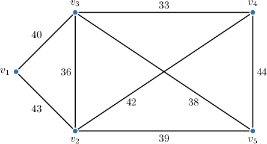

Let's use Prim's algorithm, starting from the vertex $v_1,$ to find a minimum spanning tree of the above graph.

We proceed as follows:

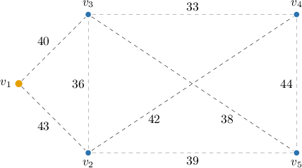

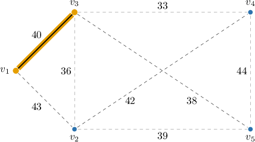

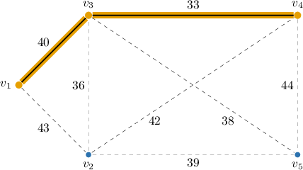

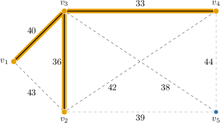

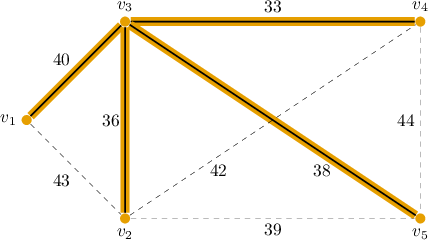

The total weight of the resulting minimum spanning tree is

$$

40 + 33 + 36 + 38 = 147.

$$

### Example: Applying Steps of Prim's Algorithm

#### Question

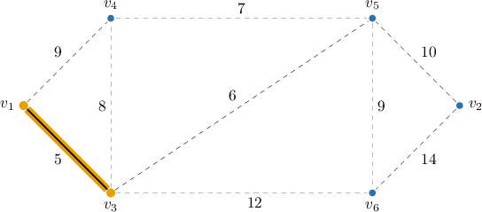

Consider the weighted graph $G$ with vertices $V=\{v_1, \ldots, v_7\}$ and edges indicated above. Prim's algorithm for finding a minimum spanning tree is applied to the graph, starting at the vertex $v_1,$ and after a few steps, the highlighted edges have been added to the tree. According to the algorithm, what edge will be added to the tree next?

#### Explanation

Prim's algorithm finds a minimum spanning tree of a connected, weighted graph $G.$ The pseudocode for Prim's algorithm is the following:

So, at the next step of Prim's algorithm, we consider the edge of the smallest weight such that one of its ends belongs to the tree and the other does not. This is the edge $v_3 - v_5$ of weight $6.$

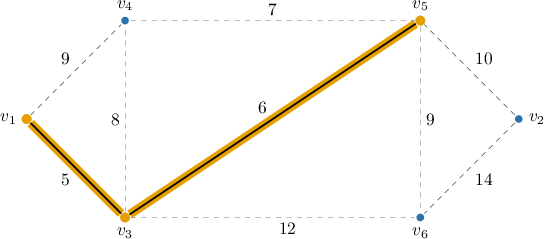

Therefore, the correct answer is $v_3-v_5.$

### Example: Applying Prim's Algorithm

#### Question

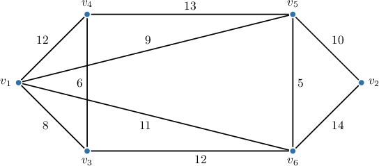

Using Prim's algorithm starting from the vertex $v_1,$ find a minimum spanning tree of the graph shown above.

#### Explanation

Prim's algorithm finds a minimum spanning tree of a connected, weighted graph $G.$ The pseudocode for Prim's algorithm is the following:

With that in mind, we proceed as follows:

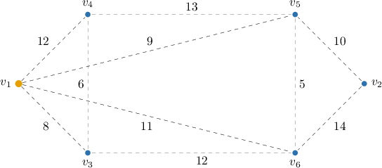

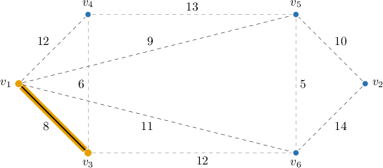

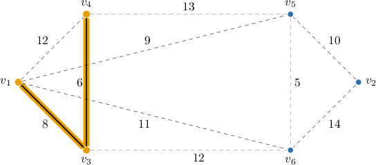

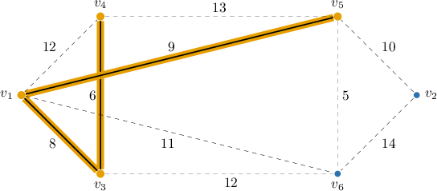

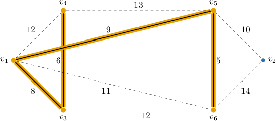

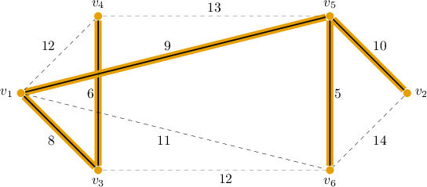

The total weight of the resulting minimum spanning tree is

$$

8 + 6 + 9 + 5 + 10 = 38.

$$
